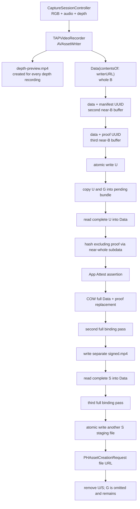
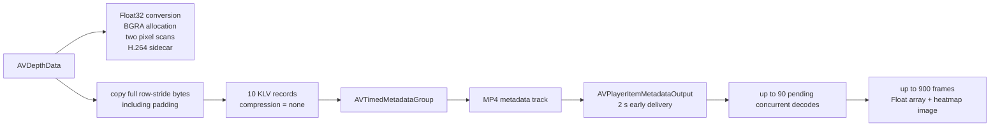
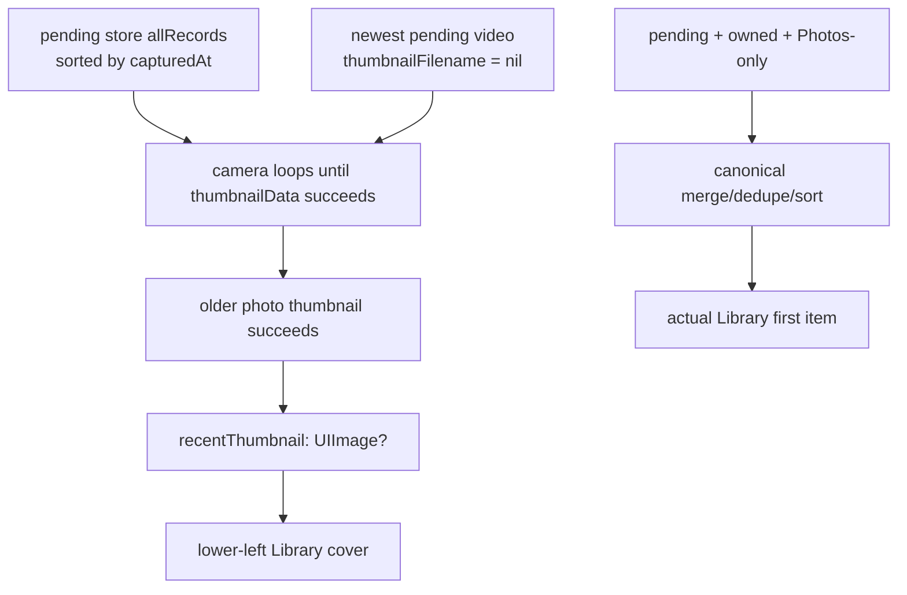

# Video Library Risk Research Trace

## Shared Goal

Review branch `video` against merge base
`26df33a18b3571a2b4d0372bfd2f8c8e86264cf0` (`refacteor_under_review`), then
trace the broader unshipped video feature before choosing an implementation.
The requested research scope includes:

- player/custom-chrome overlay failures;
- the camera's lower-left Library cover showing a photo instead of the latest
  video's poster;
- iCloud-only photo/video loading state;
- capture, finalization, signing, validation, and playback memory;
- manifest/depth resource storage and compression;
- professional Apple, open-source, and research references;
- a discussion-ready PRD rather than code changes.

The resulting product and engineering contract is
[../TAPVideoLibraryPRD.md](../TAPVideoLibraryPRD.md).

## User Constraints

- The feature has not shipped. Do not preserve the current pending schema,
  `unsigned.mp4` / `signed.mp4` split, or player state merely for compatibility.
- This turn is research and design only. No production implementation.
- Separate source-confirmed findings, compiler evidence, and runtime evidence.
- Show an explicit iCloud loading state when the original is not local.
- Use the `build-ios-apps` plugin to evaluate SwiftUI lifecycle, playback UI,
  ETTrace boundaries, and memory evidence.

## Scope Snapshot

```text
branch: video
HEAD: edbd24c Fix depth video playback and capture warnings
merge base: 26df33a Implement depth video capture and playback
diff: 10 files, 325 insertions, 89 deletions
```

The one-commit diff mostly adds Swift concurrency isolation adapters, changes
video poster extraction from deprecated synchronous generation to an async
callback, and replaces SwiftUI `VideoPlayer` with an embedded
`AVPlayerViewController` plus fixed bottom safe-area insets.

The user-reported cover, iCloud, whole-file memory, compression, manifest, and
crash-recovery problems are broader current-feature risks. Most were introduced
by the merge-base vertical slice, not by commit `edbd24c`; they are documented
separately from diff-only review comments.

## Evidence Levels

| Level | Meaning | Evidence in this trace |
| --- | --- | --- |
| Source-confirmed | A current path and state transition directly imply the behavior. | Cover fallback, whole-file `Data`, cache sizes, raw depth bytes, omitted cleanup, false empty-gap manifest, missing video recovery. |
| Compile-confirmed | The exact branch builds for the stated target. | Generic iOS Simulator `build-for-testing` passed. |
| Documentation-backed | A proposed seam is supported by a primary API/library contract. | PhotoKit progress/cancel, AVPlayer overlay/video bounds, async poster generation, file-URL Photos import, compression candidates. |
| Runtime-unverified | Requires a deterministic media fixture, simulator flow, or physical-device capture. | Actual overlay screenshots, RSS/thermal slope, compression ratios, Photos preservation of the custom track/UUID boxes. |

## Current Capture-to-Photos Trace

Let:

- `B` = the AVAssetWriter MP4 bytes;
- `M` = appended manifest UUID box;
- `P` = fixed proof UUID box, currently 61,464 bytes including its BMFF header;
- `U = B + M + P` = unsigned file;
- `S = U` = proof-filled signed file;
- `G` = diagnostic `depth-preview.mp4`.



### Source loci

- Finalize full-file copies:
  [TAPVideoRecorder.swift](../../TAPCamDemo/CameraCapture/Runtime/TAPVideoRecorder.swift),
  `completeFinishedWriter`, current lines 335–369.
- Manifest append:
  [TAPVideoManifestBox.swift](../../TAPCamDemo/CameraCapture/Output/TAPVideoManifestBox.swift),
  `appendingManifest`, current lines 15–25.
- Proof append/write and slot size:
  [CaptureContentDigest.swift](../../TAPCamDemo/CameraCapture/Output/CaptureContentDigest.swift),
  `TAPProofSlot`, current lines 474–545.
- Near-whole `subdata` hashing:
  `TAPContentBindingHash.sha256Base64URL(data:excluding:)`, current lines 450–464.
- Pending video copy and missing poster:
  [TAPPendingCaptureStore.swift](../../TAPCamDemo/TAPLibrary/TAPPendingCaptureStore.swift),
  `ingestVideo`, current lines 143–199.
- Whole-file sign and export reads:
  [TAPPendingCaptureProcessor.swift](../../TAPCamDemo/TAPLibrary/TAPPendingCaptureProcessor.swift),
  current lines 272–289 and 397–410.
- Separate Photos staging copy:
  [PhotoLibraryWriter.swift](../../TAPCamDemo/CameraCapture/Output/PhotoLibraryWriter.swift),
  `createVideoAsset`, current lines 634–676.
- Debug sidecar omitted from exported cleanup:
  [TAPPendingCaptureBundleStorage.swift](../../TAPCamDemo/TAPLibrary/TAPPendingCaptureBundleStorage.swift),
  `cleanupLargeFiles`, current lines 278–295.

The source therefore proves `O(video size)` heap behavior and multiple logical
full-file copies. ARC and filesystem behavior determine the exact runtime peak,
so the PRD uses bounded-buffer invariants and requires physical-device traces
instead of asserting an unmeasured RSS number.

## Per-Depth-Frame Trace



Source-confirmed risks:

- `TAPDepthVideoSampleEncoder.copyPixelBytes` copies `bytesPerRow * height` and
  stores `compression = "none"`. Core Video permits row alignment/padding, so
  the signed resource includes bytes with no logical pixel meaning.
- The callback serial queue performs diagnostic preview conversion before raw
  KLV encoding. This work can delay RGB/audio/depth callbacks.
- The captured calibration is reduced to
  `"AVCameraCalibrationData-present"`; playback cannot reproduce a calibrated
  RGB-depth mapping from that string.
- `TAPDecodedDepthVideoFrame` retains both a full Float depth map and a heatmap
  image, but `depthMap` has no consumer after image creation.
- `maxPendingDepthDecodeCount = 90` and `maxDepthFrameCacheCount = 900` are
  count limits, not memory budgets.
- As soon as one depth sample is stored, `makeManifest` emits `gaps: []` even if
  capture-output or metadata backpressure counters recorded drops.

## Recent-Cover Trace



The two surfaces do not share a latest-item identity. In addition:

- an empty or failed fallback can leave the previous `UIImage` in place;
- PhotoKit requests have no item ID, generation, or cancellation token;
- an older request can complete after a newer request and overwrite the cover;
- the grid already knows how to extract a local video frame, but the camera
  cover path does not reuse or persist that result.

Relevant loci:

- [CameraViewModel.swift](../../TAPCamDemo/CameraCapture/UI/CameraViewModel.swift),
  `recentThumbnail`, current line 37.
- [CameraViewModel+Capture.swift](../../TAPCamDemo/CameraCapture/UI/CameraViewModel+Capture.swift),
  current lines 141–224 and 243–278.
- [DepthAlbumItemProvider.swift](../../TAPCamDemo/DepthAnalysis/DepthAlbumItemProvider.swift),
  `TAPLibraryItem.merged`, current lines 228–268.
- [DepthAlbumPickerView.swift](../../TAPCamDemo/DepthAnalysis/DepthAlbumPickerView.swift),
  `TAPLibraryItemCell`, current lines 600–747.

## iCloud Trace

| Surface | Current behavior | Missing state |
| --- | --- | --- |
| Grid photo/video poster | `isNetworkAccessAllowed = false`; nil result becomes a permanent generic icon; `PHImageResultIsInCloudKey` is not read. | cloud-only, cancelled, typed failure. |
| Photo display image | Network enabled but no progress/cancellation; current and neighboring slots may start downloads. | current-only policy and visible progress while a low-resolution preview remains. |
| Photo original analysis | Resource request has a progress callback. UI presents a circular badge only in some states. | Explicit localized `Loading from iCloud...` text and unified cancellation/error taxonomy. |
| Video original | Photos writes the original into a temporary directory with network enabled but no progress/cancellation; player waits behind generic loading. | progress, cancel, retry, partial-file cleanup, typed offline/download error. |

PhotoKit already provides the required primitives: network permission and
progress on image/video/resource options, `PHImageRequestID` cancellation, and
`PHAssetResourceDataRequestID` cancellation. The missing seam is the app's
state/ownership model, not a platform limitation.

## Player Overlay Trace

The `edbd24c` diff computes `videoAspectRatio`, stores it, and never reads it. It
then embeds `AVPlayerViewController` and adjusts
`additionalSafeAreaInsets.bottom` by fixed values while the custom
`DepthViewerChromeView` remains over the same surface. The depth image is still
fitted independently to the full SwiftUI viewport.

Apple exposes two stronger seams:

- `AVPlayerViewController.videoBounds` reports the displayed video geometry;
- `contentOverlayView` hosts noninteractive content between video and system
  controls.

The PRD therefore rejects magic control-clearance constants and requires one
control owner plus one RGB/depth coordinate mapping.

## Manifest, Trust, and Recovery Trace

- Manifest UUID bytes are part of `assetHash`; the fixed proof UUID box is the
  only excluded range.
- Local export validation recomputes byte binding and checks proof-value
  equality. It requires a nonempty assertion object but does not perform backend
  App Attest cryptographic verification. Product copy must not conflate these.
- The current manifest can sign an incorrect `gaps: []` claim.
- Photos export success is not followed by original-video readback validation
  before pending cleanup, so preservation of the private metadata track and
  trailing UUID boxes is assumed rather than proved.
- Restart recovery for an `.exporting` record calls the photo-specific existing-
  asset lookup. A crash after Photos commits a video but before `markExported`
  can create a duplicate video on retry.

## Professional Research Applied

| Source | How it affected the PRD |
| --- | --- |
| Apple `AVPlayerViewController`, `contentOverlayView`, `videoBounds` | Replaced fixed inset guesses with one player coordinate/layout owner. |
| Apple PhotoKit network/progress/cancel APIs | Defined explicit cloud-only/downloading/ready/failed states and request ownership. |
| Apple `AVAssetImageGenerator` async API | Poster extraction must be async, bounded, and cancellable. |
| Apple Photos file-URL resource import | Enables direct import from the validated pending file instead of another in-memory/staging copy. |
| Apple Compression/LZFSE; LZ4; Zstandard | Established a device benchmark matrix for independent lossless depth frames. |
| Microsoft RVL paper | Kept an integer-depth-specific candidate separate from exact Float16/Float32 preservation. |
| GoPro GPMF parser/writer | Retained time-indexed, compact KLV lessons; rejected treating the demo writer as a robust MP4 muxer. |
| Bento4 and GPAC | Added independent container/track/box inspection to acceptance evidence. |
| ETTrace | Defined CPU flows only; explicitly did not use it as heap evidence. |

Primary links are collected in the PRD's
[Professional References](../TAPVideoLibraryPRD.md#professional-references).

## AI Tooling and Delegation

- Main agent used `build-ios-apps:swiftui-performance-audit` to classify
  observation, task-lifecycle, main-thread, image, and cache risks.
- Main agent used `build-ios-apps:swiftui-ui-patterns` for async media state,
  ownership, cancellation, and player composition guidance.
- Main agent used `build-ios-apps:ios-ettrace-performance` to define focused CPU
  flows and symbolication requirements.
- Main agent used `build-ios-apps:ios-memgraph-leaks` to distinguish leaks from
  intentional cache retention and define repeated viewer-lifetime evidence.
- A capture/storage subagent traced file and memory amplification, depth KLV,
  cleanup, trust, and crash recovery.
- A Library/iCloud subagent traced cover identity, PhotoKit state, request races,
  and exact build evidence.
- A playback subagent reviewed the changed player and thumbnail code for
  diff-introduced issues.

## Validation

The exact compile command was:

```sh
xcodebuild \
  -project TAPCamDemo.xcodeproj \
  -scheme TAPCamDemo \
  -configuration Debug \
  -destination 'generic/platform=iOS Simulator' \
  -derivedDataPath /tmp/TAPCamDemo-review-ui-derived \
  build-for-testing \
  CODE_SIGNING_ALLOWED=NO
```

Result: `** TEST BUILD SUCCEEDED **`, exit 0.

This proves compilation, not runtime correctness. No ETTrace, memgraph, rendered
player screenshot, real iCloud transfer, physical-camera capture, compression
benchmark, or Photos round-trip was produced in this design-only turn.

## Score and Project Status

No global project score changes in this turn because no production behavior was
implemented or device-validated. The first depth-video vertical slice remains a
prototype. The PRD's acceptance matrix is the scorecard for the next phase; an
item receives credit only with the named source test plus runtime/device
evidence where required.

## Next Decision Gate

Do not start a broad implementation until the team chooses:

1. system player with measured overlays, or one fully custom TAP player;
2. exact Float depth or a new integer canonical representation;
3. the two compression candidates for the device spike;
4. removal or bounded Debug-only retention of the depth preview sidecar;
5. the physical-device RSS budget after the baseline trace.
