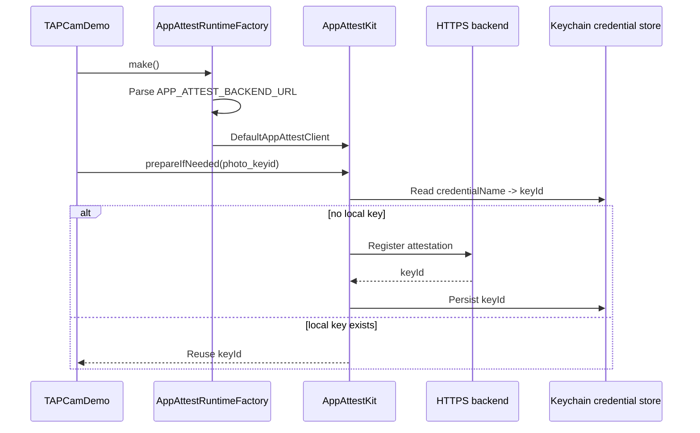
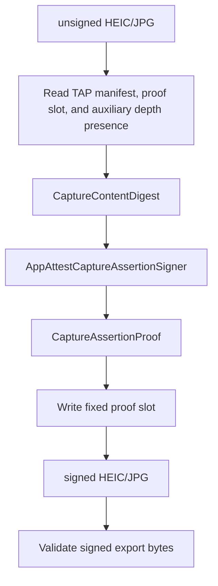

# App Attest Integration

This folder documents TAPCamDemo's App Attest integration. The reusable client
implementation comes from the upstream
[TAP-NAP/AppAttestKit](https://github.com/TAP-NAP/AppAttestKit) Swift Package.
TAPCamDemo owns runtime wiring, credential naming, capture-proof construction,
and the decision about when App Attest is required.

## Code Boundaries

| Boundary | Code |
| --- | --- |
| Reusable App Attest client package | [TAP-NAP/AppAttestKit](https://github.com/TAP-NAP/AppAttestKit/tree/main/Sources/AppAttestKit) |
| TAPCamDemo runtime factory | [AppAttestRuntime.swift](../../TAPCamDemo/App/AppAttestRuntime.swift) |
| Credential preparation state | [AppAttestRuntimeController.swift](../../TAPCamDemo/App/AppAttestRuntimeController.swift) |
| Public-safe status and key ID presentation | [AppAttestCredentialPresentation.swift](../../TAPCamDemo/App/AppAttestCredentialPresentation.swift) |
| Capture assertion signer | [AppAttestCaptureAssertionSigner.swift](../../TAPCamDemo/CameraCapture/Output/AppAttestCaptureAssertionSigner.swift) |
| Capture proof write and final export validation | [TAPCaptureProvenanceWriter.swift](../../TAPCamDemo/CameraCapture/Output/TAPCaptureProvenanceWriter.swift) |
| Pending queue signer adapter | [TAPPendingCaptureProcessor.swift](../../TAPCamDemo/TAPLibrary/TAPPendingCaptureProcessor.swift) |
| Settings/status UI usage | [DepthAnalyzerSettingsView.swift](../../TAPCamDemo/DepthAnalysis/DepthAnalyzerSettingsView.swift) |
| Settings App Attest section | [DepthAnalyzerAppAttestSection.swift](../../TAPCamDemo/DepthAnalysis/DepthAnalyzerAppAttestSection.swift) |
| App Attest entitlement file | [TAPCamDemo.entitlements](../../TAPCamDemo.entitlements) |

## Runtime Flow

## Capture Proof Flow

Capture signing reuses the registered `photo_keyid` credential. It builds a
capture `signingBinding` over a C2PA-aligned content binding and writes an App
Attest assertion into the TAP proof slot.
It does not use `generateAssertion(credentialName:request:)` because capture
signing is not an online protected API request and does not use an assertion
challenge.

Before Photos export, `TAPCaptureProvenanceWriter.validateSignedExportPhoto`
re-reads the signed file and validates the proof envelope, proof digest binding,
manifest id, selected HEIC/JPG source type, and auxiliary depth presence. The
content binding hashes the exact file bytes that are leaving the private queue
except for the fixed proof slot, so validation does not depend on CoreGraphics,
AVDepthData conversion output, browser canvas pixels, or libheif decode output.

## Runtime Backend Selection

TAPCamDemo does not include a local App Attest backend path. The runtime reads
only `APP_ATTEST_BACKEND_URL`, which must be an HTTPS base URL without an
endpoint path.

| Build | Backend | App Attest metadata |
| --- | --- | --- |
| Debug | `https://dev.tapnap.net` | `.development` |
| Release/TestFlight | `https://www.tapnap.net` | `.production` |

Bare IP addresses, localhost, cleartext HTTP, and endpoint URLs such as
`/healthz` are rejected by configuration parsing.

The app target points `CODE_SIGN_ENTITLEMENTS` at
[`TAPCamDemo.entitlements`](../../TAPCamDemo.entitlements). That file exposes
`com.apple.developer.devicecheck.appattest-environment` and reads the value from
the per-configuration `APP_ATTEST_ENVIRONMENT` build setting:

| Build | Entitlement value |
| --- | --- |
| Debug | `development` |
| Release | `production` |

The `AppAttestKit` package is pinned to the reviewed revision recorded in
`Package.resolved`; it should be advanced deliberately after reviewing upstream
changes.

`AppAttestRuntimeFactory.configuredEnvironment` is still selected with
`#if DEBUG`, so future build-configuration changes must keep runtime metadata
and the entitlement value aligned.

## Logging Privacy

`TAPDiagnostics.describe` is the public OSLog-safe error formatter for App
Attest and startup failures. It keeps domain/code and scalar stream diagnostics,
but it must not expose localized error text, failing URLs, raw network paths,
proof bodies, assertion objects, or backend response bodies.

[`TAPDiagnosticsOSLogPrivacyTests`](../../TAPCamDemoTests/TAPDiagnosticsOSLogPrivacyTests.swift)
is the source-level harness for critical log call sites. It enforces private
interpolation for capture ids, Photos asset ids, manifest ids, credential names,
key ids, and invalid bundle names, checks every reviewed interpolation declares
privacy, and requires public `error=` fields to use
`TAPDiagnostics.describe(error)`. Public `backend=` fields must use
`AppAttestRuntime.backendPublicSummary`, not the raw backend URL or internal
backend description.

TAPCamDemo currently uses the fixed credential name `photo_keyid`. Runtime logs
still mark credential names and key-id summaries private so future user, tenant,
install, or session-derived credential names do not become public diagnostics by
accident.

## Settings UI

Release settings present this capability as `Photo Integrity`, with one
`Protection Readiness` row. Its product-facing states are `Not Ready`,
`Preparing`, `Ready`, and `Preparation Failed`; unavailable or failed states
offer `Prepare` or `Retry`. Release does not expose App Attest terminology,
backend details, help text, credential names, or key IDs.

The Release action asks `AppAttestRuntimeController` to reset local credential
artifacts, run `prepare(credentialName:)` for `photo_keyid`, and validate that
the prepared credential can generate an assertion. The controller reports
`Ready` only after that complete health check succeeds. Debug builds retain the
internal status, redacted key-ID presentation, backend, prepare, and reset
controls, and those debug-only rows use a yellow background so they are easy to
distinguish from Release UI.

The Debug backend row uses `AppAttestRuntime.backendPublicSummary`, so the real
backend URL remains an internal request and credential-health-token input.
User-visible failure text is generic; raw localized errors, failing URLs, paths,
backend URLs, backend text, and full key IDs stay out of Settings text and
accessibility labels.

## Boundary Rules

- `AppAttestKit` accepts only `credentialName: String` from the caller.
- TAPCamDemo decides that `photo_keyid` is the capture credential name.
- Apple attests the generated App Attest key, not `credentialName`.
- The kit never intercepts API requests automatically.
- TAPCamDemo chooses which operations need App Attest.
- App Attest entitlements and dependency pinning are visible in the checkout so
  reviewers do not need to infer security setup from runtime code alone.

## Primary Documents

- [ClientUsage.md](ClientUsage.md): client API and call examples.
- [CredentialNameGuide.md](CredentialNameGuide.md): recommended caller-owned credential names.
- [BackendContract.md](BackendContract.md): HTTP contract and server duties.
- [SecurityNotes.md](SecurityNotes.md): safety boundaries and non-goals.
