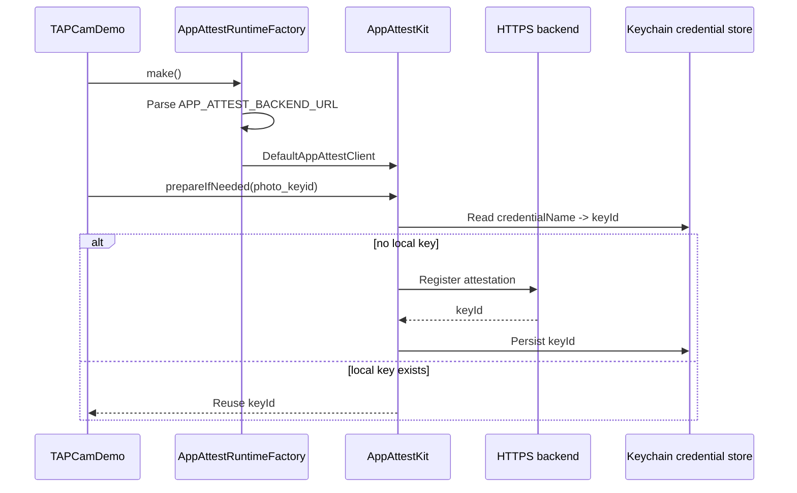

# App Attest Integration

Status: active TAPCamDemo client and runtime contract

Server interface: [BackendContract.md](BackendContract.md)

This folder documents TAPCamDemo's App Attest integration. The reusable client
implementation comes from the upstream
[TAP-NAP/AppAttestKit](https://github.com/TAP-NAP/AppAttestKit) Swift Package.
TAPCamDemo owns runtime wiring, credential naming, capture-proof construction,
and the decision about when App Attest is required.

This document is the single active App Attest client guide for TAPCamDemo. It
owns client call semantics, credential naming and storage boundaries, runtime
configuration, Settings presentation, and client-side privacy rules. The
separate backend contract remains active because it owns a cross-project HTTP
and server-trust boundary.

The capture artifact's shared signing-binding, proof-envelope, proof-slot, and
content-binding wire conventions are owned by the documentation-only
[TAPArtifactContracts](https://github.com/TAP-NAP/TAPArtifactContracts)
repository. This guide continues to own TAPCamDemo client lifecycle, storage,
runtime selection, privacy, and Settings behavior.

## Code Boundaries

| Boundary | Code |
| --- | --- |
| Reusable App Attest client package | [TAP-NAP/AppAttestKit](https://github.com/TAP-NAP/AppAttestKit/tree/main/Sources/AppAttestKit) |
| TAPCamDemo runtime factory | [AppAttestRuntime.swift](../../TAPCamDemo/App/AppAttestRuntime.swift) |
| Credential preparation state | [AppAttestRuntimeController.swift](../../TAPCamDemo/App/AppAttestRuntimeController.swift) |
| Public-safe status and key ID presentation | [AppAttestCredentialPresentation.swift](../../TAPCamDemo/App/AppAttestCredentialPresentation.swift) |
| Capture assertion signer | [AppAttestCaptureAssertionSigner.swift](../../TAPCamDemo/CameraCapture/Output/AppAttestCaptureAssertionSigner.swift) |
| Capture proof write and final export validation | [TAPCaptureProvenanceWriter.swift](../../TAPCamDemo/CameraCapture/Output/TAPCaptureProvenanceWriter.swift) |
| Pending queue signer adapter | [TAPPendingCaptureProcessor.swift](../../TAPCamDemo/TAPLibrary/TAPPendingCaptureProcessor.swift) |
| Settings/status UI usage | [DepthAnalyzerSettingsView.swift](../../TAPCamDemo/DepthAnalysis/DepthAnalyzerSettingsView.swift) |
| Settings App Attest section | [DepthAnalyzerAppAttestSection.swift](../../TAPCamDemo/DepthAnalysis/DepthAnalyzerAppAttestSection.swift) |
| App Attest entitlement file | [TAPCamDemo.entitlements](../../TAPCamDemo.entitlements) |

## Runtime Flow



## Credential And Client API Semantics

TAPCamDemo uses the one fixed capture credential name `photo_keyid`.
`credentialName` is only a caller-owned lookup name for credential metadata; it
is not an Apple attestation claim, user model, or proof of identity. Apple
attests the generated App Attest key. AppAttestKit stores the association:

```text
credentialName -> keyId / credentialId / status / environment / timestamps
```

The naming scheme must remain stable because changing the string selects a
different credential. If TAPCam later introduces install-, account-, tenant-,
or session-scoped credential names, it must prefer opaque backend identifiers
or hashed stable identifiers rather than raw PII. Those names remain private in
logs and UI even when they are not themselves trust claims.

The client calls have distinct meanings:

- `prepare(credentialName:)` creates and attests a fresh App Attest key, sends
  the attestation to the backend, and persists the local mapping only after the
  backend accepts registration.
- `prepareIfNeeded(credentialName:)` reuses a ready local credential; if none
  exists, it performs the registration flow.
- `reset(credentialName:)` deletes local metadata for that name only. It does
  not delete other caller-defined credentials, an Apple-held private key, or a
  backend credential record. TAPCam's controller also clears its local health
  token when it resets `photo_keyid`.
- `generateAssertion(credentialName:request:)` protects only the request for
  which TAPCam explicitly calls it and applies the returned envelope. The kit
  does not intercept or protect requests automatically.

TAPCam capture signing is deliberately different from an online protected API
request. The pending capture signer calls `prepareIfNeeded` for `photo_keyid`,
constructs the canonical capture `signingBinding`, and asks
`DCAppAttestService` to sign its client-data hash directly. It does not call the
request-oriented `generateAssertion(credentialName:request:)` and does not ask
the backend for an assertion challenge.

## First-Install Credential Bootstrap

First-Install Setup owns one required **Network** row. The row is not a system
permission and is not satisfied by a generic reachability or `/healthz` check.
Its explicit action starts the initial `photo_keyid` App Attest registration and
backend verification sequence. Camera and Photos remain separate required
permission rows; Location and Microphone remain optional.

The initial sequence follows these boundaries:

- page appearance, passive refresh, and Foreground Resume never start it;
- one explicit Network action may own a bounded automatic-retry sequence;
- after that sequence times out, connectivity recovery alone does not start a
  new attempt and the row waits for an explicit Retry;
- Setup Continue remains unavailable until this bootstrap, Camera, and Photos
  are ready; and
- a Network failure remains a First-Install Setup row state. It never routes to
  Required Permission Check, which owns only Camera and Photos.

A successful bootstrap contributes the local credential binding recorded by
the Setup receipt. It does not promise that the network or credential remains
healthy forever. Once Setup is complete, ordinary Viewfinder entry and local
capture are network-independent.

The current main implementation still exposes a legacy `/healthz` preflight in
this row. Replacing it with the complete initial App Attest
registration/verification contract belongs to `TAP-0010`; visual prototype
status does not convert `/healthz` into credential evidence.

## Post-Setup Credential Preparation And Health Token

Post-setup credential health/recovery is a different operation from the
required first-install bootstrap. It becomes eligible only after the
interactive Viewfinder milestone (`t5`) as guarded background work and never
participates in Setup, Required Permission Check, Resource Initialization, the
first-frame gate, preview readiness, or ordinary local capture readiness.

TAPCam stores a local credential-health token bound to the app bundle id,
version/build, backend URL, App Attest environment, and the fixed
`photo_keyid` name. If any input changes, the post-setup controller resets local
`photo_keyid` metadata, runs `prepare`, and validates that the prepared
credential can generate an assertion. If the token still matches, it may reuse
the local credential through `prepareIfNeeded`.

## Capture Proof Flow

Capture signing reuses the registered `photo_keyid` credential. The pending
queue calls `AppAttestCaptureAssertionSigner` and
`TAPCaptureProvenanceWriter`; those producer types implement the ordered
construction, App Attest input, proof-envelope, slot-write, and final local
reconstruction rules in the shared
[binding/proof contract](https://github.com/TAP-NAP/TAPArtifactContracts/blob/63f96b31de193c3ad456ffa500cc0db03fb97142/bindings/capture-binding-and-proof-v1.md).

This client guide owns one local distinction: capture signing asks
`DCAppAttestService` to sign the capture binding directly. It does not use the
request-oriented `generateAssertion(credentialName:request:)` path and does not
request a server assertion challenge. The final pre-Photos check is local
self-consistency, not registered-public-key verification.

## Client Trust And Storage Boundary

The client can create local key handles, attestation objects, and assertion
objects, but it cannot decide that any of them are trustworthy. The backend
must validate attestation before accepting registration, and a later verifier
must validate a capture assertion against the registered backend credential.

The App Attest private key is not stored by TAPCamDemo or AppAttestKit. Apple
keeps it in system-protected key material; the app receives a `keyId` handle.
Keychain stores only the credential metadata needed to find and reuse that
handle. Losing the mapping requires registration of a new key and can create a
new backend credential record.

The final HEIC/JPG validation before Photos export is a client-side consistency
check. It confirms that the outgoing file still contains the expected
container, manifest id, proof envelope, digest binding, source type, and depth
presence. It does not establish backend trust, capture freshness, protection
against every replay, or real-world scene authenticity.

If `DCAppAttestService.isSupported` is false, the client reports
`AppAttestError.unsupportedDevice`. That error does not authorize a silent
trust fallback; the owning product flow must apply its explicit failure policy.

## Runtime Backend Selection

TAPCamDemo does not include a local App Attest backend path. The runtime reads
only `APP_ATTEST_BACKEND_URL`, which must be an HTTPS base URL without an
endpoint path.

| Build | Backend | App Attest metadata |
| --- | --- | --- |
| Debug | `https://www.tapnap.net` | `.development` |
| Release/TestFlight | `https://www.tapnap.net` | `.production` |

Bare IP addresses, localhost, cleartext HTTP, and endpoint URLs such as
`/healthz` are rejected by configuration parsing.

The app target points `CODE_SIGN_ENTITLEMENTS` at
[`TAPCamDemo.entitlements`](../../TAPCamDemo.entitlements). That file exposes
`com.apple.developer.devicecheck.appattest-environment` and reads the value from
the per-configuration `APP_ATTEST_ENVIRONMENT` build setting:

| Build | Entitlement value |
| --- | --- |
| Debug | `development` |
| Release | `production` |

The `AppAttestKit` package is pinned to the reviewed revision recorded in
`Package.resolved`; it should be advanced deliberately after reviewing upstream
changes.

`AppAttestRuntimeFactory.configuredEnvironment` is still selected with
`#if DEBUG`, so future build-configuration changes must keep runtime metadata
and the entitlement value aligned.

## Logging Privacy

`TAPDiagnostics.describe` is the public OSLog-safe error formatter for App
Attest and startup failures. It keeps domain/code and scalar stream diagnostics,
but it must not expose localized error text, failing URLs, raw network paths,
proof bodies, assertion objects, or backend response bodies.

[`TAPDiagnosticsOSLogPrivacyTests`](../../TAPCamDemoTests/TAPDiagnosticsOSLogPrivacyTests.swift)
is the source-level harness for critical log call sites. It enforces private
interpolation for capture ids, Photos asset ids, manifest ids, credential names,
key ids, and invalid bundle names, checks every reviewed interpolation declares
privacy, and requires public `error=` fields to use
`TAPDiagnostics.describe(error)`. Public `backend=` fields must use
`AppAttestRuntime.backendPublicSummary`, not the raw backend URL or internal
backend description.

TAPCamDemo currently uses the fixed credential name `photo_keyid`. Runtime logs
still mark credential names and key-id summaries private so future user, tenant,
install, or session-derived credential names do not become public diagnostics by
accident.

## Settings UI

Release settings present this capability as `Photo Integrity`, with one
`Protection Readiness` row. Its product-facing states are `Not Ready`,
`Preparing`, `Ready`, and `Preparation Failed`; unavailable or failed states
offer `Prepare` or `Retry`. Release does not expose App Attest terminology,
backend details, help text, credential names, or key IDs.

The Release action asks `AppAttestRuntimeController` to reset local credential
artifacts, run `prepare(credentialName:)` for `photo_keyid`, and validate that
the prepared credential can generate an assertion. The controller reports
`Ready` only after that complete health check succeeds. Debug builds retain the
internal status, redacted key-ID presentation, backend, prepare, and reset
controls, and those debug-only rows use a yellow background so they are easy to
distinguish from Release UI.

The Debug backend row uses `AppAttestRuntime.backendPublicSummary`, so the real
backend URL remains an internal request and credential-health-token input.
User-visible failure text is generic; raw localized errors, failing URLs, paths,
backend URLs, backend text, and full key IDs stay out of Settings text and
accessibility labels.

## Boundary Rules

- `AppAttestKit` accepts only `credentialName: String` from the caller.
- TAPCamDemo decides that `photo_keyid` is the capture credential name.
- Apple attests the generated App Attest key, not `credentialName`.
- The kit never intercepts API requests automatically.
- TAPCamDemo chooses which operations need App Attest.
- App Attest entitlements and dependency pinning are visible in the checkout so
  reviewers do not need to infer security setup from runtime code alone.

## Active Documents

- This README: TAPCamDemo client calls, naming, storage, privacy, runtime, and
  capture-signing boundaries.
- [BackendContract.md](BackendContract.md): cross-project HTTP contract, server
  trust decisions, replay controls, and capture-signature verification duties.
