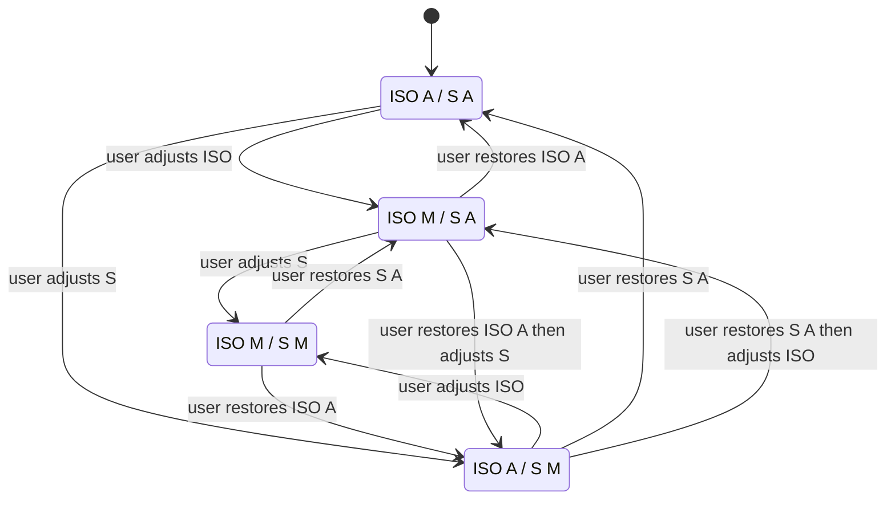
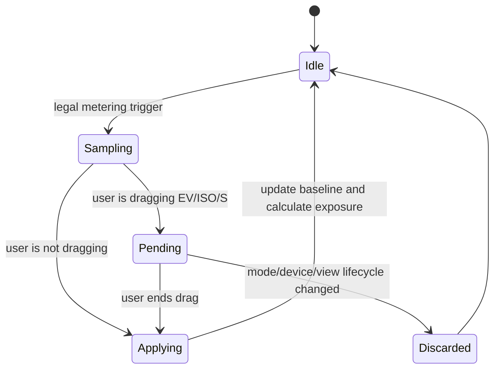
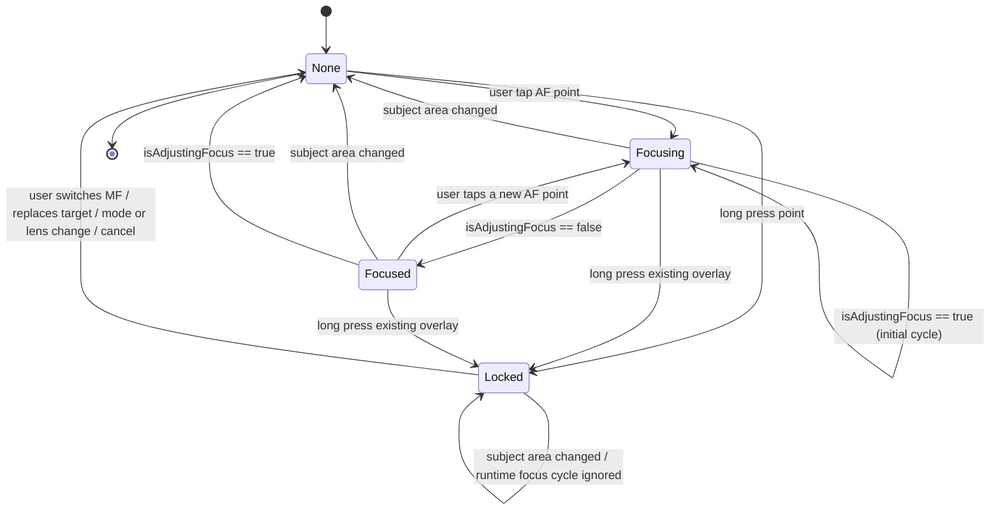
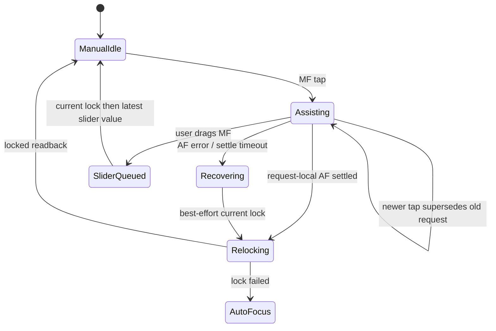

# Camera Controls Design

本文档记录当前相机控制 UI 的实现准绳。正文用中文解释决策，代码、测试、评审里使用英文 canonical term，避免后续靠口头记忆判断按钮位置。

## Canonical Terms

| Term | 中文解释 | 使用规则 |
| --- | --- | --- |
| `viewfinder top shoulder` | 取景器顶部 Face ID / Dynamic Island 两侧肩区 | 不放状态噪音。右肩放 `Settings`。 |
| `Basic EV` | Standard 曝光补偿 | 不依赖专业控制状态机的轻量 EV 流程。入口在 Face ID / Dynamic Island 左侧，只写 exposure target bias。 |
| `viewfinder top toolbar` | 肩区下方、取景器上方工具栏 | 放高频但不属于参数条的按钮，固定布局为 `Flash / Live Photo / Spacer / PRO`。它参与垂直布局，占用 viewfinder 上方空间，不覆盖预览画面。 |
| `viewfinder lower toolbar` | 取景器下方参数工具栏 | 只在 Photographer Mode 已完成异步切换并进入 `active` 后显示 `EV / ISO / S / AF/MF / ƒ`。Standard 不显示。 |
| `mode selector slot` | 拍摄模式选择占位区 | 默认承载 `mode selector bar`。控制条打开时被 `ticked adjustment strip` 临时替代。 |
| `mode selector bar` | 拍摄模式选择条 | 默认显示 `PHOTO / VIDEO`。外层 bar、按钮 frame、按钮文字都不参与旋转。 |
| `portrait adjustment centerline` | Portrait UI 的全局参数调节中线 | 所有横向参数条的中心刻度必须对齐整个屏幕 / 控件容器的水平中心线，不能被左标题或右数值挤偏。 |
| `ticked adjustment strip` | 刻度调节条 | 共享 UI primitive，可服务 Basic EV 或 Pro EV/ISO/S/MF。它只知道 value/range/step/label/callback，不知道 Basic/Pro 业务模式。 |
| `value cursor` | 当前值游标 | 位于 `ticked adjustment strip` 上的可见圆点 / 小按钮，用来标识当前选择值；不是实线轨道。 |
| `FOV selector bar` | 镜头 / 视角选择条 | Standard 显示 release field-of-view chips；PRO 固定后置 LiDAR 24mm / 1x，因此隐藏。外层 bar 固定在取景器下边缘内侧，chip 内容按设备姿态旋转，bar 本身不旋转。 |
| `preview-only zoom` | 取景器预览缩放 | Standard 可保留既有 `1x / 2x / 3x` 预览行为；PRO 固定 LiDAR 24mm / 1x 并隐藏入口。 |
| `source switching mode` | 真实摄像头源切换模式 | 后续 roadmap。切换焦段时可能切到不同 Apple camera path，并按当前 path 能力重新决定 ISO/S/AF/MF 可用性。 |
| `Photographer Mode` / `PRO` | 摄影师模式 / 专业模式 | Release runtime 产品模式。只在 eligible 后置 LiDAR 24mm / 1x 路径可用，并且 v1 只支持 Photo。 |
| `Photographer Mode state` | 摄影师模式异步状态 | 固定为 `unavailable / standard / activating / active / deactivating / failed`，不能用一个 bool 代替 session readiness。 |
| `frosted session transition` | 毛玻璃 session 切换 | 保留最后一帧并覆盖毛玻璃；异步 session 未 ready 前禁用拍摄和取景器交互。适用于 PRO 开关以及 rear PRO / front 双向切换。 |
| `suspended rear mode` | 暂挂的后置模式意图 | PRO 下切前置时记录的瞬时 rear intent；返回后置时尝试恢复 PRO。它不是关闭 PRO，也不改写 `Remember Last State`。 |
| `viewfinder edge toast` | 取景器边缘提示 | 贴在取景器上边缘内侧，水平居中淡入淡出，不阻止拍摄。 |
| `focus loupe` | 对焦放大预览 | MF 下由用户点按位置驱动的右下角局部放大窗。主 PreviewLayer 始终保持 1x；PRO graph 常驻一条 preview-sized `AVCaptureVideoDataOutput`，放大窗用 `AVSampleBufferDisplayLayer` 消费该帧流。它不写 `videoZoomFactor`，不影响主构图或成片，也不创建第二个 PreviewLayer。显示时长由 Debug Settings 的 `Focus Magnifier` 枚举决定；普通产品设置页暂不展示。 |
| `focus target overlay` | 对焦目标覆盖层 | 同一个状态同时驱动对焦框、`AE/AF LOCK` 标签和旁边的临时 EV 条。 |
| `focus frame anchor` | 对焦框锚点 | 用户点按或锁定的 preview-local 归一化坐标。对焦框的几何中心必须始终由这个点决定，不能被标签、提示、EV 条或动画布局推移。 |
| `focus validity` | 对焦目标有效性 | 可见对焦框代表“当前仍然有效的用户选择目标”。它不会按固定 TTL 自动消失，只会被用户替换、手动对焦模式、镜头/模式切换、取消或 runtime invalidation 改变。 |
| `lock badge` | 锁定标签 | `AE/AF LOCK` 标签。它是对焦框的附属 overlay，放在 frame 外侧，不参与 frame 本体布局，也不能改变 `focus frame anchor`。 |
| `focus companion EV rail` | 对焦框旁边的临时 EV 条 | AF tap-to-focus 后和对焦框同步显示 / 消失；AE/AF lock 后继续显示。只显示靠近对焦框的细线和太阳游标，不显示刻度、`EV` 字样或数值。 |
| `focus exposure scrub` | 对焦点曝光拖拽 | 对焦框出现后，用户可在 viewfinder 内上下拖动来调节临时 EV；临时 EV 条只作为视觉反馈。 |
| `subject area changed` | 画面/主体区域变化 | AVFoundation 的 subject-area 变化信号。非锁定 AF 下，它表示当前用户选择的对焦目标已经失效。 |
| `runtime focus invalidation` | 运行时对焦失效 | 用户选择的非锁定对焦目标已经不再代表当前画面。触发条件包括 `subject area changed`，或对焦已经 settled 后 runtime 再次进入 `isAdjustingFocus == true`。 |
| `center-anchored chrome rotation` | 中心锚点旋转 | 固定控件 frame 不旋转，只把内部内容放进稳定 frame 后以 `.center` 为锚点旋转，避免按文字自身边界偏心旋转。 |
| `manual focus tap assist` | 手动对焦点按辅助 | eligible 后置 PRO 的 MF 下点按取景器时，始终对该点执行一次 focus-only AF，等待本次请求稳定后用 `AVCaptureDevice.currentLensPosition` 重新锁回 MF。它不写 AE、不改变曝光模式。 |
| `meter target` | 测光目标 | 用户或系统当前用于估算光强的点或区域。第一阶段目标来自 AF tap、AF completion、进入半自动/手动曝光时的当前自动状态，或默认中心/全局区域。 |
| `meter sample` | 测光样本 | 某一时刻对 `meter target` 的光强估计。它可以来自 iOS 自动曝光状态，也可以由当前 ISO/S 和 `exposureTargetOffset` 反推。它只是输入测量，不等于写曝光参数。 |
| `meter baseline` | 测光基准 | TAPCam 接受的最新 `meter sample`，用于半自动曝光计算和双手动 `Meter` 偏差显示。没有独立 re-meter 按钮，但合法 focus-driven metering trigger 可以更新它。 |
| `metering` | TAPCam 测光 | TAPCam 的内部抽象：根据 `meter target` 估算当前场景光强，生成 `meter sample`，并在合法时机更新 `meter baseline`。它不等同于 iOS AE，也不直接写 ISO/S/EV。 |
| `metering trigger` | 测光触发 | 允许产生新 `meter sample` 的事件。第一阶段包括进入半自动/手动曝光、用户 AF tap、AF 模式下 focus completion。禁止独立 re-meter 按钮。 |
| `pending meter sample` | 待应用测光样本 | 用户正在拖 EV/ISO/S 时收到的最新测光样本。它不立刻改 UI 或写曝光，等用户松手后与最终用户值合并。 |
| `exposure calculation` | 曝光计算 | 用 `meter baseline`、EV 目标、用户固定的 `M` 项和设备范围计算 ISO/S/只读 Meter 偏差。它是 metering 的下游。 |
| `exposure write` | 曝光写入 | 把曝光计算结果提交给 Runtime/AVFoundation。`A/A` 可写 exposure bias；`M/A`、`A/M`、`M/M` 通过 custom exposure 写 ISO + shutter 双值。 |
| `ISO priority` | ISO 优先 | `ISO M / S A`。用户手动选择 ISO，TAPCam 根据 `meter baseline` 和 EV 目标计算 `S`，再把 ISO 和 S 作为 custom exposure 双值写入 Runtime。 |
| `shutter priority` | 快门优先 | `ISO A / S M`。用户手动选择 `S`，TAPCam 根据 `meter baseline` 和 EV 目标计算 ISO，再把 ISO 和 S 作为 custom exposure 双值写入 Runtime。 |
| `manual exposure` | 双手动曝光 | `ISO M / S M`。用户直接控制 ISO 和 S，不再做等效曝光反推；`EV` 位置显示只读 `Meter` 偏差。 |

## Rotation Rules

相机屏幕保持 portrait layout。设备旋转只改变 chrome 内容方向，不改变控件组的锚点和外层尺寸。

采用同一规则的控件：

- `FOV selector bar`：bar capsule、chip frame、滚动方向不旋转；每个 chip 内的数字和单位使用 `center-anchored chrome rotation`。
- `mode selector bar`：bar、按钮 frame、`PHOTO / VIDEO` 文字都不旋转。
- `viewfinder lower toolbar`：toolbar 的 HStack、按钮 frame、active 背景不旋转；按钮内文字、数值和角标使用 `center-anchored chrome rotation`。
- `ticked adjustment strip`：strip frame、刻度分布、拖动热区不旋转；左侧标题和右侧数值使用 `center-anchored chrome rotation`。
- `viewfinder top shoulder` 和 `viewfinder top toolbar`：按钮 frame 与背景不旋转；图标使用 `center-anchored chrome rotation`。

不要对整组 toolbar 或 strip 直接做 `rotationEffect`。整组旋转会改变触控方向和布局锚点，和镜头选择条行为不一致。

## Runtime Surface Split

Standard 和 Photographer Mode 是同一个 Release app 内的 runtime 状态。两套控制
都会编译，但只能由已完成的 session 状态选择，不允许由 requested preference 或
一个提前变亮的按钮推断相机已经 ready。

- `standard`：绝不主动选择 LiDAR；保留现有相机路径、`Basic EV`、镜头选择器和
  原始 UI。
- `activating` / `deactivating`：显示 `frosted session transition`，禁用快门、
  focus gesture、镜头选择和参数写入。
- `active`：只使用 eligible 后置 LiDAR 24mm / 1x path，隐藏 `Basic EV` 和镜头
  选择器，显示完整 `EV / ISO / S / AF/MF / ƒ`。
- `unavailable`：当前设备没有同时满足 depth、custom ISO/S 和 MF 的后置 LiDAR
  path；不显示 PRO 入口。
- `failed`：切换失败，恢复可用 Standard session，再允许重试。

Photographer Mode v1 只支持 Photo。进入 Video 前必须先完成到 Standard 的切换，
或拒绝切换并给出简短反馈，不能让 PRO 视觉状态留在 Video。

完整 runtime 边界、状态机和验证准绳见
[CameraProControlsBuildIsolationPlan.md](CameraProControlsBuildIsolationPlan.md)。

## Top Layout

`viewfinder top shoulder` 只承担两个角色：

- 右肩：`Settings`，替代系统状态区位置。
- 左肩：Standard 显示 `Basic EV` 常驻入口。它采用 Apple Camera 风格的
  透明单行文字控件，显示紧凑当前值；点击后在 `mode selector slot` 打开 EV
  `ticked adjustment strip`，再次点击关闭。
- PRO `active` 时隐藏 `Basic EV` 左肩入口；专业 EV/ISO/S/AFMF 入口由下方
  toolbar 承担。

`viewfinder top toolbar` 放：

- `Flash`：44pt 圆形按钮，点按循环 `Off -> Auto -> On -> Off`。
- `Live Photo`：44pt 圆形按钮，仅在当前 `AVCapturePhotoOutput` 支持 Live Photo
  时显示；点击只切换当前 viewfinder 状态。当前实现支持
  无声 Live Photo：照片、manifest/proof、paired MOV 写入和 Photos 导出链路已接通，
  麦克风音频不作为启用前提。
- `Spacer`：把 PRO 固定推到整行最右侧。
- `PRO`：只在 eligible 后置 LiDAR path 存在且当前不是前置 presentation 时显示；
  active 使用选中态，`activating / deactivating` 原位显示 progress，期间不接受重复请求。

固定顺序是 `[Flash] [Live Photo] Spacer [PRO]`，不能把 PRO 放回左肩或插入
Flash / Live Photo 之间。

`viewfinder top toolbar` 不能作为 preview overlay。布局顺序必须是 `viewfinder top shoulder`、`viewfinder top toolbar`、viewfinder，再进入下方控制区。

`LiDAR Focus Assist` 不出现在拍摄 UI 上，只在 Debug Settings 里。

## Lower Toolbar

`viewfinder lower toolbar` 只在 Photographer Mode `active` 时出现。Standard 即使
运行在有 LiDAR 的 Pro 机型上也不显示这组入口。

下方控制区从上到下固定为：快门行、`viewfinder lower toolbar`（仅 PRO active）、
`mode selector slot`。快门行必须高于 `mode selector slot`，避免主要拍摄
动作落在屏幕过低位置；底部留白属于整个控制栈，不属于快门行本身。

PRO active 时从左到右：

1. `EV`
2. `ISO`
3. `S`
4. `AF/MF`
5. `ƒ`

行为：

- toolbar 在 PRO active 期间常驻；退出 active 立即关闭当前 adjustment strip。
- 点击 `EV / ISO / S` 时，`mode selector slot` 被 `ticked adjustment strip` 临时替代；快门位置不移动。
- 点击另一个参数会直接切换控制条。
- `ƒ` 灰色只读，例如 `ƒ1.8`；不可点击，不提示。

`ticked adjustment strip` 的视觉：

- 中心刻度对齐 `portrait adjustment centerline`。
- 只显示刻度和 `value cursor`，不显示系统 slider 的实线轨道。
- 拖动热区可以透明覆盖刻度。
- 每跨过一个有效 step 触发轻量 selection haptic。
- 在 PRO active 时，当前正在调节的参数由 `viewfinder lower toolbar`
  对应按钮的 active 状态标识，不在 strip 内额外加选中标签或轨道高亮。
- 在 Standard 中，`Basic EV` 左肩入口的 active 状态标识 EV strip 已打开。

## Photographer Mode Transitions

PRO 开关不是同步换皮。Standard / PRO 使用不同 active camera path，必须按异步
session reconfiguration 处理：

1. 暂停 preview-layer 的帧流，让当前画面停留在毛玻璃下方。
2. 整个 viewfinder 覆盖毛玻璃，PRO 按钮原位显示 progress。
3. 禁用快门、tap/long-press focus、镜头选择以及所有参数写入。
4. Runtime 切换 camera input、active format、depth 和 control capability。
5. 恢复 preview-layer，并等待 `isPreviewing` 完成 `false -> true`；只有新
   preview 可交互且 capability snapshot 已更新后才撤掉毛玻璃。

如果切换失败且原 camera path 也无法恢复，继续保留毛玻璃和暂停的 preview，直到
自动回退的 Standard session 真正恢复可交互；不能因为进入 `failed/unconfigured`
状态就提前露出未配置画面。如果自动回退仍失败，毛玻璃内显示 `Retry`，由用户
重新触发 Standard recovery，不能把整个相机界面锁成只能重启恢复。

PRO 下切到前置、以及从前置返回后置，也使用同一套毛玻璃等待。进入前置时保存
`suspended rear mode = pro`，前置只提供自动/点按对焦并隐藏 PRO / lower toolbar；
返回后置时优先恢复 eligible PRO。如果返回时 capability 已不满足，则落回 Standard
并显示简短提示。

`suspended rear mode` 只是本次前后摄像头导航状态，不等于用户关闭 PRO，也不能
写入 Photographer Mode 的 `Remember Last State`。

## Basic EV

`Basic EV` 是 Standard 的完整独立流程，不是 PRO 的残留入口。它在所有产品构建
中存在，但只由 Standard UI 使用。

UI：

- 入口常驻在 `viewfinder top shoulder` 左侧。
- 入口是 Apple Camera 风格的轻量文字控件，不是 capsule、card、chip 或
  toolbar button。
- 入口视觉必须保持紧凑：单行 `EV` + 当前值，例如 `EV 0.0`、`EV +0.7`、
  `EV -1.0`。Tap target 可以通过固定 frame / `contentShape` 保持可点，但
  不能用可见背景来放大视觉重量。
- 入口不得显示背景、描边、阴影、material blur、外框或按下态高亮。
- 非 0 状态由紧凑数值本身传达；如果后续需要强调，只允许使用克制的文字色
  或字重变化，不能引入背景或边框。
- strip 打开时，active 状态可以使用文字 tint 表示，仍显示当前值。
- 点击入口打开 `mode selector slot` 里的 EV `ticked adjustment strip`。
- 再次点击入口关闭 strip，并恢复 `mode selector bar`。
- Shutter、Flash、Live Photo、preview-only zoom 不自动关闭 EV strip，方便用户连续调节。
- 打开 Settings、离开相机或 view 生命周期结束时关闭 EV strip。
- 关闭 strip 不重置 EV；EV 值保持到用户再次调整或启动重置策略生效。

行为：

- 保留已有 EV 持久化与启动重置策略。
- 写入路径只允许写 exposure target bias。
- 不读、不计算、不写 ISO 或 shutter。
- 不进入 custom exposure。
- 不改变 AF/MF 或 focus mode。
- 不写 App Intents、TAP manifest、Photos metadata 或 pending record schema。

## FOV Selector Bar

`FOV selector bar` 位于 viewfinder 下边缘内侧，作为 release FOV / 镜头选择入口。

行为：

- Standard 保留既有选项和选择行为；它不会为了专业控制改成 LiDAR path。
- PRO active 时整个 selector 隐藏，因为 active capture path 固定为后置 LiDAR
  24mm / 1x。
- 只接收 display-only FOV options，不读取 camera profile、depth profile、raw device id 或 zoom plan。
- 少量选项居中，多选项水平滚动。
- 可选 chip 使用高对比状态；不可用 chip 灰显。
- bar 作为 viewfinder overlay 存在，但不遮挡 `viewfinder lower toolbar`、`mode selector slot` 或快门。
- 旋转时只旋转 chip 内数字和单位；bar capsule、chip frame 和滚动方向保持 portrait layout。

## Professional Control Device Limits

专业相机控制不是 TAPCam 单方面能“补出来”的能力。ISO、shutter、AF/MF
是否可写，最终取决于当前 Apple camera path、active format 和 depth
pipeline 暴露给 AVFoundation 的能力。

当前只有一台 iPhone 15 Pro 的真机证据，不能扩张成完整 iPhone 15 系列或
其他设备矩阵结论。已观察到：

- `BuiltInTripleCamera` 的 release 24/48/77mm-style depth path 可以保留
  depth 和 tap AF，但不支持 custom ISO/S 或 MF lens-position 写入。
- `BuiltInLiDARDepthCamera @ 1x` 可以保留 depth，并支持 custom ISO/S、
  MF lens position 和 tap AF。
- 该设备上 LiDAR depth zoom range 为 `1.0...1.0`，不能假设 LiDAR
  `videoZoomFactor` 超过 1x 仍 depth-safe。
- 前置 depth capture graph 下写 custom lens position 已观察到黑屏风险；
  第一阶段前置只保留自动/点按对焦，不暴露 MF 调节杆。

第一阶段优先 manual-control reliability：只有 Photographer Mode 会切到 eligible
rear LiDAR 24mm / 1x manual-depth path，并把它作为 active capture/control path。
该模式固定 24mm / 1x，不显示 `FOV selector bar`。Standard 保留原相机 path 和
原有镜头选择 / preview-only zoom 行为，但不会因为设备具备 LiDAR 而自动使用 LiDAR。

`source switching mode` 进入 roadmap，不混进第一阶段。未来如果真的切换到
Triple/Wide/Tele/其他 Apple camera path，ISO/S/AF/MF 必须按当前 path 的
capability 重新 gate。置灰项需要解释为“当前苹果设备摄像头路径不支持该调节”，
而不是 TAPCam 不支持。该模式还必须重新定义输出契约，因为它不再能声明所有最终
RGB/depth 都是 full-frame LiDAR 24mm。

完整设备限制说明见 [CameraManualControlDeviceLimits.md](CameraManualControlDeviceLimits.md)。

## Exposure Model

本节只在 Photographer Mode `active` 时进入。Standard 只使用 `Basic EV`，不会
创建、恢复或写入 ISO/S/Meter/risk/readback 专业曝光状态；异步切换期间也拒绝
专业参数写入。

曝光控制有四个用户可见状态。`ISO` 和 `S` 两个按钮就是完整模式选择器，不新增独立曝光模式按钮：

- `ISO A / S A` 是全自动曝光。`EV` 可调，写入全局曝光补偿。
- `ISO M / S A` 是 `ISO priority`。用户手动选择 ISO，TAPCam 只计算带 `A` 角标的 S。
- `ISO A / S M` 是 `shutter priority`。用户手动选择 S，TAPCam 只计算带 `A` 角标的 ISO。
- `ISO M / S M` 是 `manual exposure`。取消自动等效曝光计算，直接写入用户选择的 ISO 和 S。
- 从 `A/A` 调 ISO 进入 `M/A`；从 `A/A` 调 S 进入 `A/M`；在 `M/A` 下再调 S 或在 `A/M` 下再调 ISO 升级为 `M/M`。
- 点击已经处于 `M` 的 `ISO` 或 `S` 按钮时，只把该侧恢复为 `A`。因此 `M/M` 可通过恢复 ISO 得到 `A/M`，或通过恢复 S 得到 `M/A`；再恢复另一侧回到 `A/A`。不新增第三个曝光模式按钮。
- 在 `M/A` 或 `A/M` 下调 EV 时，固定用户手动的 `M` 项，只按新的 EV 目标重算带 `A` 的项。
- UI 里的 `A` 表示 TAPCam 根据当前 `meter baseline` 自动等效计算，不表示 AVFoundation 仍处于连续自动曝光。Runtime 写入仍使用 custom exposure 的 ISO + shutter 双值。
- `M/M` 下 `EV` 位置变成只读 `Meter +/-x.x`，显示当前手动 ISO/S 组合相对 `meter baseline` 的偏差。
- `Meter +/-x.x` 本身是只读显示，不作为隐藏模式状态或恢复按钮。恢复自动侧只通过 `ISO` / `S` 两个按钮完成。

等效曝光计算：

- 第一版不追求真实物理 lux 标定；只做用户可感知的等效曝光计算。
- 可用的基准字段是 `meter baseline` 对应的 ISO、shutter duration、`exposureTargetOffset` 和当前 EV 目标。
- 目标曝光量近似为 `baseISO * baseShutterSeconds * pow(2, evBias - exposureTargetOffset)`。具体符号需要真机验证；验收时必须记录预览变亮/变暗方向是否与 EV 相符。
- `M/A` 中 `computedShutter = targetExposure / selectedISO`。
- `A/M` 中 `computedISO = targetExposure / selectedShutter`。
- 计算结果必须按当前设备的 ISO 和 shutter range clamp；发生 clamp 时，Debug readback 和验收记录应标记自动项已到硬件边界。
- `M/M` 不使用公式重算 ISO/S，只计算 `meterDeltaEV = log2(manualExposure / targetExposure)` 作为只读 `Meter`。

测光模型：

- `metering` 是 TAPCam 内部抽象，不等同于 iOS AE。
- `metering` 只产生光强输入：`meter target -> meter sample -> meter baseline`。
- `exposure calculation` 读取 `meter baseline` 并计算 ISO/S/只读 Meter。
- `exposure write` 才把结果交给 Runtime。
- 不提供独立 re-meter 按钮。
- 允许 focus-driven metering trigger：用户 AF tap、AF 模式下 focus completion、进入半自动/双手动曝光时的当前自动曝光状态。
- `MF` 下的 `manual focus tap assist` 永远 focus-only，不触发曝光重算。
- 这个策略是当前阶段的明确产品约束，但不是最终体验定论。后续需要根据真实拍摄体验、拖动手感、亮度突变场景、连续 AF 稳定性和用户理解成本继续讨论和迭代。

合法 metering trigger 对曝光状态的影响：

| Exposure state | User AF tap | AF completion | MF tap assist |
| --- | --- | --- | --- |
| `A/A` | AF + AE；更新测光目标和系统自动曝光输入 | 更新 `meter sample`，保持用户 EV 偏移 | focus-only，不参与曝光 |
| `M/A` | AF + metering；固定 ISO，重算 S | focus-driven metering；固定 ISO，重算 S | focus-only，不参与曝光 |
| `A/M` | AF + metering；固定 S，重算 ISO | focus-driven metering；固定 S，重算 ISO | focus-only，不参与曝光 |
| `M/M` | AF；不写曝光；更新只读 `Meter` 输入 | 更新只读 `Meter` 输入 | focus-only，不参与曝光 |

AF completion metering 的节流规则：

- 只在 `isAdjustingFocus` 从 `true` 回到 `false` 时触发一次。
- 如果距离上次 metering 小于 500ms，跳过。
- 用户主动 AF tap 可以取代正在进行的旧 metering。
- metering 和 focus assist 都使用 generation token，旧结果晚到时丢弃。
- 更细的 same focus point / device id / exposure state 去重先不进入第一阶段实现，后续按真实 UX 反馈再调。

交互优先规则：

- 用户正在拖 `EV`、`ISO` 或 `S` 时，系统 metering 只能更新 `pending meter sample`，不能立刻改 UI、灰色风险区或写曝光。
- 用户拖 `EV` 时，EV 自身仍要尽可能实时写入并影响预览明暗；延后的只是系统 metering sample。
- `M/A` 中拖 ISO、`A/M` 中拖 S 时，使用当前已提交 `meter baseline` 实时重算带 `A` 的项；pending sample 不参与拖动中的实时反馈。
- 用户松手后，用最新 `pending meter sample` + 松手后的最终用户值合并计算并写入一次。
- 如果松手前切换模式、镜头、设备、退出相机或回到 `A/A`，丢弃 pending sample。
- 拖动期间灰色风险区不跟 pending sample 移动；松手应用后再按新的 `meter baseline` 更新。

风险区规则：

- `M/A` 和 `A/M` 中，当前正在拖的 `M` 项 strip 可以显示灰色风险区。灰色表示另一侧 `A` 项已接近或到达硬件边界，无法继续保持目标曝光。
- `M/M` 中也保留灰色风险区，但语义变成只读 meter delta 风险：`abs(meterDeltaEV) > 1.0 EV` 灰色。
- 第一阶段只实现单层灰色风险区；更深的危险分级属于后续 UX tuning。
- 风险区只提示，不阻止拖动。优先保留用户意图；最终曝光可能欠曝或过曝。

`Tap-to-focus` 后的临时 EV 是全局 EV 的附加值：`effective EV = global EV + temporary focus EV`。在 `M/A` 或 `A/M` 中，temporary focus EV 改变目标曝光，只重算带 `A` 的项；在 `M/M` 中它不改 ISO/S。

## Focus Model

`AF/MF` 与曝光完全独立。

原生 iPhone Camera、AVFoundation 约束、当前 TAPCam 差异和临时 EV 全局
viewfinder 上下滑动目标见
[FocusTemporaryEVNativeComparison.md](FocusTemporaryEVNativeComparison.md)。

Standard 和前置相机保留基础 tap-to-focus 路径，但不显示 `AF/MF` 专业切换入口、
MF lens-position strip、MF 专业调节状态或 PRO readback。以下 MF 专业控制规则只在
eligible 后置 Photographer Mode `active` 时生效。

对焦模式只决定相机如何找焦点，不决定曝光控制权。曝光写入由 `A/A`、`M/A`、`A/M`、`M/M` 决定。AF 事件可以成为 metering trigger，但 metering 的结果必须按当前曝光状态处理。

AF：

- 点击取景器执行 tap-to-focus。
- `AF tap` 和 `MF tap` 使用同一套 preview-local 点位与 visible-crop 映射；分开的是后续结果状态。
- 显示 `focus target overlay`：对焦框和 `focus companion EV rail` 同步出现、同步消失。
- `A/A` 下 AF tap 可以同时更新 AF 和 AE 输入；`M/A`、`A/M` 下只固定用户的 `M` 项并重算 `A` 项；`M/M` 下不写曝光，只允许更新只读 `Meter` 输入。
- 非锁定 AF 的 overlay 不使用固定时间自动隐藏。只要 runtime 没有让当前目标失效，对焦框继续代表当前有效的 `focus frame anchor`。
- 对焦 overlay 状态机是 `none -> focusing(point) -> focused(point) -> locked(point) -> none`。`none` 可由用户切到 MF、替换目标、镜头/模式切换、显式取消、view 生命周期或 `runtime focus invalidation` 触发。
- `subject area changed` 不创建新框，也不使用旧 `focus frame anchor` 再发起一次对焦。它表示当前非锁定目标失效，必须隐藏 `focus target overlay`。
- `focus target overlay` 清空时，temporary focus EV 必须回到 0；自动曝光路径恢复 continuous auto camera controls，非自动曝光 Pro 路径只恢复 autofocus，不能偷改 ISO/S 用户意图。
- runtime `isAdjustingFocus` 进入 true 时，如果当前 overlay 仍在 `focusing(point)`，这是用户刚 tap 后的初始对焦周期，overlay 保持显示；如果当前 overlay 已经 `focused(point)`，这是 `runtime focus invalidation`，必须隐藏 overlay。回到 false 时只有仍存在的 `focusing(point)` 才进入 `focused(point)`。
- `focus companion EV rail` 的中心线和对焦框中心线对齐，默认贴在对焦框右侧；右侧空间不足时翻到左侧。细线要靠近对焦框，两者边缘间距优先使用 2pt，靠近取景器边缘时允许被 clamp。
- `focus companion EV rail` 不显示 `EV` 字样、当前 EV 数值或刻度；用户只看到细线和黄色太阳 `value cursor`。
- `focus companion EV rail` 的默认值是 0 EV，太阳游标的中心必须落在 rail 的中点上。
- 对焦框出现后，支持 `focus exposure scrub`：用户在 viewfinder 内上下拖动即可调节同一份临时 EV，不需要按住临时 EV 条。
- 长按只通过对焦框附属的 `lock badge` 显示 `AE/AF LOCK`，不额外触发 `viewfinder edge toast`。如果当前已有可见 `focus target overlay`，长按把这个已有目标升级为锁定态；只有没有现有目标时才使用长按开始点创建新目标。非 `A/A` 曝光状态下，长按不能偷写 AE；锁定文案后续可按 UX 反馈调整，第一阶段先保证曝光写入规则正确。
- AE/AF lock 后，对焦框固定在锁定的目标点，`focus companion EV rail` 继续显示且不自动消失。`lock badge` 不能改变对焦框位置；subject-area 变化和 runtime focus cycle 也不能自动移动或取消锁定目标。

MF：

- 点击 `AF/MF` 从 AF 进入 MF，并显示 `MF lens position` 的 `ticked adjustment strip`。
- AF -> MF 只锁定 AF 已经到达的当前镜头位置，再 readback 更新调节条；模式切换本身不能重放 capability snapshot 中已经过期的数值位置。只有用户实际拖动 MF 条后才能写具体 lens position。
- 再次点击回到 AF，控制条消失。
- 前置摄像头下第一阶段禁用 `AF/MF` 切换。前置 depth capture graph 下写入 custom lens position 已观察到黑屏风险；在真实设备能力矩阵和 UX 验证完成前，前置只保留自动对焦/点按对焦路径，不暴露 MF 调节杆。
- MF 下没有对焦框。
- MF 下点击取景器会更新同一个 `manual focus assist point`。这是原因；`focus loupe` 和 `manual focus tap assist` 都只是这个点派生出来的结果，彼此不能互相 gate。
- `Focus Magnifier` 不为 `Off` 时，MF tap 或 MF 条调节会显示右下角 2.4x 局部放大窗；主取景器保持 1x，用户仍然看到完整构图。放大窗不新增 PreviewLayer、不改 `videoZoomFactor`，也不影响最终照片。
- `focus loupe` 使用主取景器的 display-local tap point。2.4x 缩放后必须再把这个像素平移到 loupe 中心；不能只把 tap point 设为 SwiftUI scale anchor，也不能把已经转换过的 capture-device point 再用于显示裁剪。中心、左下、右上以及横竖尺寸都必须满足“点击像素 == loupe 十字中心”。
- MF 条不使用停手 debounce。第一笔数值立即发送；硬件写入在途时，中间值合并成一个 latest value，completion 后继续发送最新值。这样拖动期间可以实时观察焦平面变化，同时不会向 AVFoundation 堆积过时的 FIFO 写入。
- `Focus Magnifier` 为 `Off` 时，仍然记录 tap point；只是不显示 loupe。
- `manual focus tap assist` 是 PRO/MF 的固定交互，不再由 Debug toggle gate。MF tap 会对该点执行一次 focus-only AF，并用本次请求独享的 `isAdjustingFocus` observation 等待 `started -> stably settled`；如果画面已经合焦且没有产生镜头移动，则使用一个短 no-motion grace window。
- AF 稳定后直接使用 `AVCaptureDevice.currentLensPosition` 锁回 MF，并等待 applied-buffer completion；不能先读取一个 numeric lens position 再重放它。
- `manual focus tap assist` 不写 `exposurePointOfInterest`，不切 `continuousAutoExposure`，不更新 `meter baseline`，不改变 `A/A`、`M/A`、`A/M`、`M/M`。
- AF assist、current-position MF lock 和 MF slider 共用同一个 transport。assist 未完成前如果用户拖动 MF 杆，只保留最后一个 slider value；barrier 完成后再写该值，并且 assist snapshot 不覆盖用户已经拖动的 draft。
- 连续点按采用 latest-wins：新点立即更新取样标记和 loupe anchor，并使旧 request/context 失效。切 AF、退出 PRO、切前置、进入后台或停止 session 会立即唤醒并取消旧 settle waiter。
- assist 完成并重新锁回 MF 前暂时禁用快门，但不禁用 MF slider。AF settle 超时或命令失败时先尝试一次有界的 current-position relock；如果最终无法得到 locked readback，UI 必须回到 AF，不能继续显示不可信的 MF。
- `focus loupe` 默认显示 1.5s。显示时长由 Debug Settings 的 `Focus Magnifier` 选择：`Off`、`1.5s`、`3s`、`5s`。用户 tap 或拖动 MF 杆时续期；停止交互后按所选时长关闭。放大窗自身不接收点击；主取景器坐标和交互始终保持不变。
- 半按快门、拍照、切回 AF、切换镜头、退出相机或 view 生命周期结束时立即关闭 loupe。
- `Focus Magnifier` 的 Debug Settings 形态是单个枚举 key，包含关闭和三个时长值；不保留旧 bool key，也不做未上线内部 key 兼容。这个 UX 允许后续根据真实反馈调整。

## Mode Selector

`mode selector slot` 默认显示 `mode selector bar`：

- `PHOTO`：可用，当前选中。
- `VIDEO`：灰色不可用，点击显示 `Coming soon`。

`mode selector bar` 不响应设备方向变化。它的外层 HStack、每个按钮 frame、`PHOTO` / `VIDEO` 文字都保持 portrait layout，不使用 `rotationEffect`。

`Live Photo` 不放在 mode selector 里，放在 `viewfinder top toolbar`，因为它是 Photo 模式的附加捕获能力，不是独立拍摄模式。

Photographer Mode v1 只支持 `PHOTO`。如果用户在 PRO active 时选择 `VIDEO`，UI
必须拒绝并提示，或先完成带毛玻璃的 PRO -> Standard 切换后再进入 Video；不能让
PRO selected state 和 standard video session 同时出现。

## Viewfinder Edge Toast

所有非阻塞提示都使用 `viewfinder edge toast`：

- 贴取景器上边缘内侧，水平居中。
- 只淡入淡出，不从边缘滑入。
- 不覆盖快门、`viewfinder lower toolbar`、`mode selector slot`。
- 不阻止拍摄。

示例：

- `Depth unavailable`
- `Coming soon`
- `Auto exposure restored`
- `Flash unavailable`

Settings 的 `Depth Warnings` 只控制深度类提示；普通操作反馈不提供开关。

## Settings

Settings 分组：

- `Capture`：`Photo Quality`、`Output Format`、`Flash Default`、`Live Photo Default`、
  `Photographer Mode Startup`。
- `Viewfinder`：`Grid`、`Highlight Color`、`Depth Warnings`。
- `Camera Behavior`：`Keep Screen Awake`、`Reset EV on App Launch`、`Return to Camera After Background`。
- `Feedback`：`Shutter Sound`、`Shutter Haptics`。
- `Analysis`：`Help`。
- `Permissions`：`Camera`、`Photos` 授权状态；`Location`、`Microphone`
  授权状态和获取权限入口；`Use Location Data`、`Use Microphone Data`
  是 App 内数据使用开关。采集只在系统授权和 App 内开关都允许时使用地点或
  麦克风数据。
- `App Attest`：凭证状态和 redacted KeyID 摘要。
- `Debug Camera Controls`：仅 `DEBUG` 构建显示 `Focus Magnifier` 和
  `LiDAR Focus Assist`。MF 点按快速对焦是 eligible 后置 PRO/MF 的固定产品交互，
  不再出现在 Settings。

`Focus Magnifier` 是 Debug-only Picker，不是 bool toggle：

- `Off`
- `1.5s`，默认值
- `3s`
- `5s`

该设置只控制 `focus loupe` 是否显示以及显示时长。它仍不进入普通 Settings，
也不 gate MF 点按是否执行 focus-only AF assist。

`LiDAR Focus Assist` 当前不清楚 LiDAR 如何参与真实对焦流程，因此只保留为
Debug-only 实验开关，默认关，不进入普通 Settings。

`Highlight Color` 是取景器交互高亮色：

- 默认值是 `Yellow`，保留既有外观。
- `Titian`（`#B7282E`）影响用户可见的 EV 激活状态、Flash Auto 的 `A`
  角标、Flash On 强制开启态、Live Photo 激活态、AE/AF lock、tap-focus
  temporary EV marker，以及 Pro 控制 ticked slider cursor。
- Debug-only overlay、Settings Debug rows、warning/status 黄色、深度热力图或
  分析语义色不读取该设置。

`Flash Default` 和 `Live Photo Default` 是 Settings 里的 viewfinder
初始化策略，不是当前按钮状态。它们的选项顺序一致：

- `Default Off`
- `Default On`
- `Remember Last State`

`Flash Default`：

- 默认策略是 `Default On`，进入相机时映射为 `Flash Auto`，不是强制
  `Always On`。
- `Default Off` 进入相机时映射为 `Flash Off`。
- `Remember Last State` 恢复上次离开 viewfinder 时的 `Off / Auto / Always On`。
- viewfinder 顶部 `Flash` 按钮仍然只改变当前 viewfinder 状态；只有当前
  policy 是 `Remember Last State` 时，离开 viewfinder 才保存该状态。
- 如果 Settings 正在打开时才切到 `Remember Last State`，当前 viewfinder
  的 Flash 状态会成为第一份 remembered state，不回跳到旧历史值。

`Live Photo Default`：

- 默认策略是 `Remember Last State`，以兼容既有 viewfinder 切换会被记住的行为；
  没有历史状态时默认关闭。
- `Default On` 进入相机时默认开启 Live Photo。
- `Default Off` 进入相机时默认关闭 Live Photo。
- viewfinder 顶部 `Live Photo` 按钮仍然只改变当前 viewfinder 状态；只有当前
  policy 是 `Remember Last State` 时，离开 viewfinder 才保存该状态。
- 如果 Settings 正在打开时才切到 `Remember Last State`，当前 viewfinder
  的 Live Photo 状态会成为第一份 remembered state，不回跳到旧历史值。

`Photographer Mode Startup`：

- 选项同样固定为 `Default Off / Default On / Remember Last State`，默认策略是
  `Default Off`。
- `Default On` 和 remembered-on 只是启动请求，不代表 LiDAR/capability 已 ready。
- 进入相机后先发现 eligible rear LiDAR path；满足 depth + custom ISO/S + MF 后，
  才通过毛玻璃异步进入 PRO。
- 当前设备不 eligible、当前从前置启动或 session configuration 失败时，安全回退
  Standard，不阻塞相机使用。
- `Remember Last State` 只记录用户明确完成的 Standard / PRO 偏好改变。PRO 下临时
  切到前置属于 `suspended rear mode`，不覆盖 remembered state。

C2PA 当前不出现在 UI。

## Lifetime Rules

不跨冷启动持久化：

- ISO/S 半自动和双手动曝光状态、`meter baseline`、`pending meter sample`
- `AF/MF`
- MF lens position
- 当前激活的 `ticked adjustment strip`
- `Flash`，除非 `Flash Default` 是 `Remember Last State`
- `Live Photo`，除非 `Live Photo Default` 是 `Remember Last State`
- Photographer Mode 内部 ISO/S/AF/MF 调节状态；启动时只恢复模式偏好，不恢复这些
  专业参数值
- `suspended rear mode`；它只在当前相机会话的前后摄像头导航中存在

从后台回到前台时，本次会话状态应恢复。

持久化的 Settings 项：

- `Photo Quality`
- `Output Format`
- `Flash Default`
- `Live Photo Default`
- `Photographer Mode Startup`
- `Flash Last State`，仅当 `Flash Default` 为 `Remember Last State` 时写入
- `Live Photo Last State`，仅当 `Live Photo Default` 为 `Remember Last State` 时写入
- `Photographer Mode Last State`，仅当 `Photographer Mode Startup` 为
  `Remember Last State` 时记录成功的用户模式偏好改变
- `Keep Screen Awake`
- `Reset EV on App Launch`
- `Basic EV` 值按 EV preference policy 处理：如果启动重置开启，冷启动回到默认值；如果关闭，可恢复上次 EV。它不进入 capture artifact、manifest、Photos metadata 或 pending record。
- `Grid`
- `Highlight Color`
- `Depth Warnings`
- `Return to Camera After Background`
- `Help`

Debug-only 持久化 Settings 项：

- `Focus Magnifier` 枚举：`Off / 1.5s / 3s / 5s`
- `LiDAR Focus Assist`

## No Depth

TAP 仍优先选择支持深度的设备和格式，并请求深度。

如果支持深度的拍摄链路在当前场景没有返回深度数据：

- 保存照片。
- 进入 TAP Library。
- 标记 `Depth unavailable`。
- 允许进入分析页面；分析页面显示 No Depth 分数和不可用状态。
- 不因为深度或可信状态阻止拍摄。

拍摄中不常驻显示可信状态或深度状态。只有 `Depth Warnings` 开启时，No Depth 捕获后用 `viewfinder edge toast` 轻提示。

## Capture Score Summary

打分系统接在捕获完成后的本地 artifact / pending record 节点。

第一阶段评分只作为结构化输入，不在拍摄 UI 常驻显示。评分维度：

- depth availability
- output format
- photo quality level
- capture signature / binding state
- analysis readiness

评分文本必须是 public-safe：不显示 capture ID、Photos asset ID、proof、key ID、URL、文件路径、GPS 坐标。

## Current Implementation Status

当前阶段已经落地：

- `CameraExposureControlState` 是纯 Planning 模型，负责 `A/A`、`M/A`、`A/M`、`M/M`、`meter baseline`、`pending meter sample`、EV 重算、只读 `Meter`、generation/device/signature 丢弃和风险区计算。
- `CameraManualControlReadbackSnapshot` 是 Runtime readback 的纯值边界。`CaptureSessionController` 在 session queue 上读取 ISO、S、`exposureTargetOffset`、lens position、focus/exposure mode 和 `isAdjustingExposure`/`isAdjustingFocus`，并带上 caller-supplied readback reason。
- `CaptureSessionController` 观察 `isAdjustingExposure`，向 ViewModel 发出 `exposureStarted` / `exposureSettled`。进入半自动/手动或 focus-driven metering 后，View 层按 300ms settle 上限安排 readback。
- `CameraControlService` 区分 `autoFocus` 和 `autoFocusOnly`。`manual focus tap assist` 使用 request-local observation 和 focus-only 写入，不写 AE、不改 exposure point；settled 后通过 completion-observable `.current` lock 回到 MF。
- `CameraView` 把纯模型输出的 display state、Runtime intent、Debug state 分开处理；Debug overlay 只显示 readback/model 字符串，不写 OSLog、不持久化、不进入 manifest。
- `Focus Magnifier` 使用单个 Debug Settings 枚举 key：`Off / 1.5s / 3s / 5s`，默认 `1.5s`；关闭只影响 loupe。`Manual Focus Tap Assist` 是 PRO/MF 固定交互，不由 `Focus Magnifier` gate。

当前自动化覆盖：

- `TAPCameraExposureControlStateTests` 覆盖纯曝光模型、EV 只重算 `A` 侧、纯 M 只读 Meter、pending sample、stale generation 丢弃和等效曝光公式符号。
- `TAPCameraManualControlIntentTests` / `TAPCameraManualControlCommandPlanTests` 继续覆盖 Runtime command 边界。
- `TAPCameraCapturePresentationTests` 覆盖 UI state、Settings key/default、Debug state 和边界扫描。

仍需真机 UX 验证：

- 等效曝光公式中 `exposureTargetOffset` 的符号方向。
- AF completion metering 的节流体感、300ms settle 上限、灰色风险区阈值，以及半自动模式下预览明暗是否足够实时。
- 真实设备上 ISO/S clamp 后的 readback 与用户感知是否一致。

## Acceptance Evidence

相关验收报告保存在 `Docs/Acceptance/`。报告必须区分三类证据：

- 用户现场实机验收：记录覆盖项、日期和人工验收性质；不能伪装成 Codex 自动化产物。
- Codex 自动化 UI 回归：记录 XCUITest 命令、result bundle 路径，以及它是否通过 Debug-only harness 复用生产控件。
- 输出与评分证据：记录真实设备 Photos 输出审计、depth/proof/manifest/score 覆盖项、命令、结果包路径；如果设备、权限或解锁状态阻塞，按阻塞记录。

报告只描述证据，不改变拍摄 UI。拍摄界面仍不常驻显示可信状态、深度状态或评分。

## Roadmap

这轮不实现：

- 完整视频捕获。
- 完整 Live Photo paired movie 写入、Photos 保存和分析链路。
- 第二快门。
- 左手/右手快门位置。
- 横屏左右控制条分配。
- 完整外部 C2PA manifest 兼容。
