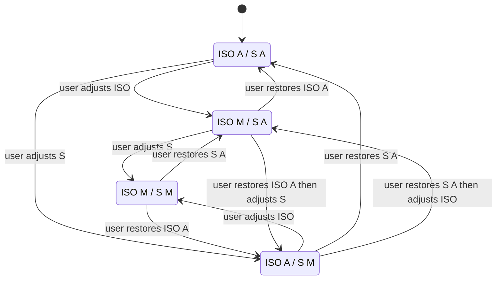
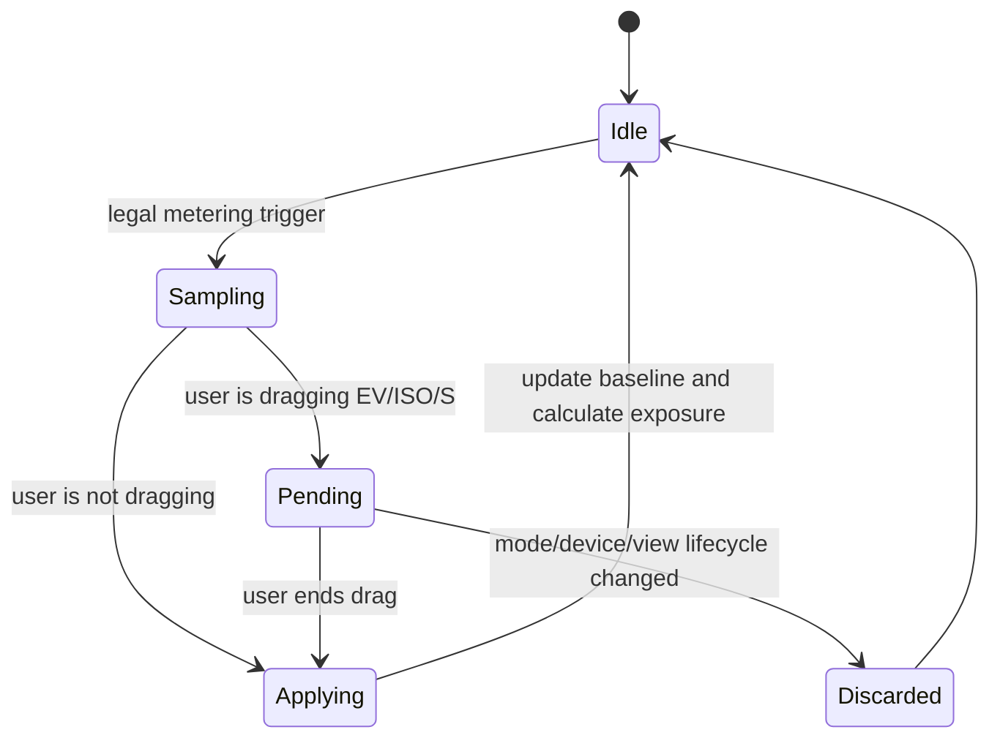
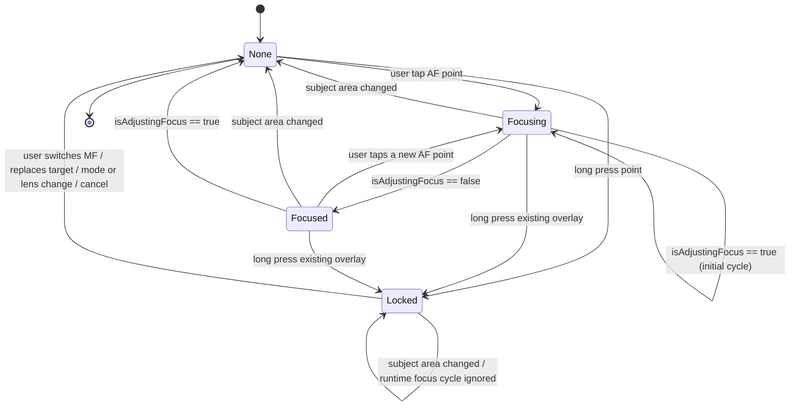
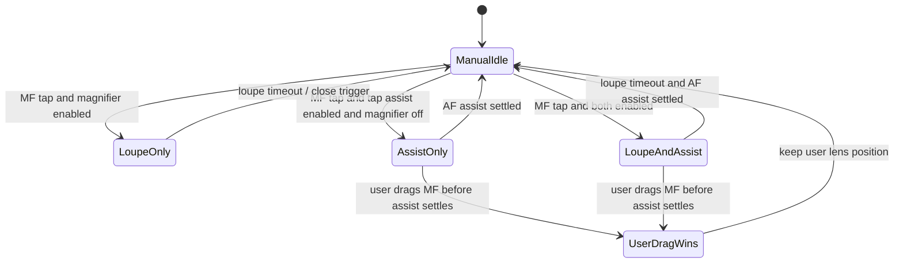

# Camera Controls Design

本文档记录当前相机控制 UI 的实现准绳。正文用中文解释决策，代码、测试、评审里使用英文 canonical term，避免后续靠口头记忆判断按钮位置。

## Canonical Terms

| Term | 中文解释 | 使用规则 |
| --- | --- | --- |
| `viewfinder top shoulder` | 取景器顶部 Face ID / Dynamic Island 两侧肩区 | 不放状态噪音。右肩放 `Settings`。 |
| `Basic EV` | 普通产品曝光补偿 | 不依赖专业控制状态机的轻量 EV 流程。入口在 Face ID / Dynamic Island 左侧，只写 exposure target bias。 |
| `viewfinder top toolbar` | 肩区下方、取景器上方工具栏 | 放高频但不属于参数条的按钮：`Flash` 和 `Live Photo`。它参与垂直布局，占用 viewfinder 上方空间，不覆盖预览画面。 |
| `viewfinder lower toolbar` | 取景器下方参数工具栏 | 只属于 `TAP_ENABLE_PRO_CAMERA_CONTROLS` 专业控制构建；普通产品构建不编译这组专业参数入口。 |
| `mode selector slot` | 拍摄模式选择占位区 | 默认承载 `mode selector bar`。控制条打开时被 `ticked adjustment strip` 临时替代。 |
| `mode selector bar` | 拍摄模式选择条 | 默认显示 `PHOTO / VIDEO`。外层 bar、按钮 frame、按钮文字都不参与旋转。 |
| `portrait adjustment centerline` | Portrait UI 的全局参数调节中线 | 所有横向参数条的中心刻度必须对齐整个屏幕 / 控件容器的水平中心线，不能被左标题或右数值挤偏。 |
| `ticked adjustment strip` | 刻度调节条 | 共享 UI primitive，可服务 Basic EV 或 Pro EV/ISO/S/MF。它只知道 value/range/step/label/callback，不知道 Basic/Pro 业务模式。 |
| `value cursor` | 当前值游标 | 位于 `ticked adjustment strip` 上的可见圆点 / 小按钮，用来标识当前选择值；不是实线轨道。 |
| `FOV selector bar` | 镜头 / 视角选择条 | 显示 release field-of-view chips。外层 bar 固定在取景器下边缘内侧，chip 内容按设备姿态旋转，bar 本身不旋转。 |
| `preview-only zoom` | 取景器预览缩放 | 第一阶段的 `1x / 2x / 3x` 只改变用户看到的预览和 tap 坐标映射，不改变最终 RGB/depth 输出。 |
| `source switching mode` | 真实摄像头源切换模式 | 后续 roadmap。切换焦段时可能切到不同 Apple camera path，并按当前 path 能力重新决定 ISO/S/AF/MF 可用性。 |
| `TAP_ENABLE_PRO_CAMERA_CONTROLS` | 专业相机控制编译开关 | 只允许 Debug 实验构建使用。普通产品构建不定义它；Release + 该 flag 必须 fail build。 |
| `viewfinder edge toast` | 取景器边缘提示 | 贴在取景器上边缘内侧，水平居中淡入淡出，不阻止拍摄。 |
| `focus loupe` | 对焦放大预览 | MF 下由用户点按位置驱动的预览辅助。它只放大预览，不写 `videoZoomFactor`，不影响构图或成片。显示时长由 Settings 的 `Focus Magnifier` 枚举决定。 |
| `focus target overlay` | 对焦目标覆盖层 | 同一个状态同时驱动对焦框、`AE/AF LOCK` 标签和旁边的临时 EV 条。 |
| `focus frame anchor` | 对焦框锚点 | 用户点按或锁定的 preview-local 归一化坐标。对焦框的几何中心必须始终由这个点决定，不能被标签、提示、EV 条或动画布局推移。 |
| `focus validity` | 对焦目标有效性 | 可见对焦框代表“当前仍然有效的用户选择目标”。它不会按固定 TTL 自动消失，只会被用户替换、手动对焦模式、镜头/模式切换、取消或 runtime invalidation 改变。 |
| `lock badge` | 锁定标签 | `AE/AF LOCK` 标签。它是对焦框的附属 overlay，放在 frame 外侧，不参与 frame 本体布局，也不能改变 `focus frame anchor`。 |
| `focus companion EV rail` | 对焦框旁边的临时 EV 条 | AF tap-to-focus 后和对焦框同步显示 / 消失；AE/AF lock 后继续显示。只显示小太阳图标、刻度和当前值游标，不显示 `EV` 字样或数值。 |
| `focus exposure scrub` | 对焦点曝光拖拽 | 对焦框或旁边 EV 条出现后，用户可在对焦目标附近上下拖动来调节临时 EV。 |
| `subject area changed` | 画面/主体区域变化 | AVFoundation 的 subject-area 变化信号。非锁定 AF 下，它表示当前用户选择的对焦目标已经失效。 |
| `runtime focus invalidation` | 运行时对焦失效 | 用户选择的非锁定对焦目标已经不再代表当前画面。触发条件包括 `subject area changed`，或对焦已经 settled 后 runtime 再次进入 `isAdjustingFocus == true`。 |
| `center-anchored chrome rotation` | 中心锚点旋转 | 固定控件 frame 不旋转，只把内部内容放进稳定 frame 后以 `.center` 为锚点旋转，避免按文字自身边界偏心旋转。 |
| `manual focus tap assist` | 手动对焦点按辅助 | MF 下点按取景器时，可选地对该点执行一次 focus-only AF assist，然后回到 MF，用读到的 lens position 作为手动微调起点。它不写 AE、不改变曝光模式。 |
| `meter target` | 测光目标 | 用户或系统当前用于估算光强的点或区域。第一阶段目标来自 AF tap、AF completion、进入半自动/手动曝光时的当前自动状态，或默认中心/全局区域。 |
| `meter sample` | 测光样本 | 某一时刻对 `meter target` 的光强估计。它可以来自 iOS 自动曝光状态，也可以由当前 ISO/S 和 `exposureTargetOffset` 反推。它只是输入测量，不等于写曝光参数。 |
| `meter baseline` | 测光基准 | TAPCam 接受的最新 `meter sample`，用于半自动曝光计算和双手动 `Meter` 偏差显示。没有独立 re-meter 按钮，但合法 focus-driven metering trigger 可以更新它。 |
| `metering` | TAPCam 测光 | TAPCam 的内部抽象：根据 `meter target` 估算当前场景光强，生成 `meter sample`，并在合法时机更新 `meter baseline`。它不等同于 iOS AE，也不直接写 ISO/S/EV。 |
| `metering trigger` | 测光触发 | 允许产生新 `meter sample` 的事件。第一阶段包括进入半自动/手动曝光、用户 AF tap、AF 模式下 focus completion。禁止独立 re-meter 按钮。 |
| `pending meter sample` | 待应用测光样本 | 用户正在拖 EV/ISO/S 时收到的最新测光样本。它不立刻改 UI 或写曝光，等用户松手后与最终用户值合并。 |
| `exposure calculation` | 曝光计算 | 用 `meter baseline`、EV 目标、用户固定的 `M` 项和设备范围计算 ISO/S/只读 Meter 偏差。它是 metering 的下游。 |
| `exposure write` | 曝光写入 | 把曝光计算结果提交给 Runtime/AVFoundation。`A/A` 可写 exposure bias；`M/A`、`A/M`、`M/M` 通过 custom exposure 写 ISO + shutter 双值。 |
| `ISO priority` | ISO 优先 | `ISO M / S A`。用户手动选择 ISO，TAPCam 根据 `meter baseline` 和 EV 目标计算 `S`，再把 ISO 和 S 作为 custom exposure 双值写入 Runtime。 |
| `shutter priority` | 快门优先 | `ISO A / S M`。用户手动选择 `S`，TAPCam 根据 `meter baseline` 和 EV 目标计算 ISO，再把 ISO 和 S 作为 custom exposure 双值写入 Runtime。 |
| `manual exposure` | 双手动曝光 | `ISO M / S M`。用户直接控制 ISO 和 S，不再做等效曝光反推；`EV` 位置显示只读 `Meter` 偏差。 |

## Rotation Rules

相机屏幕保持 portrait layout。设备旋转只改变 chrome 内容方向，不改变控件组的锚点和外层尺寸。

采用同一规则的控件：

- `FOV selector bar`：bar capsule、chip frame、滚动方向不旋转；每个 chip 内的数字和单位使用 `center-anchored chrome rotation`。
- `mode selector bar`：bar、按钮 frame、`PHOTO / VIDEO` 文字都不旋转。
- `viewfinder lower toolbar`：toolbar 的 HStack、按钮 frame、active 背景不旋转；按钮内文字、数值和角标使用 `center-anchored chrome rotation`。
- `ticked adjustment strip`：strip frame、刻度分布、拖动热区不旋转；左侧标题和右侧数值使用 `center-anchored chrome rotation`。
- `viewfinder top shoulder` 和 `viewfinder top toolbar`：按钮 frame 与背景不旋转；图标使用 `center-anchored chrome rotation`。

不要对整组 toolbar 或 strip 直接做 `rotationEffect`。整组旋转会改变触控方向和布局锚点，和镜头选择条行为不一致。

## Build-Time Surface Split

普通产品构建和专业控制实验构建是编译期互斥的两套流程，不是运行时设置：

- 未定义 `TAP_ENABLE_PRO_CAMERA_CONTROLS`：编译 `Basic EV`，不编译
  Pro Controls UI，不编译 ISO/S/MF/Meter/risk/readback 专业状态机。
- `DEBUG && TAP_ENABLE_PRO_CAMERA_CONTROLS`：编译 Pro Controls，且不编译
  `Basic EV` 入口。
- `!DEBUG && TAP_ENABLE_PRO_CAMERA_CONTROLS`：必须 fail build，避免专业实验
  控制进入 Release 产品包。

Settings 里不提供 `Pro Controls` runtime toggle。这个选择只由编译条件决定。

允许共享的只有足够小的底层：`ticked adjustment strip` UI primitive、EV 常量、
纯显示/数值限制 helper，以及不感知 ISO/S/Meter/MF 的最小 exposure-bias 写入。
普通 `Basic EV` 不允许依赖 `CameraExposureControlState`、`CameraAdjustmentControlState`
或任何 Pro lower-toolbar 状态。

完整边界、实现状态和验证记录见 [CameraProControlsBuildIsolationPlan.md](CameraProControlsBuildIsolationPlan.md)。

## Top Layout

`viewfinder top shoulder` 只承担两个角色：

- 右肩：`Settings`，替代系统状态区位置。
- 左肩：普通产品构建显示 `Basic EV` 常驻入口。它采用 Apple Camera 风格的
  透明单行文字控件，显示紧凑当前值；点击后在 `mode selector slot` 打开 EV
  `ticked adjustment strip`，再次点击关闭。
- `TAP_ENABLE_PRO_CAMERA_CONTROLS` 构建不编译 `Basic EV` 左肩入口；Pro Controls
  自己拥有专业 EV/ISO/S/AFMF 入口。

`viewfinder top toolbar` 放：

- `Flash`：44pt 圆形按钮，点按循环 `Off -> Auto -> On -> Off`。
- `Live Photo`：44pt 圆形按钮，仅在当前 `AVCapturePhotoOutput` 支持 Live Photo
  时显示；点击切换 Settings 共用的 `CameraLivePhotoEnabled` 偏好。当前实现支持
  无声 Live Photo：照片、manifest/proof、paired MOV 写入和 Photos 导出链路已接通，
  麦克风音频不作为启用前提。

`viewfinder top toolbar` 不能作为 preview overlay。布局顺序必须是 `viewfinder top shoulder`、`viewfinder top toolbar`、viewfinder，再进入下方控制区。

`LiDAR Focus Assist` 不出现在拍摄 UI 上，只在 Settings 里。

## Lower Toolbar

`viewfinder lower toolbar` 只属于 `TAP_ENABLE_PRO_CAMERA_CONTROLS` 专业控制构建。
普通产品构建不编译这组入口。

下方控制区从上到下固定为：快门行、`viewfinder lower toolbar`（仅 Pro Controls
构建）、`mode selector slot`。快门行必须高于 `mode selector slot`，避免主要拍摄
动作落在屏幕过低位置；底部留白属于整个控制栈，不属于快门行本身。

Pro Controls 构建中从左到右：

1. `EV`
2. `ISO`
3. `S`
4. `AF/MF`
5. `ƒ`

行为：

- toolbar 在 Pro Controls 构建中常驻。
- 点击 `EV / ISO / S` 时，`mode selector slot` 被 `ticked adjustment strip` 临时替代；快门位置不移动。
- 点击另一个参数会直接切换控制条。
- `ƒ` 灰色只读，例如 `ƒ1.8`；不可点击，不提示。

`ticked adjustment strip` 的视觉：

- 中心刻度对齐 `portrait adjustment centerline`。
- 只显示刻度和 `value cursor`，不显示系统 slider 的实线轨道。
- 拖动热区可以透明覆盖刻度。
- 每跨过一个有效 step 触发轻量 selection haptic。
- 在 Pro Controls 构建中，当前正在调节的参数由 `viewfinder lower toolbar`
  对应按钮的 active 状态标识，不在 strip 内额外加选中标签或轨道高亮。
- 在普通产品构建中，`Basic EV` 左肩入口的 active 状态标识 EV strip 已打开。

## Basic EV

`Basic EV` 是普通产品构建的完整独立流程，不是 Pro Controls 的残留入口。

UI：

- 入口常驻在 `viewfinder top shoulder` 左侧。
- 入口是 Apple Camera 风格的轻量文字控件，不是 capsule、card、chip 或
  toolbar button。
- 入口视觉必须保持紧凑：单行 `EV` + 当前值，例如 `EV 0.0`、`EV +0.7`、
  `EV -1.0`。Tap target 可以通过固定 frame / `contentShape` 保持可点，但
  不能用可见背景来放大视觉重量。
- 入口不得显示背景、描边、阴影、material blur、外框或按下态高亮。
- 非 0 状态由紧凑数值本身传达；如果后续需要强调，只允许使用克制的文字色
  或字重变化，不能引入背景或边框。
- strip 打开时，active 状态可以使用文字 tint 表示，仍显示当前值。
- 点击入口打开 `mode selector slot` 里的 EV `ticked adjustment strip`。
- 再次点击入口关闭 strip，并恢复 `mode selector bar`。
- Shutter、Flash、Live Photo、preview-only zoom 不自动关闭 EV strip，方便用户连续调节。
- 打开 Settings、离开相机或 view 生命周期结束时关闭 EV strip。
- 关闭 strip 不重置 EV；EV 值保持到用户再次调整或启动重置策略生效。

行为：

- 保留已有 EV 持久化与启动重置策略。
- 写入路径只允许写 exposure target bias。
- 不读、不计算、不写 ISO 或 shutter。
- 不进入 custom exposure。
- 不改变 AF/MF 或 focus mode。
- 不写 App Intents、TAP manifest、Photos metadata 或 pending record schema。

## FOV Selector Bar

`FOV selector bar` 位于 viewfinder 下边缘内侧，作为 release FOV / 镜头选择入口。

行为：

- 只接收 display-only FOV options，不读取 camera profile、depth profile、raw device id 或 zoom plan。
- 少量选项居中，多选项水平滚动。
- 可选 chip 使用高对比状态；不可用 chip 灰显。
- bar 作为 viewfinder overlay 存在，但不遮挡 `viewfinder lower toolbar`、`mode selector slot` 或快门。
- 旋转时只旋转 chip 内数字和单位；bar capsule、chip frame 和滚动方向保持 portrait layout。

## Professional Control Device Limits

专业相机控制不是 TAPCam 单方面能“补出来”的能力。ISO、shutter、AF/MF
是否可写，最终取决于当前 Apple camera path、active format 和 depth
pipeline 暴露给 AVFoundation 的能力。

当前只有一台 iPhone 15 Pro 的真机证据，不能扩张成完整 iPhone 15 系列或
其他设备矩阵结论。已观察到：

- `BuiltInTripleCamera` 的 release 24/48/77mm-style depth path 可以保留
  depth 和 tap AF，但不支持 custom ISO/S 或 MF lens-position 写入。
- `BuiltInLiDARDepthCamera @ 1x` 可以保留 depth，并支持 custom ISO/S、
  MF lens position 和 tap AF。
- 该设备上 LiDAR depth zoom range 为 `1.0...1.0`，不能假设 LiDAR
  `videoZoomFactor` 超过 1x 仍 depth-safe。
- 前置 depth capture graph 下写 custom lens position 已观察到黑屏风险；
  第一阶段前置只保留自动/点按对焦，不暴露 MF 调节杆。

第一阶段优先 manual-control reliability：有可用的 rear LiDAR 24mm
manual-depth path 时，使用它作为 active capture/control path。`1x / 2x /
3x` 是 `preview-only zoom` preset，不是硬件焦段切换；最终 photo 和 depth
仍保持 full-frame LiDAR 24mm。第一次进入 2x 或 3x 时，用短暂
`viewfinder edge toast` 说明 preview-only。

`source switching mode` 进入 roadmap，不混进第一阶段。未来如果真的切换到
Triple/Wide/Tele/其他 Apple camera path，ISO/S/AF/MF 必须按当前 path 的
capability 重新 gate。置灰项需要解释为“当前苹果设备摄像头路径不支持该调节”，
而不是 TAPCam 不支持。该模式还必须重新定义输出契约，因为它不再能声明所有最终
RGB/depth 都是 full-frame LiDAR 24mm。

完整设备限制说明见 [CameraManualControlDeviceLimits.md](CameraManualControlDeviceLimits.md)。

## Exposure Model

本节只属于 `TAP_ENABLE_PRO_CAMERA_CONTROLS` 专业控制构建。普通产品构建只有
`Basic EV`，不编译 ISO/S/Meter/risk/readback 专业曝光状态机。

曝光控制有四个用户可见状态。`ISO` 和 `S` 两个按钮就是完整模式选择器，不新增独立曝光模式按钮：

- `ISO A / S A` 是全自动曝光。`EV` 可调，写入全局曝光补偿。
- `ISO M / S A` 是 `ISO priority`。用户手动选择 ISO，TAPCam 只计算带 `A` 角标的 S。
- `ISO A / S M` 是 `shutter priority`。用户手动选择 S，TAPCam 只计算带 `A` 角标的 ISO。
- `ISO M / S M` 是 `manual exposure`。取消自动等效曝光计算，直接写入用户选择的 ISO 和 S。
- 从 `A/A` 调 ISO 进入 `M/A`；从 `A/A` 调 S 进入 `A/M`；在 `M/A` 下再调 S 或在 `A/M` 下再调 ISO 升级为 `M/M`。
- 点击已经处于 `M` 的 `ISO` 或 `S` 按钮时，只把该侧恢复为 `A`。因此 `M/M` 可通过恢复 ISO 得到 `A/M`，或通过恢复 S 得到 `M/A`；再恢复另一侧回到 `A/A`。不新增第三个曝光模式按钮。
- 在 `M/A` 或 `A/M` 下调 EV 时，固定用户手动的 `M` 项，只按新的 EV 目标重算带 `A` 的项。
- UI 里的 `A` 表示 TAPCam 根据当前 `meter baseline` 自动等效计算，不表示 AVFoundation 仍处于连续自动曝光。Runtime 写入仍使用 custom exposure 的 ISO + shutter 双值。
- `M/M` 下 `EV` 位置变成只读 `Meter +/-x.x`，显示当前手动 ISO/S 组合相对 `meter baseline` 的偏差。
- `Meter +/-x.x` 本身是只读显示，不作为隐藏模式状态或恢复按钮。恢复自动侧只通过 `ISO` / `S` 两个按钮完成。

等效曝光计算：

- 第一版不追求真实物理 lux 标定；只做用户可感知的等效曝光计算。
- 可用的基准字段是 `meter baseline` 对应的 ISO、shutter duration、`exposureTargetOffset` 和当前 EV 目标。
- 目标曝光量近似为 `baseISO * baseShutterSeconds * pow(2, evBias - exposureTargetOffset)`。具体符号需要真机验证；验收时必须记录预览变亮/变暗方向是否与 EV 相符。
- `M/A` 中 `computedShutter = targetExposure / selectedISO`。
- `A/M` 中 `computedISO = targetExposure / selectedShutter`。
- 计算结果必须按当前设备的 ISO 和 shutter range clamp；发生 clamp 时，Debug readback 和验收记录应标记自动项已到硬件边界。
- `M/M` 不使用公式重算 ISO/S，只计算 `meterDeltaEV = log2(manualExposure / targetExposure)` 作为只读 `Meter`。

测光模型：

- `metering` 是 TAPCam 内部抽象，不等同于 iOS AE。
- `metering` 只产生光强输入：`meter target -> meter sample -> meter baseline`。
- `exposure calculation` 读取 `meter baseline` 并计算 ISO/S/只读 Meter。
- `exposure write` 才把结果交给 Runtime。
- 不提供独立 re-meter 按钮。
- 允许 focus-driven metering trigger：用户 AF tap、AF 模式下 focus completion、进入半自动/双手动曝光时的当前自动曝光状态。
- `MF` 下的 `manual focus tap assist` 永远 focus-only，不触发曝光重算。
- 这个策略是当前阶段的明确产品约束，但不是最终体验定论。后续需要根据真实拍摄体验、拖动手感、亮度突变场景、连续 AF 稳定性和用户理解成本继续讨论和迭代。

合法 metering trigger 对曝光状态的影响：

| Exposure state | User AF tap | AF completion | MF tap assist |
| --- | --- | --- | --- |
| `A/A` | AF + AE；更新测光目标和系统自动曝光输入 | 更新 `meter sample`，保持用户 EV 偏移 | focus-only，不参与曝光 |
| `M/A` | AF + metering；固定 ISO，重算 S | focus-driven metering；固定 ISO，重算 S | focus-only，不参与曝光 |
| `A/M` | AF + metering；固定 S，重算 ISO | focus-driven metering；固定 S，重算 ISO | focus-only，不参与曝光 |
| `M/M` | AF；不写曝光；更新只读 `Meter` 输入 | 更新只读 `Meter` 输入 | focus-only，不参与曝光 |

AF completion metering 的节流规则：

- 只在 `isAdjustingFocus` 从 `true` 回到 `false` 时触发一次。
- 如果距离上次 metering 小于 500ms，跳过。
- 用户主动 AF tap 可以取代正在进行的旧 metering。
- metering 和 focus assist 都使用 generation token，旧结果晚到时丢弃。
- 更细的 same focus point / device id / exposure state 去重先不进入第一阶段实现，后续按真实 UX 反馈再调。

交互优先规则：

- 用户正在拖 `EV`、`ISO` 或 `S` 时，系统 metering 只能更新 `pending meter sample`，不能立刻改 UI、灰色风险区或写曝光。
- 用户拖 `EV` 时，EV 自身仍要尽可能实时写入并影响预览明暗；延后的只是系统 metering sample。
- `M/A` 中拖 ISO、`A/M` 中拖 S 时，使用当前已提交 `meter baseline` 实时重算带 `A` 的项；pending sample 不参与拖动中的实时反馈。
- 用户松手后，用最新 `pending meter sample` + 松手后的最终用户值合并计算并写入一次。
- 如果松手前切换模式、镜头、设备、退出相机或回到 `A/A`，丢弃 pending sample。
- 拖动期间灰色风险区不跟 pending sample 移动；松手应用后再按新的 `meter baseline` 更新。

风险区规则：

- `M/A` 和 `A/M` 中，当前正在拖的 `M` 项 strip 可以显示灰色风险区。灰色表示另一侧 `A` 项已接近或到达硬件边界，无法继续保持目标曝光。
- `M/M` 中也保留灰色风险区，但语义变成只读 meter delta 风险：`abs(meterDeltaEV) > 1.0 EV` 灰色。
- 第一阶段只实现单层灰色风险区；更深的危险分级属于后续 UX tuning。
- 风险区只提示，不阻止拖动。优先保留用户意图；最终曝光可能欠曝或过曝。

`Tap-to-focus` 后的临时 EV 是全局 EV 的附加值：`effective EV = global EV + temporary focus EV`。在 `M/A` 或 `A/M` 中，temporary focus EV 改变目标曝光，只重算带 `A` 的项；在 `M/M` 中它不改 ISO/S。

## Focus Model

`AF/MF` 与曝光完全独立。

普通产品构建保留基础 tap-to-focus 路径，但不编译 `AF/MF` 专业切换入口、
MF lens-position strip、MF 专业调节状态或 Pro readback。以下 MF 专业控制规则只属于
`TAP_ENABLE_PRO_CAMERA_CONTROLS` 构建。

对焦模式只决定相机如何找焦点，不决定曝光控制权。曝光写入由 `A/A`、`M/A`、`A/M`、`M/M` 决定。AF 事件可以成为 metering trigger，但 metering 的结果必须按当前曝光状态处理。

AF：

- 点击取景器执行 tap-to-focus。
- `AF tap` 和 `MF tap` 使用同一套 preview-local 点位与 visible-crop 映射；分开的是后续结果状态。
- 显示 `focus target overlay`：对焦框和 `focus companion EV rail` 同步出现、同步消失。
- `A/A` 下 AF tap 可以同时更新 AF 和 AE 输入；`M/A`、`A/M` 下只固定用户的 `M` 项并重算 `A` 项；`M/M` 下不写曝光，只允许更新只读 `Meter` 输入。
- 非锁定 AF 的 overlay 不使用固定时间自动隐藏。只要 runtime 没有让当前目标失效，对焦框继续代表当前有效的 `focus frame anchor`。
- 对焦 overlay 状态机是 `none -> focusing(point) -> focused(point) -> locked(point) -> none`。`none` 可由用户切到 MF、替换目标、镜头/模式切换、显式取消、view 生命周期或 `runtime focus invalidation` 触发。
- `subject area changed` 不创建新框，也不使用旧 `focus frame anchor` 再发起一次对焦。它表示当前非锁定目标失效，必须隐藏 `focus target overlay`。
- runtime `isAdjustingFocus` 进入 true 时，如果当前 overlay 仍在 `focusing(point)`，这是用户刚 tap 后的初始对焦周期，overlay 保持显示；如果当前 overlay 已经 `focused(point)`，这是 `runtime focus invalidation`，必须隐藏 overlay。回到 false 时只有仍存在的 `focusing(point)` 才进入 `focused(point)`。
- `focus companion EV rail` 的中心线和对焦框中心线对齐，默认贴在对焦框右侧；右侧空间不足时翻到左侧。两者边缘间距优先使用 6pt，靠近取景器边缘时允许被 clamp。
- `focus companion EV rail` 不显示 `EV` 字样或当前 EV 数值；用户只看到小太阳图标、刻度和黄色 `value cursor`。
- `focus companion EV rail` 的默认值是 0 EV，`value cursor` 的圆心必须落在中间刻度上；实现时不能用圆点底边去对齐刻度。
- 对焦框或旁边 EV 条出现后，支持 `focus exposure scrub`：用户在对焦目标附近上下拖动，也能调节同一份临时 EV。
- 长按显示 `AE/AF LOCK`。如果当前已有可见 `focus target overlay`，长按把这个已有目标升级为锁定态；只有没有现有目标时才使用长按开始点创建新目标。非 `A/A` 曝光状态下，长按不能偷写 AE；锁定文案后续可按 UX 反馈调整，第一阶段先保证曝光写入规则正确。
- AE/AF lock 后，对焦框固定在锁定的目标点，`focus companion EV rail` 继续显示且不自动消失。`lock badge` 不能改变对焦框位置；subject-area 变化和 runtime focus cycle 也不能自动移动或取消锁定目标。

MF：

- 点击 `AF/MF` 从 AF 进入 MF，并显示 `MF lens position` 的 `ticked adjustment strip`。
- 再次点击回到 AF，控制条消失。
- 前置摄像头下第一阶段禁用 `AF/MF` 切换。前置 depth capture graph 下写入 custom lens position 已观察到黑屏风险；在真实设备能力矩阵和 UX 验证完成前，前置只保留自动对焦/点按对焦路径，不暴露 MF 调节杆。
- MF 下没有对焦框。
- MF 下点击取景器会更新同一个 `manual focus assist point`。这是原因；`focus loupe` 和 `manual focus tap assist` 都只是这个点派生出来的结果，彼此不能互相 gate。
- `Focus Magnifier` 不为 `Off` 时，MF tap 在取景器右下角显示 `focus loupe`；它只放大当前预览，不改 `videoZoomFactor`，不影响最终照片。
- `Focus Magnifier` 为 `Off` 时，仍然记录 tap point；只是不显示 loupe。
- `manual focus tap assist` 开启时，MF tap 会对该点执行一次 focus-only AF assist，然后读取 settled 后的 `lensPosition` 作为手动对焦杆起点，状态仍然回到 MF。
- `manual focus tap assist` 关闭时，MF tap 仍然可以显示/移动 loupe，但不执行 AF assist。
- `manual focus tap assist` 不写 `exposurePointOfInterest`，不切 `continuousAutoExposure`，不更新 `meter baseline`，不改变 `A/A`、`M/A`、`A/M`、`M/M`。
- AF assist 未完成前如果用户拖动 MF 杆，用户拖动优先。旧 AF assist 回调只能更新 Debug readback，不能覆盖 `lensPosition` 或对焦杆位置。
- `focus loupe` 默认显示 1.5s。显示时长由 Settings 的 `Focus Magnifier` 选择：`Off`、`1.5s`、`3s`、`5s`。用户 tap 或拖动 MF 杆时续期；停止交互后按所选时长关闭。
- 半按快门、拍照、切回 AF、切换镜头、退出相机或 view 生命周期结束时立即关闭 loupe。
- `Focus Magnifier` 的 Settings 形态是单个枚举 key，包含关闭和三个时长值；不保留旧 bool key，也不做未上线内部 key 兼容。这个 UX 允许后续根据真实反馈调整。

## Mode Selector

`mode selector slot` 默认显示 `mode selector bar`：

- `PHOTO`：可用，当前选中。
- `VIDEO`：灰色不可用，点击显示 `Coming soon`。

`mode selector bar` 不响应设备方向变化。它的外层 HStack、每个按钮 frame、`PHOTO` / `VIDEO` 文字都保持 portrait layout，不使用 `rotationEffect`。

`Live Photo` 不放在 mode selector 里，放在 `viewfinder top toolbar`，因为它是 Photo 模式的附加捕获能力，不是独立拍摄模式。

## Viewfinder Edge Toast

所有非阻塞提示都使用 `viewfinder edge toast`：

- 贴取景器上边缘内侧，水平居中。
- 只淡入淡出，不从边缘滑入。
- 不覆盖快门、`viewfinder lower toolbar`、`mode selector slot`。
- 不阻止拍摄。

示例：

- `Depth unavailable`
- `Coming soon`
- `Auto exposure restored`
- `Flash unavailable`

Settings 的 `Depth Warnings` 只控制深度类提示；普通操作反馈不提供开关。

## Settings

Settings 分组：

- `Capture`：`Photo Quality`、`Output Format`、`Default Flash`、`Live Photo`、`Keep Screen Awake`。
- `Viewfinder`：`Grid`、`Highlight Color`、`Focus Magnifier`、`Depth Warnings`。
- `Focus`：`LiDAR Focus Assist`，默认关。`Manual Focus Tap Assist` 属于
  `TAP_ENABLE_PRO_CAMERA_CONTROLS`，普通产品构建不显示。

`Focus Magnifier` 是 Picker，不是 bool toggle：

- `Off`
- `1.5s`，默认值
- `3s`
- `5s`

该设置只控制 `focus loupe` 是否显示以及显示时长。`manual focus tap assist`
只属于 `TAP_ENABLE_PRO_CAMERA_CONTROLS` 构建；在 Pro Controls 构建中，
`Focus Magnifier` 不 gate 它是否执行 focus-only AF assist。

`Highlight Color` 是取景器交互高亮色：

- 默认值是 `Yellow`，保留既有外观。
- `Titian`（`#B7282E`）影响用户可见的 EV 激活状态、Flash Auto 的 `A`
  角标、Flash On 强制开启态、Live Photo 激活态、AE/AF lock、tap-focus
  temporary EV marker，以及 Pro 控制 ticked slider cursor。
- Debug-only overlay、Settings Debug rows、warning/status 黄色、深度热力图或
  分析语义色不读取该设置。

`Default Flash` 是 Settings 里的持久化默认值：

- 选项顺序是 `Off`、`Auto`、`Always On`。
- 默认值是 `Auto`。
- 相机页面创建时用它初始化当前 `Flash` 状态。
- Settings 修改该值时，当前相机页面同步到新的默认状态。
- 相机 viewfinder 顶部 `Flash` 按钮仍然只改变当前会话状态，不反写
  `Default Flash`。

C2PA 当前不出现在 UI。

## Lifetime Rules

不跨冷启动持久化：

- ISO/S 半自动和双手动曝光状态、`meter baseline`、`pending meter sample`
- `AF/MF`
- MF lens position
- 当前激活的 `ticked adjustment strip`
- `Flash`

从后台回到前台时，本次会话状态应恢复。

持久化的 Settings 项：

- `Photo Quality`
- `Output Format`
- `Default Flash`
- `Live Photo`
- `Keep Screen Awake`
- `Reset EV on App Launch`
- `Basic EV` 值按 EV preference policy 处理：如果启动重置开启，冷启动回到默认值；如果关闭，可恢复上次 EV。它不进入 capture artifact、manifest、Photos metadata 或 pending record。
- `Grid`
- `Highlight Color`
- `Focus Magnifier` 枚举：`Off / 1.5s / 3s / 5s`
- `Depth Warnings`
- `LiDAR Focus Assist`
- `Manual Focus Tap Assist`，仅 `TAP_ENABLE_PRO_CAMERA_CONTROLS` 构建显示和读取

## No Depth

TAP 仍优先选择支持深度的设备和格式，并请求深度。

如果支持深度的拍摄链路在当前场景没有返回深度数据：

- 保存照片。
- 进入 TAP Library。
- 标记 `Depth unavailable`。
- 允许进入分析页面；分析页面显示 No Depth 分数和不可用状态。
- 不因为深度或可信状态阻止拍摄。

拍摄中不常驻显示可信状态或深度状态。只有 `Depth Warnings` 开启时，No Depth 捕获后用 `viewfinder edge toast` 轻提示。

## Capture Score Summary

打分系统接在捕获完成后的本地 artifact / pending record 节点。

第一阶段评分只作为结构化输入，不在拍摄 UI 常驻显示。评分维度：

- depth availability
- output format
- photo quality level
- capture signature / binding state
- analysis readiness

评分文本必须是 public-safe：不显示 capture ID、Photos asset ID、proof、key ID、URL、文件路径、GPS 坐标。

## Current Implementation Status

当前阶段已经落地：

- `CameraExposureControlState` 是纯 Planning 模型，负责 `A/A`、`M/A`、`A/M`、`M/M`、`meter baseline`、`pending meter sample`、EV 重算、只读 `Meter`、generation/device/signature 丢弃和风险区计算。
- `CameraManualControlReadbackSnapshot` 是 Runtime readback 的纯值边界。`CaptureSessionController` 在 session queue 上读取 ISO、S、`exposureTargetOffset`、lens position、focus/exposure mode 和 `isAdjustingExposure`/`isAdjustingFocus`，并带上 caller-supplied readback reason。
- `CaptureSessionController` 观察 `isAdjustingExposure`，向 ViewModel 发出 `exposureStarted` / `exposureSettled`。进入半自动/手动或 focus-driven metering 后，View 层按 300ms settle 上限安排 readback。
- `CameraControlService` 区分 `autoFocus` 和 `autoFocusOnly`。`manual focus tap assist` 使用 focus-only 写入，不写 AE、不改 exposure point。
- `CameraView` 把纯模型输出的 display state、Runtime intent、Debug state 分开处理；Debug overlay 只显示 readback/model 字符串，不写 OSLog、不持久化、不进入 manifest。
- `Focus Magnifier` 使用单个 Settings 枚举 key：`Off / 1.5s / 3s / 5s`，默认 `1.5s`；关闭只影响 loupe。`Manual Focus Tap Assist` 只在 `TAP_ENABLE_PRO_CAMERA_CONTROLS` 构建中显示，且不由 `Focus Magnifier` gate。

当前自动化覆盖：

- `TAPCameraExposureControlStateTests` 覆盖纯曝光模型、EV 只重算 `A` 侧、纯 M 只读 Meter、pending sample、stale generation 丢弃和等效曝光公式符号。
- `TAPCameraManualControlIntentTests` / `TAPCameraManualControlCommandPlanTests` 继续覆盖 Runtime command 边界。
- `TAPCameraCapturePresentationTests` 覆盖 UI state、Settings key/default、Debug state 和边界扫描。

仍需真机 UX 验证：

- 等效曝光公式中 `exposureTargetOffset` 的符号方向。
- AF completion metering 的节流体感、300ms settle 上限、灰色风险区阈值，以及半自动模式下预览明暗是否足够实时。
- 真实设备上 ISO/S clamp 后的 readback 与用户感知是否一致。

## Acceptance Evidence

相关验收报告保存在 `Docs/Acceptance/`。报告必须区分三类证据：

- 用户现场实机验收：记录覆盖项、日期和人工验收性质；不能伪装成 Codex 自动化产物。
- Codex 自动化 UI 回归：记录 XCUITest 命令、result bundle 路径，以及它是否通过 Debug-only harness 复用生产控件。
- 输出与评分证据：记录真实设备 Photos 输出审计、depth/proof/manifest/score 覆盖项、命令、结果包路径；如果设备、权限或解锁状态阻塞，按阻塞记录。

报告只描述证据，不改变拍摄 UI。拍摄界面仍不常驻显示可信状态、深度状态或评分。

## Roadmap

这轮不实现：

- 完整视频捕获。
- 完整 Live Photo paired movie 写入、Photos 保存和分析链路。
- 第二快门。
- 左手/右手快门位置。
- 横屏左右控制条分配。
- 完整外部 C2PA manifest 兼容。
