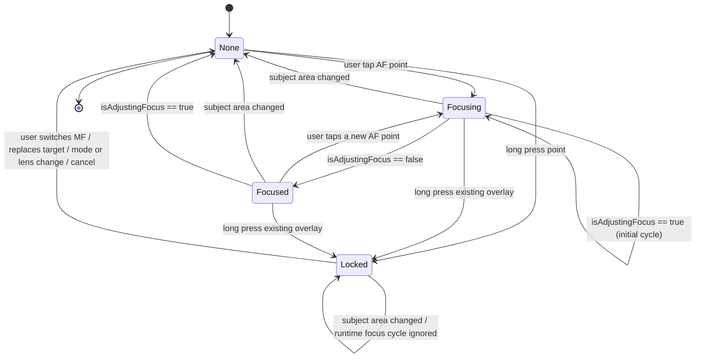

# Camera Controls Design

本文档记录当前相机控制 UI 的实现准绳。正文用中文解释决策，代码、测试、评审里使用英文 canonical term，避免后续靠口头记忆判断按钮位置。

## Canonical Terms

| Term | 中文解释 | 使用规则 |
| --- | --- | --- |
| `viewfinder top shoulder` | 取景器顶部 Face ID / Dynamic Island 两侧肩区 | 不放状态噪音。右肩放 `Settings`。 |
| `viewfinder top toolbar` | 肩区下方、取景器上方工具栏 | 放高频但不属于参数条的按钮：`Flash` 和 `Live Photo`。它参与垂直布局，占用 viewfinder 上方空间，不覆盖预览画面。 |
| `viewfinder lower toolbar` | 取景器下方参数工具栏 | 常驻显示 `EV`、`ISO`、`S`、`AF/MF`、`ƒ`。 |
| `mode selector slot` | 拍摄模式选择占位区 | 默认承载 `mode selector bar`。控制条打开时被 `ticked adjustment strip` 临时替代。 |
| `mode selector bar` | 拍摄模式选择条 | 默认显示 `PHOTO / VIDEO`。外层 bar、按钮 frame、按钮文字都不参与旋转。 |
| `portrait adjustment centerline` | Portrait UI 的全局参数调节中线 | 所有横向参数条的中心刻度必须对齐整个屏幕 / 控件容器的水平中心线，不能被左标题或右数值挤偏。 |
| `ticked adjustment strip` | 刻度调节条 | 通用控制条，可调 `EV`、`ISO`、`S`、`MF lens position`。只显示刻度、`value cursor` 和透明拖动热区，不显示系统 slider 实线轨道。当前参数由 `viewfinder lower toolbar` 的 active 按钮标识。不是 sheet，不从底部滑出。 |
| `value cursor` | 当前值游标 | 位于 `ticked adjustment strip` 上的可见圆点 / 小按钮，用来标识当前选择值；不是实线轨道。 |
| `FOV selector bar` | 镜头 / 视角选择条 | 显示 release field-of-view chips。外层 bar 固定在取景器下边缘内侧，chip 内容按设备姿态旋转，bar 本身不旋转。 |
| `viewfinder edge toast` | 取景器边缘提示 | 贴在取景器上边缘内侧，水平居中淡入淡出，不阻止拍摄。 |
| `focus loupe` | 对焦放大预览 | MF 时常驻取景器右下角，用于检查手动对焦区域。 |
| `focus target overlay` | 对焦目标覆盖层 | 同一个状态同时驱动对焦框、`AE/AF LOCK` 标签和旁边的临时 EV 条。 |
| `focus frame anchor` | 对焦框锚点 | 用户点按或锁定的 preview-local 归一化坐标。对焦框的几何中心必须始终由这个点决定，不能被标签、提示、EV 条或动画布局推移。 |
| `focus validity` | 对焦目标有效性 | 可见对焦框代表“当前仍然有效的用户选择目标”。它不会按固定 TTL 自动消失，只会被用户替换、手动对焦模式、镜头/模式切换、取消或 runtime invalidation 改变。 |
| `lock badge` | 锁定标签 | `AE/AF LOCK` 标签。它是对焦框的附属 overlay，放在 frame 外侧，不参与 frame 本体布局，也不能改变 `focus frame anchor`。 |
| `focus companion EV rail` | 对焦框旁边的临时 EV 条 | AF tap-to-focus 后和对焦框同步显示 / 消失；AE/AF lock 后继续显示。只显示小太阳图标、刻度和当前值游标，不显示 `EV` 字样或数值。 |
| `focus exposure scrub` | 对焦点曝光拖拽 | 对焦框或旁边 EV 条出现后，用户可在对焦目标附近上下拖动来调节临时 EV。 |
| `subject area changed` | 画面/主体区域变化 | AVFoundation 的 subject-area 变化信号。非锁定 AF 下，它表示当前用户选择的对焦目标已经失效。 |
| `runtime focus invalidation` | 运行时对焦失效 | 用户选择的非锁定对焦目标已经不再代表当前画面。触发条件包括 `subject area changed`，或对焦已经 settled 后 runtime 再次进入 `isAdjustingFocus == true`。 |
| `center-anchored chrome rotation` | 中心锚点旋转 | 固定控件 frame 不旋转，只把内部内容放进稳定 frame 后以 `.center` 为锚点旋转，避免按文字自身边界偏心旋转。 |
| `manual focus tap assist` | 手动对焦点按辅助 | MF 下点按取景器时，可选地先对该点执行一次 AF/AE，再回到当前 MF lens position 进行微调。 |

## Rotation Rules

相机屏幕保持 portrait layout。设备旋转只改变 chrome 内容方向，不改变控件组的锚点和外层尺寸。

采用同一规则的控件：

- `FOV selector bar`：bar capsule、chip frame、滚动方向不旋转；每个 chip 内的数字和单位使用 `center-anchored chrome rotation`。
- `mode selector bar`：bar、按钮 frame、`PHOTO / VIDEO` 文字都不旋转。
- `viewfinder lower toolbar`：toolbar 的 HStack、按钮 frame、active 背景不旋转；按钮内文字、数值和角标使用 `center-anchored chrome rotation`。
- `ticked adjustment strip`：strip frame、刻度分布、拖动热区不旋转；左侧标题和右侧数值使用 `center-anchored chrome rotation`。
- `viewfinder top shoulder` 和 `viewfinder top toolbar`：按钮 frame 与背景不旋转；图标使用 `center-anchored chrome rotation`。

不要对整组 toolbar 或 strip 直接做 `rotationEffect`。整组旋转会改变触控方向和布局锚点，和镜头选择条行为不一致。

## Top Layout

`viewfinder top shoulder` 只承担两个角色：

- 右肩：`Settings`，替代系统状态区位置。
- 左肩：当前不放常驻状态。`EV` 不再放在这里。

`viewfinder top toolbar` 放：

- `Flash`：44pt 圆形按钮，点按循环 `Off -> Auto -> On -> Off`。
- `Live Photo`：44pt 圆形按钮，当前阶段作为可见入口；完整 Live Photo 电影配对、写入和分析链路仍在 roadmap。点击未完成能力时使用 `viewfinder edge toast` 显示 `Coming soon`。

`viewfinder top toolbar` 不能作为 preview overlay。布局顺序必须是 `viewfinder top shoulder`、`viewfinder top toolbar`、viewfinder，再进入下方控制区。

`LiDAR Focus Assist` 不出现在拍摄 UI 上，只在 Settings 里。

## Lower Toolbar

`viewfinder lower toolbar` 从左到右：

1. `EV`
2. `ISO`
3. `S`
4. `AF/MF`
5. `ƒ`

行为：

- toolbar 常驻。
- 点击 `EV / ISO / S` 时，`mode selector slot` 被 `ticked adjustment strip` 临时替代；快门位置不移动。
- 点击另一个参数会直接切换控制条。
- `ƒ` 灰色只读，例如 `ƒ1.8`；不可点击，不提示。

`ticked adjustment strip` 的视觉：

- 中心刻度对齐 `portrait adjustment centerline`。
- 只显示刻度和 `value cursor`，不显示系统 slider 的实线轨道。
- 拖动热区可以透明覆盖刻度。
- 每跨过一个有效 step 触发轻量 selection haptic。
- 当前正在调节的参数由 `viewfinder lower toolbar` 对应按钮的 active 状态标识，不在 strip 内额外加选中标签或轨道高亮。

## FOV Selector Bar

`FOV selector bar` 位于 viewfinder 下边缘内侧，作为 release FOV / 镜头选择入口。

行为：

- 只接收 display-only FOV options，不读取 camera profile、depth profile、raw device id 或 zoom plan。
- 少量选项居中，多选项水平滚动。
- 可选 chip 使用高对比状态；不可用 chip 灰显。
- bar 作为 viewfinder overlay 存在，但不遮挡 `viewfinder lower toolbar`、`mode selector slot` 或快门。
- 旋转时只旋转 chip 内数字和单位；bar capsule、chip frame 和滚动方向保持 portrait layout。

## Exposure Model

全自动曝光状态：

- `EV` 显示 `EV 0.0` 或 `EV +0.3`，可调全局曝光补偿。
- `ISO` 显示当前 ISO，并带小 `A` 角标。
- `S` 显示当前快门，例如 `1/60`，并带小 `A` 角标。

自定义曝光状态：

- 用户调整 `ISO` 或 `S` 后进入 custom exposure。
- 不做伪自动补偿。调整 `ISO` 只改变 ISO，快门保持当前值；调整 `S` 只改变快门，ISO 保持当前值。
- `ISO` 和 `S` 都去掉 `A` 角标，不显示锁图标。
- `EV` 位置变成只读测光偏移，例如 `Meter +0.3`。
- 点击 `Meter +/-x.x` 恢复全自动曝光，`ISO` 和 `S` 重新显示 `A` 角标，`EV` 恢复为可调曝光补偿。

`Tap-to-focus` 后的临时 EV 是全局 EV 的附加值：`effective EV = global EV + temporary focus EV`。

## Focus Model

`AF/MF` 与曝光完全独立。

AF：

- 点击取景器执行 tap-to-focus。
- 显示 `focus target overlay`：对焦框和 `focus companion EV rail` 同步出现、同步消失。
- 非锁定 AF 的 overlay 不使用固定时间自动隐藏。只要 runtime 没有让当前目标失效，对焦框继续代表当前有效的 `focus frame anchor`。
- 对焦 overlay 状态机是 `none -> focusing(point) -> focused(point) -> locked(point) -> none`。`none` 可由用户切到 MF、替换目标、镜头/模式切换、显式取消、view 生命周期或 `runtime focus invalidation` 触发。
- `subject area changed` 不创建新框，也不使用旧 `focus frame anchor` 再发起一次对焦。它表示当前非锁定目标失效，必须隐藏 `focus target overlay`。
- runtime `isAdjustingFocus` 进入 true 时，如果当前 overlay 仍在 `focusing(point)`，这是用户刚 tap 后的初始对焦周期，overlay 保持显示；如果当前 overlay 已经 `focused(point)`，这是 `runtime focus invalidation`，必须隐藏 overlay。回到 false 时只有仍存在的 `focusing(point)` 才进入 `focused(point)`。
- `focus companion EV rail` 的中心线和对焦框中心线对齐，默认贴在对焦框右侧；右侧空间不足时翻到左侧。两者边缘间距优先使用 6pt，靠近取景器边缘时允许被 clamp。
- `focus companion EV rail` 不显示 `EV` 字样或当前 EV 数值；用户只看到小太阳图标、刻度和黄色 `value cursor`。
- `focus companion EV rail` 的默认值是 0 EV，`value cursor` 的圆心必须落在中间刻度上；实现时不能用圆点底边去对齐刻度。
- 对焦框或旁边 EV 条出现后，支持 `focus exposure scrub`：用户在对焦目标附近上下拖动，也能调节同一份临时 EV。
- 长按显示 `AE/AF LOCK`。如果当前已有可见 `focus target overlay`，长按把这个已有目标升级为锁定态；只有没有现有目标时才使用长按开始点创建新目标。
- AE/AF lock 后，对焦框固定在锁定的目标点，`focus companion EV rail` 继续显示且不自动消失。`lock badge` 不能改变对焦框位置；subject-area 变化和 runtime focus cycle 也不能自动移动或取消锁定目标。

MF：

- 点击 `AF/MF` 从 AF 进入 MF，并显示 `MF lens position` 的 `ticked adjustment strip`。
- 再次点击回到 AF，控制条消失。
- MF 下没有对焦框。
- MF 下点击取景器移动 `focus loupe` 的采样区域。
- `manual focus tap assist` 开启时，MF 下点击取景器还会先对该点执行一次 AF/AE，然后回到当前 MF lens position；关闭时只移动 `focus loupe`。
- `focus loupe` 位于取景器右下角，常驻；Settings 的 `Focus Magnifier` 关闭后不显示，MF 点击也不触发预览。

## Mode Selector

`mode selector slot` 默认显示 `mode selector bar`：

- `PHOTO`：可用，当前选中。
- `VIDEO`：灰色不可用，点击显示 `Coming soon`。

`mode selector bar` 不响应设备方向变化。它的外层 HStack、每个按钮 frame、`PHOTO` / `VIDEO` 文字都保持 portrait layout，不使用 `rotationEffect`。

`Live Photo` 不放在 mode selector 里，放在 `viewfinder top toolbar`，因为它是 Photo 模式的附加捕获能力，不是独立拍摄模式。

## Viewfinder Edge Toast

所有非阻塞提示都使用 `viewfinder edge toast`：

- 贴取景器上边缘内侧，水平居中。
- 只淡入淡出，不从边缘滑入。
- 不覆盖快门、`viewfinder lower toolbar`、`mode selector slot`。
- 不阻止拍摄。

示例：

- `Depth unavailable`
- `Coming soon`
- `Auto exposure restored`
- `Flash unavailable`
- `Focus magnifier off`

Settings 的 `Depth Warnings` 只控制深度类提示；普通操作反馈不提供开关。

## Settings

Settings 分组：

- `Capture`：`Photo Quality`、`Output Format`、`Live Photo`、`Keep Screen Awake`。
- `Viewfinder`：`Grid`、`Focus Magnifier`、`Depth Warnings`。
- `Focus`：`LiDAR Focus Assist`，默认关；`Manual Focus Tap Assist`，默认关。
- `Roadmap`：`Video`、`Shutter Position`、`Second Shutter`、`Landscape Control Split`，全部灰色并提示 `Coming soon`。

C2PA 当前不出现在 UI。

## Lifetime Rules

不跨冷启动持久化：

- 全局 `EV`
- ISO/S custom exposure 状态
- `AF/MF`
- MF lens position
- 当前激活的 `ticked adjustment strip`
- `Flash`

从后台回到前台时，本次会话状态应恢复。

持久化的 Settings 项：

- `Photo Quality`
- `Output Format`
- `Live Photo`
- `Keep Screen Awake`
- `Grid`
- `Focus Magnifier`
- `Depth Warnings`
- `LiDAR Focus Assist`

## No Depth

TAP 仍优先选择支持深度的设备和格式，并请求深度。

如果支持深度的拍摄链路在当前场景没有返回深度数据：

- 保存照片。
- 进入 TAP Library。
- 标记 `Depth unavailable`。
- 允许进入分析页面；分析页面显示 No Depth 分数和不可用状态。
- 不因为深度或可信状态阻止拍摄。

拍摄中不常驻显示可信状态或深度状态。只有 `Depth Warnings` 开启时，No Depth 捕获后用 `viewfinder edge toast` 轻提示。

## Capture Score Summary

打分系统接在捕获完成后的本地 artifact / pending record 节点。

第一阶段评分只作为结构化输入，不在拍摄 UI 常驻显示。评分维度：

- depth availability
- output format
- photo quality level
- capture signature / binding state
- analysis readiness

评分文本必须是 public-safe：不显示 capture ID、Photos asset ID、proof、key ID、URL、文件路径、GPS 坐标。

## Acceptance Evidence

相关验收报告保存在 `Docs/Acceptance/`。报告必须区分三类证据：

- 用户现场实机验收：记录覆盖项、日期和人工验收性质；不能伪装成 Codex 自动化产物。
- Codex 自动化 UI 回归：记录 XCUITest 命令、result bundle 路径，以及它是否通过 Debug-only harness 复用生产控件。
- 输出与评分证据：记录真实设备 Photos 输出审计、depth/proof/manifest/score 覆盖项、命令、结果包路径；如果设备、权限或解锁状态阻塞，按阻塞记录。

报告只描述证据，不改变拍摄 UI。拍摄界面仍不常驻显示可信状态、深度状态或评分。

## Roadmap

这轮不实现：

- 完整视频捕获。
- 完整 Live Photo paired movie 写入、Photos 保存和分析链路。
- 第二快门。
- 左手/右手快门位置。
- 横屏左右控制条分配。
- 完整外部 C2PA manifest 兼容。
