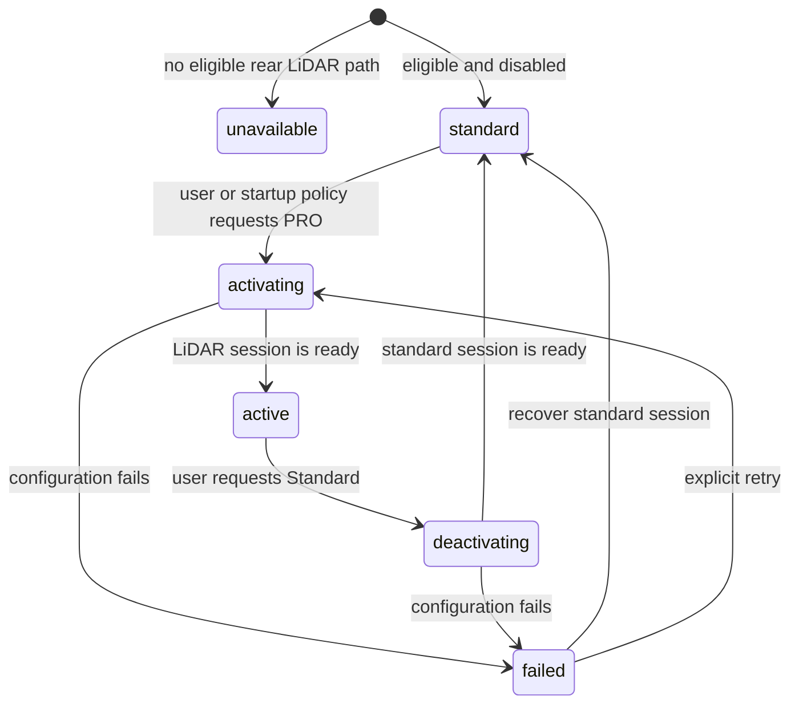

# Photographer Mode Runtime Product Plan

This document replaces the former build-isolation plan. Photographer Mode is a
Release product surface selected at runtime. Basic EV and professional camera
controls are both compiled; the active camera path and capability result decide
which surface the user can enter.

The existing filename is retained so older documentation links continue to
resolve.

## Product Contract

| Runtime mode | Camera path | Visible controls | Lens selector |
| --- | --- | --- | --- |
| Standard | Existing non-LiDAR path | Existing camera UI and Basic EV | Preserved |
| Photographer / PRO | Eligible rear LiDAR depth camera at 24mm / 1x | `EV`, `ISO`, `S`, `AF/MF`, `ƒ` | Hidden |
| Front camera | Existing front path with automatic/tap focus | Standard front-camera UI | Existing behavior |

The boundaries are strict:

- Standard mode never opts into LiDAR merely because the device has a LiDAR
  sensor. It keeps the original session, Basic EV, and lens/FOV selector.
- Photographer Mode is the only product path that selects the rear LiDAR
  capture device for professional controls.
- Photographer Mode supports both Photo and TAP Video. The rightmost `PRO`
  control remains visible in VIDEO and switches between Standard VIDEO and the
  eligible rear LiDAR PRO VIDEO path.
- The former Debug graph probe has been promoted into the product path and its
  Settings toggle has been removed. Runtime graph/format/drop/writer
  diagnostics remain available for validation. See
  [ProVideoResearchPlan.md](ProVideoResearchPlan.md).
- Photographer Mode uses one fixed 24mm / 1x capture path. It therefore removes
  the lens selector instead of presenting controls that cannot change the active
  LiDAR source safely.
- The professional control group is all-or-nothing. The mode is eligible only
  when the selected rear LiDAR path preserves depth and supports custom ISO,
  custom shutter duration, and manual lens-position writes.
- Front-camera selection never exposes Photographer Mode or manual focus.

## Entry and Chrome

The top toolbar order is:

```text
[Flash] [Live Photo] Spacer [PRO]
```

- `PRO` is the rightmost control on the same row as Flash and Live Photo.
- The button is hidden when the current device has no eligible rear LiDAR path
  or while the front camera is the active presentation.
- Standard uses a neutral treatment; active PRO uses the selected treatment.
- During activation or deactivation the button stays in place and shows
  progress. Repeated transition requests are ignored.
- A failed transition returns to a usable mode and may expose concise,
  public-safe failure feedback; it must not leave the button visually active
  against a standard session.

When PRO becomes active:

- Hide Basic EV and close any open Basic EV adjustment strip.
- Hide the lens selector.
- Show the lower toolbar in this fixed order: `EV`, `ISO`, `S`, `AF/MF`, `ƒ`.
- Keep `ƒ` read-only because the physical aperture is not user-adjustable.

When PRO becomes inactive, restore the original Basic EV, lens selector, and
standard camera surface.

## Runtime State Machine

Photographer Mode is not represented by one Boolean because changing the active
camera path requires asynchronous session reconfiguration.



Canonical states:

- `unavailable`: no eligible rear LiDAR professional path.
- `standard`: standard camera session is ready.
- `activating`: switching from standard to the rear LiDAR session.
- `active`: rear LiDAR session and all professional controls are ready.
- `deactivating`: restoring the standard session.
- `failed`: the requested transition failed; recovery must converge on a usable
  standard session before accepting another request.

UI must derive button selection, control availability, shutter gating, lens
selector visibility, and transition progress from this state machine. It must
not infer readiness from the user's requested preference.

## Capture Source Ownership Invariant

Every camera-path transition creates one source generation identified by the
active device/input, active video and depth formats, and the ViewModel
configuration generation.

- All professional controls, MF readback, focus-loupe frames, synchronized
  Depth, and recorded RGB must belong to that generation.
- Rear PRO owns one canonical RGB data output. MF and VIDEO fan out after that
  output; they must not create independent hardware RGB outputs.
- A live RGB/Depth synchronizer keeps one delegate and one callback queue for
  its full lifetime. Warmup and recording are software-router states, not
  AVFoundation delegate changes.
- Late callbacks from an old generation are stale and must not update the
  destination UI, writer, or readiness state.
- The main PreviewLayer shares the session/device source but is not described
  as the recorder's data output.

This is a product architecture rule, not a PRO Video optimization. Any future
source-switching mode, lens-source change, auxiliary preview, histogram,
peaking, or analysis consumer must reuse this ownership model.

## Frosted Transition Contract

Session reconfiguration must never expose a black, half-configured, or stale
interactive viewfinder.

For Standard to PRO and PRO to Standard:

1. Pause preview-layer frame flow so the current image remains beneath the
   frosted treatment.
2. Cover it with a full-viewfinder frosted-glass treatment.
3. Disable shutter, focus gestures, lens controls, and professional adjustment
   writes.
4. Reconfigure the session asynchronously.
5. Re-enable preview-layer frame flow and wait for `isPreviewing` to complete a
   false-to-true transition. Remove the frost only after the destination camera
   reports an interactable preview and its capability snapshot is current.
   VIDEO must additionally retain a valid canonical-output graph for that same
   generation. `commitConfiguration` is structural readiness, not proof that a
   first RGB/Depth pair has flowed.

If both the requested transition and its original-path recovery fail, keep the
preview paused beneath the frost until the queued Standard fallback becomes
interactive. Entering `failed/unconfigured` must not expose an unconfigured
viewfinder. If the queued fallback also fails, expose a `Retry` action inside
the frost so Standard recovery remains possible without restarting the app.

The same transition contract applies when moving between active rear PRO and
the front camera in either direction.

## Front Camera Suspension

Choosing the front camera while PRO is active does not mean the user turned PRO
off. It temporarily suspends the rear Photographer Mode intent:

1. Record `suspendedRearMode = pro`.
2. Frost the current rear frame.
3. Configure the standard front session with automatic/tap focus only.
4. Hide the PRO button and professional toolbar.
5. When the user returns to rear, frost again and restore the eligible LiDAR
   PRO session.

If the rear path is no longer eligible when returning, recover to Standard and
show a concise availability message. This suspended intent is transient camera
navigation state and is separate from the persisted startup preference.

## Startup Preference

Settings exposes `Photographer Mode Startup` with the same policy shape used by
Flash and Live Photo:

- `Default Off`
- `Default On`
- `Remember Last State`

Rules:

- Default policy is `Default Off`.
- `Default On` and remembered-on are requests, not proof of availability.
- On camera startup, resolve the preference, discover capabilities, and enter
  PRO only if the eligible rear LiDAR path exists.
- If the requested startup mode is unavailable or configuration fails, start in
  Standard without blocking camera use.
- `Remember Last State` stores explicit successful user preference changes. A
  temporary front-camera suspension does not overwrite it.

## Runtime and State Ownership

- Runtime owns camera discovery, eligible-device selection, active format,
  depth configuration, session mutation, and device writes.
- The view model owns the Photographer Mode state machine, suspended rear mode,
  transition generation, cancellation/staleness checks, and public-safe status.
- SwiftUI chrome receives presentation values and closures. It does not select
  camera devices or treat a requested state as session readiness.
- Basic EV keeps its narrow exposure-target-bias-only behavior in Standard.
- Professional exposure/focus state is used only while the state is `active`.
- Leaving `active`, switching cameras, changing capture mode, or tearing down the
  view clears open professional strips and rejects stale writes.

## Photo-Only v1

Photographer Mode v1 applies only to Photo capture. Video remains on the
standard camera path. The UI must not silently keep PRO selected while switching
to Video; it should either prevent the switch with concise feedback or complete
a frosted transition back to Standard before entering Video.

This phase does not promise:

- front-camera manual focus;
- multiple LiDAR focal lengths;
- 2x/3x depth-safe hardware zoom;
- true aperture control;
- automatic fusion between LiDAR control and another RGB camera path.

## Acceptance Criteria

- Standard mode never selects LiDAR and retains Basic EV plus the original lens
  selector.
- Eligible rear devices expose a rightmost `PRO` button on the Flash/Live Photo
  row.
- Ineligible devices and the front camera do not expose the PRO entry.
- PRO activates only after the rear LiDAR 24mm / 1x session and professional
  capability snapshot are ready.
- Active PRO shows `EV`, `ISO`, `S`, `AF/MF`, and `ƒ`, and hides the lens
  selector.
- Both PRO toggling directions and both rear-PRO/front switching directions use
  the frosted transition and disable interaction until ready.
- Front-camera navigation suspends and restores rear PRO intent without
  changing `Remember Last State`.
- Startup policy supports Default Off, Default On, and Remember Last State with
  safe Standard fallback.
- Release and Debug builds share the same product eligibility boundary;
  Debug-only diagnostics may remain separately gated.
- Focused tests cover state transitions, stale async completions, capability
  gating, startup-policy resolution, suspended rear intent, chrome visibility,
  and Standard fallback.

## Validation

Automated validation should include:

- pure tests for the runtime state machine and startup preference resolver;
- source-boundary tests proving Standard does not request a LiDAR device;
- source/presentation tests for top-toolbar order and PRO visibility;
- tests proving the lens selector and Basic EV are hidden only in active PRO;
- tests proving interaction remains locked throughout activation,
  deactivation, and rear/front restoration;
- ordinary Release and Debug simulator build-for-testing runs;
- attended real-device validation on at least one eligible Pro model and one
  non-LiDAR model.

Simulator tests establish deterministic state and UI composition only. They do
not prove physical LiDAR depth, ISO, shutter, lens-position, preview continuity,
or black-screen avoidance.
