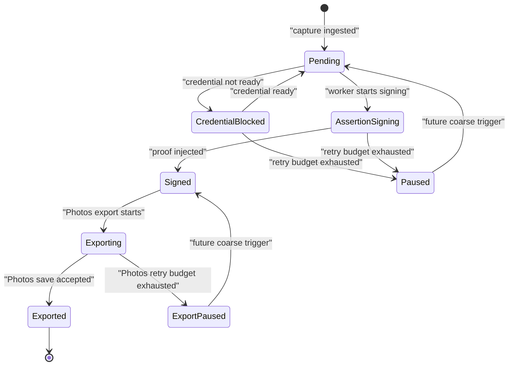
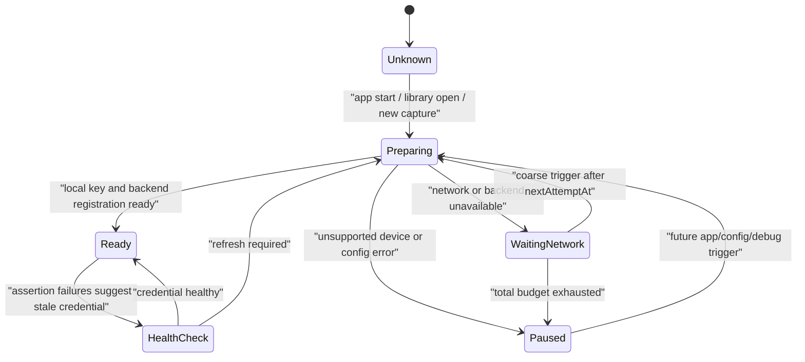
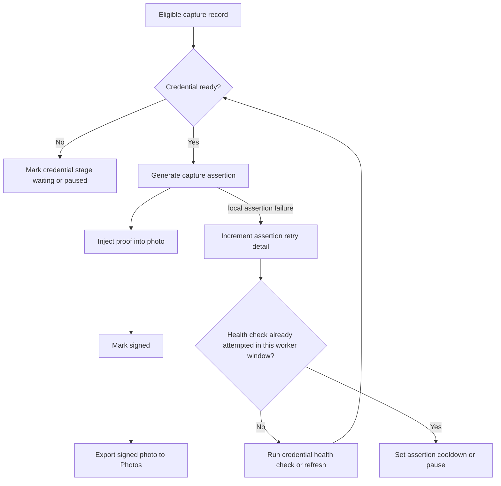
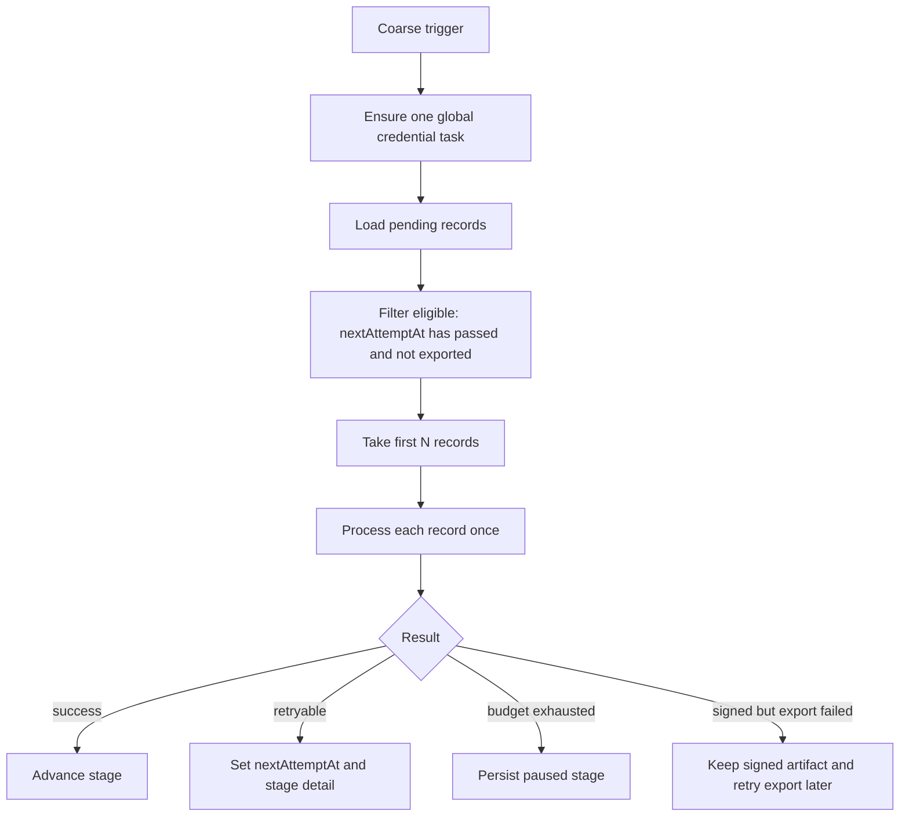
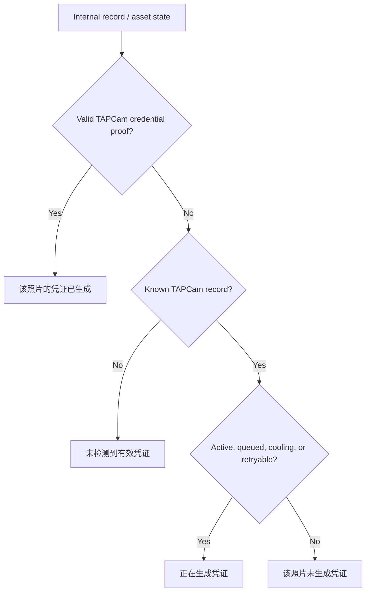

# Credential Signing Retry Design

Status: design snapshot from the 2026-07-05 product discussion. This document
describes the intended App Attest credential and capture assertion retry model
before implementation.

## Product Boundary

The Release product text stays simple:

| Product state | Release text |
| --- | --- |
| Credential work is active, queued, cooling down, or retryable | `正在生成凭证` |
| The photo has a generated credential proof | `该照片的凭证已生成` |
| TAPCam produced the photo but no credential was generated | `该照片未生成凭证` |
| The asset has no TAPCam record and no valid credential | `未检测到有效凭证` |

Detailed retry stage, counters, timestamps, App Attest errors, network hints,
and assertion failures belong in structured persistent state and diagnostics,
not in Release UI. Debug builds may expose retry and diagnostic export controls.

## Current Code Snapshot

The current TAP Library queue has a coarse status model:

- `pending`
- `waitingNetwork`
- `signing`
- `signed`
- `exporting`
- `exported`
- `failedRetryable`

`TAPPendingCaptureRetryClassifier` currently classifies raw worker failures into
`.waitingNetwork` or `.failedRetryable`. `AppAttestCaptureAssertionSigner.sign`
does both credential preparation and assertion generation in one signing step:
it calls `prepareIfNeeded(...)` and then `generateAssertion(...)`.

`TAPPendingCaptureRecord` has `retryCount`, but it does not yet persist
`nextAttemptAt`, retry windows, total retry budgets, or per-stage failure
details.

The target design keeps the serial worker and candidate ordering, but makes the
retry stage explicit enough to avoid endless hot retries.

## State Model

Keep the user-facing state broad. Add stage detail under the record or a
record-adjacent retry state.

Recommended persistent fields:

| Field | Purpose |
| --- | --- |
| `credentialStatus` | App/device credential state: `preparing`, `waitingNetwork`, `paused`. |
| `assertionStatus` | Capture assertion state: `signing`, `waitingNetwork`, `paused`. |
| `lastFailureStage` | Last failed stage: `credential`, `assertion`, or `export`. |
| `nextAttemptAt` | Earliest time a coarse trigger may retry this record. |
| `retryWindowCount` | Attempts consumed in the current retry window. |
| `totalRetryCount` | Cumulative attempts across all windows. |

If implementation chooses one flattened enum instead of nested fields, keep the
same stage boundary in the names, for example `credentialPreparing`,
`credentialWaitingNetwork`, `credentialPaused`, `assertionSigning`,
`assertionWaitingNetwork`, and `assertionPaused`.

`waitingNetwork` should move from a top-level flow status into stage detail over
time. Existing `.waitingNetwork` records should remain readable and migrate into
the new staged model.

## Credential Lifecycle

App Attest credential preparation is a global app/device dependency, not a
per-capture operation. If the credential is missing or unhealthy, one global
task should try to prepare, register, or refresh it. Captures should wait for
that global result instead of each record independently calling network-backed
preparation.

Credential preparation is the phase expected to need network access. It can
request challenges, register attestation, or ask the backend about credential
status.

## Assertion Signing Lifecycle

Assertion generation is local after a credential is ready. It should not be
treated like a normal network retry path.

If assertion signing repeatedly fails:

- try one credential health check or refresh in the same worker window;
- if the health check fails because of network or backend, use credential
  cooldown;
- if the device or credential remains invalid, pause until a future coarse
  trigger or Debug manual action.

## Retry Policy

The queue remains internal. Do not show persistent queue position or queue UI.

Use finite retry windows plus a total cumulative budget:

- The worker processes only the first N eligible records per run.
- A record can be attempted at most once in the same worker run.
- A record is eligible only when `nextAttemptAt` is missing or has passed.
- Reaching a window budget sets cooldown.
- Reaching a total budget sets paused state. Paused is not permanent, but it
  requires a later coarse trigger or Debug action.

Recommended cooldown classes:

| Failure class | Cooldown |
| --- | --- |
| Credential attestation/register/network failure | Long, about 12-24 hours. This implements the "tomorrow afternoon" retry shape. |
| Assertion local failure | Short, about 15-60 minutes. Repeated local failures can trigger credential health check. |
| Configuration error or unsupported device | No automatic retry until app/config changes or Debug manual trigger. |
| Photos export failure | Lightweight cooldown if needed, but keep it separate from credential generation. |

## Coarse Triggers

For v1, use coarse triggers instead of a continuous network listener:

- app startup;
- entering TAP Library;
- new photo ingestion;
- next time the app becomes active after `nextAttemptAt`;
- Debug manual retry.

Do not add `NWPathMonitor` network-recovery wakeups for v1.

## Export Boundary

Export does not need a large separate product design right now. It is listed
separately only so implementation does not confuse these cases:

- signed proof generation failed;
- proof exists, but Photos export failed;
- user manually exported an uncredentialed version.

The current signed/exporting priority remains correct: a record that already
has a signed file should reach Photos before newer records start another
signing pass.

Manual uncredentialed export should not mutate the original TAPCam record into
an exported signed state. The original record stays available for future
credential generation unless the user deletes it.

## User-Visible Mapping

## Implementation Notes

- Keep retry details in structured state first. Logs should explain exact
  low-level errors, but Release UI should not.
- Preserve existing record decoding for old statuses.
- Add migration for old `.waitingNetwork` and `.failedRetryable` records.
- Keep the worker serialized. The queue is an implementation detail, not a
  visible product surface.
- Treat credential health as global and assertion signing as per-capture.
- Keep export retries separate from credential generation retries.
