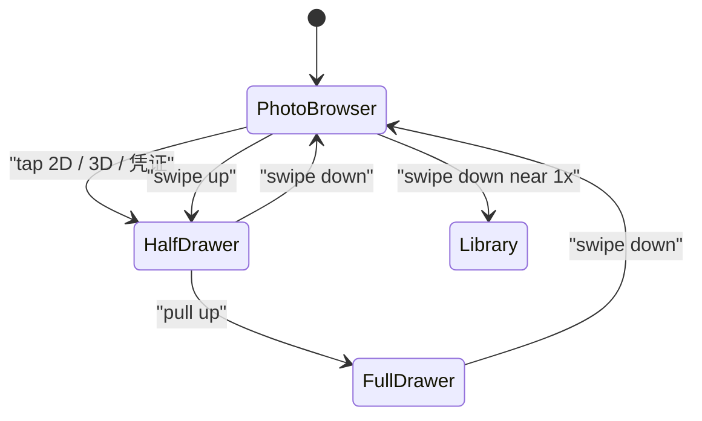
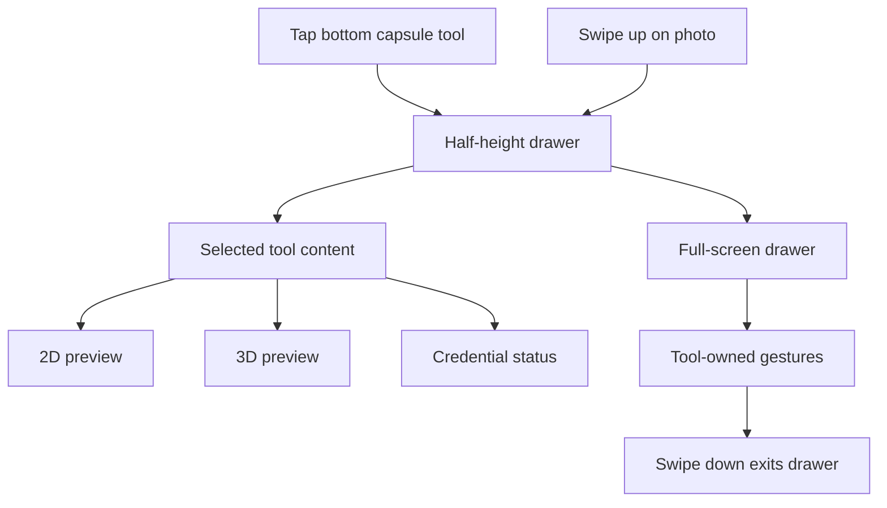

# Depth Analysis Viewer Redesign

Status: implemented design record from the 2026-07-05 Analysis viewer
refactor. This document describes the user-facing contract and the code seams
that now support it.

## Goals

- Make the Analysis surface feel like a native photo viewer first.
- Move analysis tools into an explicit bottom drawer instead of changing the
  main photo every time a mode is selected.
- Keep the original photo as the primary object. Analysis previews are
  secondary and live in the drawer.
- De-emphasize rectangular region selection. It can remain as a debug or
  advanced tool, but it should not be the default Release interaction.
- Split tools into simple user concepts: `2D`, `3D`, and `凭证`.

## Primary Surface

The normal state is a Photos-like browser. It shows one original image and a
small bottom control set:

| Position | Control | Behavior |
| --- | --- | --- |
| Left | Share | Opens TAPCam actions first, then system share/export when needed. |
| Center capsule | 2D icon | Opens the drawer and selects the 2D analysis tool. The visible capsule button is icon-only; accessibility keeps the `2D analysis` label. |
| Center capsule | 3D icon | Opens the drawer and selects the native 3D projection tool. The visible capsule button is icon-only; accessibility keeps the `3D projection` label. |
| Center capsule | credential icon | Opens the drawer and selects credential status. The visible capsule button is icon-only; accessibility keeps the credential label. |
| Right | Delete | Deletes the current TAP Library item or Photos asset with confirmation. |

There is no visible `Normal` mode button. Closing the drawer returns to normal
photo browsing.

## Photo Gestures

The photo browser keeps native-feeling gesture priority:

- Pinch zoom and drag pan are always photo gestures in the main photo layer.
- Double tap toggles between fit size and a useful zoomed-in scale.
- Left and right swipes switch photos only when the photo is at fit size or
  close to fit size.
- When zoomed in, horizontal movement pans the current photo instead of
  switching photos.
- Down-swipe returns to the Library only when the photo is near fit size.
- Timeline navigation includes every item. Pending, signing, failed, missing
  credential, and external invalid items stay in the same time flow.

## Carousel And Loading

Analysis no longer rebuilds the whole page from a single `currentSource`.
`DepthAnalysisCarouselStore` owns a stable ordered list and creates one
`AnalysisPhotoSlot` per item. The visible window is always the current item plus
its previous and next neighbors when they exist.

Each slot owns:

- thumbnail image;
- original/depth loading phase and Photos progress;
- decoded `TAPDepthAnalysisInput`;
- rectangular debug selection state;
- Plane seed/region state;
- a Plane region request coordinator with geometry prewarm.

Switching photos changes only `currentItemID`. The bottom chrome, selected
tool, scroll page, and neighboring slots remain alive. This is the contract that
prevents the old black flash where `input = nil` destroyed the surface before
the next photo decoded.

Loading is progressive:

- Photos thumbnails are requested with no network access and can appear before
  the original asset is local.
- Original photo bytes allow network access and publish the Photos download
  progress handler.
- The main photo and tool placeholders keep showing the thumbnail while the
  original image/depth decode is pending.
- When decode succeeds, the surface crossfades to the full image and the
  selected 2D/3D/credential content follows the same slot.
- Pending captures are local and may skip the iCloud progress path.

## Drawer Behavior

The drawer is the tool surface.

- Tapping `2D`, `3D`, or `凭证` opens the half-height drawer and selects that
  tool.
- Opening the drawer by swiping up defaults to `凭证`.
- The selected tool is preserved while switching photos.
- If the selected tool is unavailable for the next photo, keep the tool selected
  and show an unavailable state instead of silently switching to another tool.
- The half-height drawer allows left and right photo switching. The drawer
  content follows the selected photo.
- The full-screen drawer disables photo switching because the selected tool owns
  gestures.
- Full-screen drawer still supports down-swipe to exit directly back to normal
  photo browsing.
- Half-screen 3D preview hides controls and can respond to gyroscope movement.

## 2D Tool

Release UI exposes one top-level `2D` tool. The primary 2D view is an overlay
analysis surface with an opacity slider:

- opacity `0` shows the original RGB photo;
- opacity `1` shows the full heatmap;
- intermediate values show the heatmap over the RGB photo;
- tapping the overlay view selects a plane seed and runs plane detection in the
  same 2D surface.

`Mask` is not exposed inside the Release 2D tool. Valid-depth mask rendering can
remain an internal/debug view mode, but the Release 2D tool is only RGB plus
heatmap overlay. Separate top-level `热力图` and `热力图重叠` controls are
unnecessary because the opacity slider spans both endpoints.

The half-height drawer shows a small preview, opacity control, and plane
status.

The full-screen 2D tool owns analysis gestures. It does not switch photos by
horizontal swipe while full-screen.

If depth is unavailable, keep the tool selected and show:

> 没有可用深度，无法显示 2D 分析

## 3D Tool

The 3D tool should be native iOS, not WebView. TAPCamVerifier remains a
reference for the geometry and interaction model: use signed depth or disparity
pixels as the geometry source, back-project depth pixels into relative 3D, and
attach aligned RGB as per-point color. The verifier's Three.js renderer is a
browser implementation detail, not the iOS rendering target.

Release terminology is `3D projection`. Avoid exposing `point cloud` as the
primary user-facing label.

Initial implementation direction:

- Use SceneKit for v1 native rendering.
- Half-height drawer directly shows the native projected model with no visible
  controls.
- Half-height 3D preview uses slight gyroscope/parallax motion by default while
  visible.
- Respect Reduce Motion. Disable gyroscope movement when Reduce Motion is on.
- 3D gestures are owned by the SceneKit surface, not by the drawer page. A
  gesture that starts inside the 3D content must not scroll or resize the
  analysis page underneath it.
- One-finger drag orbits the model around the current target depth. Two-finger
  drag pans in capture-camera units. Pinch scales the model around the same
  target depth with a bounded scale range. Two-finger rotation rolls the model
  in the same apparent direction as the screen gesture. Double-tap resets
  translation, rotation, and scale to the capture-camera identity view.
- Quality/risk filters stay Debug or advanced. Release can show terse status
  such as `深度结构有限` when needed.
- Hide the point-cloud concept from Release UI. The implementation can still
  reuse internal sampling/projection helpers, but the user-facing tool is the
  mapped-back native 3D projection model.
- The initial camera matches the capture-camera contract from TAPCamVerifier:
  the camera node starts at the capture camera origin, looks down the same
  viewing direction as the photo, and sets a projection matrix from
  `fx / fy / cx / cy` fitted to the drawer content size.
- The display orientation is applied once in the 3D projection frame. Geometry
  and camera intrinsics rotate into the same orientation as the visible photo,
  while RGB sampling and selected-plane membership stay in raw/native pixel
  space.
- Depth pixels are back-projected into camera-space XYZ, converted into
  SceneKit's camera-facing `-Z` direction, and rendered without normalizing the
  geometry into an arbitrary display cube.
- RGB pixels are sampled from the primary image and attached as per-vertex
  colors. Depth-only viridis color is only a fallback when an RGB image cannot
  be sampled.
- A selected 2D Plane region maps to 3D through `TAPPlaneRegion.pixelRuns`.
  The renderer builds a highlight depth-index mask and draws matching projected
  points in a separate yellow overlay. The overlay gently blinks while selected
  and becomes static when Reduce Motion is enabled.
- SceneKit's default camera controller stays disabled. Real-device probe logs
  showed that `allowsCameraControl` can replace the configured `pointOfView` and
  reset the capture-camera projection matrix on touch. Custom gestures transform
  only the interaction root; they do not mutate the camera node or projection
  matrix.

TODO: keep a renderer boundary that can be replaced with Metal later if point
count, splat rendering, mesh rendering, or performance makes SceneKit too
limited.

If depth is unavailable, keep the tool selected and show:

> 没有可用深度，无法生成 3D 投影

## Credential Tool

The center capsule label is `凭证`.

Release UI should show only small, understandable credential text:

| Internal situation | Release text |
| --- | --- |
| Credential or assertion work is active, queued, cooling down, or retryable | `正在生成凭证` |
| Signed TAPCam record has a valid credential | `该照片的凭证已生成` |
| TAPCam-produced record exhausted retry budget or was manually exported without credential | `该照片未生成凭证` |
| External/system asset has no known TAPCam record and no valid credential | `未检测到有效凭证` |

Normal signed photos do not need a thumbnail badge. Thumbnail badges should
appear only for exception states:

- generating credential
- no credential

`已导出无凭证版本` should not appear on the thumbnail. It can appear in the
Credential drawer or Share menu state.

Release UI does not expose a manual retry signing button. Retry is automatic in
the background. Debug builds may expose retry and diagnostics.

## Share And Export

The left button is `Share`, not `Export`. It opens a TAPCam action menu before
the system Share Sheet.

| Item state | Share menu actions |
| --- | --- |
| Valid credential | `分享照片`, `导出验证包` |
| TAPCam record without generated credential | `导出无凭证版本` |
| External invalid asset | `分享原图` |
| Debug only | `导出诊断信息` |

Manual uncredentialed export is allowed when signing fails or cannot complete.
It must be a user action, not an automatic fallback.

Uncredentialed export goes to system Photos or another share destination, not
the TAPCamDepth dedicated album. The TAPCam Library keeps the original capture
record for future credential generation unless the user deletes it.

After an uncredentialed copy leaves TAPCam's record context, another viewer can
only say `未检测到有效凭证`; it cannot distinguish `未生成凭证` from an unrelated
invalid file.

## Delete

The right button deletes with confirmation.

- Photos assets should use system Photos delete semantics, including Recently
  Deleted behavior.
- Pending or local-only records delete the local record and temporary files.
- If a signing-failed TAPCam record has an uncredentialed export, warn that
  deleting the TAPCam capture record prevents a future credentialed version from
  being generated. The already exported uncredentialed copy is unaffected.

## Non-Goals For This Redesign

- No Release-first rectangular region selection flow.
- No separate top-level Heatmap, Heatmap Overlay, or Mask buttons in the bottom
  capsule.
- No WebView/Three.js renderer inside the iOS app.
- No queue-position UI for credential generation.
- No Release UI that exposes raw proof IDs, App Attest key IDs, capture IDs,
  Photos asset IDs, backend URLs, or raw retry logs.
