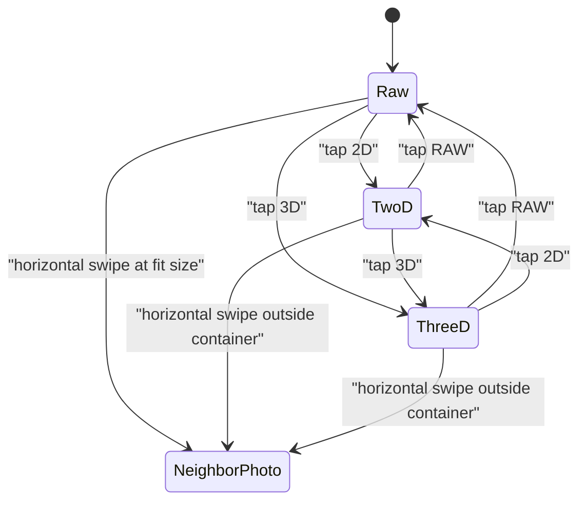
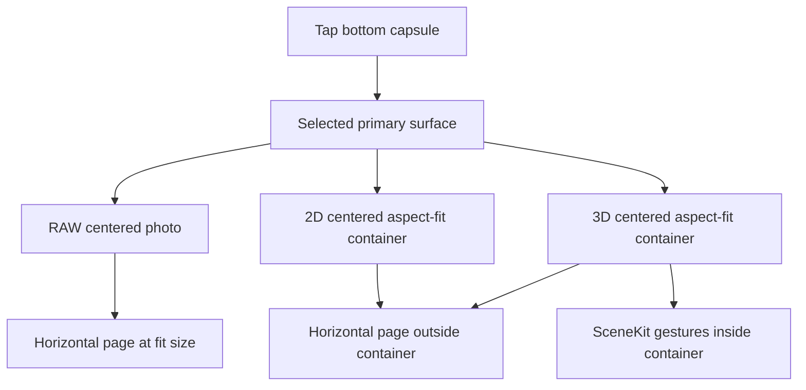

# Depth Analysis Viewer Redesign

Status: current implementation record plus target behavior. The 2026-07-05
Analysis viewer refactor now uses a stable full-screen browser shell, a
previous/current/next carousel, progressive loading, and a bottom `RAW / 2D /
3D` mode group that switches the primary centered surface. The bottom capsule
also includes global Share/Delete icon buttons. Credential action-menu
expansion, single-tap chrome toggle, and iOS 26 Liquid Glass polish remain
explicit gaps, not completed product behavior.

`TAPCamDemo/TAPLibrary` is the app-private pending artifact queue for signing
and Photos export. The user-facing TAP Library grid/viewer path lives in
`TAPCamDemo/DepthAnalysis`: `DepthAlbumPickerView` opens `DepthAnalysisView`.

## Goals

- Make the Analysis surface feel like a native photo viewer first.
- Keep the active photo centered on the screen in every tool state.
- Keep `RAW`, `2D`, and `3D` as the only primary-surface modes; global Share
  and Delete sit beside them and do not add viewer modes.
- Preserve reliable left/right photo switching without vertical drawer or
  sheet gestures.
- Keep `2D` and `3D` tool surfaces visually aligned with the original photo by
  rendering them in a centered aspect-fit container that matches the raw photo
  ratio.
- De-emphasize rectangular region selection. It can remain as a debug or
  advanced tool, but it should not be the default Release interaction.

## Current Implementation Status

This table maps the target Photos-style behavior to the current implementation
so future work does not confuse an intended contract with shipped interaction.

| Area | Current status |
| --- | --- |
| Stable viewer and chrome | Implemented. `DepthAnalysisView` keeps bottom chrome and selected tool state outside per-photo loading. |
| Carousel | Implemented. `AnalysisNativePagingView` wraps UIKit `UIScrollView.isPagingEnabled`, while `DepthAnalysisCarouselStore` owns previous/current/next slots and switches by changing `currentItemID`. |
| Loading | Implemented. RAW display loading is separate from 2D/3D analysis input loading. Slots load thumbnails first, then viewport-sized display images for browsing; depth analysis input is loaded on demand for the current 2D/3D page. |
| Bottom controls | Implemented. `DepthAnalysisViewerChromeView` places Share at bottom-left, Delete at bottom-right, and keeps `DepthAnalysisControlsView` as the centered icon-only `RAW` / `2D` / `3D` capsule. `RAW`, `2D`, and `3D` remain the only viewer modes. |
| Raw photo surface | Implemented. The raw photo is centered in the full-screen black viewer, supports pinch, pan while zoomed, double-tap zoom, and fit-size left/right paging. |
| 2D tool surface | Implemented. `2D` replaces the primary surface with a centered aspect-fit container matching the raw photo ratio. Swipes that begin outside the container page left/right. |
| 3D tool surface | Implemented. `3D` replaces the primary surface with a centered aspect-fit SceneKit container matching the raw photo ratio. SceneKit owns gestures that begin inside the container; swipes outside it page left/right. |
| Vertical gestures | Not implemented by design in this pass. There is no up-swipe drawer, down-swipe dismiss, or half/full detent behavior in the current viewer. |
| Global Share | Implemented. The Share button opens a compact share page, shows only whether a locally valid credential is present, and reuses `TAPVerificationExportBuilder` plus `VerificationExportActivityView` for verification-original exports. |
| Delete | Implemented. The Delete button asks for confirmation, then deletes Photos assets through Photos semantics or removes pending local records through `TAPPendingCaptureStore`. |
| Liquid Glass | Not implemented. Current controls use material fallbacks such as `.thinMaterial`; future iOS 26 adoption should be `#available(iOS 26, *)` gated because the project deployment target is iOS 18.6. |

## Native Paging Implementation

The current viewer uses UIKit for the parts where iOS Photos feel matters most.
This is the engineering contract for the shipped browser behavior:

- Horizontal photo switching is driven by a `UIScrollView` with
  `isPagingEnabled`, `.fast` deceleration, horizontal bounce, and a stable black
  background. We do not hand-roll page commit distance, velocity landing, or
  spring-back curves in SwiftUI.
- The SwiftUI bridge keeps three `UIHostingController` page hosts alive for
  previous/current/next. When the system scroll view lands on a neighbor,
  `DepthAnalysisCarouselStore.move(offset:)` updates `currentItemID`, then the
  scroll view is reset without animation back to the center/active page.
- Each page reserves `DepthAnalysisViewerInteractionPolicy.nativePageSpacing`
  points for black inter-page separation. The current value is `18`, applied as
  a 9pt inset on each side of page content.
- RAW browsing uses a display-only chain. It requests a viewport-sized Photos
  image for the current/neighbor browser pages and does not require
  `TAPDepthAnalysisInput`.
- 2D and 3D are analysis tools. They load `TAPDepthAnalysisInput` only for the
  current page when the selected tool needs depth/geometry data.
- RAW zoom is a nested UIKit `UIScrollView + UIImageView`. It owns pinch,
  double-tap zoom, and pan while zoomed. At fit size the nested pan recognizer
  is disabled so the parent paged scroll view owns left/right swipes.
- RAW layout has a UIKit layout repair path that restores the image view frame,
  content size, and zoom state after page reuse or tool switching. This prevents
  the observed black RAW page after returning from 2D/3D.
- 2D and 3D render in a centered aspect-fit container computed from the raw
  photo dimensions and display orientation. In tool modes, parent paging begins
  only when the gesture starts outside that container; SceneKit owns gestures
  inside the 3D container.
- Viewer and grid left-edge return use UIKit/SwiftUI edge policy thresholds from
  `AnalysisEdgeBackPolicy`: start within 24pt of the left edge, rightward,
  horizontally dominant, and past distance or predicted-distance threshold.

Known engineering limitation: display image tasks cancel the Swift concurrency
task and drop stale results, but the underlying `PHImageManager` display-image
request is not yet cancelled by request ID. Rapid paging can still leave old
Photos requests running in the system manager even though stale UI publication
is guarded.

## Primary Surface

The normal state is a Photos-like browser. The active photo or tool container is
centered in the viewport. The bottom control is one capsule:

| Control | Behavior |
| --- | --- |
| `RAW` | Shows the original photo as the primary full-screen surface. At fit size, left/right drag pages to neighboring photos. When zoomed, horizontal drag pans the current photo instead of paging. |
| `2D` | Shows the 2D analysis surface in a centered aspect-fit container whose ratio matches the visible raw photo. Horizontal swipes that begin outside the container page left/right. |
| `3D` | Shows the native 3D projection in a centered aspect-fit container whose ratio matches the visible raw photo. Gestures inside the container control SceneKit; horizontal swipes outside the container page left/right. |

There is no visible `Normal` button, no credential button in this capsule, and
no bottom drawer close state. Returning to plain photo browsing is the `RAW`
selection.

## Photo Gestures

The viewer keeps one primary gesture rule: horizontal photo paging is available
when the gesture starts in a pageable region.

- `RAW` mode pages left/right at fit size or close to fit size.
- `RAW` mode does not page while zoomed; the same drag pans the current photo.
- Pinch zoom and double tap are raw photo gestures.
- `2D` and `3D` modes page left/right only from the black area outside the
  centered tool container.
- Gestures that begin inside the 3D SceneKit container are owned by SceneKit.
- Vertical drags do not open a drawer, resize a sheet, or dismiss the viewer in
  the current implementation.
- Timeline navigation includes every item. Pending, signing, failed, missing
  credential, and external invalid items stay in the same time flow.

## Carousel And Loading

Analysis no longer rebuilds the whole page from a single `currentSource`.
`DepthAnalysisCarouselStore` owns a stable ordered list and creates one
`AnalysisPhotoSlot` per item. The visible window is always the current item plus
its previous and next neighbors when they exist. UIKit paging owns the drag,
deceleration, page landing, and edge bounce; the store owns only the model
transition after the page lands.

Each slot owns:

- thumbnail image;
- display image loading phase and Photos progress;
- decoded `TAPDepthAnalysisInput` only when 2D/3D needs analysis;
- rectangular debug selection state;
- Plane seed/region state;
- a Plane region request coordinator with geometry prewarm.

Switching photos changes only `currentItemID`. The bottom capsule, selected
tool, and neighboring slots remain alive. This is the contract that prevents
the old black flash where `input = nil` destroyed the surface before the next
photo decoded.

Loading is progressive:

- Photos thumbnails are requested with no network access and can appear before
  the original asset is local.
- Display images allow network access and publish the Photos download progress
  handler.
- RAW keeps showing the thumbnail until a viewport-sized display image is ready.
- 2D/3D keep showing loading or unavailable states until the current page's
  `TAPDepthAnalysisInput` decode is ready.
- When display or analysis decode succeeds, the selected `RAW` / `2D` / `3D`
  content follows the same slot.
- Pending captures are local and may skip the iCloud progress path.

## Tool Surface

Current implementation uses primary-surface replacement instead of a bottom
detail sheet.

- Tapping `RAW`, `2D`, or `3D` switches the centered primary viewer surface.
- `RAW` renders the raw/original photo full-screen with aspect-fit centering.
- `2D` and `3D` render inside a centered aspect-fit container calculated from
  the current raw photo dimensions and display orientation.
- The center of the raw photo or tool container stays at the center of the
  screen.
- Tool selection is preserved while switching photos.
- If a selected tool is unavailable for the next photo, keep the tool selected
  and show an unavailable/loading state instead of silently switching to another
  tool.
- There are no hidden/half/full drawer detents in the current viewer.

## 2D Tool

Release UI exposes one top-level `2D` tool. The primary 2D view is an overlay
analysis surface:

- opacity `0` shows the original RGB photo;
- opacity `1` shows the full heatmap;
- intermediate values show the heatmap over the RGB photo;
- tapping the overlay view selects a plane seed and runs plane detection in the
  same 2D surface.

`Mask` is not exposed inside the Release 2D tool. Valid-depth mask rendering can
remain an internal/debug view mode, but the Release 2D tool is only RGB plus
heatmap overlay.

Current implementation renders the 2D surface in the centered aspect-fit
container. It does not expose a separate bottom sheet or drawer for 2D controls
in this pass.

If depth is unavailable, keep the tool selected and show:

> 没有可用深度，无法显示 2D 分析

## 3D Tool

The 3D tool should be native iOS, not WebView. TAPCamVerifier remains a
reference for the geometry and interaction model: use signed depth or disparity
pixels as the geometry source, back-project depth pixels into relative 3D, and
attach aligned RGB as per-point color. The verifier's Three.js renderer is a
browser implementation detail, not the iOS rendering target.

Release terminology is `3D projection`. Avoid exposing `point cloud` as the
primary user-facing label.

Current implementation direction:

- Use SceneKit for v1 native rendering.
- Show the native projected model directly in the centered `3D` aspect-fit
  container.
- Respect Reduce Motion. Disable gyroscope movement when Reduce Motion is on.
- 3D gestures are owned by the SceneKit surface. A gesture that starts inside
  the 3D content must not page the photo carousel.
- One-finger drag orbits the model around the current target depth. Two-finger
  drag pans in capture-camera units. Pinch scales the model around the same
  target depth with a bounded scale range. Two-finger rotation rolls the model
  in the same apparent direction as the screen gesture. Double-tap resets
  translation, rotation, and scale to the capture-camera identity view.
- Quality/risk filters stay Debug or advanced. Release can show terse status
  such as `深度结构有限` when needed.
- Hide the point-cloud concept from Release UI. The implementation can still
  reuse internal sampling/projection helpers, but the user-facing tool is the
  mapped-back native 3D projection model.
- The initial camera matches the capture-camera contract from TAPCamVerifier:
  the camera node starts at the capture camera origin, looks down the same
  viewing direction as the photo, and sets a projection matrix from
  `fx / fy / cx / cy` fitted to the centered 3D container size.
- The display orientation is applied once in the 3D projection frame. Geometry
  and camera intrinsics rotate into the same orientation as the visible photo,
  while RGB sampling and selected-plane membership stay in raw/native pixel
  space.
- Depth pixels are back-projected into camera-space XYZ, converted into
  SceneKit's camera-facing `-Z` direction, and rendered without normalizing the
  geometry into an arbitrary display cube.
- RGB pixels are sampled from the primary image and attached as per-vertex
  colors. Depth-only viridis color is only a fallback when an RGB image cannot
  be sampled.
- A selected 2D Plane region maps to 3D through `TAPPlaneRegion.pixelRuns`.
  The renderer builds a highlight depth-index mask and draws matching projected
  points in a separate yellow overlay. The overlay gently blinks while selected
  and becomes static when Reduce Motion is enabled.
- SceneKit's default camera controller stays disabled. Real-device probe logs
  showed that `allowsCameraControl` can replace the configured `pointOfView` and
  reset the capture-camera projection matrix on touch. Custom gestures transform
  only the interaction root; they do not mutate the camera node or projection
  matrix.

TODO: keep a renderer boundary that can be replaced with Metal later if point
count, splat rendering, mesh rendering, or performance makes SceneKit too
limited.

If depth is unavailable, keep the tool selected and show:

> 没有可用深度，无法生成 3D 投影

## Credential Status

Credential verification is not part of the current `RAW / 2D / 3D` bottom
capsule. It remains available through the existing credential verification
panel paths and should be integrated into a future TAPCam action menu rather
than reintroduced as a fourth primary viewer mode.

Release UI should show only small, understandable credential text when the
credential panel is shown:

| Internal situation | Release text |
| --- | --- |
| Credential or assertion work is active, queued, cooling down, or retryable | `正在生成凭证` |
| Signed TAPCam record has a valid credential | `该照片的凭证已生成` |
| TAPCam-produced record exhausted retry budget or was manually exported without credential | `该照片未生成凭证` |
| External/system asset has no known TAPCam record and no valid credential | `未检测到有效凭证` |

Normal signed photos do not need a thumbnail badge. Thumbnail badges should
appear only for exception states:

- generating credential
- no credential

`已导出无凭证版本` should not appear on the thumbnail. It can appear in the
credential panel or future Share menu state.

Release UI does not expose a manual retry signing button. Retry is automatic in
the background. Debug builds may expose retry and diagnostics.

## Share And Export

Current implementation status: a global Share button is shown in the bottom
viewer capsule and wired from `DepthAnalysisView`.

The current Release share page is intentionally minimal: it uses a compact
drawer and shows only `Valid credential: Yes/No`. That status is a local
credential/proof check through the verification-export validator; opening the
Share drawer must not call the backend. Full App Attest backend verification
remains in the Verify Signature panel. Debug-only details must stay behind
`DEBUG || TAP_ENABLE_RELEASE_DIAGNOSTICS` and must continue to avoid raw proof,
key, asset, capture, signing-binding, or backend payload values.

Existing reusable implementation pieces:

- `TAPVerificationExportBuilder` builds verification-original exports for
  still photos and Live Photos.
- `VerificationExportActivityView` wraps `UIActivityViewController` for both
  the credential panel and global Share page.

| Item state | Share menu actions |
| --- | --- |
| Saved Photos TAP asset | Show valid credential Yes/No, then allow Share via verification-original export. |
| Pending local item | Show valid credential No; do not invent an uncredentialed export path in this UI. |
| Debug only | Optional diagnostics, guarded by the debug compile condition and the existing privacy boundary. |

Manual uncredentialed export is allowed when signing fails or cannot complete.
It must be a user action, not an automatic fallback.

Uncredentialed export goes to system Photos or another share destination, not
the TAPCamDepth dedicated album. The TAPCam Library keeps the original capture
record for future credential generation unless the user deletes it.

After an uncredentialed copy leaves TAPCam's record context, another viewer can
only say `未检测到有效凭证`; it cannot distinguish `未生成凭证` from an unrelated
invalid file.

## Delete

Current implementation status: a Delete button is shown in the bottom viewer
capsule and wired from `DepthAnalysisView`.

Delete always requires confirmation.

- Photos assets should use system Photos delete semantics, including Recently
  Deleted behavior.
- Pending or local-only records delete the local record and temporary files.
- If a signing-failed TAPCam record has an uncredentialed export, warn that
  deleting the TAPCam capture record prevents a future credentialed version from
  being generated. The already exported uncredentialed copy is unaffected.

## Non-Goals For This Redesign

- No Release-first rectangular region selection flow.
- No separate top-level Heatmap, Heatmap Overlay, or Mask buttons in the bottom
  capsule.
- No WebView/Three.js renderer inside the iOS app.
- No up-swipe drawer, down-swipe dismissal, or half/full sheet detents in this
  pass.
- No queue-position UI for credential generation.
- No Release UI that exposes raw proof IDs, App Attest key IDs, capture IDs,
  Photos asset IDs, backend URLs, or raw retry logs.
