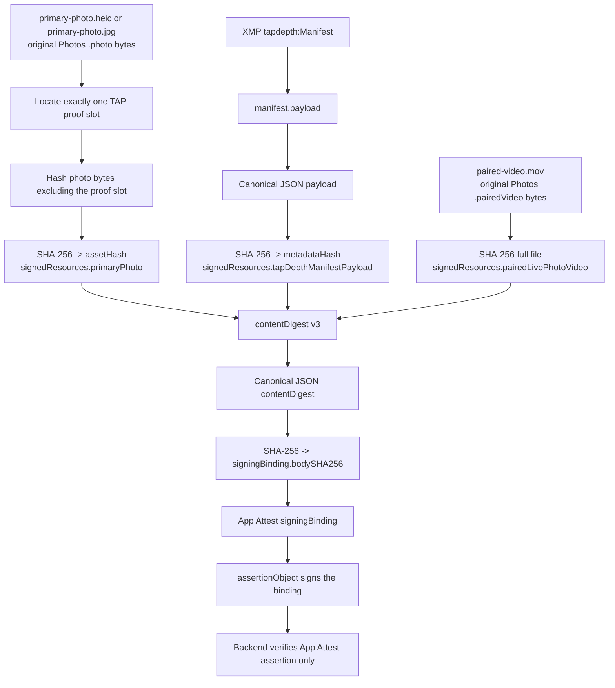

# Live Photo Browser Verification Contract

This document is the handoff for adding Live Photo verification support to the
browser verifier and for confirming the server verification boundary. It is a
contract document, not an implementation patch.

TAPCamDemo owns this specification because it owns the capture artifact format.
Browser verifier code and server code are maintained in separate repositories,
so this repo should not implement those code paths. TAPCamDemo changes should
stop at the app-side capture/sign/export/verification path plus the external
contract documented here.

The important boundary is: Live Photo is an extension of the existing TAP
capture proof model. It must not change the manifest, content binding, or
verification behavior of existing still-photo captures.

## Non-Negotiable Boundaries

- Existing still-photo captures keep the current contract:
  - `urn:tapnap:tapcam:depth-manifest:v1`
  - `urn:tapnap:tapcam:content-binding:v2`
  - one original Photos `.photo` resource, HEIC or JPG
  - fixed TAP proof slot in the photo container
  - SHA-256 over format-native photo bytes excluding exactly one proof slot
  - SHA-256 over canonical `manifest.payload` JSON
- Live Photo captures use a new versioned contract:
  - `urn:tapnap:tapcam:depth-manifest:v2`
  - `urn:tapnap:tapcam:content-binding:v3`
  - one original Photos `.photo` resource plus one `.pairedVideo` MOV resource
  - the same fixed TAP proof slot in the photo resource
  - the paired video is signed as an additional binary resource
- `manifest.payload.livePhoto` is present only for v2 Live Photo manifests:
  - `presence: "paired-video"`
  - `pairedVideoFilename: "paired-video.mov"`
  - `durationSeconds`
  - `photoDisplayTimeSeconds`
  - `width`
  - `height`
  - `videoCodec`
  - `audio`, either `"not-captured"` for silent Live Photos or `"captured"` when
    Live Photo sound was enabled at capture time
- `proof.value.contentDigest.signedResources` is present only for v3 Live Photo
  bindings and uses these roles:
  - `primaryPhoto`
  - `tapDepthManifestPayload`
  - `pairedLivePhotoVideo`
- Do not add Live Photo fields to the v1 manifest payload.
- Do not reinterpret v2 content binding as a Live Photo binding.
- Do not make the backend re-hash photo or video bytes. The backend continues
  to verify only the App Attest assertion over the submitted `signingBinding`.
- Do not use platform-decoded pixels, browser canvas pixels, decoded video
  frames, or metric depth conversion as inputs to the base signature check.
- Do not claim per-frame video depth for Live Photo v2/v3. The depth resource
  is the original still photo's `AVCapturePhoto.depthData` embedded in the
  primary `.photo` resource. The paired MOV is signed as video bytes, not as a
  synchronized stream of video frames plus depth frames.

If Live Photo capture is requested but the movie complement fails, the capture
should be signed and exported as the still-photo contract above, not as a
partial v2/v3 Live Photo.

## Primary Photo, Paired MOV, and Hash Chain

The TAP Live Photo verification object is a pair of original Photos resources:

- primary photo: the original `.photo` resource, exported as
  `primary-photo.heic` or `primary-photo.jpg`
- paired video: the original `.pairedVideo` resource, exported as
  `paired-video.mov`

The resources correspond through two layers:

- Apple layer: Photos stores them as one Live Photo asset using `.photo` plus
  `.pairedVideo`. Apple also writes its own Live Photo pairing metadata.
- TAP layer: `manifest.payload.livePhoto.pairedVideoFilename` fixes the verifier
  filename to `paired-video.mov`, and
  `proof.value.contentDigest.signedResources` binds the primary photo, manifest
  payload, and paired MOV bytes into one signed content digest.

The TAP verifier must trust the TAP hash chain, not the ZIP sidecar, filenames
alone, decoded pixels, or platform Live Photo playback state.



Inside `proof.value.contentDigest`, the required Live Photo descriptors are:

| Descriptor | Byte source | Hash rule |
| --- | --- | --- |
| `assetHash` | Primary HEIC/JPG | SHA-256 over format-native photo bytes excluding the TAP proof slot. |
| `metadataHash` | `manifest.payload` | SHA-256 over canonical payload JSON. |
| `signedResources.primaryPhoto` | Primary HEIC/JPG | Same hash material as `assetHash`, repeated as a named Live Photo resource. |
| `signedResources.tapDepthManifestPayload` | `manifest.payload` | Same hash material as `metadataHash`, repeated as a named Live Photo resource. |
| `signedResources.pairedLivePhotoVideo` | Paired MOV | SHA-256 over the complete MOV file bytes. |
| `signingBinding.bodySHA256` | Canonical `contentDigest` JSON | SHA-256 over the full v3 digest object above. |

The manifest itself does not store the MOV hash. It declares that this is a
Live Photo contract and names the required paired video filename. The hash lives
in the proof value's v3 `contentDigest`, which is then bound to App Attest by
`signingBinding.bodySHA256`.

## Depth Scope and Streaming Depth Non-Goal

Apple exposes two separate depth paths:

- `AVCapturePhotoOutput` can deliver `AVCapturePhoto.depthData`, and that depth
  is associated with one captured photo.
- `AVCaptureDepthDataOutput` can deliver streaming `AVDepthData` frames.

The current TAP Live Photo contract deliberately uses only the first path. It
does not add `AVCaptureDepthDataOutput`, does not synchronize depth frames with
the Live Photo MOV, and does not define a per-frame video-depth sidecar. The
reason is semantic, not only implementation cost: the Apple Live Photo MOV is a
movie complement produced by `AVCapturePhotoOutput`, while a streaming
video/depth product would need an explicit timestamp mapping, storage format,
resource roles, manifest fields, and content-binding schema for every retained
video/depth sample.

Future work may define a separate video-depth capture format using
`AVCaptureVideoDataOutput`, `AVCaptureDepthDataOutput`, and
`AVCaptureDataOutputSynchronizer`. That future format must not reuse the current
v2/v3 Live Photo verifier as if it certified per-frame video depth.

## Version Routing

The browser verifier must route by the embedded TAP manifest schema and the
proof value's content-binding schema.

| Input | Required verifier behavior |
| --- | --- |
| v1 manifest + v2 content binding | Run the current still-photo verifier. Do not require a paired video. |
| v2 manifest + v3 content binding | Run the Live Photo verifier. Require the photo checks and then validate the paired video resource if supplied. |
| v2 manifest + missing paired video file | Report still photo proof status separately, then report Live Photo video resource missing. |
| v2 manifest + paired video hash mismatch | Report still photo proof status separately, then report Live Photo video resource failed. |
| Unknown manifest or content-binding schema | Fail as unsupported schema, not as tampered media. |

The report model should separate:

- still photo container, manifest, proof-slot, depth-resource, and App Attest
  binding status
- Live Photo paired-video resource status
- backend signature verification status

That separation lets a user still inspect a valid TAP depth photo even when the
Live Photo movie resource is absent or mismatched.

## Report Severity and Presentation Warnings

Verifier reports use three final states:

- `Verified`: every required local and backend check passed, with no warning.
- `Warnings`: required checks passed, but the verifier detected presentation
  risk such as Photos adjustment resources.
- `Failed`: at least one required check failed.

Failure has priority over warning. If a report contains both warning and
failure steps, the final state is `Failed`, and the primary jump target should
be the first failed step. If there are warnings and no failures, the jump target
is the first warning step.

The verifier should treat these Photos resource types as warning evidence, not
as signed inputs:

- `.fullSizePairedVideo`
- `.adjustmentBasePairedVideo`
- `.adjustmentData`
- related adjusted presentation resources such as `.adjustmentBasePhoto` and
  `.adjustmentBaseVideo`

These resources can indicate edits or a changed Live Photo key photo. They do
not by themselves invalidate the TAP proof, because the proof covers only the
original `.photo` and, for Live Photo, the original `.pairedVideo`. The UI must
make that boundary visible: a green Live Photo means the original signed
resources match; a yellow Live Photo means the original signed resources match
but the Photos presentation may differ.

## Verification Export Package

TAPCam's in-app export path is the stable transport for verification material.
It must not use Photos' generic share/export surface, because that surface may
render edits, change compatibility format, or drop the Live Photo movie for
targets that do not support Live Photos.

For still-photo captures, TAPCam exports the original Photos `.photo` resource
as one HEIC or JPG file. For Live Photo captures with a complete original
paired movie, TAPCam exports one ZIP package:

```text
tapcam-live-photo-verification.zip
├── primary-photo.heic   or primary-photo.jpg
├── paired-video.mov
└── tapcam-export.json
```

The ZIP is a transport container only. It is written without media
re-encoding, and browser verification must not trust the ZIP container or the
sidecar as signature evidence. The verifier must read `primary-photo.*`, parse
the embedded TAP proof, and then hash `paired-video.mov` against
`proof.value.contentDigest.signedResources`.

`tapcam-export.json` is intentionally minimal and unsigned. It may contain only
the export schema/version, package kind, resource roles, filenames, media
types, and warning labels. It must not contain capture IDs, App Attest key
IDs, assertion objects, signing bindings, proof bodies, resource hashes, or
server verification results.

If a saved Live Photo `.photo` carries the v2 manifest but the original
`.pairedVideo` resource is missing, TAPCam may export `tapcam-primary-photo-only`
as a single HEIC/JPG and warn that Live Photo verification remains incomplete.
That fallback is not a successful Live Photo package.

## Browser Verification Flow

For still-photo v1/v2 captures, keep the current flow:

1. Read the supplied HEIC or JPG as bytes.
2. Parse XMP `tapdepth:Manifest`.
3. Require `manifest.proofs` to be empty.
4. Locate exactly one fixed TAP proof slot.
5. Read and decode the proof envelope from the slot.
6. Recompute the v2 content binding from photo bytes excluding the proof slot
   plus canonical `manifest.payload` JSON.
7. Compare the recomputed content binding with `proof.value.contentDigest`.
8. Canonically encode `signingBinding` and confirm its `bodySHA256` matches the
   canonical content-digest bytes.
9. Submit only `keyId`, `assertionObject`, and `signingBinding` to
   `/tapcam/capture-signatures/verify`.

For Live Photo v2/v3 captures, extend the local browser step before backend
submission:

1. Read the supplied photo resource as HEIC or JPG bytes.
2. Read the supplied paired video resource as MOV bytes when present.
3. Parse XMP `tapdepth:Manifest` and require schema v2.
4. Locate the same fixed proof slot in the photo resource.
5. Decode the proof value and require content-binding schema v3.
6. Recompute `signedResources` from local bytes:
   - primary photo: SHA-256 over HEIC/JPG bytes excluding the proof slot
   - manifest payload: SHA-256 over canonical `manifest.payload` JSON
   - paired video: SHA-256 over the complete MOV file bytes with media type
     `com.apple.quicktime-movie`
7. Compare every required resource descriptor with `proof.value.contentDigest`.
8. If the video file is missing or mismatched, keep the still-photo checks in
   the report and fail only the Live Photo resource section.
9. Submit the same unchanged backend request shape:

```json
{
  "keyId": "apple-key-id",
  "assertionObject": "base64url-assertion-object",
  "signingBinding": {
    "bodySHA256": "base64url-sha256-content-digest",
    "captureID": "capture-id",
    "operation": "tapcam.capture.sign",
    "schemaID": "urn:tapnap:tapcam:app-attest-capture-signing:v1"
  }
}
```

The server does not need to know whether `bodySHA256` came from v2 still-photo
content binding or v3 Live Photo content binding. That distinction is owned by
the local verifier.

## Cross-Platform Verification Requirements

TAP Live Photo verification must work outside Apple's Photos app. A compliant
verifier can run in a browser, desktop app, Android app, server-side worker, or
CLI as long as it receives byte-preserving inputs.

Required support:

- Accept TAPCam's verification ZIP as the user-facing Live Photo transport.
- Preserve entry bytes exactly when reading `primary-photo.*` and
  `paired-video.mov`.
- Parse the TAP manifest and proof slot from HEIC/BMFF or JPEG bytes without
  relying on Apple Photos, ImageIO, QuickTime playback, or Live Photo playback.
- Hash the MOV as a complete binary file. The verifier does not need to decode
  video frames.
- Recompute canonical JSON and SHA-256 values exactly as specified above.
- Submit only the unchanged backend request shape after local byte verification
  has passed far enough to produce a trusted `signingBinding`.

Supported input modes:

| Platform / source | Required behavior |
| --- | --- |
| TAPCam in-app export ZIP | Primary supported path. Unzip, verify primary photo, then verify paired MOV. |
| Developer fixture with separate photo and MOV | Supported for tests if the MOV is explicitly selected as the paired resource. |
| Single HEIC/JPG still photo | Supported only for v1/v2 still-photo contracts. If the embedded manifest is Live Photo v2, report missing MOV. |
| Generic share, AirDrop, social app export, or platform "compatible" export | Not a stable verification source. These paths may transcode, compress, drop resources, or export presentation edits. |

Non-goals for cross-platform verification:

- Native Live Photo re-import or playback.
- Android Motion Photo, Google Motion Photo, or social-platform dynamic-photo
  conversion.
- Reconstructing a Live Photo from decoded frames.
- Proving that the selected Photos key photo comes from the MOV.

## Browser Tool Requirements

The browser verifier needs these implementation tools:

| Need | Browser-side tool |
| --- | --- |
| Read user-selected photo, MOV, or ZIP bytes | File input / drag-drop plus `Blob.arrayBuffer()` |
| Unpack TAPCam Live Photo verification ZIPs | ZIP reader that preserves entry bytes; trust only the embedded TAP proof after unpacking |
| Parse binary containers | TAP-owned HEIC/BMFF and JPEG byte parsers, preferably in the existing Rust/WASM verifier path |
| Locate and validate the TAP proof slot | Extend `Tools/ContentBindingVerifier/tap-content-binding.mjs` rules or port the same rules into WASM |
| Parse TAP XMP manifest | TAP-owned XMP extraction for JPEG APP1 and HEIC/BMFF metadata, then JSON parse the `tapdepth:Manifest` value |
| Canonical JSON | A deterministic sorted-key encoder matching Swift `JSONEncoder` with `.sortedKeys` and `.withoutEscapingSlashes` |
| SHA-256 | Web Crypto `crypto.subtle.digest("SHA-256", data)` for in-memory buffers; add a WASM/JS streaming hasher if MOV size makes whole-file hashing too expensive |
| Base64url | TAP-owned base64url no-padding encode/decode helpers |
| Backend verification call | `fetch()` POST with JSON to `/tapcam/capture-signatures/verify` after local byte checks pass |
| Test vectors | Still-photo v1/v2 fixtures plus Live Photo v2/v3 fixtures with matching, missing, and mismatched paired MOV resources |

The optional browser-side streaming hasher above is only a memory optimization
for hashing one MOV file. It is not camera streaming depth capture.

Do not require these for base signature verification:

- `canvas`
- `CGImageSource` equivalents
- `libheif` image decode
- `ffmpeg.wasm`
- video frame decode
- depth Float32 conversion

Those can be useful for preview, geometry inspection, or diagnostics, but they
must not define whether the capture proof is valid.

Relevant browser API references:

- [`Blob.arrayBuffer()`](https://developer.mozilla.org/en-US/docs/Web/API/Blob/arrayBuffer)
- [`SubtleCrypto.digest()`](https://developer.mozilla.org/en-US/docs/Web/API/SubtleCrypto/digest)
- [`TextEncoder`](https://developer.mozilla.org/en-US/docs/Web/API/TextEncoder)
- [`Fetch API`](https://developer.mozilla.org/en-US/docs/Web/API/Fetch_API)

## Server Contract

The existing server endpoint remains the same:

```text
POST /tapcam/capture-signatures/verify
```

The request shape remains `keyId`, `assertionObject`, and `signingBinding`.
The server verifies that a registered App Attest key signed the canonical
`signingBinding`. It does not receive the photo, paired MOV, manifest payload,
or recomputed resource hashes.

For Live Photo, the browser/app local verifier must compute the v3 content
binding first. The resulting canonical content binding hash is still represented
only through `signingBinding.bodySHA256`, so the server does not need a Live
Photo-specific branch unless a future protocol changes the App Attest signing
binding schema itself.

## TAPCamVerifier Handoff Checklist

Implementation belongs in the TAPCamVerifier repository. TAPCamDemo only
publishes the artifact contract and fixtures/spec expectations.

- Accept either a single still-photo file or a TAPCam Live Photo verification
  ZIP. Raw photo-plus-MOV pairs may remain a developer fixture path, but the
  user-facing Live Photo transport is the ZIP package.
- Keep the visible verifier simple: file selection or drag-drop should start
  verification directly.
- Preserve the current server split:
  - browser proves the media bytes match the embedded content binding
  - server proves the registered App Attest key signed the binding
- Add v3 fixtures before changing UI:
  - still HEIC/JPG v1/v2 remains green
  - Live Photo v2/v3 with matching MOV is fully green
  - Live Photo v2/v3 without MOV shows still proof status plus video missing
  - Live Photo v2/v3 with wrong MOV shows still proof status plus video mismatch
  - unknown schema is unsupported
- Keep CORS expectations unchanged for the backend JSON POST. Browser transport
  failures are separate from local hash verification failures.

## Related Local Contracts

- [App Attest backend contract](AppAttest/BackendContract.md)
- [Camera capture packaging](../TAPCamDemo/CameraCapture/Documentation/PACKAGING.md)
- [Camera capture output README](../TAPCamDemo/CameraCapture/Output/README.md)
- [JS proof-slot reference parser](../Tools/ContentBindingVerifier/tap-content-binding.mjs)
