# TAPCamDemo Documents

`Docs` contains cross-module design and integration notes. Source-adjacent
README files live next to their code under `TAPCamDemo/`.

## Document Map

```mermaid
flowchart TD
    Docs["Docs"] --> Startup["Startup\nfirst-install flow"]
    Docs --> AppAttest["AppAttest\nclient/backend/capture proof"]
    Docs --> Future["FutureCameraSpecs\nboundary status"]
    Docs --> ManualLimits["Manual control\ndevice limits"]
    Docs --> ViewerRedesign["Analysis viewer\nredesign"]
    Docs --> CredentialRetry["Credential signing\nretry design"]
    Docs --> ProBuild["Pro controls\nbuild isolation"]
    Docs --> LiveBrowser["Live Photo\nbrowser verification"]
    Docs --> Scorecard["ProjectScorecard\ndated score"]
    Docs --> AITrace["AITrace\ncollaboration trace"]
    AppAttest --> Backend["BackendContract.md"]
    AppAttest --> Client["ClientUsage.md"]
    AppAttest --> Security["SecurityNotes.md"]

    click Future "FutureCameraSpecs.md"
    click ManualLimits "CameraManualControlDeviceLimits.md"
    click ViewerRedesign "DepthAnalysisViewerRedesign.md"
    click CredentialRetry "CredentialSigningRetryDesign.md"
    click ProBuild "CameraProControlsBuildIsolationPlan.md"
    click LiveBrowser "LivePhotoBrowserVerification.md"
    click Scorecard "ProjectScorecard.md"
    click AITrace "AITrace/README.md"
    click Startup "Startup/FirstLaunch.md"
    click AppAttest "AppAttest/README.md"
    click Backend "AppAttest/BackendContract.md"
    click Client "AppAttest/ClientUsage.md"
    click Security "AppAttest/SecurityNotes.md"
```

| Area | Entry |
| --- | --- |
| Dated score and from-scratch reading order | [ProjectScorecard.md](ProjectScorecard.md) |
| Refactor boundary status and future camera specs | [FutureCameraSpecs.md](FutureCameraSpecs.md) |
| Professional camera-control device limits | [CameraManualControlDeviceLimits.md](CameraManualControlDeviceLimits.md) |
| Analysis viewer and tool drawer redesign | [DepthAnalysisViewerRedesign.md](DepthAnalysisViewerRedesign.md) |
| Credential signing retry state machine | [CredentialSigningRetryDesign.md](CredentialSigningRetryDesign.md) |
| Basic EV and Pro Controls build isolation | [CameraProControlsBuildIsolationPlan.md](CameraProControlsBuildIsolationPlan.md) |
| Live Photo browser verification contract | [LivePhotoBrowserVerification.md](LivePhotoBrowserVerification.md) |
| AI collaboration trace | [AITrace/README.md](AITrace/README.md) |
| Output profile contract | [../TAPCamDemo/CameraCapture/Output/README.md](../TAPCamDemo/CameraCapture/Output/README.md) |
| First-install startup flow | [Startup/FirstLaunch.md](Startup/FirstLaunch.md) |
| App Attest integration | [AppAttest/README.md](AppAttest/README.md) |
| App Attest backend contract | [AppAttest/BackendContract.md](AppAttest/BackendContract.md) |
| App Attest client usage | [AppAttest/ClientUsage.md](AppAttest/ClientUsage.md) |
| App Attest credential naming | [AppAttest/CredentialNameGuide.md](AppAttest/CredentialNameGuide.md) |
| App Attest security notes | [AppAttest/SecurityNotes.md](AppAttest/SecurityNotes.md) |

## Related Code READMEs

- [../TAPCamDemo/README.md](../TAPCamDemo/README.md)
- [../TAPCamDemo/App/README.md](../TAPCamDemo/App/README.md)
- [../TAPCamDemo/CameraCapture/README.md](../TAPCamDemo/CameraCapture/README.md)
- [../TAPCamDemo/TAPLibrary/README.md](../TAPCamDemo/TAPLibrary/README.md)
- [../TAPCamDemo/DepthAnalysis/README.md](../TAPCamDemo/DepthAnalysis/README.md)
