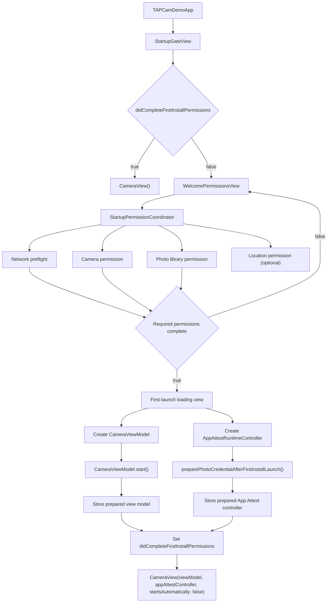

# First Launch Startup Flow

This document records the current first-install startup flow, the known issues
that must be fixed next, and the recommended trace points if startup logging is
temporarily reintroduced.

## Current Flow

## Sequence Notes

- `TAPCamDemoApp` renders `StartupGateView` as the root view.
- `StartupGateView` reads `TAPCamDemo.StartupGate.didCompleteFirstInstallPermissions`
  from `UserDefaults` through `@AppStorage`.
- Returning users skip the welcome page and enter `CameraView()` directly.
- First-install users see `WelcomePermissionsView` before the camera surface is
  created.
- The welcome page asks for required network, camera, and photo library access.
  Location is optional and can be skipped.
- If location is skipped or still not authorized after first launch, later
  captures do not request location permission. They use any already cached
  authorized location or save without location metadata.
- The network row currently performs a lightweight HTTP preflight before App
  Attest is allowed to run.
- After required access is complete, the loading view creates a
  `CameraViewModel` and an `AppAttestRuntimeController`.
- The loading phase starts camera session preparation and App Attest preparation
  concurrently.
- When both preparation tasks return, the prepared objects are injected into
  `CameraView` with `startsAutomatically: false` so the camera screen does not
  start the same work again.
- The existing camera screen layout is not part of the first-launch gate and
  should remain unchanged by startup-flow work.

## TODO

- **P1: Use real network availability as the only success signal.**
  The network checklist item must not be marked complete only because
  `CTCellularData.restrictedState == .notRestricted`. The completion condition
  should be a successful lightweight network query. `CTCellularData` can remain
  diagnostic context, but it should not grant the network item by itself.

- **P1: Do not mark first launch complete when App Attest preparation fails.**
  `preparePhotoCredentialAfterFirstInstallLaunch()` currently reports failures
  through UI state instead of returning failure to `StartupGateView`. The gate
  should only set `didCompleteFirstInstallPermissions` after App Attest and
  camera preparation have both succeeded.

- **P2: Add a wall-clock timeout for network preflight.**
  The current retry loop can run much longer than intended because each attempt
  has its own URL request timeout. Replace attempt-count timing with a bounded
  total timeout.

- **P2: Make network retry after Settings explicit or tightly scoped.**
  Re-querying automatically whenever the status is denied can shift UI state
  unexpectedly. Prefer a user-visible retry action or a one-time recheck after
  returning from Settings.

- **P3: Keep startup tracing temporary and isolated.**
  Startup logs should not remain scattered through production code. Any future
  tracing should be short-lived, easy to remove, and preferably guarded by a
  debug flag or a small scoped tracer.

## Temporary Startup Trace Points

If startup logging is needed again, add trace points only around boundaries that
explain ordering or latency:

- App root creation: when `TAPCamDemoApp` creates `StartupGateView`.
- Gate decision: when `StartupGateView` chooses welcome, loading, or camera.
- Welcome interactions: when each permission button is tapped.
- Network preflight: begin, query attempt, query result, final success, timeout,
  and failure reason.
- Camera permission: before and after `AVCaptureDevice.requestAccess`.
- Photo library permission: before and after `PHPhotoLibrary.requestAuthorization`.
- Loading phase: before creating the prepared `CameraViewModel` and
  `AppAttestRuntimeController`.
- Camera warmup: before and after `CameraViewModel.start()`.
- App Attest warmup: before and after
  `preparePhotoCredentialAfterFirstInstallLaunch()`, including failure.
- Session runtime: before and after `CaptureSessionController.configure`,
  `AVCaptureSession.startRunning`, and photo output prewarm.

Do not add permanent log calls inside layout-only SwiftUI views, repeated body
rendering paths, or frequently called capability helpers unless the logging is
guarded and removed after diagnosis.

## Cleanup State

- The first-launch welcome gate is the current startup flow.
- The previous direct-root startup path is only retained for returning users
  through `CameraView()`.
- Temporary `StartupTrace` instrumentation has been removed from production
  code. Reintroduce it only as a focused diagnostic patch.
