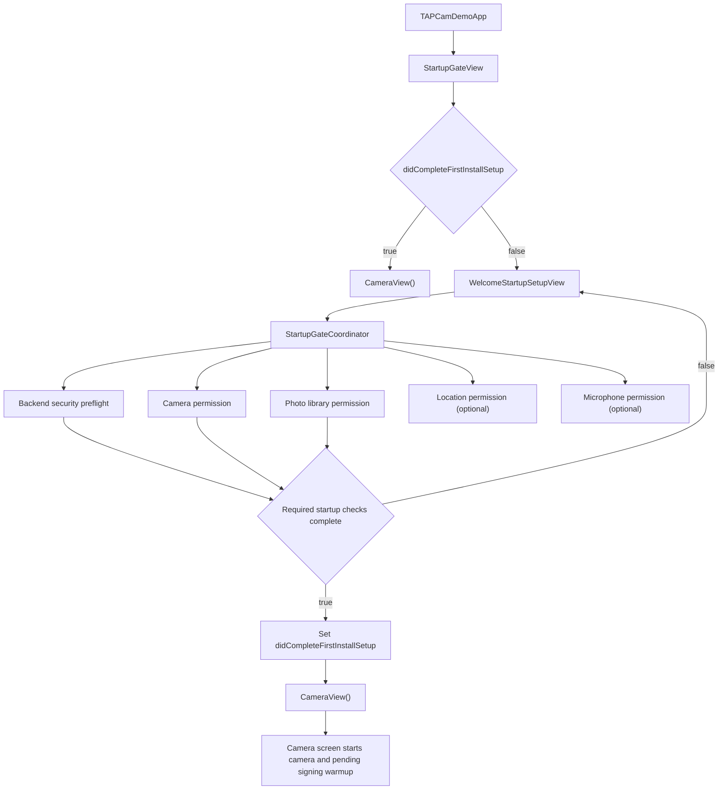

# First Launch Startup Flow

This document records the current first-install startup flow, remaining cleanup
ideas, and the recommended trace points if startup logging is temporarily
reintroduced.

## Current Flow

## Sequence Notes

- `TAPCamDemoApp` renders `StartupGateView` as the root view.
- `StartupGateView` reads `didCompleteFirstInstallSetup` from `@AppStorage`.
  The stored key string remains `TAPCamDemo.StartupGate.didCompleteFirstInstallPermissions`
  so existing installs do not repeat first-launch setup after this rename.
- Returning users skip the welcome page and enter `CameraView()` directly.
- First-install users see `WelcomeStartupSetupView` before the camera surface is
  created.
- `StartupGatePolicy` is the code-level policy entry. It names backend security
  preflight, camera, and photo library as required checks, while location and
  microphone stay optional.
- The welcome page requires a backend security preflight, camera access, and
  photo library access. Location and microphone are optional and can be
  skipped.
- The Photo Library system prompt is owned exclusively by the welcome page's
  explicit access action. Startup refreshes, capture retries, and media reads
  consume existing authorization and never request it implicitly.
- The backend security preflight is a strict product gate, not an iOS network
  permission prompt. The current policy intentionally blocks first camera entry
  until that preflight succeeds.
- The welcome page labels that required backend preflight as **Network Access**
  because the user-facing action is checking connectivity, while the code keeps
  the `securityPreflight` policy name.
- If location is skipped or still not authorized after first launch, later
  captures use the app's location data-use switch plus any already cached
  authorized location, or save without location metadata.
- If microphone is skipped or still not authorized after first launch, the
  camera continues to capture still photos and silent Live Photos. Live Photo
  sound requires both system microphone authorization and the app's microphone
  data-use switch.
- The Network Access row performs a lightweight HTTPS preflight against the
  configured App Attest server `/healthz` endpoint before first camera entry and
  automatic pending-capture signing credential warmup.
- After required access is complete, `StartupGateView` marks
  `didCompleteFirstInstallSetup` and enters `CameraView()`.
- The current implementation does not have a separate first-launch loading view
  and does not inject prepared `CameraViewModel` or
  `AppAttestRuntimeController` instances from the startup gate.
- Camera startup, pending-capture signing credential warmup, and pending-capture
  retry are owned by the camera screen lifecycle.
- The existing camera screen layout is not part of the first-launch gate and
  should remain unchanged by startup-flow work.

## TODO

- **Done: Backend security preflight has a bounded wall-clock timeout.**
  The current retry loop uses a total timeout so failed backend security
  preflight checks cannot grow into multi-minute first-launch waits.

- **Done: Backend security preflight retry and timeout are pure policy.**
  Backend security preflight still uses the same bounded wall-clock retry
  behavior, but the retry, delay, deadline, and timeout decision now live in a
  tested pure policy boundary, while backend `/healthz` execution lives outside
  the startup coordinator.

- **P2: Make security preflight retry explicit or tightly scoped.**
  Re-querying automatically whenever the status is denied can shift UI state
  unexpectedly. Prefer a user-visible retry action or a one-time recheck after
  returning from Settings.

- **P3: Keep startup tracing temporary and isolated.**
  Startup logs should not remain scattered through production code. Any future
  tracing should be short-lived, easy to remove, and preferably guarded by a
  debug flag or a small scoped tracer.

## Temporary Startup Trace Points

If startup logging is needed again, add trace points only around boundaries that
explain ordering or latency:

- App root creation: when `TAPCamDemoApp` creates `StartupGateView`.
- Gate decision: when `StartupGateView` chooses welcome, loading, or camera.
- Welcome interactions: when each permission button is tapped.
- Backend security preflight: begin, query attempt, query result, final success,
  timeout, and failure reason.
- Camera permission: before and after `AVCaptureDevice.requestAccess`.
- Photo library permission: before and after `PHPhotoLibrary.requestAuthorization`.
- Camera entry: before creating `CameraView()`.
- Camera warmup: before and after `CameraViewModel.start()`.
- App Attest warmup: before and after
  `warmPendingCaptureSigningCredential()`, including failure.
- Session runtime: before and after `CaptureSessionController.configure`,
  `AVCaptureSession.startRunning`, and photo output prewarm.

Do not add permanent log calls inside layout-only SwiftUI views, repeated body
rendering paths, or frequently called capability helpers unless the logging is
guarded and removed after diagnosis.

## Cleanup State

- The first-launch welcome gate is the current startup flow.
- Backend security preflight success now requires a successful HTTPS `/healthz`
  query against the configured App Attest server.
- First-launch completion is marked when required startup checks are satisfied.
  Camera warmup and pending-capture signing credential warmup happen after
  entering the camera screen.
- The previous direct-root startup path is only retained for returning users
  through `CameraView()`.
- Temporary `StartupTrace` instrumentation has been removed from production
  code. Reintroduce it only as a focused diagnostic patch.
