# TAP Video Library PRD

Status: proposed for product and engineering review; no implementation is
authorized by this document.

This PRD replaces the release-readiness assumptions of the first depth-video
vertical slice. The feature has not shipped, so the video manifest, pending
bundle, player state, and thumbnail contracts may be replaced directly. This
does not by itself change the app's iOS 18.6 deployment target.

## Executive Decision

The current branch proves that TAP can record RGB, audio, and timed depth
metadata into an MP4 and carry it through signing and Photos export. It is not a
release candidate. Before feature work continues, the next implementation
should make these structural changes:

1. Use one canonical Library item model for the grid and the camera's lower-left
   recent-media cover. Persist a poster frame for TAP videos.
2. Replace `UIImage?` and four unrelated load-state models with one identity-
   checked, cancellable media-fetch state that can represent iCloud progress.
3. Give playback layout to one owner. Do not overlap system transport controls,
   custom bottom chrome, and an independently fitted depth image using fixed
   inset constants.
4. Replace whole-video `Data` APIs with URL and streaming APIs. Keep one pending
   MP4 whose fixed proof slot transitions from empty to filled in place.
5. Bound depth decode work by bytes and time around the playhead. Do not retain
   hundreds of decoded depth maps and images.
6. Pack only logical depth pixels, bind the real calibration, record real gaps,
   and benchmark per-frame lossless compression before choosing a codec.

## Current User-Visible Failures

| ID | Failure | Current cause | Required outcome |
| --- | --- | --- | --- |
| CV-1 | The camera's lower-left Library cover shows an older photo after recording a video. | Video ingest stores `thumbnailFilename = nil`; the camera path only reads stored thumbnail data and falls through to an older photo. | The cover identity equals the first item in the Library's canonical sort, and a video shows a poster generated from that video. |
| CV-2 | A stale cover can remain after deletion or a failed request. | `recentThumbnail` contains no item identity; empty/error paths do not clear it, and older PhotoKit callbacks can overwrite newer requests. | Empty Library shows the empty state; out-of-order callbacks cannot change a newer item. |
| CV-3 | iCloud-only media is indistinguishable from idle, failed, or unavailable media. | Thumbnail requests disable network access and collapse all nil results into one placeholder; original-video loading has no progress or cancellation. | The current item visibly says `Loading from iCloud...` / `正在从 iCloud 中加载…`, reports progress when available, and supports cancel/retry. |
| CV-4 | Player controls and custom chrome can overlap. | `AVPlayerViewController` and `DepthViewerChromeView` both own the bottom area; fixed `84` / `56` point insets guess at system-control geometry. | One control owner at a time; no overlap across safe areas, Dynamic Type, orientation, or player-control visibility. |
| CV-5 | A depth heatmap may not register to the displayed RGB frame. | The player fits RGB and depth independently; the newly computed video aspect ratio is not consumed, and recorded calibration is only a presence string. | Overlay placement is derived from the actual displayed video rect and a bound RGB-depth mapping/calibration contract. |

## Goals

- Make the recent Library cover and the Library grid agree on the latest item.
- Give pending, exported, Photos-only, photo, and video items the same identity
  and fetch lifecycle.
- Show explicit iCloud download state without downloading every neighboring item.
- Keep RGB playback, depth presentation, system controls, and TAP chrome from
  obscuring each other.
- Make video finalization, signing, validation, and Photos export use memory that
  is independent of recording duration.
- Keep one authoritative signed MP4 in Photos while pending storage remains
  crash-safe and idempotent.
- Preserve depth bytes losslessly until the product explicitly approves a
  quantized schema.
- Make every manifest statement derivable from the finalized MP4 and capture
  counters.

## Non-Goals

- No implementation in this research turn.
- No migration for videos created by this unshipped branch.
- No full 3D video editor, plane analysis, or arbitrary frame-accurate depth
  scrubbing in the first corrected release.
- No compression of H.264/AAC tracks or of the complete MP4 file.
- No assumption that simulator traces prove real camera, thermal, or physical-
  device memory behavior.

## Canonical Library Model

All Library surfaces must consume the same ordered summary:

```swift
struct LibraryMediaSummary: Identifiable, Sendable {
    let id: LibraryMediaID
    let capturedAt: Date
    let kind: MediaKind          // photo, livePhoto, tapVideo
    let source: MediaSource      // pending, ownedPhotosAsset, photosOnly
    let version: MediaVersion
}
```

The provider merges pending records, owned exported records, and Photos-only
assets, suppresses duplicates, then sorts by `capturedAt`. The camera cover is
the first element of that same result; it must not run a second "latest" query.

The camera presentation state must carry identity and kind:

```swift
enum RecentLibraryPresentation: Equatable {
    case empty
    case loading(itemID: LibraryMediaID, kind: MediaKind)
    case ready(itemID: LibraryMediaID, kind: MediaKind, poster: MediaPoster)
    case failed(itemID: LibraryMediaID, kind: MediaKind, retryable: Bool)
}
```

### Poster policy

- Generate a bounded poster after local video finalization using
  `AVAssetImageGenerator` at the first useful frame.
- Persist the poster as the bundle's small protected `thumbnail.jpg`, just as a
  photo pending record does. Keep it after successful Photos export.
- Use one cache key containing item identity, media version, and target pixel
  size. Never reuse a previous item's image as the new item's placeholder.
- A failed poster extraction shows a video placeholder for the correct item; it
  does not fall through to an older photo.
- Use the structured async `image(at:)` API and cancel work when the owning item
  changes. Apple warns that synchronous image generation can block long enough
  to damage responsiveness and recommends async generation.

## Unified iCloud and Media Fetch State

The state must preserve a same-item low-resolution preview while distinguishing
where the original is:

```swift
enum MediaFetchPhase<Preview, Value> {
    case localPreview(Preview)
    case cloudOnly(Preview?)
    case downloadingFromICloud(Preview?, progress: Double?)
    case ready(Value)
    case failed(Preview?, reason: MediaFetchFailure, retryable: Bool)
}

enum MediaFetchFailure {
    case permission
    case offline
    case assetRemoved
    case download
    case decode
}
```

Every request owns `itemID + generation + cancellation token`. A callback may
publish only while both identity and generation still match. PhotoKit request
IDs must be cancelled on cell reuse, swipe, dismissal, or replacement.

### Surface policy

| Surface | Network policy | Required UI |
| --- | --- | --- |
| Library grid | Probe local thumbnails first. Do not automatically download every iCloud original. Preheat only bounded visible/near-visible thumbnails. | Local poster, cloud badge/loading state, or typed retryable failure. |
| Camera recent cover | Use the app-private poster for owned TAP items. Only request the canonical latest Photos-only poster. | Correct item kind and identity; never a stale older image. |
| Photo viewer | Automatically load only the current original. Neighboring items may use local previews but must not start original downloads. | Visible `Loading from iCloud...` text even when a low-resolution preview is already visible, plus progress when PhotoKit supplies it. |
| Video viewer | Download the current original to a temporary file before creating the player. | Progress, cancel, retry, typed failure, and temporary-file cleanup. |

Apple's PhotoKit contract supports this directly: image, video, and underlying
resource request options expose network permission and progress handlers;
`PHImageManager` and `PHAssetResourceManager` expose cancellation identifiers.

## Player and Overlay Contract

### One control owner

The current `additionalSafeAreaInsets.bottom` workaround is not a layout
contract. The next spike must choose one of these two coherent designs:

| Option | Design | Advantages | Cost |
| --- | --- | --- | --- |
| A: system player | Keep `AVPlayerViewController`; put the noninteractive depth layer in its `contentOverlayView`; read `videoBounds` for the exact displayed rect; move TAP actions outside the system transport-control region. | Native controls, AirPlay, PiP behavior. | Less freedom for persistent custom bottom chrome. |
| B: TAP player | Render with `AVPlayerLayer`, hide system controls, and let one SwiftUI control hierarchy own transport, modes, Share, and Delete. | Exact geometry and gesture arbitration. | TAP must implement and test accessible transport controls and advanced system features. |

Option C — system controls plus custom bottom chrome plus fixed clearance values —
is rejected.

### Spatial registration

- The depth image must use the actual `videoBounds`, not the full viewport.
- Orientation, mirroring, clean aperture/crop, RGB dimensions, depth dimensions,
  and calibration reference dimensions must be part of one transform.
- The signed artifact must carry the real calibration required to reproduce that
  mapping. `"AVCameraCalibrationData-present"` is not sufficient.
- If the mapping cannot be proven, label the result as an approximate depth
  visualization rather than a registered overlay.
- A missing depth sample at the current time clears or marks the overlay. It may
  not leave a stale heatmap over a later RGB frame.
- The preparation gate ends when the first usable depth frame or a typed
  no-depth result arrives; a fixed two-second timer is not readiness evidence.

## Target Storage and Signing Architecture

The pending bundle should contain one media artifact:

```text
Pending/<captureID>/
  bundle.json
  artifact.mp4       # empty proof slot, then proof-filled in place
  thumbnail.jpg
```

Diagnostic derivatives belong in a bounded Caches directory, not in the durable
pending proof bundle.

```mermaid
flowchart LR
    Capture["AVCapture outputs"] --> Writer["AVAssetWriter in pending temp bundle"]
    Writer --> Finalize["append manifest + empty proof slot in place"]
    Finalize --> Hash["streaming SHA-256 excluding proof range"]
    Hash --> Attest["App Attest assertion"]
    Attest --> Proof["fixed-offset proof write + fsync"]
    Proof --> Validate["streaming local byte-binding validation"]
    Validate --> Photos["Photos addResource(fileURL:)"]
    Photos --> Readback["read original video resource + validate"]
    Readback --> Cleanup["remove app-private MP4; retain record + poster"]
```



Requirements:

- Start recording directly in a temporary pending bundle and commit by rename.
- Video signing and validation APIs accept URLs/file descriptors, not whole-file
  `Data` values.
- Parse top-level BMFF boxes incrementally.
- Hash fixed-size chunks and skip the proof range without `subdata` copies.
- Fill the proof payload in place. The excluded fixed slot makes a separate
  signed file unnecessary.
- Photos imports the already validated pending URL. Do not write another staging
  copy from memory.
- Read the Photos original resource back and validate it before deleting the
  pending authoritative file.
- Make export idempotent across a crash after Photos commit and before the
  pending record transition. A retry may not create a duplicate video.
- Distinguish `local byte binding passed` from `backend App Attest assertion
  verified` in state and user-facing trust text.

## Memory and Disk Requirements

Let `V` be finalized video size. The current implementation has `O(V)` heap use
and multiple logical `V`-sized files. The target is:

```text
heap = O(fileChunk + boundedDepthWorkSet)
pending disk before Photos = approximately V + poster + record
app-private large-file disk after verified Photos readback = 0
```

Hard gates:

- No production video path calls `Data(contentsOf:)` for a complete MP4.
- No video artifact API accepts or returns the complete MP4 as `Data`.
- File hashing, manifest lookup, proof lookup/write, and validation use bounded
  buffers whose total configured capacity is at most 32 MiB.
- Playback keeps a byte-budgeted ring around the playhead, provisionally at most
  24 MiB. It does not use a frame-count limit such as `900`.
- Pending depth-decode concurrency is provisionally at most two jobs. A newer
  relevant frame may supersede queued obsolete work.
- A rendered overlay frame does not retain its full `TAPMetricDepthMap` unless a
  visible analysis feature consumes it.
- The Release build does not produce `depth-preview.mp4`.
- If a diagnostics sidecar remains in Debug, it has an explicit size cap, TTL,
  cleanup test, and privacy classification.
- Peak RSS is measured for 15 s, 60 s, and 180 s recordings. Passing requires a
  flat duration-to-RSS slope after steady state; the absolute device budget is
  set from the first baseline trace before implementation approval.

## Depth Payload and Compression Decision

### Format corrections before codec selection

- Copy only `width * bytesPerSample` logical bytes per row. Do not authenticate
  alignment or extended-pixel padding with no pixel meaning.
- Record packed row stride, source row stride for diagnostics if useful, sample
  byte order, pixel format, uncompressed byte count, compressed byte count, and
  codec per sample or stream.
- Move invariant format and actual calibration into stream/manifest metadata;
  do not repeat descriptive strings in every frame.
- Keep per-frame chunks independently decodable so seeking does not require
  decompressing the entire depth stream.
- If compression is larger than raw payload plus header, store that frame raw.

### Candidate matrix

| Candidate | Use | Strength | Risk / constraint | Decision |
| --- | --- | --- | --- | --- |
| Raw packed bytes | Baseline and incompressible fallback | Lowest CPU | Largest track | Keep only as fallback. |
| LZFSE | Per-frame lossless payload | Native Apple Compression API; balanced mobile ratio/speed; reference decoder is open source | Cross-platform implementations are less ubiquitous | Benchmark. |
| LZ4 | Per-frame lossless payload | Very fast; Apple API and broad implementations | Lower ratio | Benchmark for thermal/throughput floor. |
| Zstandard level 1 / fast mode | Per-frame lossless payload | Strong ratio/speed tradeoff and stable documented format | Adds a C dependency and security/update ownership | Benchmark for cross-platform default. |
| RVL | Integer depth frames | Research-backed fast lossless depth compression | Designed for integer depth; not a bit-exact codec for arbitrary Float16/Float32 buffers | Research only unless the product approves an integer canonical depth schema. |
| H.264/HEVC representation | Visual depth derivative | Standard media tooling | Normally lossy or semantically unsuitable for exact metric floats | Reject for the signed raw-depth source. |

Do not compress canonical manifest JSON by default. It is small, reviewable, and
already included in the signed MP4. Do not recompress H.264/AAC or gzip the MP4;
that breaks ordinary Photos playback and random access.

The codec spike uses real captured depth buffers and reports exact-byte
round-trip, ratio, p50/p95 encode and decode time, energy/thermal behavior, and
added capture drops. A candidate passes only if its p95 encode time consumes no
more than 25% of the observed depth-frame interval and produces no additional
RGB/audio drops in the same physical-device flow.

## Manifest Truth Contract

Before signing, the manifest must be reconciled with the finalized MP4:

- Actual track IDs, codec descriptions, dimensions, timescales, and duration
  come from the asset, not hard-coded assumptions.
- `deliveredDepthSampleCount`, `storedDepthSampleCount`, capture-output drops,
  compression/encoder drops, and metadata-writer drops are separate facts.
- Any discontinuity becomes a gap interval with reason and nearest RGB timing.
  `gaps: []` is allowed only when the measured interval is complete.
- `maxObservedDeltaSeconds` means an RGB-depth timestamp delta if named that;
  depth-to-depth cadence needs a different field.
- Calibration data and the RGB-depth mapping policy are bound bytes, not a
  presence string.
- The verifier checks sample count/gap summary against the metadata track before
  accepting those manifest claims.

## Instrumentation and Trace Plan

ETTrace is a CPU sampling tool, not a heap profiler. Use it for two focused,
symbolicated simulator flows after a deterministic video fixture exists:

1. Open a local TAP video, switch RGB -> 2D, play for 10 seconds, dismiss.
2. Finalize/sign/export a fixture through a simulator-safe file-backed harness.

Preserve processed flamegraph JSON and report first-party inclusive stacks.

Use Instruments Allocations/VM Tracker and physical-device signposts for real
capture:

```text
capture.start
capture.firstRGB / capture.firstDepth
capture.stop
finalize.writerFinished
finalize.manifestAppended
sign.hashStarted / sign.hashFinished
sign.assertionFinished
sign.proofWritten
validate.localFinished
photos.importStarted / photos.importFinished
photos.readbackValidated
pending.cleanupFinished
```

Capture 15 s, 60 s, and 180 s depth videos plus a no-depth control. Record RSS,
dirty memory, disk bytes at each marker, RGB/depth drops, compression ratio,
encode/decode latency, and thermal state.

Use a simulator memgraph after five repeated open -> 2D play -> dismiss cycles.
The pass condition is not merely "no leaks"; player, metadata output, decoded
frames, temporary directories, and request tasks must return to their intended
lifetime. The current 900-frame cache is intentional retention, not a leak, and
must be evaluated by byte budget.

No runtime ETTrace or memgraph was captured in this research turn because the
current task is design-only and the repo does not provide a deterministic
simulator TAP-video fixture. A generic launch trace would not answer the video
questions.

## Acceptance Matrix

| Area | Acceptance |
| --- | --- |
| Recent cover | Its item ID always equals the Library's first item after capture, export, delete, foreground, and Library dismissal. Pending video has a poster. Empty Library clears the cover. |
| Request race | If request A is pending and item B becomes current, A cannot publish over B; A is cancelled when possible. |
| Grid iCloud | Local-only probe never silently becomes a permanent generic icon. Cloud-only state is explicit and does not fan out original downloads. |
| Photo iCloud | Selecting an iCloud-only photo shows localized loading text and progress even while a low-resolution preview is visible; swipe/dismiss cancels work. |
| Video iCloud | Player creation waits for the current original; loading has progress/cancel/retry; cancellation removes partial temporary files. |
| Errors | Permission, offline/download, deleted asset, and decode failures have different public-safe copy and retry behavior. |
| Player chrome | No overlap in portrait/landscape, compact height, Dynamic Type, home-indicator devices, RGB mode, or 2D opacity mode. |
| Spatial overlay | Test fixtures for rotation/mirroring/aspect ratios align RGB and depth to the same displayed rect; missing depth never leaves a stale overlay. |
| Heap | No whole-video `Data`; RSS is duration-independent after steady state; playback obeys its byte budget. |
| Disk | One pending MP4; no durable debug sidecar; Photos reads from file URL; verified readback precedes cleanup. |
| Crash recovery | Forced termination after Photos commit but before record update produces exactly one Photos asset after retry. |
| Manifest | Synthetic output and metadata drops produce signed gap intervals and correct counters. |
| Compression | Every candidate passes exact-byte round-trip and device throughput gates before selection. |

## Test Strategy

- Pure tests for canonical merge/sort, video poster selection, empty state, and
  out-of-order completion rejection.
- Injectable PhotoKit client tests for cloud-only -> downloading -> ready,
  progress, cancellation, offline retry, asset deletion, and permission denial.
- Player layout tests against measured video bounds; rendered screenshot/device
  evidence for system controls and custom chrome.
- Streaming parser/hash/proof tests using sparse large fixtures so test memory is
  bounded.
- Compression corpus tests with exact byte equality and corrupted/truncated
  frame rejection.
- Crash-injection tests at every pending/sign/export transition.
- Bento4 `mp4info` / `mp4dump` and GPAC inspection in CI artifacts to verify
  track/sample/box structure. These are validation tools, not app runtime
  dependencies.
- Physical-device Photos round-trip validation before release acceptance.

## Professional References

- Apple: [AVPlayerViewController](https://developer.apple.com/documentation/avkit/avplayerviewcontroller), [contentOverlayView](https://developer.apple.com/documentation/avkit/avplayerviewcontroller/contentoverlayview), and [videoBounds](https://developer.apple.com/documentation/avkit/avplayerviewcontroller/videobounds).
- Apple: [Loading and Caching Assets and Thumbnails](https://developer.apple.com/documentation/photokit/loading-and-caching-assets-and-thumbnails), [PHImageRequestOptions network access](https://developer.apple.com/documentation/photos/phimagerequestoptions/isnetworkaccessallowed), [PHAssetResourceRequestOptions progress](https://developer.apple.com/documentation/photos/phassetresourcerequestoptions/progresshandler), and [cancelDataRequest](https://developer.apple.com/documentation/photos/phassetresourcemanager/canceldatarequest(_:)).
- Apple: [Creating images from a video asset](https://developer.apple.com/documentation/avfoundation/creating-images-from-a-video-asset) and [PHAssetCreationRequest file-URL resources](https://developer.apple.com/documentation/photos/phassetcreationrequest/addresource(with:fileurl:options:)).
- Apple: [Compression LZFSE](https://developer.apple.com/documentation/compression/compression_lzfse) and [Core Video bytes-per-row alignment](https://developer.apple.com/documentation/corevideo/kcvpixelbufferbytesperrowalignmentkey).
- GoPro: [GPMF parser](https://github.com/gopro/gpmf-parser) and [GPMF writer](https://github.com/gopro/gpmf-write). The writer explicitly does not include a robust MP4/MOV muxer, so TAP should reuse format lessons, not treat it as an app-ready container layer.
- Compression candidates: [LZFSE reference implementation](https://github.com/lzfse/lzfse), [LZ4](https://github.com/lz4/lz4), and [Zstandard](https://github.com/facebook/zstd).
- Depth-specific research: Wilson, Dou, Zhang, and Hays, [Fast Lossless Depth Image Compression (RVL)](https://www.microsoft.com/en-us/research/publication/fast-lossless-depth-image-compression/).
- Container validation: [Bento4 documentation](https://www.bento4.com/documentation/) and [GPAC inspection](https://wiki.gpac.io/Filters/inspect/).
- CPU tracing: [Emerge Tools ETTrace](https://github.com/EmergeTools/ETTrace).

## Decisions Required Before Implementation

1. System-player option A or TAP-player option B?
2. Must the signed depth source remain bit-exact Float16/Float32, or may v1
   define a quantized integer metric-depth representation?
3. Which two compression candidates enter the device spike? Recommended:
   Zstandard level 1 and LZFSE, with raw and LZ4 baselines.
4. Remove the debug depth sidecar entirely, or retain a bounded Debug-only cache?
5. What absolute RSS budget should be set after the first physical-device trace?
6. Is Photos still the authoritative original, requiring successful round-trip
   validation before pending cleanup? This PRD assumes yes.
