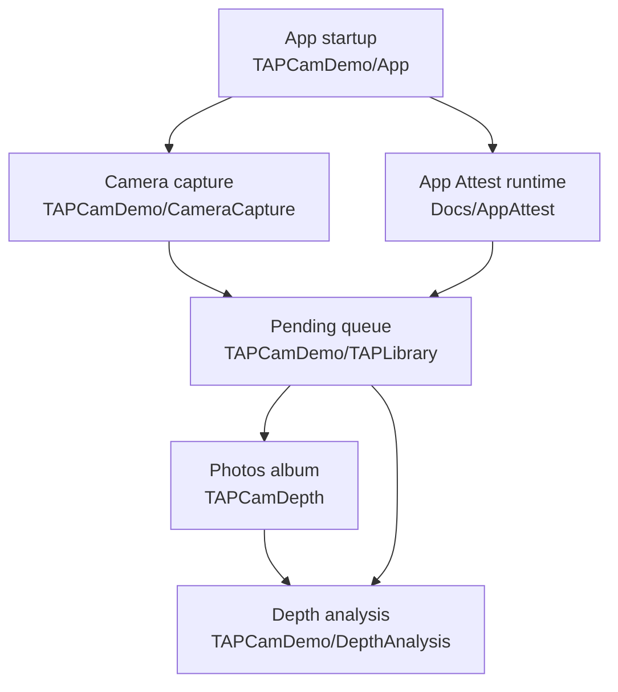
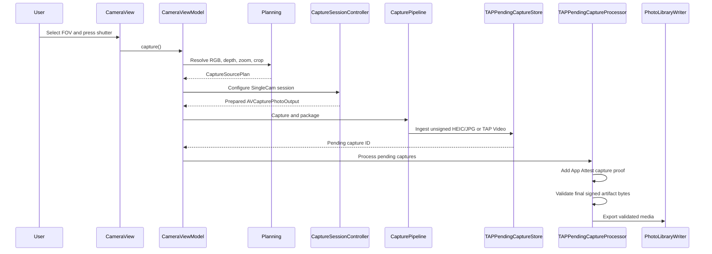

# TAPCamDemo

TAPCamDemo is an iPhone-only iOS SingleCam photo-depth and TAP Video capture app. Release capture exposes
field-of-view choices such as `13mm`, `24mm`, `48mm`, and `77mm`; each choice is
resolved into one Apple-compatible RGB source, depth source, and depth-safe raw
`AVCaptureDevice.videoZoomFactor` before capture.

Photo and TAP Video capture each stage a reviewed shared-contract artifact in
the app-private Pending Capture Queue. A serial worker signs and validates the
finalized artifact, exports it to Photos, and verifies TAP Video readback.

Current non-goals: watermarking, destructive final crop, MultiCam capture,
arbitrary non-TAP video formats, external session scaffolding, sidecar JSON,
Release debug bundles, iPad runtime/layout support,
Mac Catalyst or native macOS, Designed for iPhone/iPad on Mac, and Apple Vision
Pro compatibility. RAW/ProRAW and broader format work are future product tasks,
not dormant implementations in the current capture path.

## Quick Links

| Area | README | Primary code |
| --- | --- | --- |
| Canonical product constraints | [Docs/ProductContract.md](Docs/ProductContract.md) | Current capability, state-machine, non-goal, future, experiment, and claim authority |
| Project task database | [Docs/ProjectBoard.md](Docs/ProjectBoard.md) | Stable `TAP-xxxx` records and Inbox/Todo/Doing/Done/Deprecated views |
| UI prototype workflow | [Docs/UIPrototypeContract.md](Docs/UIPrototypeContract.md) and [Prototype](Prototype/README.md) | Incremental HTML/Web visual contract → SwiftUI → Simulator/device acceptance |
| App startup and App Attest runtime | [TAPCamDemo/App/README.md](TAPCamDemo/App/README.md) | [TAPCamDemoApp.swift](TAPCamDemo/App/TAPCamDemoApp.swift) |
| SingleCam capture pipeline | [TAPCamDemo/CameraCapture/README.md](TAPCamDemo/CameraCapture/README.md) | [CameraView.swift](TAPCamDemo/CameraCapture/UI/CameraView.swift), [CameraViewModel.swift](TAPCamDemo/CameraCapture/UI/CameraViewModel.swift) |
| Pending TAP Library queue | [TAPCamDemo/TAPLibrary/README.md](TAPCamDemo/TAPLibrary/README.md) | [TAPPendingCaptureStore.swift](TAPCamDemo/TAPLibrary/TAPPendingCaptureStore.swift), [TAPPendingCaptureProcessor.swift](TAPCamDemo/TAPLibrary/TAPPendingCaptureProcessor.swift) |
| Saved photo depth analysis and TAP Video playback | [TAPCamDemo/DepthAnalysis/README.md](TAPCamDemo/DepthAnalysis/README.md) | [DepthAnalysisView.swift](TAPCamDemo/DepthAnalysis/DepthAnalysisView.swift), [TAPVideoDepthPlaybackView.swift](TAPCamDemo/DepthAnalysis/TAPVideoDepthPlaybackView.swift) |
| App Attest contract docs | [Docs/AppAttest/README.md](Docs/AppAttest/README.md) | [AppAttestRuntime.swift](TAPCamDemo/App/AppAttestRuntime.swift), [AppAttestCaptureAssertionSigner.swift](TAPCamDemo/CameraCapture/Output/AppAttestCaptureAssertionSigner.swift) |
| Zstandard compression dependency | [facebook/zstd](https://github.com/facebook/zstd) | Exact SwiftPM version `1.5.7`; app adapter lives in [TAPDepthFrameCodec.swift](TAPCamDemo/CameraCapture/Output/TAPDepthFrameCodec.swift) |
| Tests and automation | [TAPCamDemoTests/README.md](TAPCamDemoTests/README.md) | Start with the test README for the automation gate, focused output/provenance suites, manual-control suites, TAP Library suites, and evidence limits. |
| Source tree module index | [TAPCamDemo/README.md](TAPCamDemo/README.md) | [TAPCamDemo](TAPCamDemo) |
| Documentation index | [Docs/README.md](Docs/README.md) | Minimal active reading order and specialized contracts |

## Architecture



## Current Work Governance

Current product scope comes only from
[Docs/ProductContract.md](Docs/ProductContract.md). Current and historical work
is tracked by stable Task ID in
[Docs/ProjectBoard.md](Docs/ProjectBoard.md). Before proposing a feature, search
the complete Board across Inbox, Todo, Doing, Done, and Deprecated; revise a
matching Task instead of creating a duplicate.

Visible UI work follows
[Docs/UIPrototypeContract.md](Docs/UIPrototypeContract.md): approve the
HTML/Web component and state relationship first, implement SwiftUI second, then
perform Simulator and required physical-device acceptance.

The first code-level entry for image format or quality work remains the
app-level quality policy plus Output contract in
[TAPCamDemo/CameraCapture/Output/README.md](TAPCamDemo/CameraCapture/Output/README.md).
`CapturePhotoQualityPolicy`, `CaptureOutputProfileSelectionIntent`,
`CaptureOutputProfileSelectionPresentation`, and `CaptureOutputProfile` are
internal policy, selection, presentation, and validation models, not
user-visible controls. Release supports the reviewed HEIC/JPG photo-depth
contracts and the reviewed TAP Video MP4 contract; it does not select arbitrary
media formats at runtime.
Pending worker readiness is also an internal strategy model; it decides whether
protected data permits reading private pending artifacts and does not add UI or
change Release output.

## Photo Capture Flow



## Module Responsibilities

### App

[TAPCamDemo/App](TAPCamDemo/App) owns the app root, first-install permission
gate, App Attest runtime creation, and shared diagnostics categories. It does
not own camera configuration or capture packaging.

Start with [TAPCamDemo/App/README.md](TAPCamDemo/App/README.md).

### CameraCapture

[TAPCamDemo/CameraCapture](TAPCamDemo/CameraCapture) owns all camera UI,
planning, AVFoundation runtime configuration, logical packaging, and the
unsigned artifact handoff into the Pending Capture Queue. It is the only module that touches
`AVCaptureSession`.

Start with [TAPCamDemo/CameraCapture/README.md](TAPCamDemo/CameraCapture/README.md).

### TAPLibrary

[TAPCamDemo/TAPLibrary](TAPCamDemo/TAPLibrary) owns app-private pending capture
storage, queue states, retry ordering, App Attest proof injection, Photos
export, and cleanup of large exported files. It keeps queue work serial so real
device signing/export cannot overlap itself.

Start with [TAPCamDemo/TAPLibrary/README.md](TAPCamDemo/TAPLibrary/README.md).

### DepthAnalysis

[TAPCamDemo/DepthAnalysis](TAPCamDemo/DepthAnalysis) reads validated saved or
pending photo inputs and TAP Video, then presents the approved RAW/2D/3D Viewer.
Internal analysis renderers cover RGB, depth overlays, masks, point clouds, and
planes. The local analysis reader bounds photo size, primary-image
dimensions, depth-map pixel count, sample layout, and projection calibration
before rendering or geometry tools allocate per-pixel products. It is
deliberately separate from live capture.

Start with [TAPCamDemo/DepthAnalysis/README.md](TAPCamDemo/DepthAnalysis/README.md).
Its active code map separates Viewer, Share, video playback, privacy, and
device-acceptance responsibilities.

## Artifact Contract Boundary

The shared
[TAPArtifactContracts contract index](https://github.com/TAP-NAP/TAPArtifactContracts/blob/ca3b223e0717242ce1016b34dc34f04ef2417936/CONTRACTS.md)
is the source of truth for Still/Live/Video manifests, container locations,
signing, verification, and hash participation. TAPCamDemo keeps only its
product and producer lifecycle responsibilities here.

Before a signed TAP HEIC/JPG is saved to Photos, the queue re-reads the final
file bytes and passes the shared local binding relationships plus the selected
output/depth checks. This keeps queue status or filenames from acting as trust
signals by themselves.

DepthAnalysis input validation is a local reader safety boundary, not the final
export trust gate. App Attest proof validation and signed Photos export
authority remain in the capture/output queue.

## Validation

The shared `TAPCamDemo` scheme is the default automation entry point and
contains both `TAPCamDemoTests` and `TAPCamDemoUITests`. The default automated
unit gate selects `TAPCamDemoTests` explicitly; UI tests remain a separate,
attended surface.
The scheme sets `TAPCAM_XCTEST_HOST=1` so app-hosted unit tests do not enter
the first-launch permission and camera startup flow.

Before compiling, run the scoped TAP Video refactor structure gate:

```bash
Scripts/lint-tap-video-refactor.sh
```

The script uses `.swiftlint-tap-video.yml` to enforce function bodies at or
below 80 lines and cyclomatic complexity at or below 10 on the explicit scoped
TAP Video production allowlist. It intentionally excludes tests,
UI tests, Debug fixtures, benchmarks, remote package sources, and unrelated legacy code.

Use the current, environment-neutral commands and evidence boundaries in
[TAPCamDemoTests/README.md](TAPCamDemoTests/README.md). UI tests and real-device
Camera/App Attest acceptance remain attended validation paths, not part of the
default unit gate.

## Pre-release Version TODO

The current app version is `0.2 (2)`. Before the first public build, deliberately
freeze or update that pair once, then review compatibility against
[Product Contract §1.2](Docs/ProductContract.md#12-pre-release-version-and-compatibility-policy)
and the shared
[artifact-contract versioning policy](https://github.com/TAP-NAP/TAPArtifactContracts/blob/ca3b223e0717242ce1016b34dc34f04ef2417936/VERSIONING.md).

## Supporting Documents

| Document | Purpose |
| --- | --- |
| [Docs/README.md](Docs/README.md) | Cross-module documentation index. |
| [Docs/ProductContract.md](Docs/ProductContract.md) | Canonical current capability, state-machine, non-goal, future, experimental, and evidence boundaries. |
| [Docs/ProjectBoard.md](Docs/ProjectBoard.md) | Markdown task database and Kanban views. |
| [Docs/UIPrototypeContract.md](Docs/UIPrototypeContract.md) | HTML/Web prototype to SwiftUI and acceptance workflow. |
| [TAPArtifactContracts](https://github.com/TAP-NAP/TAPArtifactContracts/blob/ca3b223e0717242ce1016b34dc34f04ef2417936/CONTRACTS.md) | Documentation-only shared artifact conventions. |
| [Docs/AppAttest/README.md](Docs/AppAttest/README.md) | App Attest client/backend boundary and capture proof notes. |
| [TAPCamDemo/CameraCapture/Documentation/ARCHITECTURE.md](TAPCamDemo/CameraCapture/Documentation/ARCHITECTURE.md) | Camera module dependency direction. |
| [TAPCamDemo/CameraCapture/Documentation/PIPELINE.md](TAPCamDemo/CameraCapture/Documentation/PIPELINE.md) | Single executable capture path. |
| [TAPCamDemo/CameraCapture/Documentation/PACKAGING.md](TAPCamDemo/CameraCapture/Documentation/PACKAGING.md) | Producer, Pending Capture Queue, Photos export, and local-integrity orchestration. |
| [TAPCamDemo/DepthAnalysis/Documentation/PlanesTechnicalDesign.md](TAPCamDemo/DepthAnalysis/Documentation/PlanesTechnicalDesign.md) | Plane-filter geometry design. |

## Release Data Policy

Release emits only the reviewed Still/Live Photo or TAP Video artifact selected
by current product scope. It must not write sidecar JSON, debug bundles, raw
bundles, independent depth files, independent metadata files, metrics files, or
intermediate capture artifacts.

If a requested still-photo RGB/depth pair cannot be embedded as a valid Apple
photo-depth HEIC, capture is rejected instead of silently generating another
file.
