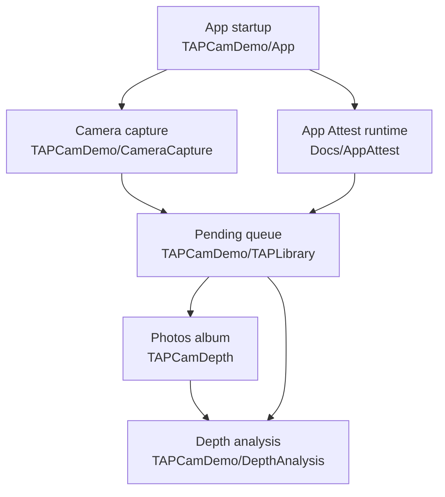
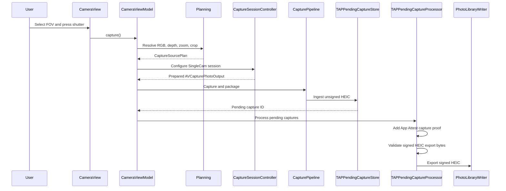
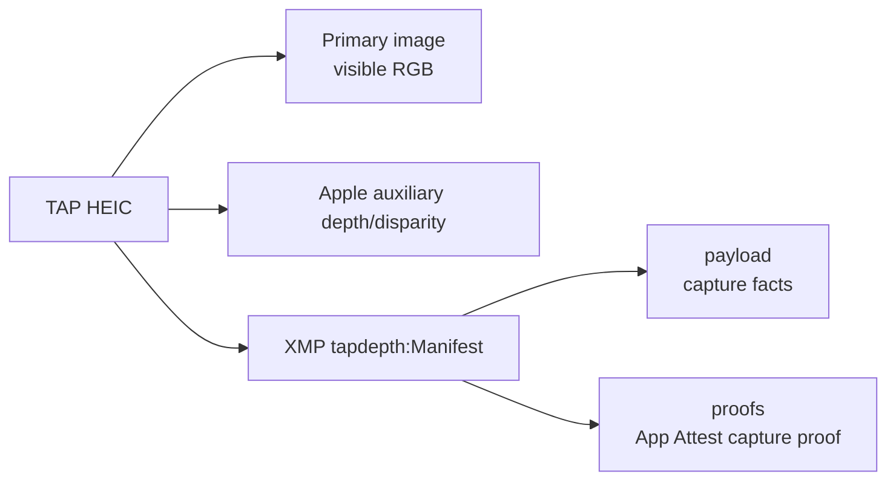

# TAPCamDemo

TAPCamDemo is an iOS SingleCam photo-depth capture app. Release capture exposes
field-of-view choices such as `13mm`, `24mm`, `48mm`, and `77mm`; each choice is
resolved into one Apple-compatible RGB source, depth source, and depth-safe raw
`AVCaptureDevice.videoZoomFactor` before capture.

The release artifact is one standard HEIC with the primary RGB image, Apple
auxiliary depth/disparity, and a TAP XMP manifest. Capture first writes an
unsigned HEIC into the app-private TAP Library queue. A serial queue worker then
adds the App Attest capture proof and exports the signed HEIC to Photos.

Current non-goals: watermarking, destructive final crop, MultiCam capture,
RGB/depth streaming synchronizer, RAW provider runtime, external session
scaffolding, sidecar JSON, and debug bundles.

## Quick Links

| Area | README | Primary code |
| --- | --- | --- |
| App startup and App Attest runtime | [TAPCamDemo/App/README.md](TAPCamDemo/App/README.md) | [TAPCamDemoApp.swift](TAPCamDemo/App/TAPCamDemoApp.swift) |
| SingleCam capture pipeline | [TAPCamDemo/CameraCapture/README.md](TAPCamDemo/CameraCapture/README.md) | [CameraView.swift](TAPCamDemo/CameraCapture/UI/CameraView.swift), [CameraViewModel.swift](TAPCamDemo/CameraCapture/UI/CameraViewModel.swift) |
| Pending TAP Library queue | [TAPCamDemo/TAPLibrary/README.md](TAPCamDemo/TAPLibrary/README.md) | [TAPPendingCaptureStore.swift](TAPCamDemo/TAPLibrary/TAPPendingCaptureStore.swift), [TAPPendingCaptureProcessor.swift](TAPCamDemo/TAPLibrary/TAPPendingCaptureProcessor.swift) |
| Saved HEIC depth analysis | [TAPCamDemo/DepthAnalysis/README.md](TAPCamDemo/DepthAnalysis/README.md) | [DepthAnalysisView.swift](TAPCamDemo/DepthAnalysis/DepthAnalysisView.swift), [DepthAnalysisReader.swift](TAPCamDemo/DepthAnalysis/DepthAnalysisReader.swift) |
| App Attest contract docs | [Docs/AppAttest/README.md](Docs/AppAttest/README.md) | [AppAttestRuntime.swift](TAPCamDemo/App/AppAttestRuntime.swift), [AppAttestCaptureAssertionSigner.swift](TAPCamDemo/CameraCapture/Output/AppAttestCaptureAssertionSigner.swift) |
| Tests and automation | [TAPCamDemoTests/README.md](TAPCamDemoTests/README.md) | Start with the test README for the automation gate, focused output/provenance suites, manual-control suites, TAP Library suites, and evidence limits. |
| Source tree module index | [TAPCamDemo/README.md](TAPCamDemo/README.md) | [TAPCamDemo](TAPCamDemo) |
| Dated project score and reading order | [Docs/ProjectScorecard.md](Docs/ProjectScorecard.md) | [Docs](Docs) |
| AI collaboration trace | [Docs/AITrace/README.md](Docs/AITrace/README.md) | [Docs/AITrace/2026-06-21-tap-library-scroll-memory.md](Docs/AITrace/2026-06-21-tap-library-scroll-memory.md) |

## Architecture



## Current Goal And Score Standard

Current AI-assisted goal: implement TAP Library in-session scroll memory,
cached return-to-library browsing, optional foreground return to Camera, and
signed-export queue cleanup without creating a second route system.
`DepthAlbumPickerView` starts each fresh TAP Library entry at the top, owns the
two-row return-offset correction and cached album snapshot for analysis-page
back navigation; `CameraRouteStore` and `CameraRouteContextStore` keep route
and tokenized item-anchor context without driving fresh-entry scroll position.
TAP Library queue policy now prioritizes already signed/exporting work and keeps
normal signed first export away from a full Photos asset scan.

Use [Docs/AITrace/2026-06-21-tap-library-scroll-memory.md](Docs/AITrace/2026-06-21-tap-library-scroll-memory.md)
as the plan-specific scoring-standard document. It contains the 10-point rubric,
current plan score, validation commands, remaining evidence, and AI
collaboration trace for this user journey. Use
[Docs/ProjectScorecard.md](Docs/ProjectScorecard.md) only for the broader
project score formula and from-scratch reading order. Use
[Docs/AITrace/README.md](Docs/AITrace/README.md) for the folder rules covering
AI-assisted iterations, security/iOS reviews, subagents, validation steps, and
change traceability.

Start with [Docs/FutureCameraSpecs.md](Docs/FutureCameraSpecs.md) for the
refactor boundary status.
The first code-level entry for future image format or quality work is the
app-level quality policy plus Output contract in
[TAPCamDemo/CameraCapture/Output/README.md](TAPCamDemo/CameraCapture/Output/README.md).
`CapturePhotoQualityPolicy`, `CaptureOutputProfileSelectionIntent`,
`CaptureOutputProfileSelectionPresentation`, and `CaptureOutputProfile` are
internal policy, selection, presentation, and validation models, not
user-visible controls. Release still captures one HEIC with embedded depth and a
TAP manifest.
Pending worker readiness is also an internal strategy model; it decides whether
protected data permits reading private pending artifacts and does not add UI or
change Release output.

## Capture Flow



## Module Responsibilities

### App

[TAPCamDemo/App](TAPCamDemo/App) owns the app root, first-install permission
gate, App Attest runtime creation, and shared diagnostics categories. It does
not own camera configuration or capture packaging.

Start with [TAPCamDemo/App/README.md](TAPCamDemo/App/README.md).

### CameraCapture

[TAPCamDemo/CameraCapture](TAPCamDemo/CameraCapture) owns all camera UI,
planning, AVFoundation runtime configuration, logical packaging, and the
unsigned HEIC handoff into TAP Library. It is the only module that touches
`AVCaptureSession`.

Start with [TAPCamDemo/CameraCapture/README.md](TAPCamDemo/CameraCapture/README.md).

### TAPLibrary

[TAPCamDemo/TAPLibrary](TAPCamDemo/TAPLibrary) owns app-private pending capture
storage, queue states, retry ordering, App Attest proof injection, Photos
export, and cleanup of large exported files. It keeps queue work serial so real
device signing/export cannot overlap itself.

Start with [TAPCamDemo/TAPLibrary/README.md](TAPCamDemo/TAPLibrary/README.md).

### DepthAnalysis

[TAPCamDemo/DepthAnalysis](TAPCamDemo/DepthAnalysis) reads validated saved or
pending TAP HEIC inputs and presents RGB, heatmap, mask, point-cloud, and
plane-filter views. The local analysis reader bounds HEIC size, primary-image
dimensions, depth-map pixel count, sample layout, and projection calibration
before rendering or geometry tools allocate per-pixel products. It is
deliberately separate from live capture.

Start with [TAPCamDemo/DepthAnalysis/README.md](TAPCamDemo/DepthAnalysis/README.md).
For presentation and privacy review, start with its Inspector/HUD Presentation
Map before scanning the SwiftUI files.

## HEIC Contract



| HEIC location | Contents | Authority |
| --- | --- | --- |
| Primary image item | Visible RGB image from `AVCapturePhoto.fileDataRepresentation(with:)` | Authoritative RGB image |
| Auxiliary data | Apple depth/disparity attachment | Authoritative depth map |
| EXIF/GPS/TIFF | Compatibility metadata and short pointer | Compatibility mirror |
| XMP `tapdepth:Manifest` | TAP JSON manifest at `tapdepth:Manifest` | Authoritative TAP metadata |

`payload` is encoded independently from `proofs`, so App Attest proof records
do not affect the payload bytes being signed. Current readers should prefer
`payload.rgbSource`, `payload.depthSource`, `payload.pairing`, `payload.zoom`,
`payload.crop`, `payload.resolvedSession`, and `payload.alignment`.

Before a signed TAP HEIC is saved to Photos, the queue re-reads the final file
bytes and validates the HEIC source type, manifest id, App Attest proof shape,
proof digest binding, and Apple auxiliary depth/disparity. This keeps queue
status or filenames from acting as trust signals by themselves.

DepthAnalysis input validation is a local reader safety boundary, not the final
export trust gate. App Attest proof validation and signed Photos export
authority remain in the capture/output queue.

## Validation

The shared `TAPCamDemo` scheme is the default automation entry point and only
includes `TAPCamDemoTests`. The old UI test target was removed because it only
proved a depth-capable physical-device FOV flow and skipped on Simulator.
The scheme sets `TAPCAM_XCTEST_HOST=1` so app-hosted unit tests do not enter
the first-launch permission and camera startup flow.

For AI/CI compilation verification, use:

```bash
xcodebuild build-for-testing -project TAPCamDemo.xcodeproj -scheme TAPCamDemo -destination 'platform=iOS Simulator,OS=26.5,name=iPhone 17'
```

For execution, use a simulator that is already booted and pass its UDID
explicitly. This avoids Xcode creating a temporary clone from a shutdown
destination during test launch.

```bash
xcrun simctl list devices booted
xcodebuild test -project TAPCamDemo.xcodeproj -scheme TAPCamDemo -destination 'id=<BOOTED_SIMULATOR_UDID>'
```

After `build-for-testing`, `test-without-building` can use the same
`-destination 'id=<BOOTED_SIMULATOR_UDID>'` form. Running by device name can
still depend on CoreSimulator boot and migration state. Real-device camera/App
Attest acceptance remains an attended validation path, not a default unit-test
target.

## Supporting Documents

| Document | Purpose |
| --- | --- |
| [Docs/README.md](Docs/README.md) | Cross-module documentation index. |
| [Docs/ProjectScorecard.md](Docs/ProjectScorecard.md) | Dated score, strict gaps, score formula, and from-scratch reading order. |
| [Docs/FutureCameraSpecs.md](Docs/FutureCameraSpecs.md) | Current refactor-first boundary status and future camera capability specs. |
| [Docs/AITrace/README.md](Docs/AITrace/README.md) | AI collaboration trace for goals, user constraints, subagent/plugin use, iteration history, and validation status. |
| [Docs/Startup/FirstLaunch.md](Docs/Startup/FirstLaunch.md) | Current first-install startup flow and trace points. |
| [Docs/AppAttest/README.md](Docs/AppAttest/README.md) | App Attest client/backend boundary and capture proof notes. |
| [TAPCamDemo/CameraCapture/Documentation/ARCHITECTURE.md](TAPCamDemo/CameraCapture/Documentation/ARCHITECTURE.md) | Camera module dependency direction. |
| [TAPCamDemo/CameraCapture/Documentation/PIPELINE.md](TAPCamDemo/CameraCapture/Documentation/PIPELINE.md) | Single executable capture path. |
| [TAPCamDemo/CameraCapture/Documentation/PACKAGING.md](TAPCamDemo/CameraCapture/Documentation/PACKAGING.md) | Embedded HEIC packaging and manifest details. |
| [TAPCamDemo/DepthAnalysis/Documentation/PlanesTechnicalDesign.md](TAPCamDemo/DepthAnalysis/Documentation/PlanesTechnicalDesign.md) | Plane-filter geometry design. |

## Release Data Policy

Release output is a single embedded photo artifact. Release builds must not
write sidecar JSON, debug bundles, raw bundles, independent depth files,
independent metadata files, metrics files, or intermediate capture artifacts.

If a requested RGB/depth pair cannot be embedded as a valid Apple photo-depth
HEIC, capture is rejected instead of silently generating another file.
