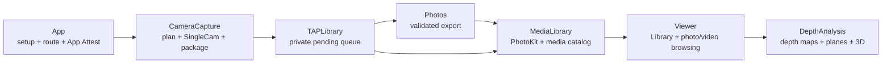

# TAPCamDemo

TAPCamDemo is an iPhone-only SingleCam app for photo-depth and TAP Video
capture. It resolves each supported field of view to one Apple-compatible RGB
source, depth source, active format, and depth-safe raw zoom; stages one reviewed
artifact in the private Pending Capture Queue; then signs, validates, exports,
and reads it back without blocking foreground capture.

## Documentation

[TAPCam documentation](https://github.com/TAP-NAP/TAPArtifactContracts/blob/main/README.md) covers the
[product requirements](https://github.com/TAP-NAP/TAPArtifactContracts/blob/main/ProductContract.md),
[App Attest backend interface](https://github.com/TAP-NAP/TAPArtifactContracts/blob/main/BackendContract.md), and
[Planes geometry design](https://github.com/TAP-NAP/TAPArtifactContracts/blob/main/PlanesTechnicalDesign.md).
The [interactive prototype](https://github.com/TAP-NAP/TAPCamPrototype/blob/main/README.md) illustrates screens
and user flows; its [manifest](https://github.com/TAP-NAP/TAPCamPrototype/blob/main/Prototype/manifest.json)
records visual revisions and fixtures.

Shared Still/Live/Video manifest, container, binding, proof, KLV, transport, and
verification conventions come only from the pinned
[TAPArtifactContracts index](https://github.com/TAP-NAP/TAPArtifactContracts/blob/ca3b223e0717242ce1016b34dc34f04ef2417936/CONTRACTS.md).
This repository implements those contracts; it does not restate their bytes.

## Runtime path



The capture transaction is:

```text
user intent
  -> pure CameraCapture/Planning plan
  -> CameraCapture/Runtime serial AVCaptureSession configuration
  -> paired AVCapturePhoto or finalized TAP Video
  -> CameraCapture/Output unsigned reviewed artifact
  -> TAPLibrary atomic pending ingest
  -> serialized App Attest proof + final-byte validation
  -> Photos save + original-resource readback validation
  -> Viewer library / photo and video browsing
  -> DepthAnalysis tools for selected depth data
```

## Implementation ownership

| Area | Owns | Start with |
| --- | --- | --- |
| `TAPCamDemo/App` | app root, setup/permission route, data-use preferences, settings, initialization gate, App Attest runtime | `TAPCamDemoApp.swift`, `StartupGateView.swift`, `Settings/DepthAnalyzerSettingsView.swift`, `AppAttestRuntime.swift` |
| `CameraCapture/Planning` | pure capability, pairing, output-intent, FOV/zoom, and manual-control plans | `CapturePlan.swift`, `CapabilityMatrix.swift` |
| `CameraCapture/Runtime` | the only `AVCaptureSession` mutation, capture requests, device writes, TAP Video recording, cached capture location | `CaptureSessionController.swift`, `CapturePipeline.swift`, `TAPVideoRecorder.swift`, `LocationProvider.swift` |
| `CameraCapture/Output` | reviewed output profiles, packaging, shared-contract encoders/writers, final signed-export gates | `CaptureOutputProfile.swift`, `EmbeddedPhotoPackager.swift`, `TAPCaptureProvenanceWriter.swift` |
| `CameraCapture/UI` | Viewfinder presentation and user intent; no capture-plan or proof ownership | `CameraView.swift`, `CameraViewModel.swift` |
| `TAPLibrary` | private pending storage, one serialized signing/export worker, retry, readback, cleanup | `TAPPendingCaptureStore.swift`, `TAPPendingCaptureProcessor.swift` |
| `MediaLibrary` | PhotoKit access and cancellation, catalog reconciliation/publication, thumbnails, resource identity | `LibraryMediaStore.swift`, `DepthAlbumItemProvider.swift`, `PhotoKitLibraryMediaFetcher.swift` |
| `Viewer` | library grid, paging/zoom, photo and video playback, Share/Delete, browsing state | `Library/DepthAlbumPickerView.swift`, `Photo/DepthAnalysisView.swift`, `Playback/TAPVideoDepthPlaybackView.swift` |
| `DepthAnalysis` | depth decoding/validation, heatmaps, planes, point clouds, registered video depth | `DepthAnalysisReader.swift`, `DepthAnalysisStageView.swift`, `Video/TAPVideoDepthPipeline.swift` |
| `Diagnostics` | capture timing and bounded video performance traces | `CaptureJobMetrics.swift`, `TAPVideoPerformanceTrace.swift` |

Viewer composes MediaLibrary resources and DepthAnalysis tools. The data and
depth layers do not own navigation, sharing, or deletion controls. Synthetic
viewer fixtures live in `Viewer/Fixtures` and compile only in Debug builds.

## Build and validation

Choose an already Booted iPhone Simulator and use its UDID:

```sh
xcrun simctl list devices booted
```

Run the three-item TAP Video structure gate:

```sh
Scripts/lint-tap-video-refactor.sh
```

Compile the shared test products:

```sh
xcodebuild build-for-testing \
  -project TAPCamDemo.xcodeproj \
  -scheme TAPCamDemo \
  -configuration Debug \
  -destination 'id=<BOOTED_IPHONE_SIMULATOR_UDID>'
```

Run deterministic unit/app-hosted tests without entering setup or camera startup:

```sh
xcodebuild test-without-building \
  -project TAPCamDemo.xcodeproj \
  -scheme TAPCamDemo \
  -configuration Debug \
  -destination 'id=<BOOTED_IPHONE_SIMULATOR_UDID>' \
  -only-testing:TAPCamDemoTests
```

Use `test` instead of `test-without-building` to build and run together. Add
`-only-testing:TAPCamDemoTests/<SuiteName>` for focused work and always verify
the executed count; a successful zero-test filter is not evidence.

UI automation is separate:

```sh
xcodebuild test \
  -project TAPCamDemo.xcodeproj \
  -scheme TAPCamDemo \
  -configuration Debug \
  -destination 'id=<BOOTED_IPHONE_SIMULATOR_UDID>' \
  -only-testing:TAPCamDemoUITests
```

A Simulator pass proves only the exercised deterministic or UI boundary. It
does not prove physical Camera/Photos/depth, App Attest hardware/backend,
iCloud, haptics, thermal behavior, native performance, or attended acceptance.
Use the relevant [acceptance section](https://github.com/TAP-NAP/TAPArtifactContracts/blob/main/Acceptance.md) and
record declared, executed, passed, failed, and skipped counts.
