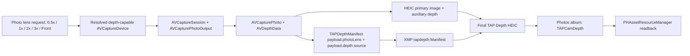

# TAP Depth HEIC v1

TAPCamDemo captures a normal HEIC photo, keeps Apple's depth auxiliary data in the file, and embeds TAP-specific capture metadata as XMP. The result is a standards-compatible photo file with a documented extension, not an app-private sidecar format.

## Data Pipeline



Key code:

| Stage | Code |
| --- | --- |
| Photo lens request and depth-capable camera selection | [CameraController.swift](TAPCamDemo/CameraController.swift#L14) |
| `AVCapturePhotoSettings` depth capture flags | [makePhotoSettings](TAPCamDemo/CameraController.swift#L210) |
| Photo delegate packaging path | [PhotoCaptureProcessor](TAPCamDemo/CameraController.swift#L335) |
| Manifest schema and constants | [TAPDepthManifest](TAPCamDemo/TAPDepthManifest.swift#L14) |
| Apple API -> manifest mapping | [TAPDepthManifestBuilder](TAPCamDemo/TAPDepthManifest.swift#L174) |
| Standard EXIF/GPS/TIFF merge | [TAPPhotoFileMetadataCustomizer](TAPCamDemo/TAPPhotoFileMetadataCustomizer.swift#L13) |
| XMP injection and readback | [TAPDepthHEICWriter.swift](TAPCamDemo/TAPDepthHEICWriter.swift#L13) |
| Photos album save and original bytes readback | [PhotoLibraryWriter.swift](TAPCamDemo/PhotoLibraryWriter.swift#L13) |

## HEIC Layout

| Location | Contents | Authority |
| --- | --- | --- |
| Primary image item | Visible HEIC image generated by `AVCapturePhoto.fileDataRepresentation(with:)` | Standard photo data |
| Auxiliary data | Apple depth or disparity attachment, readable with `kCGImageAuxiliaryDataTypeDepth` or `kCGImageAuxiliaryDataTypeDisparity` | Authoritative depth map |
| EXIF/GPS/TIFF | Generic capture date, GPS coordinates, device/lens hints, and a short pointer in EXIF `UserComment` | Compatibility mirror only |
| XMP `tapdepth:Manifest` | UTF-8 JSON manifest at namespace `urn:tapnap:tapcam:depth:1.0`, prefix `tapdepth`, path `tapdepth:Manifest` | Authoritative TAP metadata |

Do not parse TAP metadata from EXIF `UserComment`. It only contains:

```text
TAPDepthHEIC/1; metadata=xmp:tapdepth:Manifest
```

## Manifest Contract

The manifest media type is:

```text
application/vnd.tapnap.depth-manifest+json;version=1
```

The JSON root is always:

```json
{
  "schema": {},
  "payload": {},
  "proofs": []
}
```

`schema` identifies the format and XMP location. `payload` contains all unsigned capture metadata. `proofs` is reserved for future hashes and digital signatures.

Important `schema` values are defined in [TAPDepthManifest.swift](TAPCamDemo/TAPDepthManifest.swift#L25):

| Field | Value |
| --- | --- |
| `schema.id` | `urn:tapnap:tapcam:depth-manifest:v1` |
| `schema.version` | `1` |
| `schema.xmpNamespaceURI` | `urn:tapnap:tapcam:depth:1.0` |
| `schema.xmpPrefix` | `tapdepth` |
| `schema.xmpManifestPath` | `tapdepth:Manifest` |

## Field Sources

| Manifest field | Apple source |
| --- | --- |
| `payload.id` | App-generated UUID at capture processing time |
| `payload.capturedAt` | App capture timestamp, ISO-8601 UTC |
| `payload.capture.resolvedSettingsUniqueID` | `AVCapturePhoto.resolvedSettings.uniqueID` |
| `payload.capture.requestedCodec` | `AVCapturePhotoSettings(format:)` using `AVVideoCodecType.hevc` when available |
| `payload.capture.depthDataDeliveryEnabled` | `AVCapturePhotoSettings.isDepthDataDeliveryEnabled` |
| `payload.capture.embedsDepthDataInPhoto` | `AVCapturePhotoSettings.embedsDepthDataInPhoto` |
| `payload.capture.depthDataFiltered` | `AVCapturePhotoSettings.isDepthDataFiltered` |
| `payload.photoLens.*` | Requested `PhotoLensOption`, resolved `AVCaptureDevice`, and `AVCaptureDevice.activePrimaryConstituent` |
| `payload.camera.*` | `AVCaptureDevice`, `activeFormat`, `activeDepthDataFormat`, and `activePrimaryConstituent` |
| `payload.camera.lensPosition` | `AVCaptureDevice.lensPosition`, a 0...1 lens actuator position, not physical focus distance |
| `payload.camera.minimumFocusDistanceMillimeters` | `AVCaptureDevice.minimumFocusDistance` |
| `payload.depth.*` | `AVCapturePhoto.depthData` / `AVDepthData` |
| `payload.depth.source.*` | `AVCaptureDevice.DeviceType` classification from the resolved capture device |
| `payload.depth.cameraCalibration.*` | `AVDepthData.cameraCalibrationData` |
| `payload.location.*` | `CLLocationManager.requestLocation()` / `CLLocation`; nullable when permission or timeout fails |
| `payload.software.*` | `Bundle.main` info dictionary |

The depth pixels themselves are not duplicated in JSON. They remain in the HEIC auxiliary depth/disparity attachment and can be reconstructed as `AVDepthData`.

`payload.photoLens` records user intent and resolution separately. `requestedLensID`, `requestedDisplayName`, and `requestedZoomFactor` describe the UI choice. `resolvedCaptureDeviceType`, `resolvedCaptureDeviceName`, and resolved active primary constituent fields describe what AVFoundation was using when the manifest was built. On virtual cameras, `activePrimaryConstituent` may change with zoom, focus, exposure, and system policy, so third-party tools should treat the requested lens as intent and the resolved fields as the observable capture state.

`payload.depth.source` intentionally avoids guessing private Apple fusion weights:

| Capture device type | `sensingMethod` | `lidarParticipation` |
| --- | --- | --- |
| `builtInLiDARDepthCamera` | `lidarDepthCamera` | `explicit` |
| `builtInTrueDepthCamera` | `trueDepthCamera` | `notApplicable` |
| `builtInTripleCamera`, `builtInDualWideCamera`, `builtInDualCamera` | `multiCameraStereoOrComputational` | `notAsserted` |
| `builtInWideAngleCamera`, `builtInUltraWideCamera`, `builtInTelephotoCamera` | `singleCameraComputationalOrUnknown` | `notAsserted` |

## Writing Rules

1. Convert the UI lens request (`0.5x`, `1x`, `2x`, `3x`, or front) into a `PhotoLensOption`.
2. Resolve that option to a depth-capable `AVCaptureDevice`; prefer broad virtual rear cameras before LiDAR-only or single-camera fallbacks.
3. Configure `activeFormat`, `activeDepthDataFormat`, and `videoZoomFactor` on the resolved device.
4. Configure `AVCapturePhotoOutput.isDepthDataDeliveryEnabled = true` before starting the session.
5. Capture with `AVCapturePhotoSettings.isDepthDataDeliveryEnabled = true` and `embedsDepthDataInPhoto = true`.
6. Use `AVCapturePhoto.fileDataRepresentation(with:)` so Apple packages the primary image and depth attachment.
7. Merge standard EXIF/GPS/TIFF fields with `AVCapturePhotoFileDataRepresentationCustomizer`.
8. Inject `tapdepth:Manifest` with ImageIO `CGImageMetadataRegisterNamespaceForPrefix`, `CGImageMetadataSetValueWithPath`, and `CGImageDestinationCopyImageSource`.
9. Verify the final bytes can read back the manifest before saving to Photos.

## Reading From a HEIC File

Third-party apps do not need TAPCamDemo to parse the file. Use ImageIO for XMP and auxiliary depth:

```swift
import AVFoundation
import ImageIO

let source = CGImageSourceCreateWithURL(fileURL as CFURL, nil)!
let metadata = CGImageSourceCopyMetadataAtIndex(source, 0, nil)!
let manifestJSON = CGImageMetadataCopyStringValueWithPath(
    metadata,
    nil,
    "tapdepth:Manifest" as CFString
)! as String

let depthInfo =
    CGImageSourceCopyAuxiliaryDataInfoAtIndex(source, 0, kCGImageAuxiliaryDataTypeDepth)
    ?? CGImageSourceCopyAuxiliaryDataInfoAtIndex(source, 0, kCGImageAuxiliaryDataTypeDisparity)

let depthData = try depthInfo.map { try AVDepthData(fromDictionaryRepresentation: $0 as! [AnyHashable: Any]) }
```

Inside this app, the same logic is wrapped by [TAPDepthHEICReader](TAPCamDemo/TAPDepthHEICWriter.swift#L83).

## Reading From Photos

Photos may provide edited derivatives or thumbnails. For verification, always request the original `.photo` resource bytes:

```swift
import Photos

let resource = PHAssetResource.assetResources(for: asset).first { $0.type == .photo }!
var data = Data()

PHAssetResourceManager.default().requestData(
    for: resource,
    options: nil,
    dataReceivedHandler: { data.append($0) },
    completionHandler: { error in
        // Parse data with ImageIO after completion.
    }
)
```

The app helper is [PhotoLibraryWriter.originalPhotoData(for:)](TAPCamDemo/PhotoLibraryWriter.swift#L27).

## Hash And Signature Plan

`proofs` is intentionally outside `payload`. Future signing should:

1. Canonicalize only `payload`, not `schema` or `proofs`.
2. Use RFC 8785 JSON Canonicalization Scheme before hashing/signing.
3. Store each proof as an entry in `proofs[]` with `type`, `algorithm`, `keyID`, `createdAt`, and `value`.
4. Avoid signing EXIF/GPS mirror fields as the authoritative business record.
5. For full file-level authenticity, prefer C2PA/Content Credentials for the HEIF/BMFF container and let TAP manifest carry domain-specific capture claims.

`TAPDepthManifestEncoder.payloadDataForFutureProofing` currently provides a stable sorted-key JSON payload for tests and plumbing, but it is not a complete RFC 8785 implementation. Replace that encoder before shipping cryptographic verification.

## Validation

The current implementation was build-checked with:

```sh
xcodebuild -scheme TAPCamDemo -destination 'generic/platform=iOS' -derivedDataPath /tmp/TAPCamDemoDerivedData CODE_SIGNING_ALLOWED=NO build
```

Depth capture still requires a physical iPhone/iPad with a depth-capable camera. The simulator cannot validate `AVCapturePhoto.depthData`.
