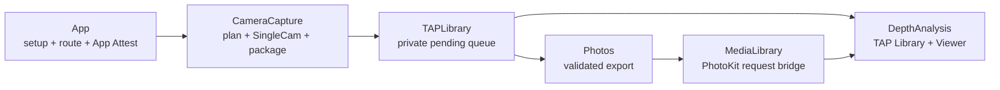

# TAPCamDemo

TAPCamDemo is an iPhone-only SingleCam app for photo-depth and TAP Video
capture. It resolves each supported field of view to one Apple-compatible RGB
source, depth source, active format, and depth-safe raw zoom; stages one reviewed
artifact in the private Pending Capture Queue; then signs, validates, exports,
and reads it back without blocking foreground capture.

## Read first

1. [AGENTS.md](AGENTS.md) defines the repository workflow and retention rules.
2. [ProductContract.md](Docs/ProductContract.md) is the single current product,
   lifecycle, operational, security, privacy, and UI-workflow authority.
3. The sibling [Project Board](../TAPCamKanban/ProjectBoard.md) owns Task state.
4. The sibling [prototype repository](../TAPCamPrototype/README.md) and
   `Prototype/manifest.json` own approved visual intent and prototype evidence.
5. `Docs/Acceptance/TAP-0040` through `TAP-0049` retain the open executable
   device/visual procedures. [BackendContract.md](Docs/AppAttest/BackendContract.md)
   owns the App Attest server boundary, and
   [PlanesTechnicalDesign.md](TAPCamDemo/DepthAnalysis/Documentation/PlanesTechnicalDesign.md)
   explains the one retained geometry algorithm.

Shared Still/Live/Video manifest, container, binding, proof, KLV, transport, and
verification conventions come only from the pinned
[TAPArtifactContracts index](https://github.com/TAP-NAP/TAPArtifactContracts/blob/ca3b223e0717242ce1016b34dc34f04ef2417936/CONTRACTS.md).
This repository implements those contracts; it does not restate their bytes.

## Runtime path



The capture transaction is:

```text
user intent
  -> pure CameraCapture/Planning plan
  -> CameraCapture/Runtime serial AVCaptureSession configuration
  -> paired AVCapturePhoto or finalized TAP Video
  -> CameraCapture/Output unsigned reviewed artifact
  -> TAPLibrary atomic pending ingest
  -> serialized App Attest proof + final-byte validation
  -> Photos save + original-resource readback validation
  -> DepthAnalysis TAP Library / Viewer
```

## Implementation ownership

| Area | Owns | Start with |
| --- | --- | --- |
| `TAPCamDemo/App` | app root, setup/permission route, initialization gate, App Attest runtime, diagnostics | `TAPCamDemoApp.swift`, `StartupGateView.swift`, `AppAttestRuntime.swift` |
| `CameraCapture/Planning` | pure capability, pairing, output-intent, FOV/zoom, and manual-control plans | `CaptureSourcePlan.swift`, `CapabilityMatrix.swift` |
| `CameraCapture/Runtime` | the only `AVCaptureSession` mutation, capture requests, device writes, TAP Video recording | `CaptureSessionController.swift`, `CapturePipeline.swift`, `TAPVideoRecorder.swift` |
| `CameraCapture/Output` | reviewed output profiles, packaging, shared-contract encoders/writers, final signed-export gates | `CaptureOutputProfile.swift`, `EmbeddedPhotoPackager.swift`, `TAPCaptureProvenanceWriter.swift` |
| `CameraCapture/UI` | Viewfinder presentation and user intent; no capture-plan or proof ownership | `CameraView.swift`, `CameraViewModel.swift` |
| `TAPLibrary` | private pending storage, one serialized signing/export worker, retry, readback, cleanup | `TAPPendingCaptureStore.swift`, `TAPPendingCaptureProcessor.swift` |
| `MediaLibrary` | exactly-once PhotoKit callback/request bridging and identity/order catalog publication | `LibraryMediaFetching.swift`, `PhotoKitRequestLifecycle.swift`, `LibraryMediaStore.swift` |
| `DepthAnalysis` | user-facing TAP Library, Viewer, local Share preparation, photo geometry, bounded TAP Video playback | `DepthAnalysisView.swift`, `TAPVideoDepthPlaybackView.swift` |

## Build and validation

Choose an already Booted iPhone Simulator and use its UDID:

```sh
xcrun simctl list devices booted
```

Run the three-item TAP Video structure gate:

```sh
Scripts/lint-tap-video-refactor.sh
```

Compile the shared test products:

```sh
xcodebuild build-for-testing \
  -project TAPCamDemo.xcodeproj \
  -scheme TAPCamDemo \
  -configuration Debug \
  -destination 'id=<BOOTED_IPHONE_SIMULATOR_UDID>'
```

Run deterministic unit/app-hosted tests without entering setup or camera startup:

```sh
xcodebuild test-without-building \
  -project TAPCamDemo.xcodeproj \
  -scheme TAPCamDemo \
  -configuration Debug \
  -destination 'id=<BOOTED_IPHONE_SIMULATOR_UDID>' \
  -only-testing:TAPCamDemoTests
```

Use `test` instead of `test-without-building` to build and run together. Add
`-only-testing:TAPCamDemoTests/<SuiteName>` for focused work and always verify
the executed count; a successful zero-test filter is not evidence.

UI automation is separate:

```sh
xcodebuild test \
  -project TAPCamDemo.xcodeproj \
  -scheme TAPCamDemo \
  -configuration Debug \
  -destination 'id=<BOOTED_IPHONE_SIMULATOR_UDID>' \
  -only-testing:TAPCamDemoUITests
```

A Simulator pass proves only the exercised deterministic or UI boundary. It
does not prove physical Camera/Photos/depth, App Attest hardware/backend,
iCloud, haptics, thermal behavior, native performance, or attended acceptance.
Use the matching retained `Docs/Acceptance/TAP-xxxx-*.md` procedure and record
declared, executed, passed, failed, and skipped counts.
