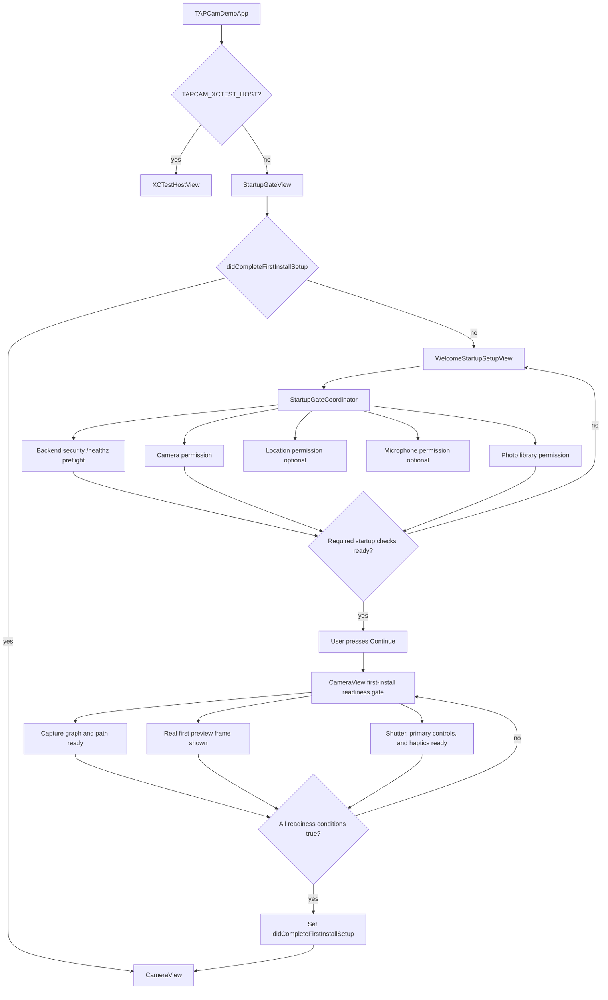
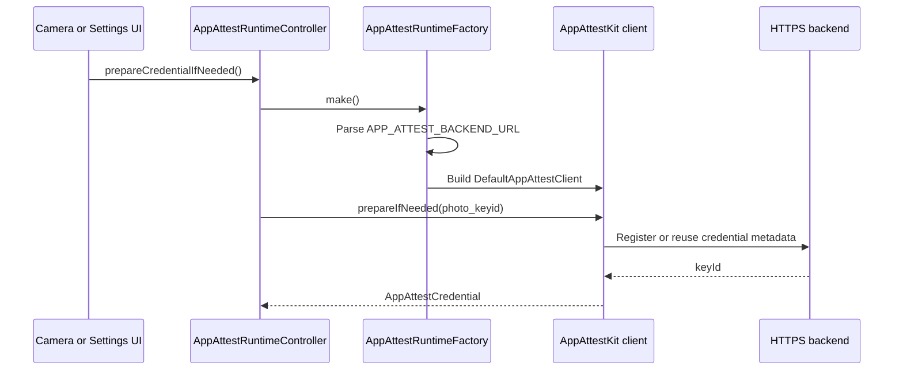

# App Module

`TAPCamDemo/App` owns process-level app wiring: app entry, first-install
startup gating, App Attest runtime construction, operation timeouts, and
shared diagnostics. It deliberately does not configure cameras, package HEIC
bytes, or run the pending queue.

[ProductContract.md](../../Docs/ProductContract.md) owns the product behavior.
This README owns only the App module's implementation responsibilities; task
status and known alignment work remain in
[ProjectBoard.md](../../Docs/ProjectBoard.md).

## Code Map

| Responsibility | Code |
| --- | --- |
| SwiftUI app entry and XCTest host bypass | [TAPCamDemoApp.swift](TAPCamDemoApp.swift) |
| First-install gate | [StartupGateView.swift](StartupGateView.swift) |
| First-launch setup UI | [WelcomeStartupSetupView.swift](WelcomeStartupSetupView.swift) |
| First camera-interactive readiness state and blocking surface | [CameraInitialReadinessGate.swift](../CameraCapture/UI/CameraInitialReadinessGate.swift), [CameraView.swift](../CameraCapture/UI/CameraView.swift) |
| Required versus optional startup policy | [StartupGatePolicy.swift](StartupGatePolicy.swift) |
| Backend security preflight retry and timeout policy | [StartupSecurityPreflightPolicy.swift](StartupSecurityPreflightPolicy.swift) |
| Backend security preflight execution | [StartupBackendSecurityPreflight.swift](StartupBackendSecurityPreflight.swift) |
| Backend security preflight, camera, photo, optional location, and optional microphone gate state | [StartupGateCoordinator.swift](StartupGateCoordinator.swift) |
| App Attest runtime factory and diagnostics | [AppAttestRuntime.swift](AppAttestRuntime.swift) |
| App Attest credential preparation state | [AppAttestRuntimeController.swift](AppAttestRuntimeController.swift) |
| Public-safe App Attest UI status and key ID presentation | [AppAttestCredentialPresentation.swift](AppAttestCredentialPresentation.swift) |
| Async operation timeout helper | [AppAttestOperationTimeout.swift](AppAttestOperationTimeout.swift) |
| App Attest entitlement configuration | [TAPCamDemo.entitlements](../../TAPCamDemo.entitlements) |

## Startup Flow

`StartupGatePolicy` is the pure required/optional entry: Network preflight,
Camera, and Photos are required; Location and Microphone are optional and may
be skipped. The Network check is product security policy, not an iOS permission
prompt. The setup UI calls it Network Access while code keeps the
`securityPreflight` name.

`StartupGateCoordinator` owns passive status reads and the operations started
by each setup row. It does not own the camera-readiness gate.
`StartupSecurityPreflightPolicy` owns the bounded retry interval, deadline, and
wall-clock timeout; `StartupBackendSecurityPreflight` performs the configured
HTTPS `/healthz` requests. One explicit Network action starts one bounded
attempt sequence. Retryable failures may retry after the policy interval until
the sequence times out. After timeout, only the setup page's explicit Retry
action may begin another sequence; page appearance, foreground return, and
status refresh must not do so.

After the required rows are complete, `Continue` creates `CameraView` with a
first-install `CameraInitialReadinessGate`. `StartupGateView` persists the
completion marker only after the capture graph and required path are ready, a
real first preview frame is visible, the shutter and primary controls can
safely respond, and first-interaction haptics are prepared. Session
configuration by itself is not enough. The blocking readiness surface remains
in place and owns Retry/Open Settings recovery until the gate succeeds.

App Attest credential warmup and Pending Capture Queue retry begin after camera
entry as independent background work. They do not participate in the first
interactive-frame gate and are not the required Network preflight.

## Explicit Setup Actions

Every setup operation belongs to its own visible action:

- Camera, Photos, Location, and Microphone may show a system prompt only from
  the corresponding row's explicit **Allow** button.
- Network preflight may begin only from the Network row's explicit action or
  its explicit Retry action after a timed-out sequence.
- Page appearance, `Continue`, scene foregrounding, returning from Settings,
  unrelated retry work, and background maintenance may refresh passive status
  only. They must not request permission or start a Network attempt.
- Before a row's explicit action, no protected media fetch, observer,
  backfill, write, capture warmup, or similar work may activate in a way that
  can request that permission. Maintenance may run only when the already-read
  authorization state permits it.
- A denied or restricted result is handled by that row or, after setup, by the
  affected feature. It is never requested repeatedly in the background.

OS authorization and the app's data-use preference are separate. Location
metadata and Live Photo/TAP Video audio are used only when both layers permit
them. The first successful Microphone authorization may enable data use only
when the user has never chosen; a saved opt-out remains authoritative.

## Completion Marker And Later Launches

The persisted key remains
`TAPCamDemo.StartupGate.didCompleteFirstInstallPermissions` for compatibility,
but its product meaning is `didCompleteFirstInstallSetup`: the user completed
the setup rows and the first camera-readiness gate once.

- Returning users skip the first-install page and enter the camera route.
- The marker is not proof that permissions remain granted and is not a
  recurring authorization gate.
- A later permission change is handled by the affected capture, export, or
  data-use feature. It does not send the user through first-install setup
  again.

## App Attest Runtime Flow

Debug builds use `https://dev.tapnap.net` and development App Attest metadata.
Release and TestFlight builds use `https://www.tapnap.net` and production App
Attest metadata.
The app target also sets `APP_ATTEST_ENVIRONMENT` to `development` for Debug and
`production` for Release, then injects that value into
[`TAPCamDemo.entitlements`](../../TAPCamDemo.entitlements).

## Boundaries

- App startup can decide whether the user may enter the camera surface.
- App startup must not pre-create `CameraViewModel` or camera runtime objects.
- `StartupGatePolicy` is the source of truth for required versus optional
  first-launch checks. Security preflight, camera, and photo library remain
  required; location and microphone remain optional.
- `StartupGateView` owns the transition from setup to first camera readiness
  and writes the completion marker only from the readiness callback.
- `CameraInitialReadinessGate` and `CameraView` own camera-interactive
  readiness; App code must not replace that gate with a timer or a
  configuration-completed flag.
- Authorization refresh is passive. Only explicit setup-row actions may call
  the request/preflight methods described above.
- `APP_ATTEST_BACKEND_URL` must be an HTTPS base URL with a domain host.
- Shared diagnostics categories are declared in `TAPDiagnostics`: `AppAttest`,
  `PendingCapture`, `SecurityPreflight`, and `PhotoLibrary`. Public error
  summaries must be safe for OSLog `.public` interpolation.
- `PhotoIntegrityReadiness` is the Release presentation boundary for protection
  readiness. Release Settings exposes only `Not Ready`, `Preparing`, `Ready`,
  or `Preparation Failed`; it does not expose App Attest terminology or key
  identifiers. Runtime code may keep the real key id for readiness checks, and
  Debug Settings may use the redacted presentation with generic failure text
  instead of raw localized errors.
- `AppAttestBackendPresentation` is the public-safe backend summary boundary.
  Runtime code keeps the real backend URL for requests and credential health
  tokens, but Settings UI and public OSLog lines use `backendPublicSummary`.
- App Attest credential names and key ids are logged as private. `photo_keyid`
  is currently fixed and non-PII, but future credential names may encode user,
  tenant, install, or session identity.
- `CODE_SIGN_ENTITLEMENTS` must point at `TAPCamDemo.entitlements` so App
  Attest setup is visible in the checkout.
- Backend security preflight is bounded by a tested retry/timeout policy so
  first-launch setup cannot become a multi-minute startup block.
- Backend preflight URL logs stay public only because
  `APP_ATTEST_BACKEND_URL` parsing rejects localhost, bare IP addresses,
  endpoint paths, query strings, and fragments.
- Tests use `TAPCAM_XCTEST_HOST=1` to avoid entering permission and camera
  startup flows in app-hosted unit tests.
- UI smoke tests that intentionally exercise the real camera app set
  `TAPCAM_UI_TEST_REAL_APP=1`. That override keeps app-hosted unit tests fast
  while allowing `TAPCamDemoUITests` to launch `StartupGateView` and the real
  capture UI.

## Related Documents

- [ProductContract.md](../../Docs/ProductContract.md)
- [ProjectBoard.md](../../Docs/ProjectBoard.md)
- [Docs/AppAttest/README.md](../../Docs/AppAttest/README.md)
- [TAPCamDemoTests/README.md](../../TAPCamDemoTests/README.md)
