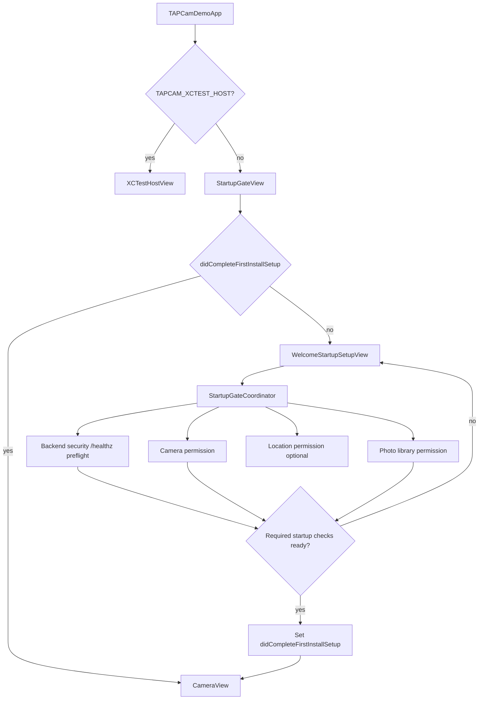
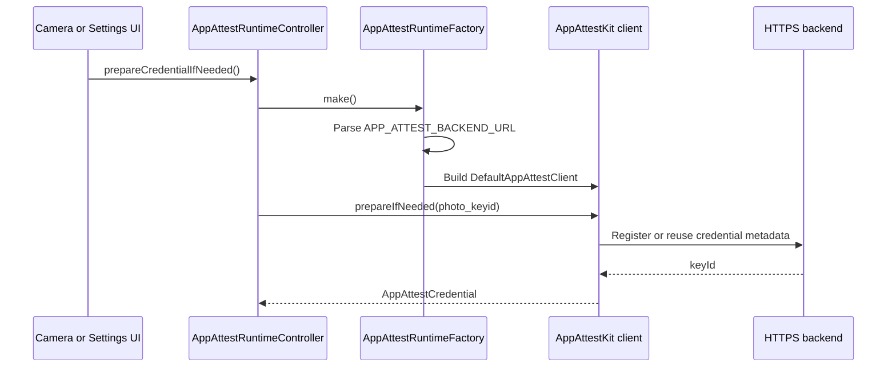

# App Module

`TAPCamDemo/App` owns process-level app wiring: app entry, first-install
startup gating, App Attest runtime construction, operation timeouts, and
shared diagnostics. It deliberately does not configure cameras, package HEIC
bytes, or run the pending queue.

## Code Map

| Responsibility | Code |
| --- | --- |
| SwiftUI app entry and XCTest host bypass | [TAPCamDemoApp.swift](TAPCamDemoApp.swift) |
| First-install gate | [StartupGateView.swift](StartupGateView.swift) |
| First-launch setup UI | [WelcomeStartupSetupView.swift](WelcomeStartupSetupView.swift) |
| Required versus optional startup policy | [StartupGatePolicy.swift](StartupGatePolicy.swift) |
| Backend security preflight retry and timeout policy | [StartupSecurityPreflightPolicy.swift](StartupSecurityPreflightPolicy.swift) |
| Backend security preflight execution | [StartupBackendSecurityPreflight.swift](StartupBackendSecurityPreflight.swift) |
| Backend security preflight, camera, photo, and optional location gate state | [StartupGateCoordinator.swift](StartupGateCoordinator.swift) |
| App Attest runtime factory and diagnostics | [AppAttestRuntime.swift](AppAttestRuntime.swift) |
| App Attest credential preparation state | [AppAttestRuntimeController.swift](AppAttestRuntimeController.swift) |
| Public-safe App Attest UI status and key ID presentation | [AppAttestCredentialPresentation.swift](AppAttestCredentialPresentation.swift) |
| Async operation timeout helper | [AppAttestOperationTimeout.swift](AppAttestOperationTimeout.swift) |
| App Attest entitlement configuration | [TAPCamDemo.entitlements](../../TAPCamDemo.entitlements) |

## Startup Flow

The startup gate marks first-install setup complete when the required backend
security preflight, camera access, and photo library access are available. The
backend check is product security policy, not an iOS permission prompt.
`StartupGatePolicy` is the pure required/optional gate entry.
`StartupSecurityPreflightPolicy` is the pure retry/timeout decision boundary
for backend security preflight. `StartupBackendSecurityPreflight` performs the
configured HTTPS `/healthz` check using that policy. `StartupGateCoordinator`
reads and requests the actual OS statuses and coordinates the backend preflight
result. Camera warmup, pending-capture signing credential warmup, and
pending-capture retry happen after entering
[CameraView](../CameraCapture/UI/CameraView.swift).

## App Attest Runtime Flow

Debug builds use `https://dev.tapnap.net` and development App Attest metadata.
Release and TestFlight builds use `https://www.tapnap.net` and production App
Attest metadata.
The app target also sets `APP_ATTEST_ENVIRONMENT` to `development` for Debug and
`production` for Release, then injects that value into
[`TAPCamDemo.entitlements`](../../TAPCamDemo.entitlements).

## Boundaries

- App startup can decide whether the user may enter the camera surface.
- App startup must not pre-create `CameraViewModel` or camera runtime objects.
- `StartupGatePolicy` is the source of truth for required versus optional
  first-launch checks. Security preflight, camera, and photo library remain
  required; location remains optional.
- `APP_ATTEST_BACKEND_URL` must be an HTTPS base URL with a domain host.
- Shared diagnostics categories are declared in `TAPDiagnostics`: `AppAttest`,
  `PendingCapture`, `SecurityPreflight`, and `PhotoLibrary`. Public error
  summaries must be safe for OSLog `.public` interpolation.
- `AppAttestCredentialPresentation` is the user-visible presentation boundary
  for App Attest credential status and key identifiers. Runtime code may keep
  the real key id for readiness checks, but Settings UI must use the redacted
  presentation and generic failure text instead of raw localized errors.
- `AppAttestBackendPresentation` is the public-safe backend summary boundary.
  Runtime code keeps the real backend URL for requests and credential health
  tokens, but Settings UI and public OSLog lines use `backendPublicSummary`.
- App Attest credential names and key ids are logged as private. `photo_keyid`
  is currently fixed and non-PII, but future credential names may encode user,
  tenant, install, or session identity.
- `CODE_SIGN_ENTITLEMENTS` must point at `TAPCamDemo.entitlements` so App
  Attest setup is visible in the checkout.
- Backend security preflight is bounded by a tested retry/timeout policy so
  first-launch setup cannot become a multi-minute startup block.
- Backend preflight URL logs stay public only because
  `APP_ATTEST_BACKEND_URL` parsing rejects localhost, bare IP addresses,
  endpoint paths, query strings, and fragments.
- Tests use `TAPCAM_XCTEST_HOST=1` to avoid entering permission and camera
  startup flows in app-hosted unit tests.
- UI smoke tests that intentionally exercise the real camera app set
  `TAPCAM_UI_TEST_REAL_APP=1`. That override keeps app-hosted unit tests fast
  while allowing `TAPCamDemoUITests` to launch `StartupGateView` and the real
  capture UI.

## Related Documents

- [FirstLaunch.md](../../Docs/Startup/FirstLaunch.md)
- [Docs/AppAttest/README.md](../../Docs/AppAttest/README.md)
- [TAPCamDemoTests/README.md](../../TAPCamDemoTests/README.md)
