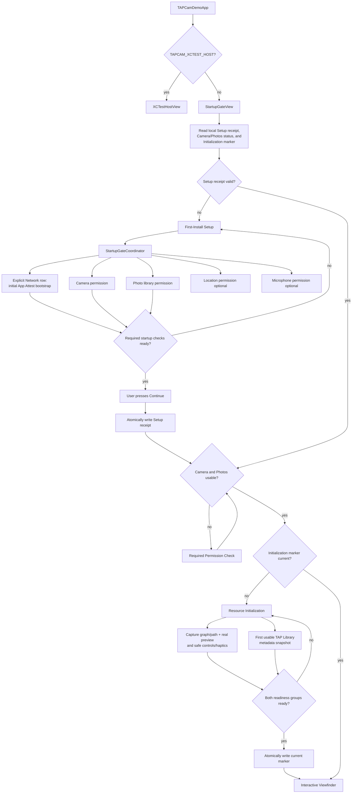
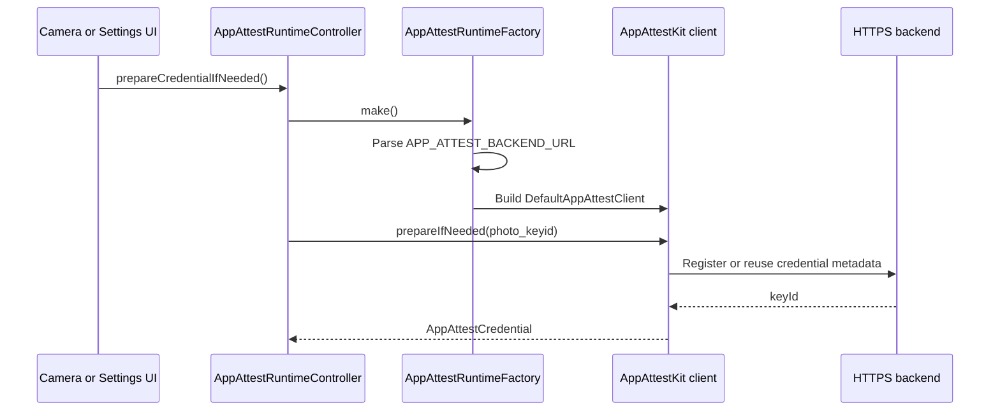

# App Module

`TAPCamDemo/App` owns process-level app wiring: app entry, first-install
startup gating, App Attest runtime construction, operation timeouts, and
shared diagnostics. It deliberately does not configure cameras, package HEIC
bytes, or run the pending queue.

[ProductContract.md](../../Docs/ProductContract.md) owns the product behavior.
This README owns only the App module's implementation responsibilities; task
status and known alignment work remain in
[ProjectBoard.md](../../Docs/ProjectBoard.md).

## Code Map

| Responsibility | Code |
| --- | --- |
| SwiftUI app entry and XCTest host bypass | [TAPCamDemoApp.swift](TAPCamDemoApp.swift) |
| First-install gate | [StartupGateView.swift](StartupGateView.swift) |
| First-Install Setup UI | [WelcomeStartupSetupView.swift](WelcomeStartupSetupView.swift) |
| First camera-interactive readiness state and blocking surface | [CameraInitialReadinessGate.swift](../CameraCapture/UI/CameraInitialReadinessGate.swift), [CameraView.swift](../CameraCapture/UI/CameraView.swift) |
| Required versus optional startup policy | [StartupGatePolicy.swift](StartupGatePolicy.swift) |
| Legacy Network-row retry and timeout policy; target App Attest bootstrap alignment is `TAP-0008` | [StartupSecurityPreflightPolicy.swift](StartupSecurityPreflightPolicy.swift) |
| Legacy `/healthz` reachability execution; not the target completion condition | [StartupBackendSecurityPreflight.swift](StartupBackendSecurityPreflight.swift) |
| Current Network, camera, photo, optional location, and optional microphone row state | [StartupGateCoordinator.swift](StartupGateCoordinator.swift) |
| App Attest runtime factory and diagnostics | [AppAttestRuntime.swift](AppAttestRuntime.swift) |
| App Attest credential preparation state | [AppAttestRuntimeController.swift](AppAttestRuntimeController.swift) |
| Public-safe App Attest UI status and key ID presentation | [AppAttestCredentialPresentation.swift](AppAttestCredentialPresentation.swift) |
| Async operation timeout helper | [AppAttestOperationTimeout.swift](AppAttestOperationTimeout.swift) |
| App Attest entitlement configuration | [TAPCamDemo.entitlements](../../TAPCamDemo.entitlements) |

## Startup Flow

This diagram is the target contract consumed by `TAP-0008` and `TAP-0009`.
Current main still has one legacy Boolean, a generic `/healthz` Network
preflight, no root Required Permission Check route, and no independent
versioned initialization marker. Those are implementation gaps rather than a
different product contract.

`StartupGatePolicy` remains the required/optional entry: initial App Attest,
Camera, and Photos are required; Location and Microphone are optional and may
be skipped. The setup UI may continue to present the first operation as
Network Access, but successful generic reachability is not completion. The row
completes only after the initial App Attest registration/verification succeeds.

`StartupGateCoordinator` owns passive status reads and the operations started
by each setup row. It does not own the camera-readiness gate.
`StartupSecurityPreflightPolicy` owns the bounded retry interval, deadline, and
wall-clock timeout used by the current Network row. `TAP-0008` must align the
operation itself with App Attest bootstrap rather than treating
`StartupBackendSecurityPreflight` `/healthz` success as the required result.
One explicit Network action starts one bounded sequence. After timeout, only
the setup page's explicit Retry action may begin another sequence; page
appearance, foreground return, and status refresh must not do so.

After the required rows are complete, Continue atomically writes the structured
Setup receipt. Resource Initialization owns a different marker and stays
visible until camera-interactive readiness and the first usable TAP Library
metadata snapshot are both ready. Session configuration by itself is not
enough. Resource Initialization has no product Failed, Retry, timeout, skip, or
degraded branch.

Later App Attest health/recovery and Pending Capture Queue retry begin after
camera entry as independent background work. They do not participate in the
first interactive-frame gate and do not turn a normal launch or local capture
into a network requirement.

## Explicit Setup Actions

Every setup operation belongs to its own visible action:

- Camera, Photos, Location, and Microphone may show a system prompt only from
  the corresponding row's explicit **Allow** button.
- Initial App Attest bootstrap may begin only from the Network row's explicit
  action or its explicit Retry action after a timed-out sequence.
- Page appearance, `Continue`, scene foregrounding, returning from Settings,
  unrelated retry work, and background maintenance may refresh passive status
  only. They must not request permission or start a Network attempt.
- Before a row's explicit action, no protected media fetch, observer,
  backfill, write, capture warmup, or similar work may activate in a way that
  can request that permission. Maintenance may run only when the already-read
  authorization state permits it.
- A denied or restricted result is handled by that row or, after setup, by the
  affected feature. It is never requested repeatedly in the background.

OS authorization and the app's data-use preference are separate. Location
metadata and Live Photo/TAP Video audio are used only when both layers permit
them. The first successful Microphone authorization may enable data use only
when the user has never chosen; a saved opt-out remains authoritative.

## Completion Marker And Later Launches

Current main persists
`TAPCamDemo.StartupGate.didCompleteFirstInstallPermissions`, but the target
model must separate:

- a structured Setup receipt, written after initial App Attest, Camera, and
  Photos are complete and Continue is accepted; and
- a versioned Resource Initialization marker, written only after both readiness
  groups succeed.

The Setup receipt includes a local binding to the initial App Attest credential
for the installation generation. It can be checked locally without making a
network request on every launch. A restored receipt without that local
credential binding returns to Setup recovery. A later backend/credential
health failure does not silently erase Setup or block Viewfinder; it is handled
by post-entry App Attest and Pending Capture recovery.

Returning users still re-read Camera and Photos. Revoking either enters
Required Permission Check and automatically re-evaluates the route after the
targeted status refresh. It does not replay first-install Setup. Location and
Microphone remain optional feature-context permissions.

## Post-Setup App Attest Runtime Flow

The required first-install branch is separate: the Setup Network row explicitly
starts the bounded App Attest registration/verification operation and gates
Continue until it succeeds. The sequence below begins only after Setup has a
valid receipt; it describes deferred health/recovery from Camera or Settings and
does not redefine the Network row or ordinary camera-entry routing.

Debug builds use `https://dev.tapnap.net` and development App Attest metadata.
Release and TestFlight builds use `https://www.tapnap.net` and production App
Attest metadata.
The app target also sets `APP_ATTEST_ENVIRONMENT` to `development` for Debug and
`production` for Release, then injects that value into
[`TAPCamDemo.entitlements`](../../TAPCamDemo.entitlements).

## Boundaries

- App startup can decide whether the user may enter the camera surface.
- App startup must not pre-create `CameraViewModel` or camera runtime objects.
- `StartupGatePolicy` is the source of truth for required versus optional
  First-Install Setup checks. Initial App Attest, camera, and photo library remain
  required; location and microphone remain optional. Current generic
  `/healthz` completion is an implementation gap, not the target requirement.
- `StartupGateView` will own the route reducer and separate Setup receipt from
  the Resource Initialization marker; current main has not implemented that
  separation.
- `CameraInitialReadinessGate` and `CameraView` own camera-interactive
  readiness; App code must not replace that gate with a timer or a
  configuration-completed flag.
- Authorization refresh is passive. Only explicit setup-row actions may call
  the permission/bootstrap methods described above. Required Permission Check
  may perform only a targeted passive refresh after its explicit system
  boundary.
- `APP_ATTEST_BACKEND_URL` must be an HTTPS base URL with a domain host.
- Shared diagnostics categories are declared in `TAPDiagnostics`: `AppAttest`,
  `PendingCapture`, `SecurityPreflight`, and `PhotoLibrary`. Public error
  summaries must be safe for OSLog `.public` interpolation.
- `PhotoIntegrityReadiness` is the Release presentation boundary for protection
  readiness. Release Settings exposes only `Not Ready`, `Preparing`, `Ready`,
  or `Preparation Failed`; it does not expose App Attest terminology or key
  identifiers. Runtime code may keep the real key id for readiness checks, and
  Debug Settings may use the redacted presentation with generic failure text
  instead of raw localized errors.
- `AppAttestBackendPresentation` is the public-safe backend summary boundary.
  Runtime code keeps the real backend URL for requests and credential health
  tokens, but Settings UI and public OSLog lines use `backendPublicSummary`.
- App Attest credential names and key ids are logged as private. `photo_keyid`
  is currently fixed and non-PII, but future credential names may encode user,
  tenant, install, or session identity.
- `CODE_SIGN_ENTITLEMENTS` must point at `TAPCamDemo.entitlements` so App
  Attest setup is visible in the checkout.
- First-install App Attest bootstrap is bounded by a tested retry/timeout policy
  so a single explicit Network action cannot become a multi-minute unbounded
  attempt sequence.
- Backend preflight URL logs stay public only because
  `APP_ATTEST_BACKEND_URL` parsing rejects localhost, bare IP addresses,
  endpoint paths, query strings, and fragments.
- Tests use `TAPCAM_XCTEST_HOST=1` to avoid entering permission and camera
  startup flows in app-hosted unit tests.
- UI smoke tests that intentionally exercise the real camera app set
  `TAPCAM_UI_TEST_REAL_APP=1`. That override keeps app-hosted unit tests fast
  while allowing `TAPCamDemoUITests` to launch `StartupGateView` and the real
  capture UI.

## Related Documents

- [ProductContract.md](../../Docs/ProductContract.md)
- [StartupLifecycleContract.md](../../Docs/StartupLifecycleContract.md)
- [ProjectBoard.md](../../Docs/ProjectBoard.md)
- [Docs/AppAttest/README.md](../../Docs/AppAttest/README.md)
- [TAPCamDemoTests/README.md](../../TAPCamDemoTests/README.md)
