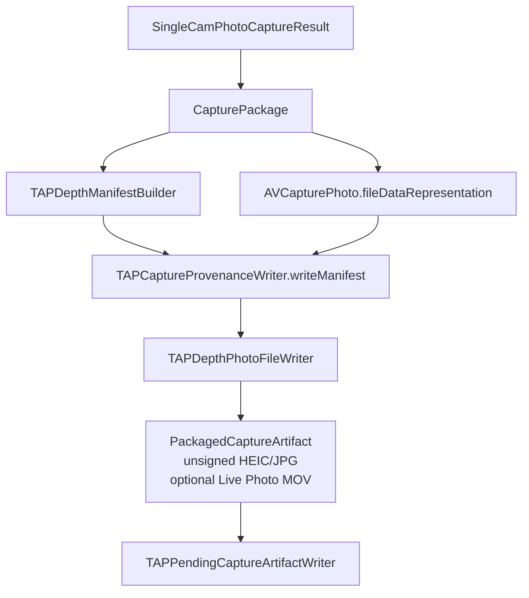

# CameraCapture Output

Shared Still/Live/Video manifest, binding/proof, and container conventions are
owned by the documentation-only
[TAPArtifactContracts](https://github.com/TAP-NAP/TAPArtifactContracts)
repository. This module keeps the Swift producer implementation and local
orchestration; its types must implement, not redefine, that shared contract.

`TAPDepthManifestEncoder`, `TAPVideoManifestEncoder`, and
`JSONEncoder.tapCaptureCanonical` are the producer-encoding mapping for
[TAP capture canonical JSON](https://github.com/TAP-NAP/TAPArtifactContracts/blob/ca3b223e0717242ce1016b34dc34f04ef2417936/bindings/capture-binding-and-proof-v1.md#tap-capture-canonical-json)
with `JSONEncoder` `.sortedKeys` and `.withoutEscapingSlashes`. This is a local
implementation mapping, not a claim of RFC 8785 or complete floating-point and
Unicode edge-vector coverage.

The photo and video final gates require the complete embedded manifest to match
that canonical mapping, then slice and hash the exact embedded `payload` bytes.
Re-encoding is only the fail-closed canonicality check; it is not the hash input.

`CameraCapture/Output` converts a successful photo-depth capture into the TAP
depth photo contract. It builds the logical package, constructs the TAP
manifest, embeds that manifest into an Apple HEIC or JPG photo-depth file, and
hands the unsigned artifact to the Pending Capture Queue for signing and export.

Foreground packaging does not talk to Photos directly. The Pending Capture
Queue owns retry behavior and invokes this directory's `PhotoLibraryWriter`
only after signing and final validation.

## Code Map

| Responsibility | Code |
| --- | --- |
| Output profile catalog | [CaptureOutputProfileCatalog.swift](CaptureOutputProfileCatalog.swift) |
| Resolved Runtime output request and photo-output capability snapshot | [CaptureOutputProfileResolution.swift](CaptureOutputProfileResolution.swift) |
| Reviewed output profile selection intent | [CaptureOutputProfileSelectionIntent.swift](CaptureOutputProfileSelectionIntent.swift) |
| App-level photo quality policy | [CapturePhotoQualityPolicy.swift](CapturePhotoQualityPolicy.swift) |
| Output format/quality policy | [CaptureOutputProfile.swift](CaptureOutputProfile.swift) |
| Manifest output-facts policy | [CaptureOutputManifestPolicy.swift](CaptureOutputManifestPolicy.swift) |
| Logical capture result | [CapturePackage.swift](CapturePackage.swift) |
| Packaged artifact model | [CapturePackager.swift](CapturePackager.swift) |
| Embedded photo-depth packaging | [EmbeddedPhotoPackager.swift](EmbeddedPhotoPackager.swift) |
| TAP provenance write and export-validation boundary | [TAPCaptureProvenanceWriter.swift](TAPCaptureProvenanceWriter.swift) |
| TAP manifest schema | [TAPDepthManifestSchema.swift](TAPDepthManifestSchema.swift) |
| Manifest construction | [TAPDepthManifestBuilder.swift](TAPDepthManifestBuilder.swift) |
| Manifest encoding/support | [TAPDepthManifestEncoding.swift](TAPDepthManifestEncoding.swift), [TAPDepthManifestSupport.swift](TAPDepthManifestSupport.swift) |
| TAP depth photo XMP injection and readback | [TAPDepthPhotoFile.swift](TAPDepthPhotoFile.swift) |
| Photo metadata customization | [TAPPhotoFileMetadataCustomizer.swift](TAPPhotoFileMetadataCustomizer.swift) |
| App Attest capture digest and signer | [CaptureContentDigest.swift](CaptureContentDigest.swift), [AppAttestCaptureAssertionSigner.swift](AppAttestCaptureAssertionSigner.swift) |
| Photos writer used by the Pending Capture Queue | [PhotoLibraryWriter.swift](PhotoLibraryWriter.swift) |
| Shared AVAsset track facts and reader used by recorder, validator, and fixtures | [TAPMediaTrackFacts.swift](TAPMediaTrackFacts.swift), [TAPMediaTrackFactsReader.swift](TAPMediaTrackFactsReader.swift) |
| TAP Video manifest schema and BMFF box access | [TAPVideoManifestSchema.swift](TAPVideoManifestSchema.swift), [TAPVideoManifestBox.swift](TAPVideoManifestBox.swift) |
| TAP Video validation facade and staged contract | [TAPVideoDepthTrackValidator.swift](TAPVideoDepthTrackValidator.swift), [TAPVideoDepthValidationContract.swift](TAPVideoDepthValidationContract.swift) |
| Container, streamed sample, and timeline validation stages | [TAPVideoContainerValidator.swift](TAPVideoContainerValidator.swift), [TAPVideoDepthSampleValidator.swift](TAPVideoDepthSampleValidator.swift), [TAPVideoDepthTimelineValidator.swift](TAPVideoDepthTimelineValidator.swift) |

## TAP Video Validation Boundary

`TAPVideoManifestSchema.swift` is the named exception to the 600-line TAP Video
production-file threshold. It is one pure `Codable` data/schema definition kept
together so the manifest contract can be reviewed atomically; it owns no I/O,
mutable runtime state, media decoding, or orchestration control flow.

`TAPMediaTrackFactsReader` is the only AVAsset facts-loading implementation.
Recorder postflight, validation, and debug fixture policy consume its value
result and apply their own requirements afterward.

`TAPVideoDepthTrackValidator` is a small facade over ordered stages: container
and manifest consistency, metadata/sample streaming, calibration accounting,
then timeline/gap validation. The sample validator retains at most one bounded
depth frame payload at a time; no stage may read an entire MP4 into `Data`.

## TAP Video Signing Boundary

A finalized, ingested pending MP4 is the app-owned source artifact. The signing
path validates capture/package identity and implements the producer-signing
portion of the ordered procedure in the
[shared binding/proof contract](https://github.com/TAP-NAP/TAPArtifactContracts/blob/ca3b223e0717242ce1016b34dc34f04ef2417936/bindings/capture-binding-and-proof-v1.md),
then immediately repeats its own-artifact reconstruction and relationship
checks from the final embedded raw payload bytes.

Normal Photos export and original-resource readback repeat this byte-binding
authentication with `validatesDepthTrack: false`. They do not reinterpret
track health as signature validity. `TAPVideoDepthTrackValidator` remains
available only when a caller explicitly requests semantic validation; for
already-signed untrusted input, proof authentication always runs before that
AVFoundation scan. Here, authentication means the local byte/binding
relationship gate; cryptographic App Attest verification remains an external
verifier/backend responsibility.

Pending-state classification follows the same boundary. Manifest/proof failures
while the video is still `.unsigned` remain retryable. Once the record is
persisted `.signed`, proof or identity failures may become terminal integrity
failures. A persisted pre-sign binding mismatch remains an external-mutation
terminal failure.

## Packaging Flow

## Signing Handoff

```mermaid
flowchart LR
    Unsigned["contract-conforming\nunsigned HEIC/JPG"] --> Digest["CaptureContentDigest"]
    Digest --> Assertion["AppAttestCaptureAssertionSigner"]
    Assertion --> Proof["CaptureAssertionProof"]
    Proof --> Provenance["TAPCaptureProvenanceWriter"]
    Unsigned --> Provenance
    Provenance --> Slot["TAPProofSlot.writeProofEnvelope"]
    Slot --> Signed["signed HEIC/JPG\nproof slot"]
    Signed --> Validator["validateSignedExportPhoto\nor validateSignedExportLivePhoto"]
    Validator --> Photos["PhotoLibraryWriter.saveDepthPhoto\nor saveDepthLivePhoto"]
```

The shutter-time packager emits an unsigned shared-contract artifact. The
pending queue asks `TAPCaptureProvenanceWriter` to validate queue/manifest
identity, sign the exact staged resources, fill only the existing fixed slot,
and return a locally revalidated artifact. Slot reservation creates a slot only
when none exists; duplicate or malformed slots fail closed instead of being
repaired.

The shutter-time packager creates no capture assertion and returns a fixed
public `unsigned` reason while the app-private pending worker owns signing,
validation, and export retry. It does not place raw
`localizedDescription`, paths, identifiers, App Attest key IDs, proofs, or photo
bytes into signature status.

Immediately before export, the same provenance boundary re-reads the final
signed bytes with `validateSignedExportPhoto`. This is not a user-visible
feature. It is a fail-closed guard that checks the actual HEIC or JPG container
type, manifest/output identity through `CaptureOutputManifestPolicy`, the
shared local binding relationships, and Apple auxiliary depth/disparity
presence before
`PhotoLibraryWriter.saveDepthPhoto` consumes Photos access granted by the
explicit first-run setup action; it never owns a permission prompt. The writer
accepts `ValidatedTAPDepthPhoto`, not arbitrary `Data`, so call sites must pass
through this final gate first.

`ValidatedTAPDepthPhoto` has no module-wide public construction path; the
provenance writer is the only production file that can mint that trusted wrapper.

Live Photo capture adds one optional MOV resource without changing the still
photo path. If `AVCapturePhotoOutput` delivers the movie complement,
`CapturePackage` and `PackagedCaptureArtifact` carry it to the Pending Capture
Queue and the writer selects the shared Live Photo family. If the movie
complement fails, the package has no MOV and the writer selects the shared
Still Photo family.

## Output Profile Contract

Read the output contract in this order:

1. [CaptureOutputProfileCatalog.swift](CaptureOutputProfileCatalog.swift)
   names the executable profile catalog. Release currently has reviewed HEIC
   and JPG photo-depth profiles; the default remains HEIC.
2. [CaptureOutputProfileSelectionIntent.swift](CaptureOutputProfileSelectionIntent.swift)
   is the pure request boundary used to choose a profile from that
   catalog. It fails closed when the catalog is invalid, the requested profile
   is missing, or the selected profile violates its output contract.
   `CaptureOutputProfileSelectionPresentation` is the public-safe companion for
   visible status text; use it instead of developer-facing `readerDescription`
   strings when a requested profile is missing or invalid.
3. [CapturePhotoQualityPolicy.swift](CapturePhotoQualityPolicy.swift) names the
   app-level quality policy before it resolves to AVFoundation settings.
4. [CaptureOutputProfile.swift](CaptureOutputProfile.swift) names the current
   Release profiles: `releasePhotoDepthHEIC` and `releasePhotoDepthJPEG`.
5. [CaptureOutputManifestPolicy.swift](CaptureOutputManifestPolicy.swift)
   maps the reviewed Release profile to the durable manifest capture fields
   that the final signed-export gate must re-read before Photos save.
6. [CaptureOutputProfileResolution.swift](CaptureOutputProfileResolution.swift)
   is the Runtime handoff value and photo-output capability snapshot. It keeps
   codec, depth, and quality validation in one focused place after a catalog
   profile has passed contract validation.
7. [CaptureSessionController.swift](../Runtime/CaptureSessionController.swift)
   and
   [AVFoundationSingleCamPhotoProvider.swift](../Runtime/AVFoundationSingleCamPhotoProvider.swift)
   consume one `ResolvedCaptureOutputProfile`: Runtime resolves the raw policy
   once, then each per-shot `AVCapturePhotoSettings` request uses that value.
8. [CapturePackage.swift](CapturePackage.swift) checks the resolved output
   against the capture plan and actual `AVCapturePhoto.depthData`.
9. [TAPDepthManifestBuilder.swift](TAPDepthManifestBuilder.swift) records the
   same resolved output facts into the published manifest.
10. [../../../TAPCamDemoTests/TAPCaptureOutputProfileTests.swift](../../../TAPCamDemoTests/TAPCaptureOutputProfileTests.swift)
   has pure unit tests for valid and rejected profile combinations, quality
   policy, fail-closed selection, and the
   `AVCapturePhotoSettings` handoff.
11. The provenance focused tests split the final proof/export contract by
   responsibility:
   [TAPCaptureManifestEncodingTests.swift](../../../TAPCamDemoTests/TAPCaptureManifestEncodingTests.swift)
   covers payload/proof byte separation,
   [TAPCaptureContentDigestTests.swift](../../../TAPCamDemoTests/TAPCaptureContentDigestTests.swift)
   covers canonical digest stability,
   [TAPCaptureAssertionSignerTests.swift](../../../TAPCamDemoTests/TAPCaptureAssertionSignerTests.swift)
   covers App Attest assertion shape,
   [TAPCaptureProvenanceWriterSigningTests.swift](../../../TAPCamDemoTests/TAPCaptureProvenanceWriterSigningTests.swift)
   covers the fixed unsigned shutter status and pending-signing identity, and
   [TAPSignedExportValidatorTests.swift](../../../TAPCamDemoTests/TAPSignedExportValidatorTests.swift)
   covers the final signed-export validation before Photos.

`CaptureOutputProfile` is internal output policy, not a raw UI setting. The
visible Settings picker resolves to a reviewed catalog profile before Runtime
sees it. The current app saves one TAP photo-depth photo artifact per capture,
either HEIC or JPG. Live Photo is a narrow extension that adds one Apple paired
MOV resource when supported by the active `AVCapturePhotoOutput`; it is not a
general multi-resource output profile. There is no hidden container fallback,
quality slider, RAW output, 24 MP deferred delivery, or extra debug artifact in
this change.

`CaptureOutputProfileSelectionIntent` is internal policy. The Settings picker
persists `CameraOutputFormatPreference`; the intent resolves that value from a
reviewed catalog before handing a concrete `CaptureOutputProfile` to Runtime.
It does not itself persist a preference, write a manifest field, or bypass
Runtime. Visible status text should use `CaptureOutputProfileSelectionPresentation`
so raw catalog/profile identifiers do not leak into UI labels.

`ResolvedCaptureOutputProfile` is the Runtime handoff value. It is created by
resolving a validated `CaptureOutputProfile` against current photo file-type,
per-file-type codec, depth, quality, and active-format dimension availability.
Runtime then validates that resolved request against a
`CapturePhotoOutputCapabilitySnapshot` from the live `AVCapturePhotoOutput` when
configuring or reusing the graph. That snapshot keeps file type, codec,
depth-delivery support, configured depth-delivery state, configured maximum
quality, active-format supported dimensions, and configured output dimensions in
one place while Runtime still owns the actual AVFoundation writes.
`CaptureSessionController` stores the resolved value in
`SessionConfigurationResult`; provider, package, packager, and manifest code
then consume it instead of re-reading raw profile fields or writing AVFoundation
format, depth, quality, or dimension settings directly.

`PhotoLibraryWriter.saveDepthPhoto` receives only a `ValidatedTAPDepthPhoto`. It
stages those final bytes as a temporary `.heic` or `.jpg` file and gives Photos
that file URL with the matching UTType. `saveDepthLivePhoto` additionally
requires `ValidatedTAPLivePhoto` and adds the paired MOV as `.pairedVideo`. Do
not switch the photo path back to `addResource(with:data:)` without repeating
the physical-device JPG audit: on iPhone 15 Pro, data-based JPG import saved
the asset but the Photos round-trip original lost `tapdepth:Manifest`.

## Profile Fields

| Field | Current Release Meaning |
| --- | --- |
| `container` | `embeddedPhotoDepthHEIC` or `embeddedPhotoDepthJPEG`; one Apple photo file that requests auxiliary depth and always carries TAP XMP. |
| `fileContainer` | `.heic` maps to `AVFileType.heic` and `UTType.heic`; `.jpeg` maps to `AVFileType.jpg` and `UTType.jpeg`. |
| `codecPreference` | HEIC uses `[.hevc]`; JPG uses `[.jpeg]`. Cross-container codec fallback is a contract violation. |
| `photoDimensionsPolicy` | `.largestStandardSupported`; Runtime chooses the largest supported non-deferred still-photo dimensions for the active camera format and writes them to output and per-shot settings. |
| `compressionQuality` | `1.0`; passed through `AVVideoQualityKey` in processed photo settings. It is still not a file-size guarantee. |
| `requiresDepthData` | `true` at configuration time; Runtime requests a depth-capable capture path, but a supported device may still return a per-shot No Depth result. |
| `depthDataDeliveryEnabled` | `true`; Runtime must request depth delivery from `AVCapturePhotoOutput`. |
| `embedsDepthDataInPhoto` | `true`; Apple auxiliary depth must remain inside the photo artifact. |
| `depthDataFiltered` | `true`; the current Release output requests filtered Apple depth. |
| `photoQualityPolicy` | `.releaseQuality`; app-level requested and maximum quality policy. It maps to AVFoundation `.quality`, but its assurances explicitly say this is AVFoundation prioritization only, with no file-size or compression-ratio guarantee. |

## Contract Rules

- Release output is one embedded TAP depth photo file, not sidecar JSON or
  debug bundles.
- The current release output policies are
  `CaptureOutputProfile.releasePhotoDepthHEIC` and
  `CaptureOutputProfile.releasePhotoDepthJPEG`. Both request embedded depth,
  filtered depth, required depth configuration,
  `CapturePhotoQualityPolicy.releaseQuality`, and a matching reviewed file
  container/codec pair.
- If AVFoundation returns a photo without `AVCapturePhoto.depthData` on an
  otherwise depth-capable capture path, the foreground capture is still saved.
  The manifest/binding use the shared No Depth representation; the item must not
  be presented as depth verified.
- `CapturePhotoQualityPolicy` names quality intent before Runtime maps it to
  `AVCapturePhotoOutput.QualityPrioritization`. It is still internal policy,
  not a visible quality setting. The current Release policy preserves the
  reviewed depth contract but does not guarantee final byte size, compression
  ratio, resolution, or visual quality.
- JPG is a first-class TAP depth photo profile, not a HEIC fallback. If the
  selected camera cannot satisfy the selected file type, codec, depth, quality,
  or dimensions, camera status is blocked and the shutter must stay unavailable.
- The TAP manifest schema keys and enum raw values are external contract.
- TAP photo metadata injection must preserve the primary image and Apple
  auxiliary depth attachments without a pixel decode/re-encode step.
- Capture signing is offline file proofing, not a normal protected API request.
- The shutter-time packager writes a proof-free manifest and reserves the fixed
  proof slot through `TAPCaptureProvenanceWriter.writeManifest`.
- `signedPhotoData` is the throwing pending-signing path and requires the
  expected queue `captureID`; no shutter-time assertion facade exists.
- `validateSignedExportPhoto` is the final export gate for signed TAP photo
  artifacts. Queue status and filenames are scheduling hints; the signed bytes
  themselves must pass container, manifest schema/id, Release output facts,
  exactly-one proof-slot, digest binding, and depth readback validation before
  Photos save. Depth-available manifests still require Apple auxiliary depth;
  No Depth manifests require that no auxiliary depth is present.

## Future Profile Rules

- Do not turn `releasePhotoDepthHEIC` or `releasePhotoDepthJPEG` into
  multi-format fallback profiles.
- Add a new catalog profile for RAW, arbitrary non-TAP media, 24 MP deferred delivery, or
  an alternative HEIC/JPG-depth path. The current Live Photo path is a fixed
  extension over the reviewed HEIC/JPG depth profiles, not a separate catalog
  profile.
- Add validation rules for every new invalid combination before UI can request
  it.
- Explain whether the TAP manifest schema changes.
- Explain what App Attest signs: one TAP depth photo file, multiple resources,
  RAW bytes, Live Photo resources, or video resources.
- Explain whether `PhotoLibraryWriter` and Depth Analysis read the artifact or
  reject it.
- Keep `validateSignedExportPhoto` as the Photos gate for signed TAP depth photo
  paths. Do not export unsigned photo files or bare `Data`.
