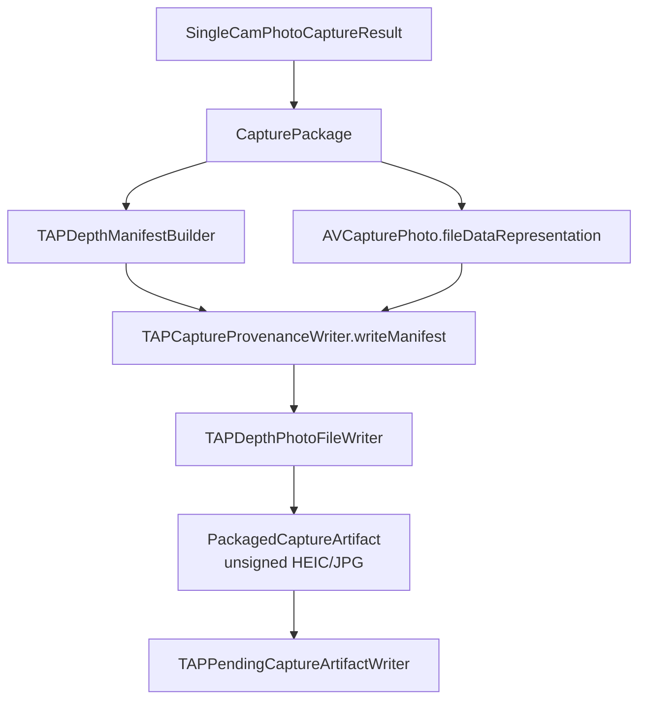

# CameraCapture Output

`CameraCapture/Output` converts a successful photo-depth capture into the TAP
depth photo contract. It builds the logical package, constructs the TAP
manifest, embeds that manifest into an Apple HEIC or JPG photo-depth file, and
hands the unsigned artifact to TAP Library for signing and export.

Output does not talk to Photos directly and does not own retry behavior.

## Code Map

| Responsibility | Code |
| --- | --- |
| Output profile catalog | [CaptureOutputProfileCatalog.swift](CaptureOutputProfileCatalog.swift) |
| Resolved Runtime output request and photo-output capability snapshot | [CaptureOutputProfileResolution.swift](CaptureOutputProfileResolution.swift) |
| Future output profile selection intent | [CaptureOutputProfileSelectionIntent.swift](CaptureOutputProfileSelectionIntent.swift) |
| App-level photo quality policy | [CapturePhotoQualityPolicy.swift](CapturePhotoQualityPolicy.swift) |
| Output format/quality policy | [CaptureOutputProfile.swift](CaptureOutputProfile.swift) |
| Output resource plan for future multi-resource formats | [CaptureOutputResourcePlan.swift](CaptureOutputResourcePlan.swift) |
| Manifest output-facts policy | [CaptureOutputManifestPolicy.swift](CaptureOutputManifestPolicy.swift) |
| Logical capture result | [CapturePackage.swift](CapturePackage.swift) |
| Packager protocol and artifact model | [CapturePackager.swift](CapturePackager.swift) |
| Embedded photo-depth packaging | [EmbeddedPhotoPackager.swift](EmbeddedPhotoPackager.swift) |
| TAP provenance write and export-validation boundary | [TAPCaptureProvenanceWriter.swift](TAPCaptureProvenanceWriter.swift) |
| TAP manifest schema | [TAPDepthManifestSchema.swift](TAPDepthManifestSchema.swift) |
| Manifest construction | [TAPDepthManifestBuilder.swift](TAPDepthManifestBuilder.swift) |
| Manifest encoding/support | [TAPDepthManifestEncoding.swift](TAPDepthManifestEncoding.swift), [TAPDepthManifestSupport.swift](TAPDepthManifestSupport.swift) |
| TAP depth photo XMP injection and HEIC compatibility wrappers | [TAPDepthHEICWriter.swift](TAPDepthHEICWriter.swift) |
| Photo metadata customization | [TAPPhotoFileMetadataCustomizer.swift](TAPPhotoFileMetadataCustomizer.swift) |
| App Attest capture digest and signer | [CaptureContentDigest.swift](CaptureContentDigest.swift), [AppAttestCaptureAssertionSigner.swift](AppAttestCaptureAssertionSigner.swift) |
| Photos writer used by TAP Library | [PhotoLibraryWriter.swift](PhotoLibraryWriter.swift) |

## Packaging Flow

## Signing Handoff

```mermaid
flowchart LR
    Unsigned["unsigned HEIC/JPG\nempty proof slot"] --> Digest["CaptureContentDigest"]
    Digest --> Assertion["AppAttestCaptureAssertionSigner"]
    Assertion --> Proof["CaptureAssertionProof"]
    Proof --> Provenance["TAPCaptureProvenanceWriter"]
    Unsigned --> Provenance
    Provenance --> Slot["TAPProofSlot.writeProofEnvelope"]
    Slot --> Signed["signed HEIC/JPG\nproof slot"]
    Signed --> Validator["validateSignedExportPhoto"]
    Validator --> Photos["PhotoLibraryWriter.saveDepthPhoto"]
```

The shutter-time packager emits `proofs: []`. The pending queue later asks
`TAPCaptureProvenanceWriter` to read the unsigned TAP depth photo file, validate
that the queue record `captureID` matches `manifest.payload.id`, ensure the
fixed proof slot exists, recompute the C2PA-aligned content binding over the
photo bytes excluding that slot, create the App Attest capture proof, write the
proof envelope into the slot, and return the signed TAP depth photo file for
export.
Slot reservation only creates a slot when none exists. Duplicate or malformed
proof slots fail closed instead of being repaired by appending another slot.

The shutter-time packager does not create a proof. It keeps `proofs: []` and
returns a fixed public `unsigned` reason while the app-private pending worker
owns proof creation, validation, and export retry. It does not place raw
`localizedDescription`, paths, identifiers, App Attest key IDs, proofs, or photo
bytes into signature status.

Immediately before export, the same provenance boundary re-reads the final
signed bytes with `validateSignedExportPhoto`. This is not a user-visible
feature. It is a fail-closed guard that checks the actual HEIC or JPG container
type, manifest schema and `payload.id`, Release output facts through
`CaptureOutputManifestPolicy`, no proof bodies in the manifest, exactly one
fixed proof slot, proof value/digest/signing binding, and Apple auxiliary
depth/disparity presence before
`PhotoLibraryWriter.saveDepthPhoto` can ask Photos for access. The Photos writer
accepts `ValidatedTAPDepthPhoto`, not arbitrary `Data`, so call sites must pass
through this final gate first.

`ValidatedTAPDepthPhoto` has no module-wide public construction path; the
provenance writer is the only production file that can mint that trusted wrapper.

## Output Profile Contract

Read the output contract in this order:

1. [CaptureOutputProfileCatalog.swift](CaptureOutputProfileCatalog.swift)
   names the executable profile catalog. Release currently has reviewed HEIC
   and JPG photo-depth profiles; the default remains HEIC.
2. [CaptureOutputProfileSelectionIntent.swift](CaptureOutputProfileSelectionIntent.swift)
   is the pure future request boundary for choosing a profile from that
   catalog. It fails closed when the catalog is invalid, the requested profile
   is missing, or the selected profile violates its output contract.
   `CaptureOutputProfileSelectionPresentation` is the public-safe companion for
   future UI text; use it instead of developer-facing `readerDescription`
   strings when a requested profile is missing or invalid.
3. [CapturePhotoQualityPolicy.swift](CapturePhotoQualityPolicy.swift) names the
   app-level quality policy before it resolves to AVFoundation settings.
4. [CaptureOutputProfile.swift](CaptureOutputProfile.swift) names the current
   Release profiles: `releasePhotoDepthHEIC` and `releasePhotoDepthJPEG`.
5. [CaptureOutputResourcePlan.swift](CaptureOutputResourcePlan.swift) names the
   logical resources in the reviewed output contract. The current Release plan
   requires the primary photo, Apple auxiliary depth, TAP manifest, and App
   Attest capture proof before export. The plan is read from a validated
   `ResolvedCaptureOutputProfile`, so future resources cannot use it as a
   shortcut around the embedded photo-depth packaging gate. It stores no bytes,
   paths, URLs, Photos identifiers, key IDs, capture IDs, manifests, or
   AVFoundation objects.
6. [CaptureOutputManifestPolicy.swift](CaptureOutputManifestPolicy.swift)
   maps the reviewed Release profile to the durable manifest capture fields
   that the final signed-export gate must re-read before Photos save.
7. [CaptureOutputProfileResolution.swift](CaptureOutputProfileResolution.swift)
   is the Runtime handoff value and photo-output capability snapshot. It keeps
   codec, depth, and quality validation in one focused place after a catalog
   profile has passed contract validation.
8. [CaptureSessionController.swift](../Runtime/CaptureSessionController.swift)
   and
   [AVFoundationSingleCamPhotoProvider.swift](../Runtime/AVFoundationSingleCamPhotoProvider.swift)
   consume one `ResolvedCaptureOutputProfile`: Runtime resolves the raw policy
   once, then both prewarm and per-shot `AVCapturePhotoSettings` use that value.
9. [CapturePackage.swift](CapturePackage.swift) checks the resolved output
   against the capture plan and actual `AVCapturePhoto.depthData`.
10. [TAPDepthManifestBuilder.swift](TAPDepthManifestBuilder.swift) records the
   same resolved output facts into the published manifest.
11. [../../../TAPCamDemoTests/TAPCaptureOutputProfileTests.swift](../../../TAPCamDemoTests/TAPCaptureOutputProfileTests.swift)
   has pure unit tests for valid and rejected profile combinations, quality
   policy, resource-plan shape, fail-closed selection, and the
   `AVCapturePhotoSettings` handoff.
12. The provenance focused tests split the final proof/export contract by
   responsibility:
   [TAPCaptureManifestEncodingTests.swift](../../../TAPCamDemoTests/TAPCaptureManifestEncodingTests.swift)
   covers payload/proof byte separation,
   [TAPCaptureContentDigestTests.swift](../../../TAPCamDemoTests/TAPCaptureContentDigestTests.swift)
   covers canonical digest stability,
   [TAPCaptureAssertionSignerTests.swift](../../../TAPCamDemoTests/TAPCaptureAssertionSignerTests.swift)
   covers App Attest assertion shape,
   [TAPCaptureProvenanceWriterSigningTests.swift](../../../TAPCamDemoTests/TAPCaptureProvenanceWriterSigningTests.swift)
   covers unsigned fallback and pending-signing identity, and
   [TAPSignedExportValidatorTests.swift](../../../TAPCamDemoTests/TAPSignedExportValidatorTests.swift)
   covers the final signed-export validation before Photos.

`CaptureOutputProfile` is internal output policy, not a raw UI setting. The
visible Settings picker resolves to a reviewed catalog profile before Runtime
sees it. The current app saves one TAP photo-depth artifact per capture, either
HEIC or JPG. There is no hidden container fallback, quality slider, RAW output,
Live Photo output, 24 MP deferred delivery, or extra saved artifact in this
change.

`CaptureOutputProfileSelectionIntent` is also internal policy. It does not add
an output setting, persist a preference, write a manifest field, or bypass
Runtime. Future UI should use it only to resolve a requested profile from a
reviewed catalog before handing a concrete `CaptureOutputProfile` to Runtime.
Future visible status text should use `CaptureOutputProfileSelectionPresentation`
so raw catalog/profile identifiers do not leak into UI labels.

`ResolvedCaptureOutputProfile` is the Runtime handoff value. It is created by
resolving a validated `CaptureOutputProfile` against current photo file-type,
per-file-type codec, depth, quality, and active-format dimension availability.
Runtime then validates that resolved request against a
`CapturePhotoOutputCapabilitySnapshot` from the live `AVCapturePhotoOutput` when
configuring or reusing the graph. That snapshot keeps file type, codec,
depth-delivery support, configured depth-delivery state, configured maximum
quality, active-format supported dimensions, and configured output dimensions in
one place while Runtime still owns the actual AVFoundation writes.
`CaptureSessionController` stores the resolved value in
`SessionConfigurationResult`; provider, package, packager, and manifest code
then consume it instead of re-reading raw profile fields or writing AVFoundation
format, depth, quality, or dimension settings directly.

`CaptureOutputResourcePlan` is the resource-level companion to the resolved
profile. It explains what kind of resources must exist for the current Release
output without carrying the concrete data. It is exposed through
`ResolvedCaptureOutputProfile.resourcePlan`, which reuses
`validateForEmbeddedPhotoDepthPackaging()` before returning the current plan.
Today it names one photo container with primary RGB, embedded Apple auxiliary
depth, an embedded TAP manifest, and an App Attest proof record. Future RAW,
Live Photo, video, sidecar, or C2PA work should extend this model before new
packagers or Photos writers are added. The App Attest proof resource is
required before export, but it is not itself an input to the App Attest content
binding; the binding covers the current photo file bytes excluding the fixed
proof slot, plus canonical manifest payload facts. Embedded auxiliary depth is
therefore bound as format-native bytes in the photo file, while later metric
depth conversion remains a consumer-side interpretation step.

`PhotoLibraryWriter` receives only a `ValidatedTAPDepthPhoto`. It stages those
final bytes as a temporary `.heic` or `.jpg` file and gives Photos that file URL
with the matching UTType. Do not switch this back to `addResource(with:data:)`
without repeating the physical-device JPG audit: on iPhone 15 Pro, data-based
JPG import saved the asset but the Photos round-trip original lost
`tapdepth:Manifest`.

## Profile Fields

| Field | Current Release Meaning |
| --- | --- |
| `container` | `embeddedPhotoDepthHEIC` or `embeddedPhotoDepthJPEG`; one Apple photo file with auxiliary depth and TAP XMP. |
| `fileContainer` | `.heic` maps to `AVFileType.heic` and `UTType.heic`; `.jpeg` maps to `AVFileType.jpg` and `UTType.jpeg`. |
| `codecPreference` | HEIC uses `[.hevc]`; JPG uses `[.jpeg]`. Cross-container codec fallback is a contract violation. |
| `photoDimensionsPolicy` | `.largestStandardSupported`; Runtime chooses the largest supported non-deferred still-photo dimensions for the active camera format and writes them to output and per-shot settings. |
| `compressionQuality` | `1.0`; passed through `AVVideoQualityKey` in processed photo settings. It is still not a file-size guarantee. |
| `requiresDepthData` | `true`; depth is required, not best effort. |
| `depthDataDeliveryEnabled` | `true`; Runtime must request depth delivery from `AVCapturePhotoOutput`. |
| `embedsDepthDataInPhoto` | `true`; Apple auxiliary depth must remain inside the photo artifact. |
| `depthDataFiltered` | `true`; the current Release output requests filtered Apple depth. |
| `photoQualityPolicy` | `.releaseQuality`; app-level requested and maximum quality policy. It maps to AVFoundation `.quality`, but its assurances explicitly say this is AVFoundation prioritization only, with no file-size or compression-ratio guarantee. |

## Contract Rules

- Release output is one embedded TAP depth photo file, not sidecar JSON or
  debug bundles.
- The current release output policies are
  `CaptureOutputProfile.releasePhotoDepthHEIC` and
  `CaptureOutputProfile.releasePhotoDepthJPEG`. Both require embedded depth,
  filtered depth, required depth, `CapturePhotoQualityPolicy.releaseQuality`,
  and a matching reviewed file container/codec pair.
- `CapturePhotoQualityPolicy` names quality intent before Runtime maps it to
  `AVCapturePhotoOutput.QualityPrioritization`. It is still internal policy,
  not a visible quality setting. The current Release policy preserves the
  reviewed depth contract but does not guarantee final byte size, compression
  ratio, resolution, or visual quality.
- JPG is a first-class TAP depth photo profile, not a HEIC fallback. If the
  selected camera cannot satisfy the selected file type, codec, depth, quality,
  or dimensions, camera status is blocked and the shutter must stay unavailable.
- The TAP manifest schema keys and enum raw values are external contract.
- TAP photo metadata injection must preserve the primary image and Apple
  auxiliary depth attachments without a pixel decode/re-encode step.
- Capture signing is offline file proofing, not a normal protected API request.
- Packagers and TAP Library workers should use `TAPCaptureProvenanceWriter`
  instead of directly constructing proof-bearing manifests.
- `manifestByApplyingCaptureAssertion` is the non-throwing shutter-time path;
  `signedPhotoData` is the throwing pending-signing path and requires the
  expected queue `captureID`.
- `validateSignedExportPhoto` is the final export gate for signed TAP depth
  artifacts. Queue status and filenames are scheduling hints; the signed bytes
  themselves must pass container, manifest schema/id, Release output facts,
  exactly-one proof-slot, digest binding, and auxiliary depth validation before
  Photos save.

## Future Profile Rules

- Do not turn `releasePhotoDepthHEIC` or `releasePhotoDepthJPEG` into
  multi-format fallback profiles.
- Add a new catalog profile for RAW, Live Photo, video, 24 MP deferred delivery,
  or an alternative HEIC/JPG-depth path.
- Add validation rules for every new invalid combination before UI can request
  it.
- Add or update the resource plan so readers can tell whether App Attest signs
  one TAP depth photo file, multiple resources, RAW bytes, Live Photo resources,
  video resources, C2PA assertions, or some combination.
- Explain whether the TAP manifest schema changes.
- Explain what App Attest signs: one TAP depth photo file, multiple resources,
  RAW bytes, Live Photo resources, or video resources.
- Explain whether `PhotoLibraryWriter` and Depth Analysis read the artifact or
  reject it.
- Keep `validateSignedExportPhoto` as the Photos gate for signed TAP depth photo
  paths. Do not export unsigned photo files or bare `Data`.
