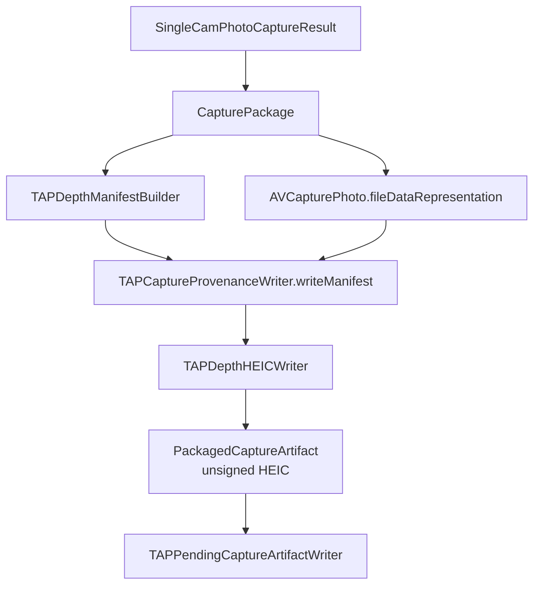

# CameraCapture Output

`CameraCapture/Output` converts a successful photo-depth capture into the TAP
HEIC contract. It builds the logical package, constructs the TAP manifest,
embeds that manifest into the Apple HEIC, and hands the unsigned artifact to
TAP Library for signing and export.

Output does not talk to Photos directly and does not own retry behavior.

## Code Map

| Responsibility | Code |
| --- | --- |
| Output profile catalog | [CaptureOutputProfileCatalog.swift](CaptureOutputProfileCatalog.swift) |
| Resolved Runtime output request and photo-output capability snapshot | [CaptureOutputProfileResolution.swift](CaptureOutputProfileResolution.swift) |
| Future output profile selection intent | [CaptureOutputProfileSelectionIntent.swift](CaptureOutputProfileSelectionIntent.swift) |
| App-level photo quality policy | [CapturePhotoQualityPolicy.swift](CapturePhotoQualityPolicy.swift) |
| Output format/quality policy | [CaptureOutputProfile.swift](CaptureOutputProfile.swift) |
| Output resource plan for future multi-resource formats | [CaptureOutputResourcePlan.swift](CaptureOutputResourcePlan.swift) |
| Manifest output-facts policy | [CaptureOutputManifestPolicy.swift](CaptureOutputManifestPolicy.swift) |
| Logical capture result | [CapturePackage.swift](CapturePackage.swift) |
| Packager protocol and artifact model | [CapturePackager.swift](CapturePackager.swift) |
| Embedded HEIC packaging | [EmbeddedPhotoPackager.swift](EmbeddedPhotoPackager.swift) |
| TAP provenance write and export-validation boundary | [TAPCaptureProvenanceWriter.swift](TAPCaptureProvenanceWriter.swift) |
| TAP manifest schema | [TAPDepthManifestSchema.swift](TAPDepthManifestSchema.swift) |
| Manifest construction | [TAPDepthManifestBuilder.swift](TAPDepthManifestBuilder.swift) |
| Manifest encoding/support | [TAPDepthManifestEncoding.swift](TAPDepthManifestEncoding.swift), [TAPDepthManifestSupport.swift](TAPDepthManifestSupport.swift) |
| HEIC XMP injection | [TAPDepthHEICWriter.swift](TAPDepthHEICWriter.swift) |
| Photo metadata customization | [TAPPhotoFileMetadataCustomizer.swift](TAPPhotoFileMetadataCustomizer.swift) |
| App Attest capture digest and signer | [CaptureContentDigest.swift](CaptureContentDigest.swift), [AppAttestCaptureAssertionSigner.swift](AppAttestCaptureAssertionSigner.swift) |
| Photos writer used by TAP Library | [PhotoLibraryWriter.swift](PhotoLibraryWriter.swift) |

## Packaging Flow

## Signing Handoff

```mermaid
flowchart LR
    Unsigned["unsigned HEIC\nproofs: []"] --> Digest["CaptureContentDigest"]
    Digest --> Assertion["AppAttestCaptureAssertionSigner"]
    Assertion --> Proof["CaptureAssertionProof"]
    Proof --> Provenance["TAPCaptureProvenanceWriter"]
    Unsigned --> Provenance
    Provenance --> Writer["TAPDepthHEICWriter"]
    Writer --> Signed["signed HEIC\nproofs[0]"]
    Signed --> Validator["validateSignedExportHEIC"]
    Validator --> Photos["PhotoLibraryWriter.saveDepthHEIC"]
```

The shutter-time packager emits `proofs: []`. The pending queue later asks
`TAPCaptureProvenanceWriter` to read the unsigned HEIC, validate that the queue
record `captureID` matches `manifest.payload.id`, recompute the RGB/depth/metadata
digest, create the App Attest capture proof, inject `manifest.proofs[0]`, and
return the signed HEIC for export.

If shutter-time proof creation is unavailable or fails, the packager keeps
`proofs: []` and returns a fixed public `unsigned` reason. It does not place raw
`localizedDescription`, paths, identifiers, App Attest key IDs, proofs, or HEIC
bytes into signature status.

Immediately before export, the same provenance boundary re-reads the final
signed bytes with `validateSignedExportHEIC`. This is not a user-visible
feature. It is a fail-closed guard that checks the actual HEIC container type,
manifest schema and `payload.id`, Release output facts through
`CaptureOutputManifestPolicy`, exactly one App Attest proof, proof
value/digest/signing binding, and Apple auxiliary depth/disparity before
`PhotoLibraryWriter.saveDepthHEIC` can ask Photos for access. The Photos writer
accepts `ValidatedTAPDepthHEIC`, not arbitrary `Data`, so call sites must pass
through this final gate first.

`ValidatedTAPDepthHEIC` has no module-wide public construction path; the
provenance writer is the only production file that can mint that trusted wrapper.

## Output Profile Contract

Read the output contract in this order:

1. [CaptureOutputProfileCatalog.swift](CaptureOutputProfileCatalog.swift)
   names the executable profile catalog. Release currently has one default
   profile and no alternates.
2. [CaptureOutputProfileSelectionIntent.swift](CaptureOutputProfileSelectionIntent.swift)
   is the pure future request boundary for choosing a profile from that
   catalog. It fails closed when the catalog is invalid, the requested profile
   is missing, or the selected profile violates its output contract.
   `CaptureOutputProfileSelectionPresentation` is the public-safe companion for
   future UI text; use it instead of developer-facing `readerDescription`
   strings when a requested profile is missing or invalid.
3. [CapturePhotoQualityPolicy.swift](CapturePhotoQualityPolicy.swift) names the
   app-level quality policy before it resolves to AVFoundation settings.
4. [CaptureOutputProfile.swift](CaptureOutputProfile.swift) names the only
   current Release profile: `releasePhotoDepthHEIC`.
5. [CaptureOutputResourcePlan.swift](CaptureOutputResourcePlan.swift) names the
   logical resources in the reviewed output contract. The current Release plan
   requires the primary photo, Apple auxiliary depth, TAP manifest, and App
   Attest capture proof before export. The plan is read from a validated
   `ResolvedCaptureOutputProfile`, so future resources cannot use it as a
   shortcut around the embedded photo-depth packaging gate. It stores no bytes,
   paths, URLs, Photos identifiers, key IDs, capture IDs, manifests, or
   AVFoundation objects.
6. [CaptureOutputManifestPolicy.swift](CaptureOutputManifestPolicy.swift)
   maps the reviewed Release profile to the durable manifest capture fields
   that the final signed-export gate must re-read before Photos save.
7. [CaptureOutputProfileResolution.swift](CaptureOutputProfileResolution.swift)
   is the Runtime handoff value and photo-output capability snapshot. It keeps
   codec, depth, and quality validation in one focused place after a catalog
   profile has passed contract validation.
8. [CaptureSessionController.swift](../Runtime/CaptureSessionController.swift)
   and
   [AVFoundationSingleCamPhotoProvider.swift](../Runtime/AVFoundationSingleCamPhotoProvider.swift)
   consume one `ResolvedCaptureOutputProfile`: Runtime resolves the raw policy
   once, then both prewarm and per-shot `AVCapturePhotoSettings` use that value.
9. [CapturePackage.swift](CapturePackage.swift) checks the resolved output
   against the capture plan and actual `AVCapturePhoto.depthData`.
10. [TAPDepthManifestBuilder.swift](TAPDepthManifestBuilder.swift) records the
   same resolved output facts into the published manifest.
11. [../../../TAPCamDemoTests/TAPCaptureOutputProfileTests.swift](../../../TAPCamDemoTests/TAPCaptureOutputProfileTests.swift)
   has pure unit tests for valid and rejected profile combinations, quality
   policy, resource-plan shape, fail-closed selection, and the
   `AVCapturePhotoSettings` handoff.
12. The provenance focused tests split the final proof/export contract by
   responsibility:
   [TAPCaptureManifestEncodingTests.swift](../../../TAPCamDemoTests/TAPCaptureManifestEncodingTests.swift)
   covers payload/proof byte separation,
   [TAPCaptureContentDigestTests.swift](../../../TAPCamDemoTests/TAPCaptureContentDigestTests.swift)
   covers canonical digest stability,
   [TAPCaptureAssertionSignerTests.swift](../../../TAPCamDemoTests/TAPCaptureAssertionSignerTests.swift)
   covers App Attest assertion shape,
   [TAPCaptureProvenanceWriterSigningTests.swift](../../../TAPCamDemoTests/TAPCaptureProvenanceWriterSigningTests.swift)
   covers unsigned fallback and pending-signing identity, and
   [TAPSignedExportValidatorTests.swift](../../../TAPCamDemoTests/TAPSignedExportValidatorTests.swift)
   covers the final signed-export validation before Photos.

`CaptureOutputProfile` is internal output policy, not a user-facing format or
quality feature. The current app still saves one TAP photo-depth HEIC. There is
no JPEG export option, quality slider, RAW output, Live Photo output, or extra
saved artifact in this refactor.

`CaptureOutputProfileSelectionIntent` is also internal policy. It does not add
an output setting, persist a preference, write a manifest field, or bypass
Runtime. Future UI should use it only to resolve a requested profile from a
reviewed catalog before handing a concrete `CaptureOutputProfile` to Runtime.
Future visible status text should use `CaptureOutputProfileSelectionPresentation`
so raw catalog/profile identifiers do not leak into UI labels.

`ResolvedCaptureOutputProfile` is the Runtime handoff value. It is created by
resolving a validated `CaptureOutputProfile` against current photo codec
availability. Runtime then validates that resolved request against a
`CapturePhotoOutputCapabilitySnapshot` from the live `AVCapturePhotoOutput` when
configuring or reusing the graph. That snapshot keeps codec availability,
depth-delivery support, configured depth-delivery state, and configured maximum
quality checks in one place while Runtime still owns the actual AVFoundation
writes. `CaptureSessionController` stores the resolved value in
`SessionConfigurationResult`; provider, package, packager, and manifest code
then consume it instead of re-reading raw profile fields or writing AVFoundation
format, depth, or quality settings directly.

`CaptureOutputResourcePlan` is the resource-level companion to the resolved
profile. It explains what kind of resources must exist for the current Release
output without carrying the concrete data. It is exposed through
`ResolvedCaptureOutputProfile.resourcePlan`, which reuses
`validateForEmbeddedPhotoDepthPackaging()` before returning the current plan.
Today it names one photo container with primary RGB, embedded Apple auxiliary
depth, an embedded TAP manifest, and an App Attest proof record. Future RAW,
Live Photo, video, sidecar, or C2PA work should extend this model before new
packagers or Photos writers are added. The App Attest proof resource is
required before export, but it is not itself an input to the App Attest content
digest; the digest covers the current primary photo, auxiliary depth, and
manifest payload facts.

## Profile Fields

| Field | Current Release Meaning |
| --- | --- |
| `container` | `embeddedPhotoDepthHEIC`; one Apple HEIC with auxiliary depth and TAP XMP. |
| `codecPreference` | `[.hevc]`; JPEG fallback is a contract violation for this profile. |
| `requiresDepthData` | `true`; depth is required, not best effort. |
| `depthDataDeliveryEnabled` | `true`; Runtime must request depth delivery from `AVCapturePhotoOutput`. |
| `embedsDepthDataInPhoto` | `true`; Apple auxiliary depth must remain inside the photo artifact. |
| `depthDataFiltered` | `true`; the current Release output requests filtered Apple depth. |
| `photoQualityPolicy` | `.releaseQuality`; app-level requested and maximum quality policy. It maps to AVFoundation `.quality`, but its assurances explicitly say this is AVFoundation prioritization only, with no file-size or compression-ratio guarantee. |

## Contract Rules

- Release output is one embedded HEIC, not sidecar JSON or debug bundles.
- The current release output policy is `CaptureOutputProfile.releasePhotoDepthHEIC`:
  HEVC only, embedded depth enabled, filtered depth enabled, required depth, and
  `CapturePhotoQualityPolicy.releaseQuality`.
- `CapturePhotoQualityPolicy` names quality intent before Runtime maps it to
  `AVCapturePhotoOutput.QualityPrioritization`. It is still internal policy,
  not a visible quality setting. The current Release policy preserves the
  reviewed depth contract but does not guarantee final byte size, compression
  ratio, resolution, or visual quality.
- JPEG fallback is deliberately rejected for the Release HEIC profile. Future
  JPEG/RAW/Live Photo/video work needs a separate profile, validation rule,
  manifest story, and packaging path before UI can request it.
- The TAP manifest schema keys and enum raw values are external contract.
- HEIC metadata injection must preserve the primary image and Apple auxiliary
  depth attachments without a pixel decode/re-encode step.
- Capture signing is offline file proofing, not a normal protected API request.
- Packagers and TAP Library workers should use `TAPCaptureProvenanceWriter`
  instead of directly constructing proof-bearing manifests.
- `manifestByApplyingCaptureAssertion` is the non-throwing shutter-time path;
  `signedHEICData` is the throwing pending-signing path and requires the
  expected queue `captureID`.
- `validateSignedExportHEIC` is the final export gate for signed TAP depth
  artifacts. Queue status and filenames are scheduling hints; the signed bytes
  themselves must pass container, manifest schema/id, Release output facts,
  proof, digest binding, and auxiliary depth validation before Photos save.

## Future Profile Rules

- Do not turn `releasePhotoDepthHEIC` into a multi-format fallback profile.
- Add a new catalog profile for a new JPEG, RAW, Live Photo, video, or
  alternative HEIC-depth path.
- Add validation rules for every new invalid combination before UI can request
  it.
- Add or update the resource plan so readers can tell whether App Attest signs
  one HEIC, multiple resources, RAW bytes, Live Photo resources, video
  resources, C2PA assertions, or some combination.
- Explain whether the TAP manifest schema changes.
- Explain what App Attest signs: one HEIC, multiple resources, RAW bytes, Live
  Photo resources, or video resources.
- Explain whether `PhotoLibraryWriter` and Depth Analysis read the artifact or
  reject it.
- Keep `validateSignedExportHEIC` as the Photos gate for the current signed TAP
  depth HEIC path. Do not export unsigned HEICs or bare `Data`.
