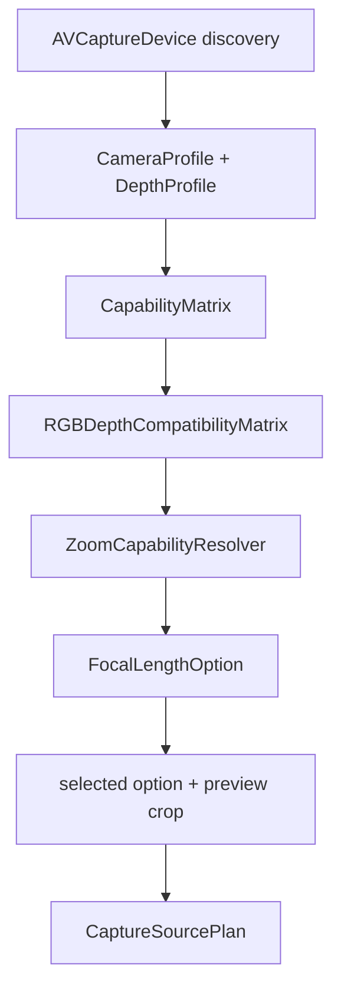

# CameraCapture Planning

`CameraCapture/Planning` converts user intent into a concrete
`CaptureSourcePlan`. It discovers AVFoundation capabilities, validates
RGB/depth compatibility, resolves depth-safe zoom, and records why unsupported
choices are rejected.

Planning is pure decision logic: it does not mutate `AVCaptureSession` and does
not capture photos.

## Code Map

| Responsibility | Code |
| --- | --- |
| Capability value models | [CapabilityModels.swift](CapabilityModels.swift) |
| Manual-control support snapshot | [CameraControlCapabilitySnapshot.swift](CameraControlCapabilitySnapshot.swift) |
| Manual-control user intent | [CameraManualControlIntent.swift](CameraManualControlIntent.swift) |
| Manual-control field summary | [CameraManualControlSummary.swift](CameraManualControlSummary.swift) |
| Manual-control Runtime command plan | [CameraManualControlCommandPlan.swift](CameraManualControlCommandPlan.swift) |
| Device discovery and profiles | [CameraCapabilityResolver.swift](CameraCapabilityResolver.swift) |
| Release FOV option matrix | [CapabilityMatrix.swift](CapabilityMatrix.swift) |
| RGB/depth pairing validation | [RGBDepthCompatibilityMatrix.swift](RGBDepthCompatibilityMatrix.swift) |
| Raw/display zoom conversion | [ZoomCapabilityResolver.swift](ZoomCapabilityResolver.swift), [FocalLengthLabelResolver.swift](FocalLengthLabelResolver.swift) |
| Final runtime plan | [CapturePlan.swift](CapturePlan.swift) |
| Shutter-time preview crop snapshot | [PreCaptureConfigurationBuilder.swift](PreCaptureConfigurationBuilder.swift) |
| Crop metadata model | [CropRectNormalized.swift](CropRectNormalized.swift) |
| Device model identifier | [DeviceModelIdentifier.swift](DeviceModelIdentifier.swift) |

## Planning Flow

## Key Invariants

- Release options are shown only when Apple can produce embedded photo depth.
- A compatible depth row must resolve to the same capture device or an Apple
  virtual device containing the selected RGB source.
- `ZoomProfile.rawVideoZoomFactor` is the value Runtime applies to
  `AVCaptureDevice.videoZoomFactor`.
- `CaptureSourcePlan` is the only photo-capture session plan Runtime is allowed
  to execute. Manual-control writes use a separate
  `CameraManualControlCommandPlan` boundary.
- Planning carries the selected `CaptureOutputProfile` through
  `CaptureSourcePlan`, but it does not choose user-visible format or quality
  settings. Future output choices belong to Output's profile selection contract.
- `PreCaptureConfigurationBuilder` is the only shutter-time bridge that copies
  a configured `SessionConfigurationResult`. It updates the current preview
  crop in both `capturePlan` and `selectionContext`, while preserving Runtime
  facts such as `outputProfile`, `resolvedOutput`, device, display name, preview
  aspect ratio, and manual-control capability snapshot.
- `CameraControlCapabilitySnapshot` is read-only. It answers what the active
  device can support; Runtime's `CameraControlService`, not Planning, performs
  EV, ISO, shutter, focus, white balance, aperture, or zoom writes to
  `AVCaptureDevice`.
- `CameraManualControlIntent` answers what future UI asked for. It is a pure
  Foundation value: no `AVCaptureDevice`, no session writes, no persistence, no
  manifest fields, and no visible UI.
- Manual-control resolution is explicit. `nil` means "leave this setting
  unchanged"; explicit auto modes are represented separately; stale device ids,
  unsupported modes, non-finite values, out-of-range values, and depth-unsafe
  zoom return violations instead of being silently clamped.
- `CameraManualControlResolutionPresentation` is the public-safe summary for
  future UI or persistence review. It names only fixed status text and fixed
  control groups, not device ids, raw requested values, AVFoundation objects,
  manifests, proofs, paths, URLs, or App Attest fields.
- `CameraManualControlSummary` is the field-row summary future controls should
  read before building EV, ISO, shutter, focus, white-balance, aperture, or zoom
  rows. It distinguishes no change, requested, blocked, and blocked requested
  states without exposing raw device identifiers or requested numeric values.
  `requestKind` keeps no-change, explicit-auto, and manual-request semantics
  separate from execution blocking.
- `CameraManualControlCommandPlan` is a Runtime-executable pure command plan. It
  turns an executable resolution into ordered pure-value commands for a future
  session-queue writer. It may carry requested numeric values and the target
  device id plus control-surface signature for stale-camera/stale-capability
  protection, so SwiftUI, logs, and persistence must not use it as display
  state.
- Planning still does not mutate `AVCaptureSession`, capture photos, or add UI
  controls.

## Manual Control Boundary

Read the manual-control files in this order:

1. [CameraControlCapabilitySnapshot.swift](CameraControlCapabilitySnapshot.swift)
   is the active device capability snapshot. It says what exposure, focus,
   white-balance, aperture, and zoom ranges the current device reports.
2. [CameraManualControlIntent.swift](CameraManualControlIntent.swift) is the
   future user-request model. It can represent no-op, explicit automatic modes,
   locked modes, EV bias, custom ISO plus shutter duration, focus point,
   white-balance gains, aperture requests, and zoom.
3. `CameraManualControlResolution` and `CameraManualControlViolation` explain
   whether the request is executable for the current snapshot and why it is not.
4. `CameraManualControlResolutionPresentation` is the public-safe summary future
   UI should read before showing status text or persisting a display state.
5. [CameraManualControlSummary.swift](CameraManualControlSummary.swift) is the
   field-row summary for future control rows. Read it before designing EV, ISO,
   shutter, focus, white-balance, aperture, or zoom UI.
6. [CameraManualControlCommandPlan.swift](CameraManualControlCommandPlan.swift)
   is the Runtime-executable pure command plan. Read it before wiring future
   controls into a session-queue writer; do not use it for UI text, logs, or
   persistence.
7. [../Runtime/CameraControlService.swift](../Runtime/CameraControlService.swift)
   remains the Runtime write boundary. Planning does not call it directly.
