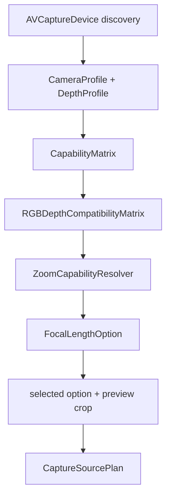

# CameraCapture Planning

`CameraCapture/Planning` converts user intent into a concrete
`CaptureSourcePlan`. It discovers AVFoundation capabilities, validates
RGB/depth compatibility, resolves depth-safe zoom, and records why unsupported
choices are rejected.

Planning is pure decision logic: it does not mutate `AVCaptureSession` and does
not capture photos.

[ProductContract.md](../../../Docs/ProductContract.md) owns product capability;
this README owns Planning's value models and resolution invariants.

## Code Map

| Responsibility | Code |
| --- | --- |
| Capability value models | [CapabilityModels.swift](CapabilityModels.swift) |
| Photographer Mode eligibility, stable state, failure, and suspended rear intent models | [PhotographerModeModels.swift](PhotographerModeModels.swift) |
| Manual-control support snapshot | [CameraControlCapabilitySnapshot.swift](CameraControlCapabilitySnapshot.swift) |
| Manual-control user intent | [CameraManualControlIntent.swift](CameraManualControlIntent.swift) |
| Manual-control field summary | [CameraManualControlSummary.swift](CameraManualControlSummary.swift) |
| Manual-control Runtime command plan | [CameraManualControlCommandPlan.swift](CameraManualControlCommandPlan.swift) |
| TAPCam-owned exposure-priority and metering state | [CameraExposureControlState.swift](CameraExposureControlState.swift) |
| Device-clipped photographic ISO/shutter steps | [CameraPhotographyExposureScale.swift](CameraPhotographyExposureScale.swift) |
| Manual-control Runtime readback snapshot | [CameraManualControlReadbackSnapshot.swift](CameraManualControlReadbackSnapshot.swift) |
| Device discovery and profiles | [CameraCapabilityResolver.swift](CameraCapabilityResolver.swift) |
| Release FOV option matrix | [CapabilityMatrix.swift](CapabilityMatrix.swift) |
| RGB/depth pairing validation | [RGBDepthCompatibilityMatrix.swift](RGBDepthCompatibilityMatrix.swift) |
| Raw/display zoom conversion | [ZoomCapabilityResolver.swift](ZoomCapabilityResolver.swift), [FocalLengthLabelResolver.swift](FocalLengthLabelResolver.swift) |
| Final runtime plan | [CapturePlan.swift](CapturePlan.swift) |
| Shutter-time preview crop snapshot | [PreCaptureConfigurationBuilder.swift](PreCaptureConfigurationBuilder.swift) |
| Crop metadata model | [CropRectNormalized.swift](CropRectNormalized.swift) |
| Device model identifier | [DeviceModelIdentifier.swift](DeviceModelIdentifier.swift) |

## Planning Flow



## Product Path Resolution

Planning resolves the Standard and Photographer Mode paths as different
products over the same capability inventory:

- Standard selects a non-LiDAR RGB source and an Apple-compatible depth plan.
  Every enabled Release FOV option carries its resolved RGB source, compatible
  depth profile, and raw `videoZoomFactor`. A visible FOV is therefore a real
  RGB/depth capture plan, not preview-only magnification with a different final
  output.
- Photographer Mode is all-or-nothing. `PhotographerModeAvailability` requires
  a rear `builtInLiDARDepthCamera` 24 mm / 1x path with photo depth, adjustable
  custom ISO and shutter, locked focus, and custom lens position. Its
  `CaptureSourcePlan` stays full-frame at raw zoom 1.0.
- If any PRO eligibility fact is absent, Planning reports a specific
  unavailable reason and returns no partial PRO plan. Standard remains usable;
  UI must not render a partly enabled professional toolbar over another camera
  path.
- Capability is resolved from the active Apple device and format. It is not a
  promise that a phone family, OS release, Triple Camera path, or front camera
  supports the same manual controls as one previously tested device.

True camera source switching is future work tracked by `TAP-0018`. It must
recompute RGB/depth compatibility and every manual-control capability after
the active Apple path changes. It is not ordinary preview zoom and cannot reuse
the fixed full-frame PRO output claim without a new contract.

## Current Manual Exposure Model

`CameraExposureControlState` is the pure state machine for active PRO. It is
separate from Standard Basic EV.

```text
A/A --adjust ISO--> M/A --adjust S--> M/M
 |                  ^                 |
 +--adjust S--> A/M +--restore S------+
                    ^                 |
                    +--restore ISO----+
```

- `A/A` writes exposure-target bias. `M/A` fixes ISO and computes shutter;
  `A/M` fixes shutter and computes ISO; `M/M` preserves both user values and
  reports a read-only Meter delta.
- Opening a strip is not a mode change. Only a real adjustment makes that side
  Manual; restoring a side to Auto changes only that side.
- Legal focus-driven metering events update `meter sample` and `meter
  baseline`. There is no separate re-meter product control, and MF tap assist
  is focus-only.
- While the user drags EV/ISO/S, a new meter sample is held as `pending` and is
  merged after the final user value. A generation, device, mode, or capability
  change discards stale samples and results.
- ISO/shutter choices use device-clipped photographic steps. Risk ranges are
  presentation facts; they warn without silently clamping the user's intent in
  UI.

Physical-device behavior and device-matrix coverage remain evidence work, not
new feature work. `TAP-0042` owns professional-control acceptance and
`TAP-0043` owns Standard FOV/depth plus PRO no-crop acceptance in
[TAPCamKanban ProjectBoard.md](../../../../TAPCamKanban/ProjectBoard.md).

## Key Invariants

- Release options are shown only when Apple can produce embedded photo depth.
- A compatible depth row must resolve to the same capture device or an Apple
  virtual device containing the selected RGB source.
- `ZoomProfile.rawVideoZoomFactor` is the value Runtime applies to
  `AVCaptureDevice.videoZoomFactor`.
- `CaptureSourcePlan` is the only photo-capture session plan Runtime is allowed
  to execute. Manual-control writes use a separate
  `CameraManualControlCommandPlan` boundary.
- Planning carries the selected `CaptureOutputProfile` through
  `CaptureSourcePlan`, but it does not choose user-visible format or quality
  settings. Output profile selection belongs to Output's selection contract.
- `PreCaptureConfigurationBuilder` is the only shutter-time bridge that copies
  a configured `SessionConfigurationResult`. It updates the current preview
  crop in both `capturePlan` and `selectionContext`, while preserving Runtime
  facts such as `outputProfile`, `resolvedOutput`, device, display name, preview
  aspect ratio, and manual-control capability snapshot.
- `CameraControlCapabilitySnapshot` is read-only. It answers what the active
  device can support; Runtime's `CameraControlService`, not Planning, performs
  EV, ISO, shutter, focus, white balance, aperture, or zoom writes to
  `AVCaptureDevice`.
- `CameraManualControlIntent` answers what the current manual-control UI asked
  for. It is a pure
  Foundation value: no `AVCaptureDevice`, no session writes, no persistence, no
  manifest fields, and no visible UI.
- Manual-control resolution is explicit. `nil` means "leave this setting
  unchanged"; explicit auto modes are represented separately; stale device ids,
  unsupported modes, non-finite values, out-of-range values, and depth-unsafe
  zoom return violations instead of being silently clamped.
- `CameraManualControlResolutionPresentation` is the public-safe summary for
  UI or persistence review. It names only fixed status text and fixed
  control groups, not device ids, raw requested values, AVFoundation objects,
  manifests, proofs, paths, URLs, or App Attest fields.
- `CameraManualControlSummary` is the field-row summary controls should
  read before building EV, ISO, shutter, focus, white-balance, aperture, or zoom
  rows. It distinguishes no change, requested, blocked, and blocked requested
  states without exposing raw device identifiers or requested numeric values.
  `requestKind` keeps no-change, explicit-auto, and manual-request semantics
  separate from execution blocking.
- `CameraManualControlCommandPlan` is a Runtime-executable pure command plan. It
  turns an executable resolution into ordered pure-value commands for the
  session-queue writer. It may carry requested numeric values and the target
  device id plus control-surface signature for stale-camera/stale-capability
  protection, so SwiftUI, logs, and persistence must not use it as display
  state.
- `CameraExposureControlState` is the pure TAPCam exposure model for
  `A/A`, `M/A`, `A/M`, and `M/M`. It owns `meter baseline`, `pending meter
  sample`, EV recalculation, read-only `Meter`, risk ranges, and stale
  generation/device/signature rejection without importing AVFoundation.
- `CameraManualControlReadbackSnapshot` is a pure value copied from Runtime
  readback. The caller-supplied reason is Debug/acceptance evidence only; the
  exposure model consumes the event/sample shape, not reason-specific business
  branches.
- Planning still does not mutate `AVCaptureSession`, capture photos, or add UI
  controls.

## Manual Control Boundary

Read the manual-control files in this order:

1. [CameraControlCapabilitySnapshot.swift](CameraControlCapabilitySnapshot.swift)
   is the active device capability snapshot. It says what exposure, focus,
   white-balance, aperture, and zoom ranges the current device reports.
2. [CameraManualControlIntent.swift](CameraManualControlIntent.swift) is the
   manual-control request model. It can represent no-op, explicit automatic modes,
   locked modes, EV bias, custom ISO plus shutter duration, focus point,
   white-balance gains, aperture requests, and zoom.
3. `CameraManualControlResolution` and `CameraManualControlViolation` explain
   whether the request is executable for the current snapshot and why it is not.
4. `CameraManualControlResolutionPresentation` is the public-safe summary UI
   should read before showing status text or persisting a display state.
5. [CameraManualControlSummary.swift](CameraManualControlSummary.swift) is the
   field-row summary for control rows. Read it before revising EV, ISO,
   shutter, focus, white-balance, aperture, or zoom UI.
6. [CameraManualControlCommandPlan.swift](CameraManualControlCommandPlan.swift)
   is the Runtime-executable pure command plan. Read it before wiring controls
   into the session-queue writer; do not use it for UI text, logs, or
   persistence.
7. [CameraExposureControlState.swift](CameraExposureControlState.swift) owns the
   exposure-priority/metering state machine before UI or Runtime writes happen.
8. [CameraManualControlReadbackSnapshot.swift](CameraManualControlReadbackSnapshot.swift)
   is the value bridge from Runtime readback into the pure metering model.
9. [../Runtime/CameraControlService.swift](../Runtime/CameraControlService.swift)
   remains the Runtime write boundary. Planning does not call it directly.
