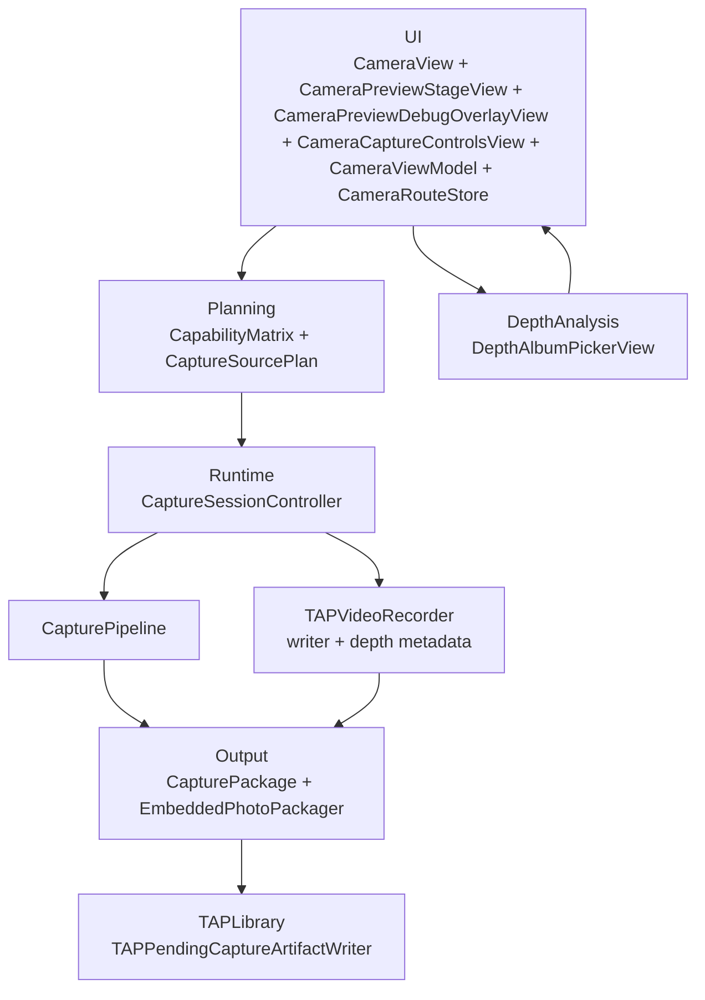
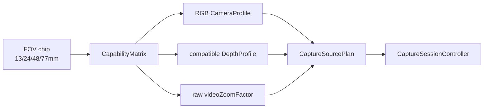
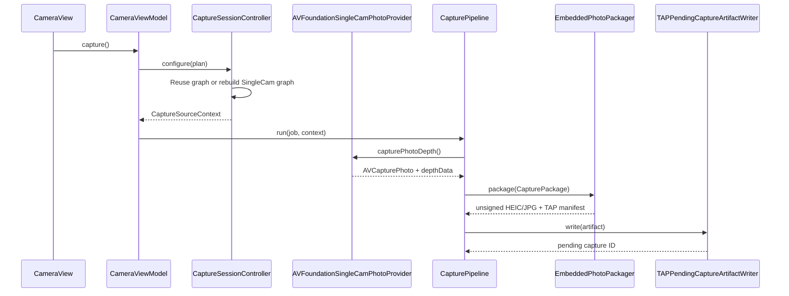
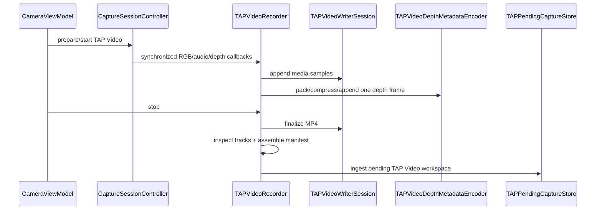
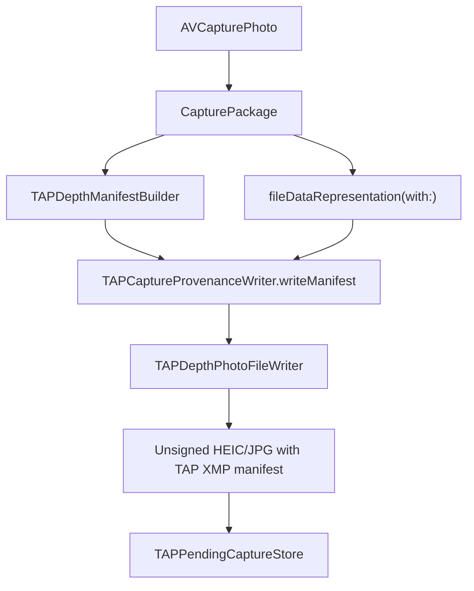

# CameraCapture Module

`TAPCamDemo/CameraCapture` owns the live camera surface, SingleCam photo-depth
capture, and TAP Video recording. Release UI chooses semantic field-of-view
options; Planning resolves them into concrete AVFoundation-compatible sources;
Runtime captures either one Apple photo-depth result or a bounded RGB/audio/
depth-metadata movie; Output builds the unsigned TAP artifact and stages it in
TAP Library.

The module does not run separate RGB/depth sessions, does not write sidecars,
and does not export to Photos directly.

## Code Map

| Layer | Responsibility | Code |
| --- | --- | --- |
| UI | Camera screen shell, preview stage, debug overlay, bottom chrome controls, FOV chips, preview bridge | [UI/README.md](UI/README.md) |
| Planning | Device discovery, RGB/depth compatibility, zoom, capture plan | [Planning/README.md](Planning/README.md) |
| Runtime | SingleCam session mutation, photo capture, and TAP Video writer orchestration | [Runtime/README.md](Runtime/README.md) |
| Output | Photo/video manifest, provenance, media facts, streaming validation, and pending handoff | [Output/README.md](Output/README.md) |
| Support | Location, metrics, capture errors, public-safe status text | [Support/README.md](Support/README.md) |

## Layer Flow

`CameraRouteStore` is the local route boundary for the live camera surface. It
keeps the default foreground destination as camera, opens the TAP Library from
the recent-photo control, and preserves the last selected or visible album item
as an in-memory restore anchor while the camera view is alive.

`CaptureLifecycleCoordinator` is the local lifecycle boundary for the live
camera surface. It turns SwiftUI scene, route, and pending-capture signing
credential events into explicit actions such as restore route, refresh recent
preview, and retry pending captures. It does not create the capture pipeline,
write Photos assets, sign photo files, or bypass TAP Library's protected-data
checks.

`CameraPreviewStageView` is the local SwiftUI composition boundary for the live
preview. It owns preview sizing, render-only `AVCaptureSession` handoff, crop
metadata callback routing, Release FOV overlay, and the Debug overlay host.
It does not configure the session, inspect devices, build capture plans, sign or
export photo artifacts, persist route state, or own output format/quality policy.

`CameraPreviewDebugOverlayView` is the Debug-only composition boundary for
status, depth-source, zoom, and performance overlays. It receives display-only
depth/zoom rows from `CameraView`, not raw device objects, camera profiles,
format selections, capture plans, App Attest objects, pending records, photo
bytes, manifests, or Photos identifiers.

`CameraCaptureStatusPresentation` is the public-safe status boundary shared by
UI and Runtime. `CameraViewModel.statusMessage` and
`CaptureJobMetrics.failureReason` must use this fixed vocabulary instead of raw
`localizedDescription` values that may include capture IDs, manifest IDs, URLs,
paths, App Attest key IDs, proofs, or associated error reasons.

## Release FOV Resolution

Release selection starts with `FocalLengthOption`, not a raw camera device.
Each option already carries the RGB source, depth source, and raw depth-safe
zoom factor produced by Planning. This keeps nonstandard mappings such as
`48mm -> raw 4.0` alive until Runtime applies `videoZoomFactor`.

## Photo Capture Sequence

The same `AVCapturePhotoOutput` settings factory is used for prewarm and
capture. The session controller is the only type that mutates
`AVCaptureSession`; FOV-only changes reuse the current graph when the selected
device, format, output, depth state, and plan are compatible.

## TAP Video Sequence

The recorder keeps callback routing, writer input ownership, depth encoding,
metrics, manifest assembly, and postflight inspection in separate types. A
single `TAPMediaTrackFactsReader` is shared by recorder postflight, validation,
and debug fixtures. The validator streams depth metadata with bounded one-frame
memory before the pending queue can sign or export the movie.

## Output Policy Handoff

The format and quality boundary crosses layers in this order:

1. Future UI or product policy should express the choice as
   `CaptureOutputProfileSelectionIntent`, then resolve it against
   `CaptureOutputProfileCatalog.release`.
2. `DepthAnalyzerSettingsView` stores `CameraOutputFormatPreference` as HEIC or
   JPG. `CameraViewModel.configureCurrentSelection()` resolves that preference
   through `CaptureOutputProfileSelectionIntent` before Runtime sees it.
   Release fixes AVFoundation capture prioritization to `.quality`; Debug can
   override that prioritization for diagnostics. These values do not promise a
   particular file size, compression ratio, or pixel resolution.
3. `SessionConfigurationRequest` carries a concrete reviewed profile from
   `CaptureOutputProfileCatalog.release`. The default remains
   `CaptureOutputProfile.releasePhotoDepthHEIC`; JPG uses
   `CaptureOutputProfile.releasePhotoDepthJPEG`.
4. `CaptureSessionController` resolves that raw policy once into
   `ResolvedCaptureOutputProfile`, configures `AVCapturePhotoOutput` from that
   resolved request, and stores it in `SessionConfigurationResult`.
5. `SingleCamPhotoSettingsFactory` receives the configured
   `ResolvedCaptureOutputProfile` for both prewarm and per-shot
   `AVCapturePhotoSettings`.
6. `CapturePackageBuilder`, `EmbeddedPhotoPackager`, and
   `TAPDepthManifestBuilder` read the same resolved output facts instead of
   reinterpreting the raw profile during packaging.
7. Output builds an unsigned embedded HEIC or JPG TAP depth photo file; TAP
   Library later signs, validates, and exports it. Output does not export to
   Photos directly.

This is still not a broad image-quality feature. The visible photo format choice is
limited to the two reviewed TAP depth photo profiles. Live Photo is a narrow
extension on top of those profiles: when the active photo output supports it,
the app captures one paired MOV resource and signs it through the v2/v3 Live
Photo contract. TAP Video uses its own reviewed movie contract. Future RAW,
arbitrary non-TAP video formats, 24MP deferred delivery, or new
quality-level work should add a new profile/catalog entry plus validation,
manifest, packaging, signing, reader, and test evidence before UI can request
it.

## Packaging Handoff

`EmbeddedPhotoPackager` writes `proofs: []` through
`TAPCaptureProvenanceWriter.writeManifest`. App Attest digesting, proof
injection, and final Photos export are retried by
[TAPPendingCaptureProcessor](../TAPLibrary/TAPPendingCaptureProcessor.swift),
not by the shutter-time capture job. The pending signing path calls the same
provenance writer in throwing mode so export cannot silently fall back to an
unsigned photo file.

## Debug Path

Debug depth selection is an override of the same SingleCam path. Selecting a
Debug depth-capable device makes that device the preview, RGB photo, and
`AVCapturePhoto.depthData` source. It does not enable a second depth pipeline.

Start with [UI/CameraViewModel+Debug.swift](UI/CameraViewModel+Debug.swift).

## Important Bug History

| Regression | Current protection |
| --- | --- |
| `48mm` fell back to the `24mm` view | UI passes raw `selectedZoomFactor`; Planning preserves it through [ZoomCapabilityResolver.swift](Planning/ZoomCapabilityResolver.swift) and [CapturePlan.swift](Planning/CapturePlan.swift). |
| `77mm` briefly flashed the `24mm` view | [CaptureSessionController.swift](Runtime/CaptureSessionController.swift) reuses a compatible graph and only moves raw zoom for FOV-only changes. |

## Internal Documents

| Document | Read it for |
| --- | --- |
| [Documentation/ARCHITECTURE.md](Documentation/ARCHITECTURE.md) | Dependency direction and module boundaries. |
| [Documentation/PIPELINE.md](Documentation/PIPELINE.md) | The one executable `AVCaptureSession + AVCapturePhotoOutput` path. |
| [Documentation/APPLE_DEPTH_LIMITATIONS.md](Documentation/APPLE_DEPTH_LIMITATIONS.md) | Apple depth-device, format, calibration, and FOV constraints. |
| [Documentation/RGB_DEPTH_PAIRING.md](Documentation/RGB_DEPTH_PAIRING.md) | Why Release only exposes Apple-paired photo-depth choices. |
| [Documentation/ZOOM.md](Documentation/ZOOM.md) | Raw `videoZoomFactor`, semantic FOV labels, and depth-safe zoom ranges. |
| [Documentation/CROP.md](Documentation/CROP.md) | Preview crop metadata versus destructive final crop. |
| [Documentation/CAPTURE_SOURCES.md](Documentation/CAPTURE_SOURCES.md) | Why this app has one photo-depth provider path. |
| [Documentation/PACKAGING.md](Documentation/PACKAGING.md) | Embedded TAP depth photo packaging, pending storage, signing, and export. |
| [Documentation/DEBUGGING.md](Documentation/DEBUGGING.md) | Debug panels, metrics, and queue state. |
