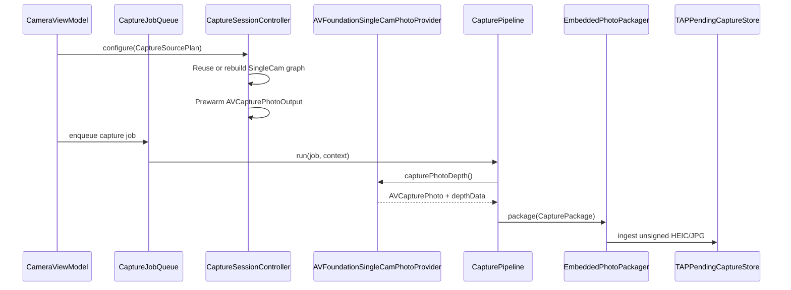

# CameraCapture Runtime

`CameraCapture/Runtime` owns the executable SingleCam path. It configures one
`AVCaptureSession + AVCapturePhotoOutput`, prewarms photo settings, captures
one photo-depth result, and runs the async capture pipeline.

[ProductContract.md](../../../Docs/ProductContract.md) owns product capability;
this README owns Runtime's executable session, device-write, and recording
invariants.

Runtime does not decide which camera should be used; it executes the
photo-capture `CaptureSourcePlan` produced by Planning. Manual-control writes
use a separate `CameraManualControlCommandPlan` produced by Planning and
validated again by `CameraControlService` before any device write.

Output file format, codec, dimensions, and quality policy come from
[`CapturePhotoQualityPolicy`](../Output/CapturePhotoQualityPolicy.swift),
[`CaptureOutputProfileCatalog`](../Output/CaptureOutputProfileCatalog.swift),
[`CaptureOutputProfileSelectionIntent`](../Output/CaptureOutputProfileSelectionIntent.swift),
and [`CaptureOutputProfile`](../Output/CaptureOutputProfile.swift). UI resolves
selection intent before Runtime sees a profile. Runtime resolves
the raw profile policy once into `ResolvedCaptureOutputProfile`, validates that
resolved request against a `CapturePhotoOutputCapabilitySnapshot` from the
current `AVCapturePhotoOutput` while configuring or reusing the graph, stores it
in `SessionConfigurationResult`, then consumes that single validated request
when it prewarms settings, creates the per-shot `AVCapturePhotoSettings`, and
hands output facts to packaging and manifest code.

Runtime also owns
[`CameraControlService`](CameraControlService.swift), the internal device-control
write boundary. The active session result still returns a read-only
[`CameraControlCapabilitySnapshot`](../Planning/CameraControlCapabilitySnapshot.swift);
manual UI requests are modeled by
[`CameraManualControlIntent`](../Planning/CameraManualControlIntent.swift) in
Planning before they reach Runtime. Runtime must not infer, persist, or log
manual user intent on its own; controls pass only a resolved
executable command plan into session-queue-safe service commands.
The service registers `CaptureSessionController`'s serial session queue and
rejects device writes outside that queue. It uses the session-safe runtime path
for baseline focus, virtual camera switching, raw zoom writes, manual-control
command application, focus-only AF assist, and manual-control readback. Runtime
readback returns a pure `CameraManualControlReadbackSnapshot`; it does not
persist, log, or infer product state on its own.

## Code Map

| Responsibility | Code |
| --- | --- |
| Serial foreground capture queue | [CapturePipeline.swift](CapturePipeline.swift) |
| Capture job and context models | [CaptureJob.swift](CaptureJob.swift) |
| Session graph owner | [CaptureSessionController.swift](CaptureSessionController.swift) |
| Session-safe camera control writes | [CameraControlService.swift](CameraControlService.swift) |
| Pure readback value handed to UI/Planning | [../Planning/CameraManualControlReadbackSnapshot.swift](../Planning/CameraManualControlReadbackSnapshot.swift) |
| Photo-depth provider protocol | [SingleCamPhotoCaptureProvider.swift](SingleCamPhotoCaptureProvider.swift) |
| AVFoundation provider | [AVFoundationSingleCamPhotoProvider.swift](AVFoundationSingleCamPhotoProvider.swift) |
| TAP Video recorder state machine and callback adapter | [TAPVideoRecorder.swift](TAPVideoRecorder.swift), [TAPVideoRecorderCaptureCallbacks.swift](TAPVideoRecorderCaptureCallbacks.swift) |
| Bounded writer input lifecycle | [TAPVideoWriterSession.swift](TAPVideoWriterSession.swift) |
| Value-semantic counters, timestamps, gaps, and calibration coverage | [TAPVideoRecordingMetrics.swift](TAPVideoRecordingMetrics.swift) |
| Per-frame depth packing/compression/KLV append | [TAPVideoDepthMetadataEncoder.swift](TAPVideoDepthMetadataEncoder.swift) |
| Pure manifest and spatial-registration assembly | [TAPVideoManifestAssembler.swift](TAPVideoManifestAssembler.swift), [TAPVideoSpatialRegistrationAssembler.swift](TAPVideoSpatialRegistrationAssembler.swift) |
| Public-safe recorder diagnostics | [TAPVideoRecorderDiagnostics.swift](TAPVideoRecorderDiagnostics.swift) |

## TAP Video Runtime Boundary

`TAPVideoRecorder` coordinates capture state only. `TAPVideoWriterSession`
owns `AVAssetWriter` input setup and finalization,
`TAPVideoDepthMetadataEncoder` owns the bounded per-frame metadata append, and
`TAPVideoRecordingMetrics` owns counters and timing facts. Final manifest and
spatial-registration values are assembled by pure collaborators after the
single shared media-track facts reader has inspected the finished file.

AVFoundation callbacks enter through one fully initialized
`TAPVideoRecorderOutputDelegate`; the recorder cannot exist with an absent
delegate. Callback routing, writer ownership, encoding, metrics, and manifest
assembly therefore have separate review boundaries.

## Capture Source And PRO Video Invariants

Every configured camera path belongs to one source generation: active
device/input, video format, depth format, and the caller's configuration
generation. Runtime must reject or drain work from an older generation before
it can update a new UI, manual-control readback, preview consumer, or writer.

The eligible rear-LiDAR PRO path owns one canonical preview-sized RGB data
output. The MF loupe and TAP Video recorder fan out in software behind that
output; they must not add separate hardware RGB outputs. When VIDEO depth is
active, one `AVCaptureDataOutputSynchronizer` and one
`TAPVideoGraphOutputRouter` remain bound to the same callback queue for the
entire prepared graph lifetime. Warmup and recording change only the router's
software recorder consumer. They do not replace the live synchronizer delegate
or queue.

The main `AVCaptureVideoPreviewLayer` shares the active session/device source
but is not the recorder data output. Runtime graph completion, a real preview
frame, and the first valid canonical RGB or synchronized RGB/depth sample are
separate readiness facts. Callers must not treat `commitConfiguration` as proof
of all three.

Standard VIDEO may use its resolved Standard graph, but Standard never selects
the rear LiDAR device merely because it is present. Active PRO Photo and PRO
Video remain on the same eligible fixed 24 mm / 1x source and manual-control
device. Switching Standard/PRO, Photo/Video, rear/front, or returning from TAP
Library tears down or drains old consumers before the new graph is declared
ready.

## Video Writer Failure Recovery

`TAPVideoRecorder` reports the first writer failure once. Runtime then detaches
the failed recording graph. The UI owner clears recording state and stop
triggers, the Pending Capture Queue aborts the failed temporary workspace, and
the selected VIDEO graph is prepared again before another recording. A corrupt
or zero-duration workspace is never ingested as a capture, and the original
failed recording is not presented as recoverable.

This failure recovery is distinct from missing depth. A successfully finalized
RGB/audio video with zero or missing depth coverage is retained for the
non-blocking signing/export path defined by the Product Contract; missing depth
alone is not a writer failure.

## Runtime Sequence

## Session Rules

- [CaptureSessionController.swift](CaptureSessionController.swift) is the only
  type that mutates `AVCaptureSession`.
- FOV-only changes should reuse the current graph when device, format, output
  file container, resolved still-photo dimensions, depth state, and requested
  plan are already compatible.
- Prewarm and capture use the same configured `ResolvedCaptureOutputProfile` so
  prepared resources match the real output request.
- File-type availability, per-file-type codec support, active-format still-photo
  dimensions, depth-delivery support, configured depth-delivery state,
  configured `AVCapturePhotoOutput.maxPhotoDimensions`, and already-configured
  maximum photo quality are checked through `CapturePhotoOutputCapabilitySnapshot`
  and `ResolvedCaptureOutputProfile.validatePhotoOutputCapabilities`. Runtime
  still owns the actual AVFoundation writes and reads the snapshot from the
  live `AVCapturePhotoOutput` on the session queue.
- UI must not write file type, codec, depth, dimensions, or quality values
  directly into
  `AVCapturePhotoSettings`; it should request a profile, and Runtime should
  consume the resolved output request.
- Provider, package, packager, and manifest code must not reinterpret raw
  `CaptureOutputProfile` fields after configuration. They consume
  `SessionConfigurationResult.resolvedOutput`.
- Runtime should not persist or interpret output-selection intent. Selection is
  resolved in Output against a reviewed catalog before Runtime configures
  AVFoundation.
- Runtime applies raw `videoZoomFactor`; it does not reinterpret semantic FOV
  labels.
- A configured Standard FOV executes the exact RGB/depth/zoom plan supplied by
  Planning. Runtime does not replace it with preview-only magnification.
- Active PRO executes the fixed full-frame rear LiDAR 24 mm / 1x plan; it does
  not apply product crop metadata or an unproven LiDAR zoom range.
- Device writes must go through `CameraControlService`. The service is
  registered to `CaptureSessionController`'s serial session queue and throws if
  a caller tries to write camera controls from another queue.
- `CameraControlService.applyManualControlCommandPlan(_:to:)` validates blocked
  plans, stale target device ids, and stale control-surface signatures before
  locking the active device.
- Runtime exposes manual-control support as data, but it does not render
  manual-control UI, infer manual intent, or persist user-adjusted manual
  settings yet.
