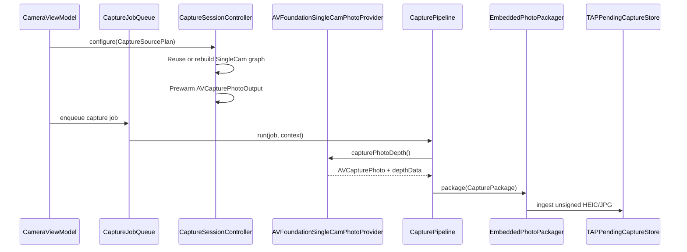

# CameraCapture Runtime

`CameraCapture/Runtime` owns the executable SingleCam path. It configures one
`AVCaptureSession + AVCapturePhotoOutput`, prewarms photo settings, captures
one photo-depth result, and runs the async capture pipeline.

Runtime does not decide which camera should be used; it executes the
photo-capture `CaptureSourcePlan` produced by Planning. Manual-control writes
use a separate `CameraManualControlCommandPlan` produced by Planning and
validated again by `CameraControlService` before any device write.

Output file format, codec, dimensions, and quality policy come from
[`CapturePhotoQualityPolicy`](../Output/CapturePhotoQualityPolicy.swift),
[`CaptureOutputProfileCatalog`](../Output/CaptureOutputProfileCatalog.swift),
[`CaptureOutputProfileSelectionIntent`](../Output/CaptureOutputProfileSelectionIntent.swift),
and [`CaptureOutputProfile`](../Output/CaptureOutputProfile.swift). Future UI
should resolve selection intent before Runtime sees a profile. Runtime resolves
the raw profile policy once into `ResolvedCaptureOutputProfile`, validates that
resolved request against a `CapturePhotoOutputCapabilitySnapshot` from the
current `AVCapturePhotoOutput` while configuring or reusing the graph, stores it
in `SessionConfigurationResult`, then consumes that single validated request
when it prewarms settings, creates the per-shot `AVCapturePhotoSettings`, and
hands output facts to packaging and manifest code.

Runtime also owns
[`CameraControlService`](CameraControlService.swift), the internal device-control
write boundary. The active session result still returns a read-only
[`CameraControlCapabilitySnapshot`](../Planning/CameraControlCapabilitySnapshot.swift);
future manual UI requests should be modeled by
[`CameraManualControlIntent`](../Planning/CameraManualControlIntent.swift) in
Planning before they reach Runtime. Runtime must not infer, persist, or log
manual user intent on its own; future controls should pass only a resolved
executable command plan into session-queue-safe service commands.
The service registers `CaptureSessionController`'s serial session queue and
rejects device writes outside that queue. It uses the session-safe runtime path
for baseline focus, virtual camera switching, raw zoom writes, and future
manual-control command application. This is infrastructure for future manual
controls; it does not add sliders, buttons, or a visible manual camera mode.

## Code Map

| Responsibility | Code |
| --- | --- |
| Serial foreground capture queue | [CapturePipeline.swift](CapturePipeline.swift) |
| Capture job and context models | [CaptureJob.swift](CaptureJob.swift) |
| Session graph owner | [CaptureSessionController.swift](CaptureSessionController.swift) |
| Session-safe camera control writes | [CameraControlService.swift](CameraControlService.swift) |
| Photo-depth provider protocol | [SingleCamPhotoCaptureProvider.swift](SingleCamPhotoCaptureProvider.swift) |
| AVFoundation provider | [AVFoundationSingleCamPhotoProvider.swift](AVFoundationSingleCamPhotoProvider.swift) |

## Runtime Sequence

## Session Rules

- [CaptureSessionController.swift](CaptureSessionController.swift) is the only
  type that mutates `AVCaptureSession`.
- FOV-only changes should reuse the current graph when device, format, output
  file container, resolved still-photo dimensions, depth state, and requested
  plan are already compatible.
- Prewarm and capture use the same configured `ResolvedCaptureOutputProfile` so
  prepared resources match the real output request.
- File-type availability, per-file-type codec support, active-format still-photo
  dimensions, depth-delivery support, configured depth-delivery state,
  configured `AVCapturePhotoOutput.maxPhotoDimensions`, and already-configured
  maximum photo quality are checked through `CapturePhotoOutputCapabilitySnapshot`
  and `ResolvedCaptureOutputProfile.validatePhotoOutputCapabilities`. Runtime
  still owns the actual AVFoundation writes and reads the snapshot from the
  live `AVCapturePhotoOutput` on the session queue.
- UI must not write file type, codec, depth, dimensions, or quality values
  directly into
  `AVCapturePhotoSettings`; it should request a profile, and Runtime should
  consume the resolved output request.
- Provider, package, packager, and manifest code must not reinterpret raw
  `CaptureOutputProfile` fields after configuration. They consume
  `SessionConfigurationResult.resolvedOutput`.
- Runtime should not persist or interpret output-selection intent. Selection is
  resolved in Output against a reviewed catalog before Runtime configures
  AVFoundation.
- Runtime applies raw `videoZoomFactor`; it does not reinterpret semantic FOV
  labels.
- Device writes must go through `CameraControlService`. The service is
  registered to `CaptureSessionController`'s serial session queue and throws if
  a caller tries to write camera controls from another queue.
- `CameraControlService.applyManualControlCommandPlan(_:to:)` validates blocked
  plans, stale target device ids, and stale control-surface signatures before
  locking the active device.
- Runtime exposes manual-control support as data, but it does not render
  manual-control UI, infer manual intent, or persist user-adjusted manual
  settings yet.
