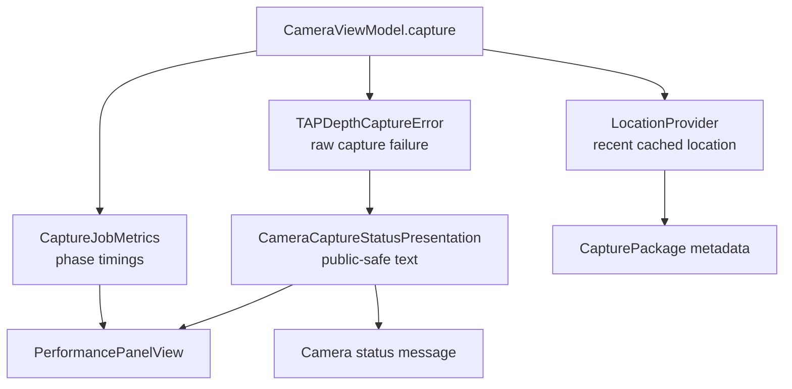

# CameraCapture Support

`CameraCapture/Support` contains cross-cutting helpers used by the capture
module. These files should stay small and dependency-light.

## Code Map

| Responsibility | Code |
| --- | --- |
| Capture metrics snapshots | [CaptureJobMetrics.swift](CaptureJobMetrics.swift) |
| Best-effort location cache and refresh | [LocationProvider.swift](LocationProvider.swift) |
| Public-safe camera status and metrics failure text | [CameraCaptureStatusPresentation.swift](CameraCaptureStatusPresentation.swift) |
| User-facing capture errors | [TAPDepthCaptureError.swift](TAPDepthCaptureError.swift) |

## Support Flow

## Rules

- Capture must not wait on a fresh Core Location prompt in the shutter path.
- Metrics are diagnostics; they should not become required capture state.
- `TAPDepthCaptureError` may carry internal reasons for control flow and
  diagnostics. UI status text and `CaptureJobMetrics.failureReason` must go
  through `CameraCaptureStatusPresentation` instead of displaying
  `localizedDescription`.
- Public-safe camera status text may explain recoverable conditions such as
  denied camera access, unsupported depth delivery, or capture backpressure, but
  it must not include capture IDs, manifest IDs, Photos asset IDs, URLs, paths,
  App Attest key IDs, proofs, photo bytes, or raw associated error reasons.
