# CameraCapture UI

`CameraCapture/UI` owns the SwiftUI camera surface and the user-facing state
model. It presents Release FOV choices, Debug controls, the preview bridge, and
the shutter path. It delegates camera decisions to Planning and Runtime instead
of inspecting AVFoundation devices directly in views.

The current control vocabulary and placement rules live in
[../../../Docs/CameraControlsDesign.md](../../../Docs/CameraControlsDesign.md).

## Code Map

| Responsibility | Code |
| --- | --- |
| Main camera screen shell, object lifetime, navigation, sheet, camera chrome state, and capture action owner | [CameraView.swift](CameraView.swift) |
| Viewfinder chrome state, top shoulder Settings, and Flash/Live Photo toolbar | [CameraViewfinderChromeView.swift](CameraViewfinderChromeView.swift) |
| Lower toolbar parameter buttons, AF/MF state, exposure risk-zone display, and ticked adjustment strip | [CameraAdjustmentControlView.swift](CameraAdjustmentControlView.swift) |
| First-stage camera UX preferences, mode enums, Flash/Live Photo viewfinder default policy, AF/MF mode, Debug-only Focus Magnifier duration setting, Debug-only LiDAR Focus Assist setting, Pro-only Manual Focus Tap Assist setting, and idle-timer policy | [CameraUXPreferences.swift](CameraUXPreferences.swift) |
| Live preview stage, preview sizing, crop metadata callback, tap-focus and temporary-EV gesture layer, focus loupe, viewfinder edge toast, guide overlay, FOV overlay, and Debug overlay host | [CameraPreviewStageView.swift](CameraPreviewStageView.swift) |
| Settings-owned guide overlay renderer | [CameraGuideOverlayView.swift](CameraGuideOverlayView.swift) |
| Debug-only preview overlay for status, depth source, zoom, manual-control readback strings, and performance panels | [CameraPreviewDebugOverlayView.swift](CameraPreviewDebugOverlayView.swift) |
| Bottom camera chrome, mode selector slot, lower toolbar host, TAP Library entry, shutter touch state, camera switch button, and disabled mode strip | [CameraCaptureControlsView.swift](CameraCaptureControlsView.swift) |
| Observable camera state | [CameraViewModel.swift](CameraViewModel.swift) |
| Public-safe status and metrics failure text consumed by CameraViewModel and Debug overlays | [../Support/CameraCaptureStatusPresentation.swift](../Support/CameraCaptureStatusPresentation.swift) |
| Release selection and plan configuration handoff | [CameraViewModel+Selection.swift](CameraViewModel+Selection.swift) |
| Shutter, pre-capture crop snapshot, and capture-write queue | [CameraViewModel+Capture.swift](CameraViewModel+Capture.swift), [../Planning/PreCaptureConfigurationBuilder.swift](../Planning/PreCaptureConfigurationBuilder.swift) |
| Debug depth and zoom state owner | [CameraViewModel+Debug.swift](CameraViewModel+Debug.swift) |
| Debug overlay display composition | [CameraPreviewDebugOverlayView.swift](CameraPreviewDebugOverlayView.swift), [DebugDepthPanelView.swift](DebugDepthPanelView.swift), [DebugZoomControlView.swift](DebugZoomControlView.swift), [PerformancePanelView.swift](PerformancePanelView.swift) |
| Preview bridge and crop metadata | [CameraPreviewView.swift](CameraPreviewView.swift) |
| FOV selector | [FocalLengthSelectorView.swift](FocalLengthSelectorView.swift) |
| Runtime metrics UI | [PerformancePanelView.swift](PerformancePanelView.swift) |
| Chrome rotation | [CameraChromeOrientationController.swift](CameraChromeOrientationController.swift) |
| Camera/TAP Library route state | [CameraRouteStore.swift](CameraRouteStore.swift) |
| Durable TAP Library route context | [CameraRouteContextStore.swift](CameraRouteContextStore.swift) |
| Camera screen lifecycle event policy | [CaptureLifecycleCoordinator.swift](CaptureLifecycleCoordinator.swift) |
| SwiftUI lifecycle hook binding and screen-awake policy | [CameraViewLifecycleModifier.swift](CameraViewLifecycleModifier.swift) |

## UI Flow

```mermaid
flowchart TD
    View["CameraView"] --> Stage["CameraPreviewStageView"]
    Stage --> Preview["CameraPreviewView"]
    Stage --> FocusGesture["Tap focus and AE/AF lock"]
    Stage --> Guides["CameraGuideOverlayView"]
    Stage --> FOV["FocalLengthSelectorView"]
    Stage --> DebugOverlay["CameraPreviewDebugOverlayView"]
    DebugOverlay --> DebugDepth["DebugDepthPanelView"]
    DebugOverlay --> DebugZoom["DebugZoomControlView"]
    DebugOverlay --> DebugMetrics["PerformancePanelView"]
    View --> Controls["CameraCaptureControlsView"]
    View --> Chrome["CameraViewfinderChromeView"]
    Controls --> AdjustmentControls["CameraAdjustmentControlView"]
    View --> Preferences["CameraUXPreferences"]
    View --> VM["CameraViewModel"]
    Controls --> CaptureAction["onCapture closure"]
    Controls --> LibraryAction["onOpenTAPLibrary closure"]
    FOV --> Select["selectReleaseFOVOption"]
    DebugDepth --> DebugSelect["debug selection methods"]
    DebugZoom --> DebugSelect
    View --> Route["CameraRouteStore"]
    View --> LifecycleModifier["CameraViewLifecycleModifier"]
    LifecycleModifier --> Lifecycle["CaptureLifecycleCoordinator"]
    Route --> Album["DepthAlbumPickerView"]
    Lifecycle --> VM
    Lifecycle --> Route
    Select --> Configure["configureCurrentSelection"]
    DebugSelect --> Configure
    Configure --> Plan["CaptureSourcePlan"]
    CaptureAction --> Capture["capture()"]
    Capture --> Snapshot["PreCaptureConfigurationBuilder"]
    Capture --> Pipeline["CapturePipeline"]
    LibraryAction --> Route

    click View "CameraView.swift"
    click Stage "CameraPreviewStageView.swift"
    click FocusGesture "CameraPreviewStageView.swift"
    click Guides "CameraGuideOverlayView.swift"
    click DebugOverlay "CameraPreviewDebugOverlayView.swift"
    click DebugDepth "DebugDepthPanelView.swift"
    click DebugZoom "DebugZoomControlView.swift"
    click DebugMetrics "PerformancePanelView.swift"
    click Preview "CameraPreviewView.swift"
    click FOV "FocalLengthSelectorView.swift"
    click Controls "CameraCaptureControlsView.swift"
    click Chrome "CameraViewfinderChromeView.swift"
    click AdjustmentControls "CameraAdjustmentControlView.swift"
    click Preferences "CameraUXPreferences.swift"
    click VM "CameraViewModel.swift"
    click Route "CameraRouteStore.swift"
    click LifecycleModifier "CameraViewLifecycleModifier.swift"
    click Lifecycle "CaptureLifecycleCoordinator.swift"
    click Album "../../DepthAnalysis/DepthAlbumPickerView.swift"
    click Select "CameraViewModel+Selection.swift"
    click Configure "CameraViewModel+Selection.swift"
    click Capture "CameraViewModel+Capture.swift"
    click Snapshot "../Planning/PreCaptureConfigurationBuilder.swift"
    click Pipeline "../Runtime/CapturePipeline.swift"
```

## Reading Order

If this directory is new to you, read it in this order:

1. [CameraViewModel.swift](CameraViewModel.swift) for the state boundary. It
   owns the session controller, capability matrix, pending store, pending
   processor, and capture pipeline; SwiftUI subviews should not receive those
   objects directly.
2. [../Support/CameraCaptureStatusPresentation.swift](../Support/CameraCaptureStatusPresentation.swift)
   for the public-safe text boundary used by `CameraViewModel.statusMessage`
   and Debug capture metrics failure text. Read this before tracing error
   catch blocks so raw `localizedDescription` and associated error values are
   not mistaken for UI copy.
3. [CameraViewModel+Selection.swift](CameraViewModel+Selection.swift) for FOV
   selection and Planning-to-Runtime configure handoff. This file should not
   copy `SessionConfigurationResult` at shutter time.
4. [CameraViewModel+Capture.swift](CameraViewModel+Capture.swift) for the
   shutter path, pending write queue, thumbnail refresh, and pending processor
   trigger. Read
   [../Planning/PreCaptureConfigurationBuilder.swift](../Planning/PreCaptureConfigurationBuilder.swift)
   beside it: that Planning helper applies the current preview crop to the
   already configured Runtime result without re-resolving output format,
   quality, device, or manual-control capability facts.
5. [CameraViewModel+Debug.swift](CameraViewModel+Debug.swift) for Debug-only
   depth device and zoom overrides.
6. [CameraRouteStore.swift](CameraRouteStore.swift) and
   [CameraRouteContextStore.swift](CameraRouteContextStore.swift) for live route
   state and durable HMAC restore tokens.
7. [CaptureLifecycleCoordinator.swift](CaptureLifecycleCoordinator.swift) for
   scene, route, pending-capture signing credential warmup, and pending retry
   policy.
8. [CameraViewLifecycleModifier.swift](CameraViewLifecycleModifier.swift) for
   SwiftUI `.task`, `.onAppear`, `.onDisappear`, and `.onChange` binding into
   the coordinator plus the camera-only idle-timer gate. This file should stay
   a thin adapter.
9. [CameraView.swift](CameraView.swift) for the screen shell. It owns
   `StateObject` lifetimes, `NavigationStack`, Settings sheet, camera chrome
   state, and top-level capture/open/switch actions.
10. [CameraUXPreferences.swift](CameraUXPreferences.swift) for first-stage
   camera UI enums and preference policy: guide selection, viewfinder highlight
   color, EV reset default, Debug-only Focus Magnifier duration default,
   Debug-only LiDAR Focus Assist default, Pro-only Manual Focus Tap Assist
   default, Flash/Live Photo viewfinder default policy, depth-warning default,
   keep-screen-awake default, AF/MF mode, current flash mode, disabled capture
   modes, and the idle-timer gate.
11. [CameraViewfinderChromeView.swift](CameraViewfinderChromeView.swift) for the
   viewfinder top shoulder Settings control and top Flash/Live Photo toolbar.
   It receives only viewfinder chrome state and action closures.
12. [CameraAdjustmentControlView.swift](CameraAdjustmentControlView.swift) for
   the `viewfinder lower toolbar` parameter buttons and the
   `ticked adjustment strip`. It receives capability-gated display ranges and
   value callbacks, not camera devices or Runtime writers.
13. [CameraPreviewStageView.swift](CameraPreviewStageView.swift) and
   [CameraGuideOverlayView.swift](CameraGuideOverlayView.swift) for preview
   sizing, render-only `AVCaptureSession` handoff, crop metadata callback,
   tap-focus point mapping, temporary focus EV adjustment, long-press AE/AF
   lock routing, MF focus loupe duration, viewfinder edge toast, Settings-owned
   guide overlay, FOV overlay, and Debug overlay hosting. The stage receives
   display-only FOV, focus-point, temporary EV, focus mode, toast, guide state,
   and viewfinder highlight color, not camera profiles, depth profiles, raw
   device identifiers, or capture plans.
14. [CameraPreviewDebugOverlayView.swift](CameraPreviewDebugOverlayView.swift)
   for Debug-only status, depth source, zoom, manual-control readback strings,
   and performance overlay layout.
   It owns the expanded/collapsed overlay state and receives display-only depth
   and zoom rows; it does not own preview sizing, crop metadata, release chrome
   rotation, capture planning, signing, export, or persistence.
15. [CameraCaptureControlsView.swift](CameraCaptureControlsView.swift) for the
   bottom camera chrome. It receives only `CameraCaptureControlsState`, a
   thumbnail image, and closures; it does not receive the view model, route
   store, App Attest controller, pending store, capture pipeline, output
   profile, identifiers, photo bytes, manifests, or proofs.
16. [CameraPreviewView.swift](CameraPreviewView.swift),
   [FocalLengthSelectorView.swift](FocalLengthSelectorView.swift), Debug panels,
   and [PerformancePanelView.swift](PerformancePanelView.swift) for the smaller
   UI leaves.

## Route State

`CameraRouteStore` is the first file to read when checking camera-to-album
navigation. It owns live route state: whether the depth album is presented,
which TAP Library item was selected, and which visible item should be used as
the current restore anchor. It still does not persist `destination`; foreground
and fresh launch return to camera.

`CameraRouteContextStore` is the durable boundary. It persists only protected
HMAC restore tokens for the latest TAP Library anchor, not raw
`pending:<captureID>`, `owned:<assetLocalIdentifier>`, `photos:<assetID>`,
paths, manifests, thumbnails, App Attest proofs, or Photos export state. Restore
is best effort: `DepthAlbumPickerView` provides the current `TAPLibraryItem`
anchors, and `CameraRouteStore` resolves a token only if a current item matches.
That lets a pending capture anchor resolve to the owned photo item after export
without making stale route context a source of truth.

Durable filters, automatic re-opening of analysis detail, and UI regression
coverage remain future work.

## Lifecycle State

`CaptureLifecycleCoordinator` is the first file to read when checking
scene-phase, foreground return, and pending-capture retry behavior. It decides
when the camera should resume after the TAP Library closes, when foregrounding
should restore the camera route, and when pending-capture signing credential
warmup should allow pending retry. It does not own layout, capture planning,
signing, export, protected-data policy, or capture pipeline construction.

`CameraViewLifecycleModifier` is the adapter between SwiftUI lifecycle hooks and
the coordinator. It owns `.task`, `.onAppear`, `.onDisappear`, and `.onChange`
wiring plus the camera-only idle-timer gate so `CameraView.body` stays readable
as screen structure. It should not gain capture or route policy branches beyond
forwarding events to `CaptureLifecycleCoordinator`.
This modifier is a root-only boundary because it holds `CameraViewModel`,
`CameraRouteStore`, `CameraChromeOrientationController`, and
`AppAttestRuntimeController`. Do not attach it to preview, Debug overlay, or
camera chrome subviews.

Foreground capture must continue to use the `CameraViewModel`-owned
`CapturePipeline` with `TAPPendingCaptureArtifactWriter`. The lifecycle
coordinator may ask the view model to retry pending captures, but it must not
create a pipeline, call a signer, export to Photos, or choose between signed and
unsigned photo data.

## Rules

- Views bind to `CameraViewModel`; they do not create capture plans themselves.
- `CameraViewModel.statusMessage` and Debug metrics failure text must receive
  public-safe text from `CameraCaptureStatusPresentation`. Do not assign
  `error.localizedDescription`, capture IDs, manifest IDs, Photos asset IDs,
  URLs, paths, App Attest key IDs, proofs, photo bytes, or raw associated error
  reasons directly into visible status strings.
- Camera chrome controls receive field-level presentation state and closures.
  They must not receive `CameraViewModel`, `CameraRouteStore`,
  `AppAttestRuntimeController`, `AppAttestClient`, `CapturePipeline`,
  `TAPPendingCaptureStore`, `CaptureOutputProfile`, session configuration
  results, raw Photos identifiers, pending capture identifiers, photo bytes,
  manifests, proofs, App Attest key IDs, or output objects.
- The preview stage may receive a render-only `AVCaptureSession`, normalized
  crop callback, display-only FOV options, guide-overlay preference, primitive
  preview sizing values, and a Debug-only overlay state. It must not receive `CameraViewModel`,
  `CaptureSessionController`, camera/depth profiles, raw device identifiers,
  capture plans, session configuration results, App Attest objects, pending
  stores/processors/records, Photos identifiers, photo bytes, manifests, proofs,
  key IDs, capture pipelines, or output profile objects.
- Debug preview overlay state must remain under `#if DEBUG`. It may display
  already-derived strings, counts, metrics, display-only Debug depth rows, and
  display-only Debug zoom rows, and it may pass selected tokens back through
  closures. It must not start/stop/configure the session, inspect
  `AVCaptureDevice`, build capture plans, read or write photo artifacts, sign/export
  captures, persist identifiers, or enter Release UI.
- `DebugDepthDeviceOption` and `ZoomProfile` stay behind `CameraView` and
  `CameraViewModel`. The overlay receives `CameraDebugDepthDisplayOption` and
  `CameraDebugZoomDisplayOption`; `CameraView` resolves their opaque tokens back
  to the real Debug option/profile.
- FOV chips in Release UI use `CameraFocalLengthDisplayOption`, an opaque token
  plus display labels, selected state, and enabled state. `CameraView` resolves
  the token back to the real `FocalLengthOption`; the stage and selector do not
  receive hardware profiles or raw device identifiers.
- Camera-to-album navigation goes through `CameraRouteStore`; direct Boolean
  route state should not be added back to `CameraView`.
- Durable route context goes through `CameraRouteContextStore`; do not use
  `@AppStorage`, `UserDefaults`, or raw Photos/pending identifiers for this
  state.
- Restore anchors must be validated against the current `TAPLibraryItem` list
  before scrolling. Persisted route context must not trigger HEIC reads, signing,
  export, Photos fetches, or navigation into analysis detail.
- Scene, route, App Attest lifecycle side effects, and camera-only idle-timer
  handling go through `CaptureLifecycleCoordinator` or
  `CameraViewLifecycleModifier`; SwiftUI lifecycle hooks belong in
  `CameraViewLifecycleModifier`, not back in `CameraView.body`.
- `CameraViewLifecycleModifier` must be applied by `CameraView` only. Do not
  reuse it on `CameraPreviewStageView`, `CameraPreviewDebugOverlayView`,
  `CameraCaptureControlsView`, or smaller leaves; doing so would carry root
  App Attest, route, and pending-processing side effects into display layers.
- `CaptureLifecycleCoordinator` must not create `CapturePipeline` or call TAP
  Library signer/exporter APIs directly. Signing/export remains owned by
  `TAPPendingCaptureProcessor`.
- Release FOV selection passes the raw resolved zoom factor through selection
  state so Planning can preserve nonstandard FOV mappings.
- The shutter path queues foreground capture/write work and returns a pending
  capture ID after the unsigned photo file is staged.
- Debug controls override the same SingleCam path; they do not enable a second
  RGB/depth pipeline.
- Preview crop metadata feeds capture provenance. The stage boundary is now
  explicit, but future layout or crop-callback changes still need stronger
  regression evidence than a pure file split.
