# CameraCapture UI

`CameraCapture/UI` owns the SwiftUI camera surface and the user-facing state
model. It presents Release FOV choices, Debug controls, the preview bridge, and
the shutter path. It delegates camera decisions to Planning and Runtime instead
of inspecting AVFoundation devices directly in views.

[ProductContract.md](../../../Docs/ProductContract.md) owns camera capability
and behavior. This README records the current native UI ownership and state
machines. New or revised component geometry is approved through
[UIPrototypeContract.md](../../../Docs/UIPrototypeContract.md), not by adding a
second camera-design document.

## Code Map

| Responsibility | Code |
| --- | --- |
| Main camera screen shell, object lifetime, navigation, sheet, camera chrome state, and capture action owner | [CameraView.swift](CameraView.swift) |
| Resource Initialization camera-plus-Library readiness state and blocking surface | [CameraInitialReadinessGate.swift](CameraInitialReadinessGate.swift), [CameraView.swift](CameraView.swift) |
| Frosted camera-path transition presentation | [CameraViewfinderTransitionOverlayView.swift](CameraViewfinderTransitionOverlayView.swift), [CameraView.swift](CameraView.swift) |
| Viewfinder chrome state, top shoulder Settings, and Flash/Live Photo toolbar | [CameraViewfinderChromeView.swift](CameraViewfinderChromeView.swift) |
| Leaf-native recording timecode that updates without periodic SwiftUI invalidation | [CameraVideoRecordingTimecodeView.swift](CameraVideoRecordingTimecodeView.swift) |
| Lower toolbar parameter buttons, AF/MF state, exposure risk-zone display, and ticked adjustment strip | [CameraAdjustmentControlView.swift](CameraAdjustmentControlView.swift) |
| First-stage camera UX preferences, mode enums, Flash/Live Photo viewfinder default policy, AF/MF mode, Debug-only Focus Magnifier duration setting, and idle-timer policy | [CameraUXPreferences.swift](CameraUXPreferences.swift) |
| Live preview stage, preview sizing, crop metadata callback, tap-focus and temporary-EV gesture layer, focus loupe, viewfinder edge toast, guide overlay, FOV overlay, and Debug overlay host | [CameraPreviewStageView.swift](CameraPreviewStageView.swift) |
| Settings-owned guide overlay renderer | [CameraGuideOverlayView.swift](CameraGuideOverlayView.swift) |
| Debug-only preview overlay for status, depth source, zoom, manual-control readback strings, and performance panels | [CameraPreviewDebugOverlayView.swift](CameraPreviewDebugOverlayView.swift) |
| Bottom camera chrome, mode selector slot, lower toolbar host, TAP Library entry, shutter touch state, camera switch button, and disabled mode strip | [CameraCaptureControlsView.swift](CameraCaptureControlsView.swift) |
| Observable camera state | [CameraViewModel.swift](CameraViewModel.swift) |
| Public-safe status and metrics failure text consumed by CameraViewModel and Debug overlays | [../Support/CameraCaptureStatusPresentation.swift](../Support/CameraCaptureStatusPresentation.swift) |
| Release selection and plan configuration handoff | [CameraViewModel+Selection.swift](CameraViewModel+Selection.swift) |
| Shutter, pre-capture crop snapshot, and capture-write queue | [CameraViewModel+Capture.swift](CameraViewModel+Capture.swift), [../Planning/PreCaptureConfigurationBuilder.swift](../Planning/PreCaptureConfigurationBuilder.swift) |
| Debug depth and zoom state owner | [CameraViewModel+Debug.swift](CameraViewModel+Debug.swift) |
| Debug overlay display composition | [CameraPreviewDebugOverlayView.swift](CameraPreviewDebugOverlayView.swift), [DebugDepthPanelView.swift](DebugDepthPanelView.swift), [DebugZoomControlView.swift](DebugZoomControlView.swift), [PerformancePanelView.swift](PerformancePanelView.swift) |
| Preview bridge and crop metadata | [CameraPreviewView.swift](CameraPreviewView.swift) |
| FOV selector | [FocalLengthSelectorView.swift](FocalLengthSelectorView.swift) |
| Runtime metrics UI | [PerformancePanelView.swift](PerformancePanelView.swift) |
| Chrome rotation | [CameraChromeOrientationController.swift](CameraChromeOrientationController.swift) |
| Camera/TAP Library route state | [CameraRouteStore.swift](CameraRouteStore.swift) |
| Durable TAP Library route context | [CameraRouteContextStore.swift](CameraRouteContextStore.swift) |
| Camera screen lifecycle event policy | [CaptureLifecycleCoordinator.swift](CaptureLifecycleCoordinator.swift) |
| SwiftUI lifecycle hook binding and screen-awake policy | [CameraViewLifecycleModifier.swift](CameraViewLifecycleModifier.swift) |

## UI Flow

```mermaid
flowchart TD
    View["CameraView"] --> Stage["CameraPreviewStageView"]
    Stage --> Preview["CameraPreviewView"]
    Stage --> FocusGesture["Tap focus and AE/AF lock"]
    Stage --> Guides["CameraGuideOverlayView"]
    Stage --> FOV["FocalLengthSelectorView"]
    Stage --> DebugOverlay["CameraPreviewDebugOverlayView"]
    DebugOverlay --> DebugDepth["DebugDepthPanelView"]
    DebugOverlay --> DebugZoom["DebugZoomControlView"]
    DebugOverlay --> DebugMetrics["PerformancePanelView"]
    View --> Controls["CameraCaptureControlsView"]
    View --> Chrome["CameraViewfinderChromeView"]
    Controls --> AdjustmentControls["CameraAdjustmentControlView"]
    View --> Preferences["CameraUXPreferences"]
    View --> VM["CameraViewModel"]
    Controls --> CaptureAction["onCapture closure"]
    Controls --> LibraryAction["onOpenTAPLibrary closure"]
    FOV --> Select["selectReleaseFOVOption"]
    DebugDepth --> DebugSelect["debug selection methods"]
    DebugZoom --> DebugSelect
    View --> Route["CameraRouteStore"]
    View --> LifecycleModifier["CameraViewLifecycleModifier"]
    LifecycleModifier --> Lifecycle["CaptureLifecycleCoordinator"]
    Route --> Album["DepthAlbumPickerView"]
    Lifecycle --> VM
    Lifecycle --> Route
    Select --> Configure["configureCurrentSelection"]
    DebugSelect --> Configure
    Configure --> Plan["CaptureSourcePlan"]
    CaptureAction --> Capture["capture()"]
    Capture --> Snapshot["PreCaptureConfigurationBuilder"]
    Capture --> Pipeline["CapturePipeline"]
    LibraryAction --> Route

    click View "CameraView.swift"
    click Stage "CameraPreviewStageView.swift"
    click FocusGesture "CameraPreviewStageView.swift"
    click Guides "CameraGuideOverlayView.swift"
    click DebugOverlay "CameraPreviewDebugOverlayView.swift"
    click DebugDepth "DebugDepthPanelView.swift"
    click DebugZoom "DebugZoomControlView.swift"
    click DebugMetrics "PerformancePanelView.swift"
    click Preview "CameraPreviewView.swift"
    click FOV "FocalLengthSelectorView.swift"
    click Controls "CameraCaptureControlsView.swift"
    click Chrome "CameraViewfinderChromeView.swift"
    click AdjustmentControls "CameraAdjustmentControlView.swift"
    click Preferences "CameraUXPreferences.swift"
    click VM "CameraViewModel.swift"
    click Route "CameraRouteStore.swift"
    click LifecycleModifier "CameraViewLifecycleModifier.swift"
    click Lifecycle "CaptureLifecycleCoordinator.swift"
    click Album "../../DepthAnalysis/DepthAlbumPickerView.swift"
    click Select "CameraViewModel+Selection.swift"
    click Configure "CameraViewModel+Selection.swift"
    click Capture "CameraViewModel+Capture.swift"
    click Snapshot "../Planning/PreCaptureConfigurationBuilder.swift"
    click Pipeline "../Runtime/CapturePipeline.swift"
```



## Startup Work Placement

[StartupLifecycleContract.md](../../../Docs/StartupLifecycleContract.md) owns
the `t0…tn` sequence and workload registry. Camera UI must be cheap enough to
commit the selected app-owned route before scalable camera work starts.

The target boundary is:

```text
route surface committed
  -> capability discovery and capture graph configuration
  -> current PreviewLayer reports a real preview
  -> shutter, primary controls, and haptics are safe
  -> Viewfinder interactive
  -> release post-entry App Attest, Pending Capture, and maintenance work
```

The `fix0809` candidate installs the selected black route-shell state and
defers `CameraView` mounting until a later main-actor turn, then keeps one
stable camera identity while Resource Initialization becomes Viewfinder. This
is not evidence that the shell rendered a frame before construction; measured
first-frame placement remains a `TAP-0083` acceptance obligation. Its gate
consumes active configuration,
completed session configuration, depth readiness, the real preview-layer
callback, safe primary controls/shutter, prepared haptics, and the first usable
Library catalog. Only the successful atomic Initialization-marker commit
removes the blocking surface. Marker preparation and durable write run off the
MainActor; the UI stays at the marker checkpoint until completion. A two-tick
display-link barrier observes the first committed Viewfinder frame before
releasing recent-cover observation/loading and root poster maintenance. The
same boundary defers any pending App Intent navigation so it cannot pause the
camera during Resource Initialization. Network/App Attest and
network-dependent Pending scheduling remain frozen and therefore are not
claimed as full `t5` alignment. `TAP-0083` still owns measured first-frame work
placement.
Debug/compiler and debugger attachment are recorded as measurement variables,
not product-state inputs.

## Current Release Camera Surface

The camera remains one portrait-layout surface. Rotation changes supported
icon/label content around a stable center; it does not rotate the toolbar,
parameter strip, mode-selector, or their touch geometry.

- The top shoulder owns Standard Basic EV on the left and Settings on the
  right. Basic EV writes exposure-target bias only; it does not enter the PRO
  ISO/shutter state machine.
- The top toolbar order is `[Flash] [Live Photo] Spacer [PRO]`. Live Photo is a
  Photo capture option, not a third item in the capture-mode selector.
- The capture-mode selector exposes `PHOTO / VIDEO` in Standard and eligible
  rear PRO. PRO remains available in VIDEO.
- Standard shows Release FOV choices resolved by Planning. Active PRO hides
  Basic EV and the FOV selector because its path is fixed rear LiDAR 24 mm /
  1x with no product crop.
- The lower parameter slot is stable across modes. Active PRO exposes
  `EV / ISO / S / Focus / ƒ`; `ƒ` is read-only. Opening a parameter replaces
  the mode-selector slot with the shared ticked adjustment strip without
  moving the shutter.
- Non-blocking capture feedback uses the viewfinder-edge toast. Missing depth
  is reported there without preventing still-photo or TAP Video output.

Visible SwiftUI views receive presentation values and closures only. Planning
owns camera/depth/FOV/manual capability decisions, Runtime owns session and
device writes, and the Product Contract owns whether a capability is current,
future, or out of scope.

## Photographer Mode UI State

`PhotographerModeState` is the only readiness source for PRO chrome:

```text
unavailable | standard | activating | active | deactivating | failed
```

- A requested preference or highlighted button never proves that the
  destination camera is ready.
- Activation, deactivation, Standard/PRO VIDEO switching, and rear-PRO/front
  switching retain the last frame under a frosted transition and block the
  shutter, focus gestures, FOV changes, capture-mode changes, and parameter
  writes.
- The transition ends only after Runtime reaches the intended stable graph and
  `CameraPreviewView` reports a current real preview frame. VIDEO additionally
  requires the requested recording graph to be prepared.
- A failed destination transition recovers a usable Standard path. If no path
  remains configured, the frosted surface stays blocking and exposes recovery;
  it must not reveal an interactive black or stale preview.
- Front-camera entry while PRO is active records a transient suspended rear
  PRO intent. Returning rear restores PRO only if it remains eligible. This
  navigation state does not overwrite `Remember Last State`.
- `Photographer Mode Startup` resolves `Default Off / Default On / Remember
  Last State` into a request. Only a successful explicit user mode change is
  remembered; capability and the stable state still decide the result.

## Exposure And Focus UI State

`CameraView` coordinates the current PRO exposure model but does not perform
the pure calculation or AVFoundation write itself.

- ISO and shutter render the Planning-owned `A/A`, `M/A`, `A/M`, and `M/M`
  state. Opening a strip does not change modes; the first real adjustment makes
  that parameter Manual, and its `Manual` action restores only that parameter
  to Auto. In `M/M`, the EV position becomes a read-only `Meter` result.
- ISO and shutter rows use device-clipped photographic steps, not raw
  continuous AVFoundation values. Risk zones are informational and do not
  discard the user's requested value.
- Standard uses only Basic EV. PRO exposure state, meter baseline, pending
  samples, AF/MF state, manual lens position, and open strips are session
  state; they are not capture metadata or cross-launch proof state.

AF overlay state is `none -> focusing(point) -> focused(point) ->
locked(point)`. A settled non-locked target has no fixed dismissal timer. A new
tap replaces it; subject-area change, a later runtime focus scan, MF entry,
camera/mode change, lifecycle teardown, or explicit cancellation invalidates
it. Locked state ignores ordinary subject-area and focus-cycle events until the
user or lifecycle explicitly clears it.

While an AF overlay is visible, a vertical scrub anywhere in the preview
content adjusts temporary focus EV. The rail beside the focus frame is visual
feedback, not a separate required hit target. Scrubbing does not refocus or
move the focus anchor; the effective automatic bias is global EV plus temporary
focus EV. Replacing or clearing the focus session resets the temporary value.

MF is exposed only on the eligible rear PRO path. A first actual Focus-strip
change enters MF. A viewfinder tap always performs the focus-only tap-assist
transaction; the optional Debug Focus Magnifier setting controls only whether
and how long the software loupe is shown. The main preview remains 1x, and the
loupe must not create another PreviewLayer, RGB output, hardware zoom, or
capture crop.

## Preference And Lifetime Ownership

`CameraUXPreferences` owns the persisted presentation policy, while
`CameraView` owns the resolved state for the current camera lifecycle.

- Flash, Live Photo, and Photographer Mode each use `Default Off / Default On /
  Remember Last State`. Flash's product default maps `Default On` to Auto; Live
  Photo defaults to Remember Last State with off as the no-history fallback;
  Photographer Mode defaults off and always has a safe Standard fallback.
- Basic EV follows its reset-on-launch policy. PRO ISO/S modes, meter baseline,
  pending samples, AF/MF mode, manual lens position, open parameter strip, and
  suspended rear intent are not persisted across a Foreground Process Launch.
- Location and Microphone data-use choices remain distinct from OS permission.
  A saved opt-out is not overwritten on foreground return or reauthorization.
- Debug-only capture prioritization, depth-warning, shutter-sound, Focus
  Magnifier, and plane-strictness controls do not become Release camera chrome.
- Camera-surface terminology remains canonical English; Settings, setup, and
  TAP Library continue to use the selected app locale.

## Reading Order

If this directory is new to you, read it in this order:

1. [CameraViewModel.swift](CameraViewModel.swift) for the state boundary. It
   owns the session controller, capability matrix, pending store, pending
   processor, and capture pipeline; SwiftUI subviews should not receive those
   objects directly.
2. [../Support/CameraCaptureStatusPresentation.swift](../Support/CameraCaptureStatusPresentation.swift)
   for the public-safe text boundary used by `CameraViewModel.statusMessage`
   and Debug capture metrics failure text. Read this before tracing error
   catch blocks so raw `localizedDescription` and associated error values are
   not mistaken for UI copy.
3. [CameraViewModel+Selection.swift](CameraViewModel+Selection.swift) for FOV
   selection and Planning-to-Runtime configure handoff. This file should not
   copy `SessionConfigurationResult` at shutter time.
4. [CameraViewModel+Capture.swift](CameraViewModel+Capture.swift) for the
   shutter path, pending write queue, thumbnail refresh, and pending processor
   trigger. Read
   [../Planning/PreCaptureConfigurationBuilder.swift](../Planning/PreCaptureConfigurationBuilder.swift)
   beside it: that Planning helper applies the current preview crop to the
   already configured Runtime result without re-resolving output format,
   quality, device, or manual-control capability facts.
5. [CameraViewModel+Debug.swift](CameraViewModel+Debug.swift) for Debug-only
   depth device and zoom overrides.
6. [CameraRouteStore.swift](CameraRouteStore.swift) and
   [CameraRouteContextStore.swift](CameraRouteContextStore.swift) for live route
   state and durable HMAC restore tokens.
7. [CaptureLifecycleCoordinator.swift](CaptureLifecycleCoordinator.swift) for
   scene, route, pending-capture signing credential warmup, and pending retry
   policy.
8. [CameraViewLifecycleModifier.swift](CameraViewLifecycleModifier.swift) for
   SwiftUI `.task`, `.onAppear`, `.onDisappear`, and `.onChange` binding into
   the coordinator plus the camera-only idle-timer gate. This file should stay
   a thin adapter.
9. [CameraView.swift](CameraView.swift) for the screen shell. It owns
   `StateObject` lifetimes, `NavigationStack`, Settings sheet, camera chrome
   state, and top-level capture/open/switch actions.
10. [CameraUXPreferences.swift](CameraUXPreferences.swift) for first-stage
   camera UI enums and preference policy: guide selection, viewfinder highlight
   color, EV reset default, Debug-only Focus Magnifier duration default,
   Flash/Live Photo viewfinder default policy, depth-warning default,
   keep-screen-awake default, AF/MF mode, current flash mode, disabled capture
   modes, and the idle-timer gate.
11. [CameraViewfinderChromeView.swift](CameraViewfinderChromeView.swift) for the
   viewfinder top shoulder Settings control and top Flash/Live Photo toolbar.
   It receives only viewfinder chrome state and action closures.
12. [CameraAdjustmentControlView.swift](CameraAdjustmentControlView.swift) for
   the `viewfinder lower toolbar` parameter buttons and the
   `ticked adjustment strip`. It receives capability-gated display ranges and
   value callbacks, not camera devices or Runtime writers.
13. [CameraPreviewStageView.swift](CameraPreviewStageView.swift) and
   [CameraGuideOverlayView.swift](CameraGuideOverlayView.swift) for preview
   sizing, render-only `AVCaptureSession` handoff, crop metadata callback,
   tap-focus point mapping, temporary focus EV adjustment, long-press AE/AF
   lock routing, always-on PRO/MF tap assist targeting, MF focus loupe duration,
   display-local tap-to-loupe center alignment, viewfinder edge toast,
   Settings-owned guide overlay, FOV overlay, and Debug overlay hosting. The
   stage receives
   display-only FOV, focus-point, temporary EV, focus mode, toast, guide state,
   and viewfinder highlight color, not camera profiles, depth profiles, raw
   device identifiers, or capture plans.
14. [CameraPreviewDebugOverlayView.swift](CameraPreviewDebugOverlayView.swift)
   for Debug-only status, depth source, zoom, manual-control readback strings,
   and performance overlay layout.
   It owns the expanded/collapsed overlay state and receives display-only depth
   and zoom rows; it does not own preview sizing, crop metadata, release chrome
   rotation, capture planning, signing, export, or persistence.
15. [CameraCaptureControlsView.swift](CameraCaptureControlsView.swift) for the
   bottom camera chrome. It receives only `CameraCaptureControlsState`, a
   thumbnail image, `RecentLibraryPresentation`, and closures. The fixed
   lower-left TAP Library slot shows its photo/video placeholder until a real
   poster is ready, then replaces it in place without changing the 58pt
   geometry. It does not receive the view model, route store, App Attest
   controller, pending store, capture pipeline, output profile, identifiers,
   photo bytes, manifests, or proofs.
16. [CameraPreviewView.swift](CameraPreviewView.swift),
   [FocalLengthSelectorView.swift](FocalLengthSelectorView.swift), Debug panels,
   and [PerformancePanelView.swift](PerformancePanelView.swift) for the smaller
   UI leaves.

## Route State

`CameraRouteStore` is the first file to read when checking camera-to-album
navigation. It owns live route state: whether the depth album is presented,
which TAP Library item was selected, and which visible item should be used as
the current restore anchor. It still does not persist `destination`; foreground
and a new Foreground Process Launch returns to camera.

`CameraRouteContextStore` is the durable boundary. It persists only protected
HMAC restore tokens for the latest TAP Library anchor, not raw
`pending:<captureID>`, `owned:<assetLocalIdentifier>`, `photos:<assetID>`,
paths, manifests, thumbnails, App Attest proofs, or Photos export state. Restore
is best effort: `DepthAlbumPickerView` provides the current `TAPLibraryItem`
anchors, and `CameraRouteStore` resolves a token only if a current item matches.
That lets a pending capture anchor resolve to the owned photo item after export
without making stale route context a source of truth.

Durable filters, automatic re-opening of analysis detail, and UI regression
coverage remain future work.

## Lifecycle State

`CaptureLifecycleCoordinator` is the first file to read when checking
scene-phase, foreground return, and pending-capture retry behavior. It decides
when the camera should resume after the TAP Library closes, when foregrounding
should restore the camera route, and when pending-capture signing credential
warmup should allow pending retry. It does not own layout, capture planning,
signing, export, protected-data policy, or capture pipeline construction.

`CameraViewLifecycleModifier` is the adapter between SwiftUI lifecycle hooks and
the coordinator. It owns `.task`, `.onAppear`, `.onDisappear`, and `.onChange`
wiring plus the camera-only idle-timer gate so `CameraView.body` stays readable
as screen structure. It should not gain capture or route policy branches beyond
forwarding events to `CaptureLifecycleCoordinator`.
This modifier is a root-only boundary because it holds `CameraViewModel`,
`CameraRouteStore`, `CameraChromeOrientationController`, and
`AppAttestRuntimeController`. Do not attach it to preview, Debug overlay, or
camera chrome subviews.

Foreground capture must continue to use the `CameraViewModel`-owned
`CapturePipeline` with `TAPPendingCaptureArtifactWriter`. The lifecycle
coordinator may ask the view model to retry pending captures, but it must not
create a pipeline, call a signer, export to Photos, or choose between signed and
unsigned photo data.

## Rules

- Views bind to `CameraViewModel`; they do not create capture plans themselves.
- `CameraViewModel.statusMessage` and Debug metrics failure text must receive
  public-safe text from `CameraCaptureStatusPresentation`. Do not assign
  `error.localizedDescription`, capture IDs, manifest IDs, Photos asset IDs,
  URLs, paths, App Attest key IDs, proofs, photo bytes, or raw associated error
  reasons directly into visible status strings.
- Camera chrome controls receive field-level presentation state and closures.
  They must not receive `CameraViewModel`, `CameraRouteStore`,
  `AppAttestRuntimeController`, `AppAttestClient`, `CapturePipeline`,
  `TAPPendingCaptureStore`, `CaptureOutputProfile`, session configuration
  results, raw Photos identifiers, pending capture identifiers, photo bytes,
  manifests, proofs, App Attest key IDs, or output objects.
- The `cameraSurface` subtree intentionally resolves localized camera chrome
  with the English locale so viewfinder terms stay canonical. Settings, TAP
  Library, startup/readiness gates, and other app surfaces inherit the user's
  selected app locale. Keep this as a presentation-only environment override;
  do not use view identity or lifecycle callbacks to enforce it.
- Periodic recording-chrome updates must stay inside a leaf-native view. Do not
  publish per-second ticks through `CameraViewModel` or place `TimelineView` in
  the camera chrome/preview SwiftUI tree; update only the native label.
- The preview stage may receive a render-only `AVCaptureSession`, normalized
  crop callback, display-only FOV options, guide-overlay preference, primitive
  preview sizing values, and a Debug-only overlay state. It must not receive `CameraViewModel`,
  `CaptureSessionController`, camera/depth profiles, raw device identifiers,
  capture plans, session configuration results, App Attest objects, pending
  stores/processors/records, Photos identifiers, photo bytes, manifests, proofs,
  key IDs, capture pipelines, or output profile objects.
- Debug preview overlay state must remain under `#if DEBUG`. It may display
  already-derived strings, counts, metrics, display-only Debug depth rows, and
  display-only Debug zoom rows, and it may pass selected tokens back through
  closures. It must not start/stop/configure the session, inspect
  `AVCaptureDevice`, build capture plans, read or write photo artifacts, sign/export
  captures, persist identifiers, or enter Release UI.
- `DebugDepthDeviceOption` and `ZoomProfile` stay behind `CameraView` and
  `CameraViewModel`. The overlay receives `CameraDebugDepthDisplayOption` and
  `CameraDebugZoomDisplayOption`; `CameraView` resolves their opaque tokens back
  to the real Debug option/profile.
- FOV chips in Release UI use `CameraFocalLengthDisplayOption`, an opaque token
  plus display labels, selected state, and enabled state. `CameraView` resolves
  the token back to the real `FocalLengthOption`; the stage and selector do not
  receive hardware profiles or raw device identifiers.
- Camera-to-album navigation goes through `CameraRouteStore`; direct Boolean
  route state should not be added back to `CameraView`.
- Durable route context goes through `CameraRouteContextStore`; do not use
  `@AppStorage`, `UserDefaults`, or raw Photos/pending identifiers for this
  state.
- Restore anchors must be validated against the current `TAPLibraryItem` list
  before scrolling. Persisted route context must not trigger HEIC reads, signing,
  export, Photos fetches, or navigation into analysis detail.
- Scene, route, App Attest lifecycle side effects, and camera-only idle-timer
  handling go through `CaptureLifecycleCoordinator` or
  `CameraViewLifecycleModifier`; SwiftUI lifecycle hooks belong in
  `CameraViewLifecycleModifier`, not back in `CameraView.body`.
- `CameraViewLifecycleModifier` must be applied by `CameraView` only. Do not
  reuse it on `CameraPreviewStageView`, `CameraPreviewDebugOverlayView`,
  `CameraCaptureControlsView`, or smaller leaves; doing so would carry root
  App Attest, route, and pending-processing side effects into display layers.
- `CaptureLifecycleCoordinator` must not create `CapturePipeline` or call TAP
  Library signer/exporter APIs directly. Signing/export remains owned by
  `TAPPendingCaptureProcessor`.
- Release FOV selection passes the raw resolved zoom factor through selection
  state so Planning can preserve nonstandard FOV mappings.
- The shutter path queues foreground capture/write work and returns a pending
  capture ID after the unsigned photo file is staged.
- Debug controls override the same SingleCam path; they do not enable a second
  RGB/depth pipeline.
- Preview crop metadata feeds capture provenance. The stage boundary is now
  explicit, but future layout or crop-callback changes still need stronger
  regression evidence than a pure file split.
