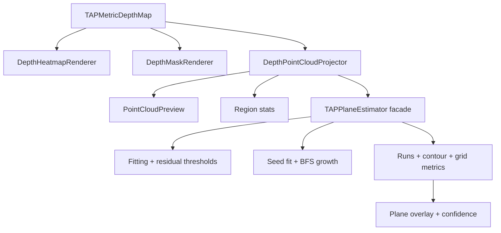

# DepthAnalysis Tools

`DepthAnalysis/AnalysisTools` contains pure rendering and geometry helpers for
already-decoded TAP depth inputs. Tools operate on `TAPMetricDepthMap` and do
not read Photos, pending bundles, or live camera state.

## Code Map

| Responsibility | Code |
| --- | --- |
| Heatmap rendering | [DepthHeatmapRenderer.swift](DepthHeatmapRenderer.swift) |
| Valid-depth mask rendering | [DepthMaskRenderer.swift](DepthMaskRenderer.swift) |
| RGBA image rendering helpers | [DepthRGBAImageRenderer.swift](DepthRGBAImageRenderer.swift) |
| Pixel-to-camera-space projection | [DepthPointCloudProjector.swift](DepthPointCloudProjector.swift) |
| Point-cloud SwiftUI preview | [DepthPointCloudPreview.swift](DepthPointCloudPreview.swift) |
| Plane estimator facade and shared fitting models | [DepthPlaneEstimator.swift](DepthPlaneEstimator.swift) |
| Plane fitting, residuals, and robust thresholds | [DepthPlaneEstimator+Fitting.swift](DepthPlaneEstimator+Fitting.swift) |
| Seed plane fitting, BFS growth, and pixel acceptance | [DepthPlaneEstimator+RegionGrowth.swift](DepthPlaneEstimator+RegionGrowth.swift) |
| Tile detection, runs, contours, grid cells, and metrics | [DepthPlaneEstimator+RegionOutput.swift](DepthPlaneEstimator+RegionOutput.swift) |

## Tool Flow



## Planes Algorithm Reading Path

Read Planes from the user interaction inward:

1. [../DepthAnalysisPlaneSelectionState.swift](../DepthAnalysisPlaneSelectionState.swift)
   stores the selected seed, strictness, loading state, error text, and selected
   result for an already-loaded depth map.
2. [../DepthAnalysisPlaneRegionRequestCoordinator.swift](../DepthAnalysisPlaneRegionRequestCoordinator.swift)
   owns async request freshness, cancellation, debounce, and geometry prewarm.
3. [../DepthAnalysisPlaneRegionDetector.swift](../DepthAnalysisPlaneRegionDetector.swift)
   builds or reuses the geometry cache and calls the estimator.
4. [DepthPointCloudProjector.swift](DepthPointCloudProjector.swift) turns native
   depth pixels into camera-space points and cacheable local normals.
5. [DepthPlaneEstimator.swift](DepthPlaneEstimator.swift) is the stable facade:
   external callers keep using `estimatePlane`, `growPlaneRegion`,
   `detectPlanes`, and `filteredPlanes`.
6. [DepthPlaneEstimator+Fitting.swift](DepthPlaneEstimator+Fitting.swift)
   contains the least-squares/RANSAC fit, residual, median/MAD, and adaptive
   threshold math.
7. [DepthPlaneEstimator+RegionGrowth.swift](DepthPlaneEstimator+RegionGrowth.swift)
   contains seed-local fitting, the 8-connected BFS grower, high-strictness
   local-normal penalty, and cancellation checks.
8. [DepthPlaneEstimator+RegionOutput.swift](DepthPlaneEstimator+RegionOutput.swift)
   converts accepted pixels into runs, contours, grid cells, flatness,
   confidence, area, image bounds, and legacy tile detections.

## Geometry Contract

Tools use metric depth in meters and camera intrinsics from the TAP manifest or
`AVDepthData.cameraCalibrationData`. Before tools consume a map,
[DepthAnalysisInputValidation.swift](../DepthAnalysisInputValidation.swift)
keeps the shared contract readable: `width * height` must fit the depth pixel
budget, `samples.count` must match the pixel count, and projected geometry
requires finite scaled intrinsics with non-zero `fx` and `fy`. Missing or
invalid calibration still allows image-space Heatmap and Valid Mask rendering,
but Point Cloud and Planes fail closed instead of producing non-finite points.

Pixel `(u, v)` with metric depth `Z` is projected with:

```text
X = (u - cx) / fx * Z
Y = (v - cy) / fy * Z
Z = depthMeters
```

Plane results describe visible depth surfaces in one photo. They are not a
world-space reconstruction and do not infer hidden geometry.
