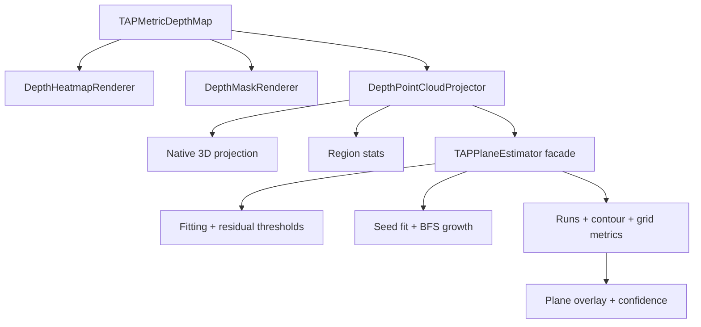

# DepthAnalysis Tools

`DepthAnalysis/AnalysisTools` contains pure rendering and geometry helpers for
already-decoded TAP depth inputs. Tools operate on `TAPMetricDepthMap` and do
not read Photos, pending bundles, or live camera state.

## Code Map

| Responsibility | Code |
| --- | --- |
| Heatmap rendering | [DepthHeatmapRenderer.swift](DepthHeatmapRenderer.swift) |
| Valid-depth mask rendering | [DepthMaskRenderer.swift](DepthMaskRenderer.swift) |
| RGBA image rendering helpers | [DepthRGBAImageRenderer.swift](DepthRGBAImageRenderer.swift) |
| Pixel-to-camera-space projection | [DepthPointCloudProjector.swift](DepthPointCloudProjector.swift) |
| Native 3D projection preview, capture-camera projection matrix, RGB color sampling, and Plane highlight mask | [DepthPointCloudPreview.swift](DepthPointCloudPreview.swift) |
| Plane estimator facade and shared fitting models | [DepthPlaneEstimator.swift](DepthPlaneEstimator.swift) |
| Plane fitting, residuals, and robust thresholds | [DepthPlaneEstimator+Fitting.swift](DepthPlaneEstimator+Fitting.swift) |
| Seed plane fitting, BFS growth, and pixel acceptance | [DepthPlaneEstimator+RegionGrowth.swift](DepthPlaneEstimator+RegionGrowth.swift) |
| Tile detection, runs, contours, grid cells, and metrics | [DepthPlaneEstimator+RegionOutput.swift](DepthPlaneEstimator+RegionOutput.swift) |

## Tool Flow



## Planes Algorithm Reading Path

Read Planes from the user interaction inward:

1. [../DepthAnalysisPlaneSelectionState.swift](../DepthAnalysisPlaneSelectionState.swift)
   stores the selected seed, strictness, loading state, error text, and selected
   result for an already-loaded depth map.
2. [../DepthAnalysisPlaneRegionRequestCoordinator.swift](../DepthAnalysisPlaneRegionRequestCoordinator.swift)
   owns async request freshness, cancellation, debounce, and geometry prewarm.
3. [../DepthAnalysisPlaneRegionDetector.swift](../DepthAnalysisPlaneRegionDetector.swift)
   builds or reuses the geometry cache and calls the estimator.
4. [DepthPointCloudProjector.swift](DepthPointCloudProjector.swift) turns native
   depth pixels into camera-space points and cacheable local normals.
5. [DepthPlaneEstimator.swift](DepthPlaneEstimator.swift) is the stable facade:
   external callers keep using `estimatePlane`, `growPlaneRegion`,
   `detectPlanes`, and `filteredPlanes`.
6. [DepthPlaneEstimator+Fitting.swift](DepthPlaneEstimator+Fitting.swift)
   contains the least-squares/RANSAC fit, residual, median/MAD, and adaptive
   threshold math.
7. [DepthPlaneEstimator+RegionGrowth.swift](DepthPlaneEstimator+RegionGrowth.swift)
   contains seed-local fitting, the 8-connected BFS grower, high-strictness
   local-normal penalty, and cancellation checks.
8. [DepthPlaneEstimator+RegionOutput.swift](DepthPlaneEstimator+RegionOutput.swift)
   converts accepted pixels into runs, contours, grid cells, flatness,
   confidence, area, image bounds, and legacy tile detections.

## Geometry Contract

Tools use metric depth in meters and camera intrinsics from the TAP manifest or
`AVDepthData.cameraCalibrationData`. Before tools consume a map,
[DepthAnalysisInputValidation.swift](../DepthAnalysisInputValidation.swift)
keeps the shared contract readable: `width * height` must fit the depth pixel
budget, `samples.count` must match the pixel count, and projected geometry
requires finite scaled intrinsics with non-zero `fx` and `fy`. Missing or
invalid calibration still allows image-space Heatmap and Valid Mask rendering,
but native 3D projection and Planes fail closed instead of producing non-finite
points.

Pixel `(u, v)` with metric depth `Z` is projected with:

```text
X = (u - cx) / fx * Z
Y = (v - cy) / fy * Z
Z = depthMeters
```

Plane results describe visible depth surfaces in one photo. They are not a
world-space reconstruction and do not infer hidden geometry.

## Native 3D Projection Contract

[DepthPointCloudPreview.swift](DepthPointCloudPreview.swift) is the native iOS
renderer boundary for the Release `3D` tool. It deliberately keeps the
user-facing label as `3D projection`; internal sampling can still reuse the
point-projection helpers.

The SceneKit v1 renderer follows the TAPCamVerifier capture-camera contract:

- Camera-space vertices use the same pinhole model as Planes, then convert
  positive depth into SceneKit's camera-facing `-Z` direction.
- The camera starts at the capture-camera origin and looks in the same direction
  as the original photo.
- `TAPDepthDisplayProjectionFrame` is the single place that applies the primary
  image display orientation. It rotates both projected geometry and the fitted
  projection camera, while RGB sampling and `TAPPlaneRegion.pixelRuns` stay in
  the raw/native pixel coordinate space.
- `TAPDepthProjectionCameraContract` fits `fx / fy / cx / cy` to the centered
  3D container frame and writes the SceneKit projection matrix.
- `TAPRGBPixelSampler` samples the primary image so projected vertices carry
  RGB color instead of a depth-only color ramp.
- `TAPPlaneRegionHighlightMask` converts `TAPPlaneRegion.pixelRuns` into depth
  indexes. The 3D view renders those indexes as a separate selected-plane
  overlay that blinks unless Reduce Motion is enabled.
- SceneKit remains the native renderer, but SceneKit's default camera
  controller is disabled. Real-device probes showed that `allowsCameraControl`
  replaces the configured `pointOfView` and resets the capture-camera
  projection matrix on touch. The current interaction path keeps camera
  position, projection, and scale fixed. The interaction root is placed at the
  median renderable target depth and the geometry root applies an equal inverse
  offset, so the identity view still matches the original photo while
  one-finger drag orbits around the model depth instead of around the capture
  camera origin. Device motion still applies only a small parallax rotation to
  the projection root.
- The 3D view is its own gesture domain inside the centered 3D container.
  Gestures that begin inside the SceneKit surface do not page the photo
  carousel. Internal gestures can still combine: one-finger drag orbits,
  two-finger drag pans in capture-camera units, pinch scales around the pivot
  within a clamped range, two-finger rotation rolls the model in the same
  apparent direction as the screen gesture, and double-tap resets the
  interaction root to the capture-camera identity view.
- `TAPDepthProjectionSampleFilter` rejects non-renderable far-depth sentinels
  before building the SceneKit payload. Real captures can contain finite
  positive values around `9999m`; those are not useful still-photo depth and
  must not skew the 3D target depth or geometry range.
- DEBUG / `TAP_ENABLE_RELEASE_DIAGNOSTICS` builds expose a scoped
  `DepthAnalysis` OSLog probe around the SceneKit boundary. It records only
  scalar renderer state: viewport size, payload depth/vertex ranges, point
  counts, camera/root transforms, controller target, projection-matrix entries,
  and touch/motion phases. It must not log Photos asset identifiers, file paths,
  pixel buffers, or image bytes.

Keep the renderer boundary replaceable. SceneKit is the current native path;
Metal remains the planned replacement point if splat density, mesh texturing, or
interaction performance outgrows SceneKit.
