# Planes View Technical Design

This document explains the geometry, data dependencies, current implementation,
current constraints behind the `Planes` view in Depth Analysis.

The short version: `Planes` is not a color-thresholding feature and it is not an
ARKit-style tracked plane detector. It is a photo-local geometry analysis tool.
Given one TAP depth HEIC, it uses the stored RGB image, metric depth map, camera
calibration, and orientation metadata to reconstruct camera-space points, fit a
local plane from a tapped seed point, grow the connected planar region around
that seed, and render the result back onto the image.

## Code Map

| Area | Code |
| --- | --- |
| Analysis input model | [`TAPDepthAnalysisInput`](../DepthAnalysisModels.swift) |
| Metric depth map | [`TAPMetricDepthMap`](../DepthAnalysisModels.swift) |
| Plane result models | [`TAPPlaneEstimate`, `TAPPlaneRegion`, `TAPPlaneGrowthParameters`](../DepthAnalysisModels.swift) |
| HEIC/depth reader | [`TAPDepthMapReader.analysisInput`](../DepthAnalysisReader.swift) |
| Depth to metric samples | [`TAPDepthMapReader.metricDepthMap`](../DepthAnalysisReader.swift) |
| Calibration fallback | [`manifest?.payload.depth.cameraCalibration ?? metricDepthData.cameraCalibrationData`](../DepthAnalysisReader.swift) |
| Orientation mapping | [`TAPImageOrientationMapper`](../DepthOrientationMapper.swift) |
| Camera-space projection | [`TAPDepthGeometryProjector.point`](../AnalysisTools/DepthPointCloudProjector.swift) |
| Plane geometry cache | [`TAPDepthGeometryProjector.geometryCache`](../AnalysisTools/DepthPointCloudProjector.swift) and [`TAPDepthGeometryCache`](../AnalysisTools/DepthPointCloudProjector.swift) |
| Plane estimator facade | [`TAPPlaneEstimator`](../AnalysisTools/DepthPlaneEstimator.swift) |
| Seed plane growth entry | [`growPlaneRegion`](../AnalysisTools/DepthPlaneEstimator.swift) |
| Weighted plane fitting | [`weightedPlaneModel`](../AnalysisTools/DepthPlaneEstimator+Fitting.swift) |
| Adaptive residual threshold | [`adaptiveResidualThreshold`](../AnalysisTools/DepthPlaneEstimator+Fitting.swift) |
| BFS region growth | [`growMask`](../AnalysisTools/DepthPlaneEstimator+RegionGrowth.swift) |
| Point acceptance | [`acceptsPixel`](../AnalysisTools/DepthPlaneEstimator+RegionGrowth.swift) |
| Region output products | [`DepthPlaneEstimator+RegionOutput`](../AnalysisTools/DepthPlaneEstimator+RegionOutput.swift) |
| Plane overlay UI | [`PlaneRegionOverlay`](../DepthAnalysisInteractiveImage.swift) |
| View-mode model | [`DepthAnalysisViewMode.planes`](../DepthAnalysisViewMode.swift) |
| View-mode routing | [`DepthAnalysisStageView`](../DepthAnalysisStageView.swift) |
| Plane-region calculation boundary | [`DepthAnalysisPlaneRegionDetector`](../DepthAnalysisPlaneRegionDetector.swift) |
| Async request state and cache prewarm scheduling | [`DepthAnalysisPlaneRegionRequestCoordinator`](../DepthAnalysisPlaneRegionRequestCoordinator.swift) |
| Synchronous plane selection state | [`DepthAnalysisPlaneSelectionState`](../DepthAnalysisPlaneSelectionState.swift) |
| Per-entry selection bridge | [`AnalysisPhotoSlot+Selection`](../AnalysisPhotoSlot+Selection.swift) |
| Plane robustness tests | [`TAPDepthAnalysisPlaneRegionTests`](../../../TAPCamDemoTests/TAPDepthAnalysisPlaneRegionTests.swift) |

## Product Problem

The user wants to inspect likely planar surfaces in a captured depth photo. The
important case is not only a front-facing wall. A continuous physical plane may
be tilted at any angle relative to the camera: 15 degrees, 45 degrees, steep side
walls, tables viewed from above, or angled flat objects. In raw Z-depth, those
planes naturally get closer or farther across the image. Therefore a good plane
detector must reason in 3D camera coordinates, not just in the 2D depth image.

The current `Planes` view interaction is seed-based:

1. The user taps a point on a surface.
2. The app maps that tap to a native depth pixel.
3. The request coordinator reuses the prewarmed geometry cache for the loaded
   image, or lets the tap task build and store that cache if prewarm has not
   completed.
4. The estimator fits a local plane from cached camera-space points.
5. It grows a connected region whose points fit the same plane.
6. The cancellable background task publishes the newest result only.
7. The UI shows the seed, region overlay, boundary, confidence, and progress.

The current `DepthAnalysisStageView` routes `Planes` to point selection and keeps rectangular Region selection out of that mode.

## Data Inventory

The current captured data is sufficient for single-photo, local plane detection.
No new capture-time data is required for this scope.

| Data | Where It Comes From | What It Enables | Why It Matters |
| --- | --- | --- | --- |
| RGB image | Primary HEIC image via ImageIO in [`analysisInput`](../DepthAnalysisReader.swift) | Visual reference and overlay target | The user taps and verifies surfaces on the visible photo. |
| Auxiliary depth/disparity | Apple auxiliary depth/disparity rebuilt as `AVDepthData` in [`analysisInput`](../DepthAnalysisReader.swift) | Dense per-pixel depth source | This is the geometric input. Without it, there are no 3D samples. |
| Metric depth | `AVDepthData.converting(toDepthDataType: kCVPixelFormatType_DepthFloat32)` in [`metricDepthMap`](../DepthAnalysisReader.swift) | Depth in meters | Plane residuals and area estimates need meter-scale distances. |
| Camera intrinsics | TAP manifest calibration, with `AVDepthData.cameraCalibrationData` fallback in [`metricDepthMap`](../DepthAnalysisReader.swift) | Back-project pixels into camera-space points | Intrinsics turn `(u, v, Z)` into `(X, Y, Z)`. |
| Orientation / rotation metadata | `CGImagePropertyOrientation` in [`imageOrientation(from:)`](../DepthAnalysisReader.swift) | Correct screen-to-depth mapping | Taps and overlays must land on the matching native depth pixels. |
| Depth accuracy / quality | Manifest or `AVDepthData` metadata in [`analysisInput`](../DepthAnalysisReader.swift) | Diagnostics in Plane Filter | Helps explain unreliable results when source depth quality is low. |
| Prewarmed geometry cache | [`DepthAnalysisPlaneRegionDetector.prewarmGeometry`](../DepthAnalysisPlaneRegionDetector.swift) building [`TAPDepthGeometryCache`](../AnalysisTools/DepthPointCloudProjector.swift) | Reusable camera-space points and local normals | Avoids recomputing image-level projection work on every seed tap. |
| Calibration extrinsics | Stored in manifest from [`makeCalibration`](../../CameraCapture/Output/TAPDepthManifestBuilder.swift) | Future alignment diagnostics | Current photo-local fitting mostly needs intrinsics. |

Data not used in this scope:

- IMU, gravity, and device motion: not needed to find a local plane inside one
  photo. They become useful if we want to label planes as wall, floor, or table
  relative to gravity.
- ARKit camera transform: not needed for photo-local analysis. It becomes useful
  for world-space tracking, multi-frame fusion, or cross-photo stable placement.
- Cloud or remote analysis state: unrelated. `Cloud` in this module means a local
  camera-coordinate point cloud preview.

## Geometry Principle

A depth pixel gives us image coordinates and a distance:

```text
u = pixel x
v = pixel y
Z = metric depth in meters
```

The camera intrinsics provide `fx`, `fy`, `cx`, and `cy`. The current code scales
the calibration reference dimensions to the actual depth-map resolution in
[`TAPCameraIntrinsics`](../AnalysisTools/DepthPointCloudProjector.swift).

The back-projection is:

```text
X = (u - cx) / fx * Z
Y = (v - cy) / fy * Z
Z = depthMeters
```

This is implemented in [`TAPDepthGeometryProjector.point`](../AnalysisTools/DepthPointCloudProjector.swift).

For the Plane Filter panel, the app also builds a per-image
[`TAPDepthGeometryCache`](../AnalysisTools/DepthPointCloudProjector.swift).
That cache stores projected camera-space points and radius-2 local normals for
valid depth samples. Repeated seed taps can then reuse the same image-level
geometry instead of recomputing projection and normal estimates.

This change of coordinates is the central idea. In raw Z-depth image space, an
oblique wall has a strong depth gradient. In camera-space, the same wall becomes
a set of 3D points that lie close to one plane. So the detector should judge
point-to-plane distance, not adjacent raw Z differences.

## Flow With Capability And Reason

```mermaid
flowchart TD
    A["Load TAP depth HEIC<br/>Capability: recover persisted RGB, depth, manifest<br/>Why: analysis must work from one saved photo, not live camera state"]
    B["Read primary RGB image<br/>Capability: display the user's visual reference<br/>Why: taps and overlays need a visible surface target"]
    C["Read Apple auxiliary depth/disparity<br/>Capability: recover per-pixel depth source<br/>Why: plane fitting needs depth samples, not only RGB pixels"]
    D["Convert to metric Float32 depth<br/>Capability: express depth as meters<br/>Why: residuals, thresholds, and area need physical units"]
    E["Load calibration intrinsics<br/>Capability: obtain fx, fy, cx, cy<br/>Why: depth pixels must become camera-space 3D points"]
    F["Load orientation metadata<br/>Capability: map displayed taps to native depth pixels<br/>Why: ImageIO pixels and SwiftUI display orientation can differ"]
    G0["Prewarm geometry cache<br/>Capability: project valid pixels and local normals once per image<br/>Why: repeated seed taps should share image-level geometry work"]
    G["Tap seed point in Planes view<br/>Capability: choose a specific visible surface<br/>Why: seed growth avoids many ambiguous rectangular detections"]
    H["Validate seed and cached local samples<br/>Capability: reject invalid depth or missing calibration early<br/>Why: failures should explain data problems, not look like empty results"]
    I["Read cached camera-space points<br/>Capability: reuse projected geometry for seed fitting and growth<br/>Why: tap latency should not include repeated full-image projection"]
    J["Fit seed-local plane with weighted PCA / TLS<br/>Capability: estimate normal and centroid from nearby points<br/>Why: the first plane model anchors region growth"]
    K["Compute point-to-plane residuals<br/>Capability: measure perpendicular distance to the plane<br/>Why: this is angle-independent for continuous tilted planes"]
    L["Compute adaptive threshold with median + MAD<br/>Capability: adapt to local noise and depth quality<br/>Why: one fixed centimeter threshold is brittle across distance and devices"]
    M["Grow connected region with 8-connected BFS<br/>Capability: expand only through neighboring inlier pixels<br/>Why: same-plane regions should be spatially connected and should not jump gaps"]
    N["Refit and grow second pass<br/>Capability: improve the model after seeing more inliers<br/>Why: a tiny seed window may not represent the full surface perfectly"]
    O["Generate mask, contour, grid cells, confidence, metrics<br/>Capability: produce renderable and inspectable results<br/>Why: UI needs both visual overlay and numeric diagnostics"]
    P["Render Planes overlay<br/>Capability: show seed, region, confidence, and progress<br/>Why: users need visible feedback for the grown plane"]

    A --> B
    A --> C
    C --> D
    D --> E
    B --> F
    D --> F
    D --> G0
    E --> G0
    F --> G
    G0 --> H
    E --> H
    G --> H
    H --> I
    I --> J
    J --> K
    K --> L
    L --> M
    M --> N
    N --> O
    O --> P
```



## Current Implementation

### 1. Reading Analysis Data

[`TAPDepthMapReader.analysisInput`](../DepthAnalysisReader.swift) constructs
the analysis-ready object:

- [`TAPDepthAnalysisInputValidation`](../DepthAnalysisInputValidation.swift)
  checks HEIC byte count, primary-image dimensions, depth-map pixel budget,
  row-major sample count, at least one finite positive sample, and usable
  calibration intrinsics before reader output fans out into rendering or
  geometry.
- The primary `CGImage` becomes the RGB display image.
- `TAPDepthHEICReader.depthData` recovers the Apple auxiliary depth/disparity.
- The auxiliary depth is converted to Float32 metric depth.
- Heatmap and mask visualizations are precomputed.
- Depth accuracy and quality are copied from the manifest or `AVDepthData`.

[`TAPDepthMapReader.metricDepthMap`](../DepthAnalysisReader.swift) copies the
`CVPixelBuffer` rows into a row-major `[Float]`. Invalid values remain in the
array, but [`TAPMetricDepthMap.sample`](../DepthAnalysisModels.swift) exposes
only finite positive values to statistics and geometry code.

After the analysis input loads, the view model asks
[`DepthAnalysisPlaneRegionRequestCoordinator`](../DepthAnalysisPlaneRegionRequestCoordinator.swift)
to prewarm geometry at utility priority; the actual geometry work is delegated
to [`DepthAnalysisPlaneRegionDetector`](../DepthAnalysisPlaneRegionDetector.swift).
That task builds the camera-space point and local-normal cache for the image
before the user taps. If the user taps before prewarm finishes, the coordinator
cancels prewarm, lets the tap request build the same cache once, stores it, and
uses it immediately.

Calibration is loaded from the TAP manifest first and falls back to
`AVDepthData.cameraCalibrationData` in
[`metricDepthMap`](../DepthAnalysisReader.swift). Invalid calibration is not
used for projection; RGB, Heatmap, and Valid Mask can still load because they
are image-space analyses. If calibration is missing or invalid, seed plane
growth throws
[`TAPPlaneGrowthError.cameraCalibrationMissing`](../DepthAnalysisModels.swift)
and `DepthAnalysisErrorPresentation` maps that failure to fixed public-safe copy.

### 2. Orientation And Tap Mapping

ImageIO returns raw pixel data plus an orientation tag. SwiftUI displays the
image with that orientation applied. The depth map is stored in its native pixel
coordinate system, so any displayed tap must be inverted back into native depth
coordinates.

[`TAPImageOrientationMapper`](../DepthOrientationMapper.swift) handles this.
The tap path is:

1. [`InteractiveDepthImage.depthPoint(for:)`](../DepthAnalysisInteractiveImage.swift)
   converts a screen point into displayed depth coordinates.
2. It calls
   [`TAPImageOrientationMapper.nativeRect(fromDisplayed:)`](../DepthOrientationMapper.swift)
   to convert the displayed point to native depth pixels.
3. The result is clamped to the depth-map bounds.

This is essential for rotation correctness. If this mapping is wrong, the seed
is valid mathematically but lands on the wrong physical surface.

### 3. Planes View Interaction

[`DepthAnalysisStageView`](../DepthAnalysisStageView.swift) renders the heatmap
backdrop, plane region, partial grid, progress, and seed marker for `planes`.
[`AnalysisPhotoSlot+Selection`](../AnalysisPhotoSlot+Selection.swift) maps the
tap into the per-entry `DepthAnalysisPlaneSelectionState` and submits work to
[`DepthAnalysisPlaneRegionRequestCoordinator`](../DepthAnalysisPlaneRegionRequestCoordinator.swift).

The synchronous selection state owns strictness, seed, selected region,
progress, and fixed public-safe failure text. The coordinator separately owns
geometry-cache reuse, request IDs, cancellation, debounce, and detached
detector work. A completion publishes only when its request ID still matches,
so rapid taps and strictness changes cannot overwrite the newest selection.
Double-tap clearing resets the current slot's region and plane selection state.

### 4. Async Detection Performance Path

The request path reuses the same image-level geometry across several user actions
share the same image-level geometry:

- selecting a new photo asks the coordinator to prewarm geometry for that depth
  map,
- tapping a point reuses the coordinator's geometry cache when it is ready,
- tapping before prewarm completes cancels prewarm and lets the tap task build
  the cache once,
- tapping another point cancels the previous growth task,
- dragging strictness regrows after a short debounce,
- completion is guarded by request IDs so only the newest tap or strictness
  change updates `planeSelection.selectedRegion`.

The expensive shared resource is the geometry cache: camera-space points for all
valid depth pixels plus local normals used by high-strictness filtering. The
remaining per-tap work is seed validation, local plane fitting, BFS growth,
refit, and output metrics.

### 5. Camera-Space Projection And Cache

[`TAPDepthGeometryProjector.point`](../AnalysisTools/DepthPointCloudProjector.swift)
is the shared projection helper. It requires:

- a valid depth-map shape with `samples.count == width * height`,
- a finite positive depth sample,
- scaled finite intrinsics for the depth-map size, with non-zero `fx` and `fy`.

[`TAPCameraIntrinsics`](../AnalysisTools/DepthPointCloudProjector.swift)
scales the stored calibration reference dimensions into the actual depth-map
resolution. This matters because Apple calibration data can be expressed against
a reference size that is not identical to the depth buffer dimensions.

[`TAPDepthGeometryProjector.geometryCache`](../AnalysisTools/DepthPointCloudProjector.swift)
validates the depth-map shape and pixel budget before allocating per-pixel
arrays, then uses the same intrinsics once for the whole loaded image. It
stores:

- one optional camera-space point per depth pixel,
- a valid-point count,
- precomputed radius-2 local normals for high-strictness growth.

The cache is checked with
[`TAPDepthGeometryCache.matches(depthMap:)`](../AnalysisTools/DepthPointCloudProjector.swift)
before reuse. `sampledPoints` and Plane Filter growth use the cache when it
matches and fall back to direct projection only when a caller does not provide
one.

### 6. Seed Validation And Initial Plane

[`TAPPlaneEstimator.growPlaneRegion`](../AnalysisTools/DepthPlaneEstimator.swift)
starts by:

- validating the depth-map shape and pixel budget,
- rejecting non-finite seed coordinates before converting them to pixels,
- clamping the tapped seed to depth-map bounds,
- requiring valid depth at the seed,
- requiring usable camera calibration,
- using a matching geometry cache or building one if the caller did not provide
  it,
- fitting an initial seed-local plane.

The initial seed plane is built by
[`seedPlane`](../AnalysisTools/DepthPlaneEstimator+RegionGrowth.swift). It tries several
window radii around the seed. For each radius, it samples up to 600
cached camera-space points and applies distance-based weights so points closer
to the seed influence the model more strongly. The lowest median-plus-MAD residual
score wins. If weighted least squares cannot produce a model, deterministic
RANSAC is used as a fallback inside the same function.

### 7. Weighted PCA / Total Least Squares

The primary plane fit is
[`weightedPlaneModel`](../AnalysisTools/DepthPlaneEstimator+Fitting.swift).

The calculation is:

1. Compute the weighted centroid of all samples.
2. Compute the weighted 3D covariance matrix around the centroid.
3. Find the covariance eigenvector with the smallest eigenvalue.
4. Use that eigenvector as the plane normal.
5. Compute the plane equation:

```text
n dot p + d = 0
d = -n dot centroid
```

This is total least squares in 3D. It minimizes perpendicular point-to-plane
error rather than vertical Z-only error. That is why it supports planes tilted at
any angle relative to the camera.

The smallest eigenvector is computed by a compact Jacobi solver in
[`SymmetricMatrix3.smallestEigenVector`](../AnalysisTools/DepthPlaneEstimator.swift).

### 8. Residuals And Adaptive Thresholds

A residual is the perpendicular distance from a 3D point to the fitted plane:

```text
residual = abs(n dot point + d)
```

The code lives in [`residual`](../AnalysisTools/DepthPlaneEstimator+Fitting.swift).

Thresholds should not be fixed globally. A 3 cm threshold may be too loose near
the camera and too strict on noisy, far, or low-resolution depth. The current
implementation uses [`adaptiveResidualThreshold`](../AnalysisTools/DepthPlaneEstimator+Fitting.swift):

- compute the median residual,
- compute MAD, the median absolute deviation,
- convert MAD to a robust sigma estimate with `1.4826`,
- combine median and robust sigma,
- clamp the result with a floor and ceiling derived from strictness.

The strictness slider maps to
[`TAPPlaneGrowthParameters`](../DepthAnalysisModels.swift):

- lower strictness allows larger residual tolerance,
- higher strictness tightens tolerance,
- seed and region minimum sample counts prevent tiny accidental planes,
- `maximumVisitedPixels` bounds worst-case BFS cost.

Note: `normalAngleThresholdDegrees` is part of the parameter model, but the
current acceptance gate does not directly compare against that exact angle. The
implemented high-strictness behavior uses local normal as a soft penalty in
[`acceptsPixel`](../AnalysisTools/DepthPlaneEstimator+RegionGrowth.swift), while
point-to-plane residual remains the primary criterion.

### 9. Region Growth

Plane region growth uses 8-connected BFS in
[`growMask`](../AnalysisTools/DepthPlaneEstimator+RegionGrowth.swift). The queue starts
from the seed. Each neighbor is considered once, and cancellation is checked
periodically so stale tap requests can stop. A pixel is accepted when
[`acceptsPixel`](../AnalysisTools/DepthPlaneEstimator+RegionGrowth.swift) can read its
cached camera-space point and its point-to-plane residual is within the
effective threshold.

Crucially, the current acceptance gate does not reject pixels because adjacent
raw Z-depth changes by some fixed amount. This is intentional. A continuous
tilted plane has a real Z gradient, so raw Z continuity would cut the plane into
small fragments.

The estimator runs:

1. initial seed-local fit,
2. first BFS grow,
3. refit from the first accepted samples,
4. second BFS grow,
5. final estimate and metrics.

This grow-refit-grow loop is implemented in
[`growPlaneRegion`](../AnalysisTools/DepthPlaneEstimator.swift).
During growth, `PlaneGrowthMask` keeps both the boolean mask and the compact
accepted-pixel list. Later sampling, contour generation, and bounds calculation
iterate accepted pixels instead of repeatedly scanning the full depth map.

### 10. Output Products

The final result is [`TAPPlaneRegion`](../DepthAnalysisModels.swift), which
contains:

- `seedPixel`: the native depth-map seed point,
- `estimate`: normal, centroid, residual, inlier ratio, depth range, bounds,
- `pixelRuns`: compact row-run representation of the accepted mask,
- `gridCells`: visual fit-confidence cells,
- `contourPoints`: boundary pixels,
- `imageBounds`: native depth-map bounds of the grown region,
- `confidence`,
- `flatnessScore`,
- `sampleCount`,
- `areaSquareMeters`.

Flatness is computed in
[`flatnessScore`](../AnalysisTools/DepthPlaneEstimator+RegionOutput.swift). It combines
average residual and inlier ratio. Confidence is computed in
[`planeRegionConfidence`](../AnalysisTools/DepthPlaneEstimator+RegionOutput.swift), which
combines flatness, inlier ratio, and sample-count size.

The visible surface area is approximated in
[`planeAreaSquareMeters`](../AnalysisTools/DepthPlaneEstimator+RegionOutput.swift). It
projects accepted points onto two axes lying in the fitted plane, computes the
2D bounding area in that local plane basis, and scales by image coverage. This is
an approximate visible area, not the real full physical extent of the wall or
table.

### 11. UI Rendering

[`PlaneRegionOverlay`](../DepthAnalysisInteractiveImage.swift) renders
fit-confidence grid cells, cell edges, and sampled boundary points over the
current image. [`PlaneSeedMarker`](../DepthAnalysisInteractiveImage.swift)
marks the tapped seed, and `PlaneRegionBadge` presents confidence. The grown
connected mask is the analysis result; grid cells are a visualization of local
fit quality, not the detector itself.


## Data Sufficiency

For photo-local plane detection, the existing saved data is enough:

- metric depth gives `Z`,
- calibration gives projection rays,
- orientation maps UI taps to native depth pixels,
- RGB provides visual context,
- quality metadata explains reliability.

What this data cannot provide by itself:

- world-space plane anchors,
- temporal stability across frames,
- semantic class such as wall/floor/table,
- gravity-relative orientation,
- occluded or invisible surface extent.

Those require additional capture modes or sensors, such as ARKit tracking,
gravity/device motion, or multi-frame fusion. They are intentionally outside the
current single-photo analyzer.

## Current Limitations

1. The overlay still emphasizes grid cells.

   `gridCells` can visually resemble a rectangle-based system even though the
   underlying result is the connected grown mask.

2. The contour is a set of boundary pixels, not a simplified polygon.

   [`contourPoints`](../AnalysisTools/DepthPlaneEstimator+RegionOutput.swift) emits
   boundary samples rather than a simplified polygon.

3. Lens distortion is not corrected in projection.

   The manifest records whether distortion lookup tables exist, but
   [`TAPCameraIntrinsics`](../AnalysisTools/DepthPointCloudProjector.swift)
   uses the pinhole intrinsics directly. This is probably fine for many local
   center-region analyses, but edge cases near wide-angle image borders may
   benefit from undistortion later.

4. Local normals are only a high-strictness soft penalty.

   This is intentional for now. Normals derived from finite differences are
   sensitive to depth noise, so they should not be the primary gate. They can
   become a stronger signal after we add smoothing or robust normal estimation.

5. Area is approximate visible area.

   The area metric describes the visible grown region in camera coordinates. It
   does not infer the full real-world surface area beyond the visible mask.


## Glossary

| Term | Meaning |
| --- | --- |
| Metric depth | Depth values expressed in meters. |
| Intrinsics | Camera parameters `fx`, `fy`, `cx`, `cy` used to project image pixels into camera rays. |
| Camera-space point | A 3D point in the local coordinate system of the capture camera. It is not world-space. |
| Seed | The user-tapped depth pixel used to initialize plane growth. |
| Total least squares | Plane fitting that minimizes perpendicular point-to-plane distance. |
| Residual | Distance from a sample point to the fitted plane. |
| MAD | Median absolute deviation, a robust way to estimate local noise. |
| 8-connected BFS | Region growth that can move to horizontal, vertical, and diagonal neighboring pixels. |
| Flatness | A user-facing score derived from residuals and inlier ratio. Higher means the grown region fits one plane more tightly. |
| Confidence | A combined score from flatness, inlier ratio, and region size. |
| Plane cells | Current UI diagnostics showing local fit quality inside the grown region. They are not the plane detection algorithm itself. |
