# Planes View Technical Design

This document explains the geometry, data dependencies, current implementation,
known failure modes, and engineering lessons behind the `Planes` view in Depth
Analysis.

The short version: `Planes` is not a color-thresholding feature and it is not an
ARKit-style tracked plane detector. It is a photo-local geometry analysis tool.
Given one TAP depth HEIC, it uses the stored RGB image, metric depth map, camera
calibration, and orientation metadata to reconstruct camera-space points, fit a
local plane from a tapped seed point, grow the connected planar region around
that seed, and render the result back onto the image.

## Code Map

| Area | Code |
| --- | --- |
| Analysis input model | [`TAPDepthAnalysisInput`](../DepthAnalysisModels.swift#L20) |
| Metric depth map | [`TAPMetricDepthMap`](../DepthAnalysisModels.swift#L74) |
| Plane result models | [`TAPPlaneEstimate`, `TAPPlaneRegion`, `TAPPlaneGrowthParameters`](../DepthAnalysisModels.swift#L109) |
| HEIC/depth reader | [`TAPDepthMapReader.analysisInput`](../DepthAnalysisReader.swift#L46) |
| Depth to metric samples | [`TAPDepthMapReader.metricDepthMap`](../DepthAnalysisReader.swift#L74) |
| Calibration fallback | [`manifest?.payload.depth.cameraCalibration ?? metricDepthData.cameraCalibrationData`](../DepthAnalysisReader.swift#L97) |
| Orientation mapping | [`TAPImageOrientationMapper`](../DepthOrientationMapper.swift#L17) |
| Camera-space projection | [`TAPDepthGeometryProjector.point`](../AnalysisTools/DepthPointCloudProjector.swift#L40) |
| Plane estimator | [`TAPPlaneEstimator`](../AnalysisTools/DepthPlaneEstimator.swift#L36) |
| Seed plane growth | [`growPlaneRegion`](../AnalysisTools/DepthPlaneEstimator.swift#L135) |
| Weighted plane fitting | [`weightedPlaneModel`](../AnalysisTools/DepthPlaneEstimator.swift#L420) |
| Adaptive residual threshold | [`adaptiveResidualThreshold`](../AnalysisTools/DepthPlaneEstimator.swift#L628) |
| BFS region growth | [`growMask`](../AnalysisTools/DepthPlaneEstimator.swift#L664) |
| Point acceptance | [`acceptsPixel`](../AnalysisTools/DepthPlaneEstimator.swift#L710) |
| Plane overlay UI | [`PlaneRegionOverlay`](../DepthAnalysisView.swift#L975) |
| Plane inspector UI | [`PlaneFilterInspectorContent`](../DepthAnalysisView.swift#L1831) |
| View-mode routing | [`DepthAnalysisView.analysisContent`](../DepthAnalysisView.swift#L87) |
| View-model plane state | [`DepthAnalysisViewModel`](../DepthAnalysisView.swift#L429) |
| Plane robustness tests | [`seedPlaneGrowthFindsLargeTiltedPlaneRegion`](../../../TAPCamDemoTests/TAPCamDemoTests.swift#L287) |

## Product Problem

The user wants to inspect likely planar surfaces in a captured depth photo. The
important case is not only a front-facing wall. A continuous physical plane may
be tilted at any angle relative to the camera: 15 degrees, 45 degrees, steep side
walls, tables viewed from above, or angled flat objects. In raw Z-depth, those
planes naturally get closer or farther across the image. Therefore a good plane
detector must reason in 3D camera coordinates, not just in the 2D depth image.

The current `Planes` view interaction is seed-based:

1. The user taps a point on a surface.
2. The app maps that tap to a native depth pixel.
3. The estimator reconstructs nearby depth pixels into camera-space 3D points.
4. It fits a local plane.
5. It grows a connected region whose points fit the same plane.
6. The UI shows the seed, region overlay, boundary, confidence, and inspector
   metrics.

Rectangular `Region` selection is intentionally disabled in `Planes` mode through
[`isSelectionEnabled: false`](../DepthAnalysisView.swift#L112), and the inspector
list for `Planes` excludes the rectangle `Region` inspector in
[`inspectors(for:)`](../DepthAnalysisView.swift#L393). This avoids mixing two
different interactions: rectangular measurement and seed-grown plane analysis.

## Data Inventory

The current captured data is sufficient for single-photo, local plane detection.
No new capture-time data is required for this scope.

| Data | Where It Comes From | What It Enables | Why It Matters |
| --- | --- | --- | --- |
| RGB image | Primary HEIC image via ImageIO in [`analysisInput`](../DepthAnalysisReader.swift#L46) | Visual reference and overlay target | The user taps and verifies surfaces on the visible photo. |
| Auxiliary depth/disparity | Apple auxiliary depth/disparity rebuilt as `AVDepthData` in [`analysisInput`](../DepthAnalysisReader.swift#L53) | Dense per-pixel depth source | This is the geometric input. Without it, there are no 3D samples. |
| Metric depth | `AVDepthData.converting(toDepthDataType: kCVPixelFormatType_DepthFloat32)` in [`metricDepthMap`](../DepthAnalysisReader.swift#L74) | Depth in meters | Plane residuals and area estimates need meter-scale distances. |
| Camera intrinsics | TAP manifest calibration, with `AVDepthData.cameraCalibrationData` fallback in [`metricDepthMap`](../DepthAnalysisReader.swift#L97) | Back-project pixels into camera-space points | Intrinsics turn `(u, v, Z)` into `(X, Y, Z)`. |
| Orientation / rotation metadata | `CGImagePropertyOrientation` in [`imageOrientation(from:)`](../DepthAnalysisReader.swift#L131) | Correct screen-to-depth mapping | Taps and overlays must land on the matching native depth pixels. |
| Depth accuracy / quality | Manifest or `AVDepthData` metadata in [`analysisInput`](../DepthAnalysisReader.swift#L67) | Diagnostics in Plane Filter | Helps explain unreliable results when source depth quality is low. |
| Calibration extrinsics | Stored in manifest from [`makeCalibration`](../../CameraCapture/Output/TAPDepthManifestBuilder.swift#L274) | Future alignment diagnostics | Current photo-local fitting mostly needs intrinsics. |

Data not used in this scope:

- IMU, gravity, and device motion: not needed to find a local plane inside one
  photo. They become useful if we want to label planes as wall, floor, or table
  relative to gravity.
- ARKit camera transform: not needed for photo-local analysis. It becomes useful
  for world-space tracking, multi-frame fusion, or cross-photo stable placement.
- Cloud or remote analysis state: unrelated. `Cloud` in this module means a local
  camera-coordinate point cloud preview.

## Geometry Principle

A depth pixel gives us image coordinates and a distance:

```text
u = pixel x
v = pixel y
Z = metric depth in meters
```

The camera intrinsics provide `fx`, `fy`, `cx`, and `cy`. The current code scales
the calibration reference dimensions to the actual depth-map resolution in
[`TAPCameraIntrinsics`](../AnalysisTools/DepthPointCloudProjector.swift#L115).

The back-projection is:

```text
X = (u - cx) / fx * Z
Y = (v - cy) / fy * Z
Z = depthMeters
```

This is implemented in [`TAPDepthGeometryProjector.point`](../AnalysisTools/DepthPointCloudProjector.swift#L40).

This change of coordinates is the central idea. In raw Z-depth image space, an
oblique wall has a strong depth gradient. In camera-space, the same wall becomes
a set of 3D points that lie close to one plane. So the detector should judge
point-to-plane distance, not adjacent raw Z differences.

## Flow With Capability And Reason

```mermaid
flowchart TD
    A["Load TAP depth HEIC<br/>Capability: recover persisted RGB, depth, manifest<br/>Why: analysis must work from one saved photo, not live camera state"]
    B["Read primary RGB image<br/>Capability: display the user's visual reference<br/>Why: taps and overlays need a visible surface target"]
    C["Read Apple auxiliary depth/disparity<br/>Capability: recover per-pixel depth source<br/>Why: plane fitting needs depth samples, not only RGB pixels"]
    D["Convert to metric Float32 depth<br/>Capability: express depth as meters<br/>Why: residuals, thresholds, and area need physical units"]
    E["Load calibration intrinsics<br/>Capability: obtain fx, fy, cx, cy<br/>Why: depth pixels must become camera-space 3D points"]
    F["Load orientation metadata<br/>Capability: map displayed taps to native depth pixels<br/>Why: ImageIO pixels and SwiftUI display orientation can differ"]
    G["Tap seed point in Planes view<br/>Capability: choose a specific visible surface<br/>Why: seed growth avoids many ambiguous rectangular detections"]
    H["Validate seed and local samples<br/>Capability: reject invalid depth or missing calibration early<br/>Why: failures should explain data problems, not look like empty results"]
    I["Back-project local pixels to 3D<br/>Capability: build a camera-coordinate point set<br/>Why: tilted planes are only obvious after 3D reconstruction"]
    J["Fit seed-local plane with weighted PCA / TLS<br/>Capability: estimate normal and centroid from nearby points<br/>Why: the first plane model anchors region growth"]
    K["Compute point-to-plane residuals<br/>Capability: measure perpendicular distance to the plane<br/>Why: this is angle-independent for continuous tilted planes"]
    L["Compute adaptive threshold with median + MAD<br/>Capability: adapt to local noise and depth quality<br/>Why: one fixed centimeter threshold is brittle across distance and devices"]
    M["Grow connected region with 8-connected BFS<br/>Capability: expand only through neighboring inlier pixels<br/>Why: same-plane regions should be spatially connected and should not jump gaps"]
    N["Refit and grow second pass<br/>Capability: improve the model after seeing more inliers<br/>Why: a tiny seed window may not represent the full surface perfectly"]
    O["Generate mask, contour, grid cells, confidence, metrics<br/>Capability: produce renderable and inspectable results<br/>Why: UI needs both visual overlay and numeric diagnostics"]
    P["Render Planes overlay and Plane Filter inspector<br/>Capability: show seed, region, confidence, strictness, diagnostics<br/>Why: users need to verify and tune the grown plane"]

    A --> B
    A --> C
    C --> D
    D --> E
    B --> F
    D --> F
    F --> G
    E --> H
    G --> H
    H --> I
    I --> J
    J --> K
    K --> L
    L --> M
    M --> N
    N --> O
    O --> P
```



## Current Implementation

### 1. Reading Analysis Data

[`TAPDepthMapReader.analysisInput`](../DepthAnalysisReader.swift#L46) constructs
the analysis-ready object:

- The primary `CGImage` becomes the RGB display image.
- `TAPDepthHEICReader.depthData` recovers the Apple auxiliary depth/disparity.
- The auxiliary depth is converted to Float32 metric depth.
- Heatmap and mask visualizations are precomputed.
- Depth accuracy and quality are copied from the manifest or `AVDepthData`.

[`TAPDepthMapReader.metricDepthMap`](../DepthAnalysisReader.swift#L74) copies the
`CVPixelBuffer` rows into a row-major `[Float]`. Invalid values remain in the
array, but [`TAPMetricDepthMap.sample`](../DepthAnalysisModels.swift#L84) exposes
only finite positive values to statistics and geometry code.

Calibration is loaded from the TAP manifest first and falls back to
`AVDepthData.cameraCalibrationData` in
[`metricDepthMap`](../DepthAnalysisReader.swift#L97). If calibration is still
missing, seed plane growth throws
[`TAPPlaneGrowthError.cameraCalibrationMissing`](../DepthAnalysisModels.swift#L192)
and the UI shows `"Camera calibration missing."` in
[`PlaneFilterInspectorContent`](../DepthAnalysisView.swift#L1905).

### 2. Orientation And Tap Mapping

ImageIO returns raw pixel data plus an orientation tag. SwiftUI displays the
image with that orientation applied. The depth map is stored in its native pixel
coordinate system, so any displayed tap must be inverted back into native depth
coordinates.

[`TAPImageOrientationMapper`](../DepthOrientationMapper.swift#L17) handles this.
The tap path is:

1. [`InteractiveDepthImage.depthPoint(for:)`](../DepthAnalysisView.swift#L951)
   converts a screen point into displayed depth coordinates.
2. It calls
   [`TAPImageOrientationMapper.nativeRect(fromDisplayed:)`](../DepthOrientationMapper.swift#L24)
   to convert the displayed point to native depth pixels.
3. The result is clamped to the depth-map bounds.

This is essential for rotation correctness. If this mapping is wrong, the seed
is valid mathematically but lands on the wrong physical surface.

### 3. Planes View Interaction

[`DepthAnalysisView.analysisContent`](../DepthAnalysisView.swift#L87) routes the
`Planes` mode to `depthImageStage` with:

- the heatmap as a visual backdrop,
- `planeRegion` and `planeSeedPoint` overlays,
- rectangle selection disabled,
- point selection enabled.

When the user taps, [`onPointSelected`](../DepthAnalysisView.swift#L116) calls
[`DepthAnalysisViewModel.selectPlaneSeed`](../DepthAnalysisView.swift#L522), then
opens the `Plane Filter` inspector.

The view model stores:

- `planeGrowthStrictness`
- `planeSeedPoint`
- `selectedPlaneRegion`
- `planeRegionErrorMessage`

These are declared in [`DepthAnalysisViewModel`](../DepthAnalysisView.swift#L429).
Changing strictness calls
[`updatePlaneGrowthStrictness`](../DepthAnalysisView.swift#L535), which regrows
the same seed if one exists.

Double-tap clearing calls [`clearSelection`](../DepthAnalysisView.swift#L510),
which clears both rectangular selection products and seed-grown plane products.

### 4. Camera-Space Projection

[`TAPDepthGeometryProjector.point`](../AnalysisTools/DepthPointCloudProjector.swift#L40)
is the shared projection helper. It requires:

- a finite positive depth sample,
- valid calibration,
- scaled intrinsics for the depth-map size.

[`TAPCameraIntrinsics`](../AnalysisTools/DepthPointCloudProjector.swift#L115)
scales the stored calibration reference dimensions into the actual depth-map
resolution. This matters because Apple calibration data can be expressed against
a reference size that is not identical to the depth buffer dimensions.

### 5. Seed Validation And Initial Plane

[`TAPPlaneEstimator.growPlaneRegion`](../AnalysisTools/DepthPlaneEstimator.swift#L135)
starts by:

- clamping the tapped seed to depth-map bounds,
- requiring valid depth at the seed,
- requiring camera calibration,
- fitting an initial seed-local plane.

The initial seed plane is built by
[`seedPlane`](../AnalysisTools/DepthPlaneEstimator.swift#L514). It tries several
window radii around the seed. For each radius, it samples up to 600
camera-space points and applies distance-based weights so points closer to the
seed influence the model more strongly. The lowest median-plus-MAD residual
score wins. If weighted least squares cannot produce a model, deterministic
RANSAC is used as a fallback inside the same function.

### 6. Weighted PCA / Total Least Squares

The primary plane fit is
[`weightedPlaneModel`](../AnalysisTools/DepthPlaneEstimator.swift#L420).

The calculation is:

1. Compute the weighted centroid of all samples.
2. Compute the weighted 3D covariance matrix around the centroid.
3. Find the covariance eigenvector with the smallest eigenvalue.
4. Use that eigenvector as the plane normal.
5. Compute the plane equation:

```text
n dot p + d = 0
d = -n dot centroid
```

This is total least squares in 3D. It minimizes perpendicular point-to-plane
error rather than vertical Z-only error. That is why it supports planes tilted at
any angle relative to the camera.

The smallest eigenvector is computed by a compact Jacobi solver in
[`SymmetricMatrix3.smallestEigenVector`](../AnalysisTools/DepthPlaneEstimator.swift#L44).

### 7. Residuals And Adaptive Thresholds

A residual is the perpendicular distance from a 3D point to the fitted plane:

```text
residual = abs(n dot point + d)
```

The code lives in [`residual`](../AnalysisTools/DepthPlaneEstimator.swift#L1000).

Thresholds should not be fixed globally. A 3 cm threshold may be too loose near
the camera and too strict on noisy, far, or low-resolution depth. The current
implementation uses [`adaptiveResidualThreshold`](../AnalysisTools/DepthPlaneEstimator.swift#L628):

- compute the median residual,
- compute MAD, the median absolute deviation,
- convert MAD to a robust sigma estimate with `1.4826`,
- combine median and robust sigma,
- clamp the result with a floor and ceiling derived from strictness.

The strictness slider maps to
[`TAPPlaneGrowthParameters`](../DepthAnalysisModels.swift#L170):

- lower strictness allows larger residual tolerance,
- higher strictness tightens tolerance,
- seed and region minimum sample counts prevent tiny accidental planes,
- `maximumVisitedPixels` bounds worst-case BFS cost.

Note: `normalAngleThresholdDegrees` is part of the parameter model, but the
current acceptance gate does not directly compare against that exact angle. The
implemented high-strictness behavior uses local normal as a soft penalty in
[`acceptsPixel`](../AnalysisTools/DepthPlaneEstimator.swift#L710), while
point-to-plane residual remains the primary criterion.

### 8. Region Growth

Plane region growth uses 8-connected BFS in
[`growMask`](../AnalysisTools/DepthPlaneEstimator.swift#L664). The queue starts
from the seed. Each neighbor is considered once. A pixel is accepted when
[`acceptsPixel`](../AnalysisTools/DepthPlaneEstimator.swift#L710) can project it
to camera space and its point-to-plane residual is within the effective
threshold.

Crucially, the current acceptance gate does not reject pixels because adjacent
raw Z-depth changes by some fixed amount. This is intentional. A continuous
tilted plane has a real Z gradient, so raw Z continuity would cut the plane into
small fragments.

The estimator runs:

1. initial seed-local fit,
2. first BFS grow,
3. refit from the first accepted samples,
4. second BFS grow,
5. final estimate and metrics.

This grow-refit-grow loop is implemented in
[`growPlaneRegion`](../AnalysisTools/DepthPlaneEstimator.swift#L162).

### 9. Output Products

The final result is [`TAPPlaneRegion`](../DepthAnalysisModels.swift#L157), which
contains:

- `seedPixel`: the native depth-map seed point,
- `estimate`: normal, centroid, residual, inlier ratio, depth range, bounds,
- `pixelRuns`: compact row-run representation of the accepted mask,
- `gridCells`: visual fit-confidence cells,
- `contourPoints`: boundary pixels,
- `imageBounds`: native depth-map bounds of the grown region,
- `confidence`,
- `flatnessScore`,
- `sampleCount`,
- `areaSquareMeters`.

Flatness is computed in
[`flatnessScore`](../AnalysisTools/DepthPlaneEstimator.swift#L903). It combines
average residual and inlier ratio. Confidence is computed in
[`planeRegionConfidence`](../AnalysisTools/DepthPlaneEstimator.swift#L913), which
combines flatness, inlier ratio, and sample-count size.

The visible surface area is approximated in
[`planeAreaSquareMeters`](../AnalysisTools/DepthPlaneEstimator.swift#L924). It
projects accepted points onto two axes lying in the fitted plane, computes the
2D bounding area in that local plane basis, and scales by image coverage. This is
an approximate visible area, not the real full physical extent of the wall or
table.

### 10. UI Rendering

[`PlaneRegionOverlay`](../DepthAnalysisView.swift#L975) renders the grown result
on top of the image. It currently draws:

- fit-confidence grid cells,
- colored cell edges,
- sampled boundary points.

[`PlaneSeedMarker`](../DepthAnalysisView.swift#L1059) marks the tapped seed, and
[`PlaneRegionBadge`](../DepthAnalysisView.swift#L1044) displays confidence.

The grid cells are a visualization choice, not the core detection algorithm. The
actual plane region is the grown connected mask. The user's feedback that the
view still looks like too many matrix boxes is valid: the next UI improvement
should make the continuous grown mask and contour more visually dominant, and
make grid cells optional or subtler.

[`PlaneFilterInspectorContent`](../DepthAnalysisView.swift#L1831) exposes:

- strictness slider,
- confidence,
- plane cells,
- area,
- flatness,
- residual,
- inliers,
- normal,
- depth size,
- calibration status,
- depth accuracy / quality.

## Previous Approach And Failure Modes

### Tile Rectangles Were Too Coarse

[`detectPlanes`](../AnalysisTools/DepthPlaneEstimator.swift#L352) still exists as
a candidate/tile detector. It divides the depth map into a small grid, estimates
a plane per tile, filters by confidence, and returns rectangular candidates.

That approach is useful as a quick hint, but it is not a satisfying main
interaction:

- rectangles do not match real plane boundaries,
- large planes can be split across tiles,
- small or angled surfaces can be missed,
- the UI can look like a matrix of boxes instead of a surface analysis.

The seed-grown region is the better primary interaction because the user can
choose the exact surface of interest, and the result can follow connected
geometry rather than fixed image tiles.

### Raw Z-Depth Continuity Breaks Oblique Planes

The main algorithmic bug to avoid is treating adjacent Z-depth difference as a
hard continuity rule. For a wall angled relative to the camera, Z naturally
changes from one side of the image to the other. The physical surface is
continuous, but raw depth values are not constant.

The better test is:

```text
Does this 3D point lie close to the fitted camera-space plane?
```

That test is implemented in
[`acceptsPixel`](../AnalysisTools/DepthPlaneEstimator.swift#L710), where
point-to-plane residual is the primary gate.

### Fixed Centimeter Thresholds Are Brittle

A fixed residual threshold can work on a synthetic flat patch but fail across:

- different subject distances,
- different Apple depth quality levels,
- filtered versus unfiltered depth,
- low-resolution auxiliary depth,
- noisy or partially invalid regions.

The current median/MAD thresholding adapts to local residual distribution while
still being bounded by strictness.

### Rotation Bugs Are Easy To Misread As Geometry Bugs

If orientation metadata is not applied consistently, the user can tap a wall but
the estimator samples the floor, edge, or empty area. This looks like a plane
algorithm failure, but the root cause is coordinate mapping.

The code currently keeps selection and seed state in native depth coordinates,
then maps to/from displayed coordinates through
[`TAPImageOrientationMapper`](../DepthOrientationMapper.swift#L17). The
orientation round-trip test starts at
[`orientationMapperRoundTripsRightRotatedSelectionRect`](../../../TAPCamDemoTests/TAPCamDemoTests.swift#L428).

## Tests And Verification

Current test coverage includes:

- planar fit on a flat map:
  [`planeEstimatorReportsFlatSurfaceMetrics`](../../../TAPCamDemoTests/TAPCamDemoTests.swift#L254)
- tile detector confidence filtering:
  [`planeDetectorFindsAndFiltersHighConfidenceFlatRegions`](../../../TAPCamDemoTests/TAPCamDemoTests.swift#L261)
- seed growth on a tilted plane:
  [`seedPlaneGrowthFindsLargeTiltedPlaneRegion`](../../../TAPCamDemoTests/TAPCamDemoTests.swift#L287)
- continuous planes across multiple tilt angles:
  [`seedPlaneGrowthFindsContinuousPlanesAcrossTiltAngles`](../../../TAPCamDemoTests/TAPCamDemoTests.swift#L306)
- noisy oblique wall:
  [`seedPlaneGrowthKeepsNoisyObliqueWallConnected`](../../../TAPCamDemoTests/TAPCamDemoTests.swift#L337)
- boundary protection between two planes:
  [`seedPlaneGrowthDoesNotLeakAcrossObliqueWallBoundary`](../../../TAPCamDemoTests/TAPCamDemoTests.swift#L351)
- curved/noisy surface strictness behavior:
  [`seedPlaneGrowthShrinksOnCurvedDepthWhenStrictnessIncreases`](../../../TAPCamDemoTests/TAPCamDemoTests.swift#L364)
- invalid seed:
  [`seedPlaneGrowthRejectsInvalidSeed`](../../../TAPCamDemoTests/TAPCamDemoTests.swift#L382)
- missing calibration:
  [`seedPlaneGrowthReportsMissingCameraCalibration`](../../../TAPCamDemoTests/TAPCamDemoTests.swift#L406)

The synthetic depth helpers generate actual oblique planes from plane normals and
intrinsics in [`depthSamples`](../../../TAPCamDemoTests/TAPCamDemoTests.swift#L750).
This matters: the tests are not just checking flat arrays of equal depth. They
construct depth maps that should look sloped in Z but remain planar in
camera-space.

## Data Sufficiency

For photo-local plane detection, the existing saved data is enough:

- metric depth gives `Z`,
- calibration gives projection rays,
- orientation maps UI taps to native depth pixels,
- RGB provides visual context,
- quality metadata explains reliability.

What this data cannot provide by itself:

- world-space plane anchors,
- temporal stability across frames,
- semantic class such as wall/floor/table,
- gravity-relative orientation,
- occluded or invisible surface extent.

Those require additional capture modes or sensors, such as ARKit tracking,
gravity/device motion, or multi-frame fusion. They are intentionally outside the
current single-photo analyzer.

## Current Limitations

1. The overlay still emphasizes grid cells.

   `gridCells` are useful diagnostics, but visually they can look like the old
   rectangle-based system. The next UI pass should render the accepted mask as a
   smoother translucent fill with a clearer contour, then optionally show grid
   diagnostics in the inspector.

2. The contour is a set of boundary pixels, not a simplified polygon.

   [`contourPoints`](../AnalysisTools/DepthPlaneEstimator.swift#L800) emits
   boundary samples. A marching-squares contour or polygon simplification would
   produce a cleaner outline.

3. Lens distortion is not corrected in projection.

   The manifest records whether distortion lookup tables exist, but
   [`TAPCameraIntrinsics`](../AnalysisTools/DepthPointCloudProjector.swift#L115)
   uses the pinhole intrinsics directly. This is probably fine for many local
   center-region analyses, but edge cases near wide-angle image borders may
   benefit from undistortion later.

4. Local normals are only a high-strictness soft penalty.

   This is intentional for now. Normals derived from finite differences are
   sensitive to depth noise, so they should not be the primary gate. They can
   become a stronger signal after we add smoothing or robust normal estimation.

5. Area is approximate visible area.

   The area metric describes the visible grown region in camera coordinates. It
   does not infer the full real-world surface area beyond the visible mask.

## Engineering Lessons

1. Depth visualization is not depth geometry.

   Heatmaps and masks help users see the data, but they are not enough to decide
   planarity. Plane detection has to operate on reconstructed 3D points.

2. A tilted plane is a stress test for the coordinate model.

   If an algorithm fails on an angled wall, the problem is often not missing
   data. It is usually the wrong acceptance rule: Z-depth continuity instead of
   point-to-plane residual.

3. UI interactions should match the geometric question.

   Rectangular region selection asks "what are the stats inside this crop?"
   Seed-based plane growth asks "what connected surface contains this point?"
   Mixing both in `Planes` made the interface confusing, so `Planes` now favors
   point selection.

4. Diagnostics should distinguish data failure from geometry failure.

   Missing calibration, invalid seed depth, low valid-sample count, and noisy
   residuals should surface as specific messages. Otherwise the user sees only
   "no plane" and cannot tell whether the photo, metadata, tap point, or
   algorithm is at fault.

5. Strictness should control geometry tolerance, not visual opacity.

   The `Plane Filter` slider maps to residual tolerance and robustness settings.
   It should make the region more conservative, not merely change the overlay's
   appearance.

## Future Work

Recommended next improvements:

- Replace grid-dominant overlay with a continuous translucent mask and clean
  contour.
- Keep grid cells as optional diagnostics, possibly only in `Plane Filter`.
- Add marching-squares contour extraction and polygon simplification.
- Add device-side debug logging for seed point, valid-sample count, residual
  threshold, accepted samples, and calibration status.
- Consider robust normal smoothing if local-normal confidence becomes important.
- Consider lens undistortion for edge-of-frame precision.
- Add real-device fixtures or captured sample HEICs for regression testing.
- Add ARKit/gravity only if the product asks for world-space or semantic plane
  categories.

## Glossary

| Term | Meaning |
| --- | --- |
| Metric depth | Depth values expressed in meters. |
| Intrinsics | Camera parameters `fx`, `fy`, `cx`, `cy` used to project image pixels into camera rays. |
| Camera-space point | A 3D point in the local coordinate system of the capture camera. It is not world-space. |
| Seed | The user-tapped depth pixel used to initialize plane growth. |
| Total least squares | Plane fitting that minimizes perpendicular point-to-plane distance. |
| Residual | Distance from a sample point to the fitted plane. |
| MAD | Median absolute deviation, a robust way to estimate local noise. |
| 8-connected BFS | Region growth that can move to horizontal, vertical, and diagonal neighboring pixels. |
| Flatness | A user-facing score derived from residuals and inlier ratio. Higher means the grown region fits one plane more tightly. |
| Confidence | A combined score from flatness, inlier ratio, and region size. |
| Plane cells | Current UI diagnostics showing local fit quality inside the grown region. They are not the plane detection algorithm itself. |
