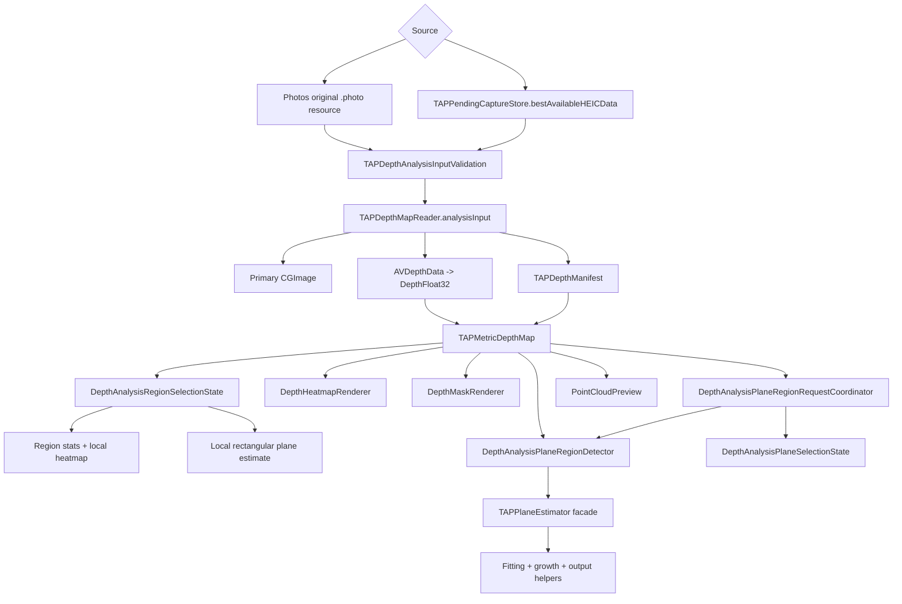
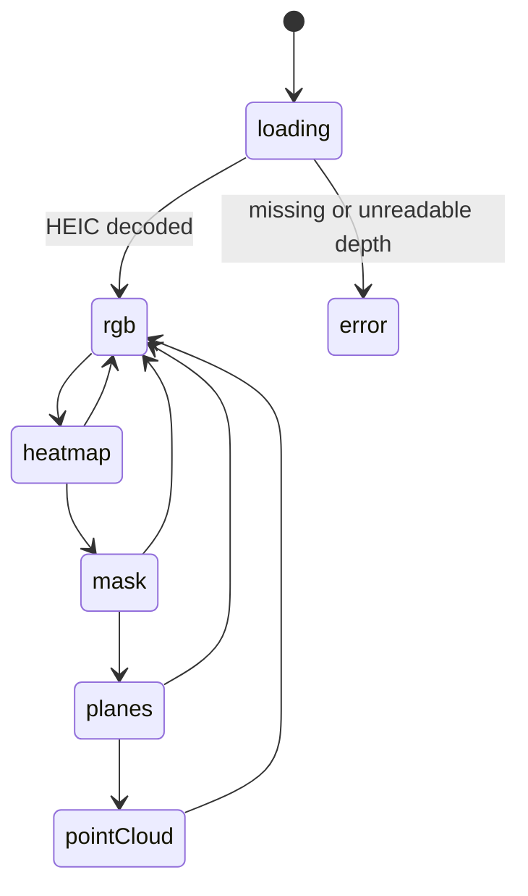
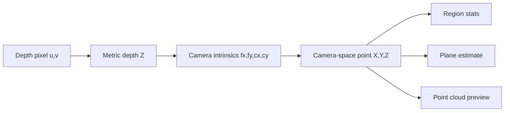

# DepthAnalysis Module

`TAPCamDemo/DepthAnalysis` is an independent reader and inspection surface for
saved or pending TAP HEIC files. It does not configure the live camera and does
not mutate capture output. It reads original HEIC bytes, reconstructs metric
depth, and renders analysis views for RGB, heatmap, valid mask, planes, and
point cloud.

## Code Map

| Responsibility | Code |
| --- | --- |
| Photos album browser | [DepthAlbumPickerView.swift](DepthAlbumPickerView.swift) |
| Analysis HEIC source loading and decode handoff | [DepthAnalysisInputLoader.swift](DepthAnalysisInputLoader.swift) |
| Public-safe analysis, album, and Planes error copy | [DepthAnalysisErrorPresentation.swift](DepthAnalysisErrorPresentation.swift) |
| TAP Library item loading, pending/exported/Photos merge, route anchors, and item cache keys | [DepthAlbumItemProvider.swift](DepthAlbumItemProvider.swift) |
| Main analysis screen source entry, loading/error shell, view-model lifetime, and route callbacks | [DepthAnalysisView.swift](DepthAnalysisView.swift) |
| Central visual stage for RGB, heatmap, mask, planes, point cloud, region gestures, and plane seed taps | [DepthAnalysisStageView.swift](DepthAnalysisStageView.swift) |
| Bottom mode controls, inspector strip, and adaptive panel presentation | [DepthAnalysisControlsView.swift](DepthAnalysisControlsView.swift) |
| Field-level panel content adapter for concrete inspector bodies | [DepthAnalysisInspectorPanelContent.swift](DepthAnalysisInspectorPanelContent.swift) |
| Analysis view-mode model, labels, icons, debug-only mode flag, and explanations | [DepthAnalysisViewMode.swift](DepthAnalysisViewMode.swift) |
| Public-safe capture metadata summary model and debug-only HUD from manifest payload summary fields | [DepthAnalysisMetadataHUD.swift](DepthAnalysisMetadataHUD.swift) |
| Analysis loading and selection-state bridging | [DepthAnalysisViewModel.swift](DepthAnalysisViewModel.swift) |
| Rectangular region selection state and derived products | [DepthAnalysisRegionSelectionState.swift](DepthAnalysisRegionSelectionState.swift) |
| Planes seed selection, strictness, loading, error, and selected-region state | [DepthAnalysisPlaneSelectionState.swift](DepthAnalysisPlaneSelectionState.swift) |
| Plane geometry prewarm and seed-region calculation boundary | [DepthAnalysisPlaneRegionDetector.swift](DepthAnalysisPlaneRegionDetector.swift) |
| Async Planes request freshness, debounce, cancellation, and geometry-cache reuse | [DepthAnalysisPlaneRegionRequestCoordinator.swift](DepthAnalysisPlaneRegionRequestCoordinator.swift) |
| Planes algorithm facade, fitting, seed growth, and output products | [AnalysisTools/README.md](AnalysisTools/README.md) |
| TAP Library thumbnail derivation, memory cache, and protected disk cache | [DepthAlbumThumbnailPipeline.swift](DepthAlbumThumbnailPipeline.swift) |
| Interactive image, selection gestures, and plane overlays | [DepthAnalysisInteractiveImage.swift](DepthAnalysisInteractiveImage.swift) |
| Panel-controls index for the split panel files | [DepthAnalysisPanelControls.swift](DepthAnalysisPanelControls.swift) |
| Shared panel support values and button hint model | [DepthAnalysisPanelSupport.swift](DepthAnalysisPanelSupport.swift) |
| Bottom view-mode and inspector strip with scroll-position sync | [DepthAnalysisInspectorStrip.swift](DepthAnalysisInspectorStrip.swift) |
| Adaptive analysis panel shell, pure height metrics, measurement, and debug layout log | [DepthAnalysisPanelLayer.swift](DepthAnalysisPanelLayer.swift) |
| Shared inspector help text, legends, metric rows, and region-stats presentation | [DepthAnalysisInspectors.swift](DepthAnalysisInspectors.swift) |
| Measurements inspector for rectangular depth stats and local plane summary | [DepthAnalysisMeasurementsInspectorContent.swift](DepthAnalysisMeasurementsInspectorContent.swift) |
| Legend inspector for RGB, heatmap, mask, planes, and point-cloud modes | [DepthAnalysisLegendInspectorContent.swift](DepthAnalysisLegendInspectorContent.swift) |
| Region inspector and selected-area local heatmap loupe | [DepthAnalysisRegionInspectorContent.swift](DepthAnalysisRegionInspectorContent.swift) |
| Plane filter inspector, strictness binding, and plane metrics | [DepthAnalysisPlaneFilterInspectorContent.swift](DepthAnalysisPlaneFilterInspectorContent.swift) |
| Overlay opacity and point-cloud info inspectors | [DepthAnalysisOverlayCloudInspectors.swift](DepthAnalysisOverlayCloudInspectors.swift) |
| HEIC, auxiliary depth, manifest, and calibration reader | [DepthAnalysisReader.swift](DepthAnalysisReader.swift) |
| HEIC byte budget, depth-map shape budget, sample-count, and calibration validation | [DepthAnalysisInputValidation.swift](DepthAnalysisInputValidation.swift) |
| Analysis input and metric depth models | [DepthAnalysisModels.swift](DepthAnalysisModels.swift) |
| Orientation mapping | [DepthOrientationMapper.swift](DepthOrientationMapper.swift) |
| Settings shell and authorization status surface | [DepthAnalyzerSettingsView.swift](DepthAnalyzerSettingsView.swift) |
| Settings App Attest section using public-safe status and redacted key ID presentation | [DepthAnalyzerAppAttestSection.swift](DepthAnalyzerAppAttestSection.swift) |
| Heatmap, mask, plane, and point-cloud tools | [AnalysisTools/README.md](AnalysisTools/README.md) |

## Reading Order

If this module is new to you, read it in this order:

1. [DepthAnalysisModels.swift](DepthAnalysisModels.swift) defines the shared
   input, depth map, region, and plane model types.
2. [DepthAnalysisInputValidation.swift](DepthAnalysisInputValidation.swift)
   defines the fail-closed input contract for HEIC byte count, primary-image
   dimensions, depth-map pixel budget, sample count, and usable calibration
   intrinsics.
3. [DepthAnalysisReader.swift](DepthAnalysisReader.swift) turns original HEIC
   bytes into those model types.
4. [DepthAnalysisInputLoader.swift](DepthAnalysisInputLoader.swift) owns the
   `DepthAnalysisSource` routing from Photos or pending capture to HEIC bytes,
   then hands those bytes to the reader.
5. [DepthAlbumItemProvider.swift](DepthAlbumItemProvider.swift) owns TAP Library
   item loading, pending/exported/Photos merge rules, duplicate suppression,
   route anchors, and item-level thumbnail cache keys.
6. [DepthAlbumThumbnailPipeline.swift](DepthAlbumThumbnailPipeline.swift) owns
   Photos thumbnail requests, JPEG normalization, in-memory cache lookup, and
   protected disk-cache writes for the TAP Library grid.
7. [DepthAlbumPickerView.swift](DepthAlbumPickerView.swift) owns the TAP Library
   grid UI, scroll restoration, item selection, and navigation into analysis.
8. [DepthAnalysisRegionSelectionState.swift](DepthAnalysisRegionSelectionState.swift)
   owns rectangular region selection, clamping, region stats, local heatmap
   generation, and local plane estimate generation. It receives only a loaded
   depth map and a rectangle.
9. [DepthAnalysisPlaneSelectionState.swift](DepthAnalysisPlaneSelectionState.swift)
   owns Planes-mode seed selection, strictness, loading, error, and selected
   region state. It receives only a loaded depth map, a depth-space point, or a
   detector result. Failed detector results pass through
   `DepthAnalysisErrorPresentation` before the Plane Filter inspector can show
   the error text.
10. [DepthAnalysisPlaneRegionDetector.swift](DepthAnalysisPlaneRegionDetector.swift)
   owns plane geometry cache building and seed-region calculation. It is local
   analysis only: it does not read Photos, write exports, or validate proofs.
11. [DepthAnalysisPlaneRegionRequestCoordinator.swift](DepthAnalysisPlaneRegionRequestCoordinator.swift)
   owns async Planes request cancellation, request freshness, strictness
   debounce, prewarm task scheduling, and geometry-cache reuse. It receives
   only loaded depth maps, seed points, strictness values, and detector results.
12. [AnalysisTools/README.md](AnalysisTools/README.md) gives the Planes
   algorithm reading path: projector, estimator facade, fitting helpers,
   seed/BFS growth, and output-product builders. Read this before changing
   thresholds or Planes result metrics.
   [../../TAPCamDemoTests/TAPDepthAnalysisPlaneRegionTests.swift](../../TAPCamDemoTests/TAPDepthAnalysisPlaneRegionTests.swift)
   is the focused test entry for camera-space geometry, Planes estimator/growth,
   detector cache build/reuse, and async request cache/freshness behavior.
13. [DepthAnalysisViewModel.swift](DepthAnalysisViewModel.swift) owns analysis
   load state and selection-state bridging. It consumes the input loader,
   region-selection state, plane-selection state, plane-region detector, and
   request coordinator instead of reading Photos, pending storage, or analysis
   algorithms directly.
14. [DepthAnalysisViewMode.swift](DepthAnalysisViewMode.swift) owns the mode
   labels, icons, explanations, legend text, and debug-only mode flag used by
   the screen, strip, and tests.
15. [DepthAnalysisView.swift](DepthAnalysisView.swift) is the source entry and
   screen shell. It owns view-model lifetime, loaded/error states, mode-switch
   side effects, panel destination routing, and top-level callbacks.
16. [DepthAnalysisStageView.swift](DepthAnalysisStageView.swift) owns the
   central visual stage for RGB, heatmap, mask, planes, and point cloud. It
   receives display-ready images, the loaded local depth map, local selection
   bindings, a capture metadata summary, and gesture callbacks; it does not
   receive sources, manifests, proofs, identifiers, Photos handles, pending
   store handles, geometry caches, or export state.
17. [DepthAnalysisControlsView.swift](DepthAnalysisControlsView.swift) owns the
   bottom mode controls, inspector strip, panel presentation, panel animation,
   and button-hint routing.
18. [DepthAnalysisInspectorPanelContent.swift](DepthAnalysisInspectorPanelContent.swift)
   adapts field-level image/depth/stats/selection values into concrete
   inspector bodies. Read it before changing which data an inspector is allowed
   to see.
19. [DepthAnalysisMetadataHUD.swift](DepthAnalysisMetadataHUD.swift) owns the
   capture metadata summary and the debug-only HUD. The summary uses only the
   optional manifest payload's lens/source/zoom fields. Free-form manifest
   display strings are normalized through fixed fallbacks when they look like
   paths, URLs, proofs, App Attest key IDs, capture IDs, asset IDs, manifest
   IDs, or token values; the HUD does not display proof, App Attest key,
   Photos, pending, or export identifiers.
20. [DepthAnalysisInteractiveImage.swift](DepthAnalysisInteractiveImage.swift)
   owns image-space gestures, rectangle selection, plane seed taps, and overlay
   drawing.
21. [DepthAnalysisPanelControls.swift](DepthAnalysisPanelControls.swift) is an
   index for the split panel files.
22. [DepthAnalysisPanelSupport.swift](DepthAnalysisPanelSupport.swift),
   [DepthAnalysisInspectorStrip.swift](DepthAnalysisInspectorStrip.swift), and
   [DepthAnalysisPanelLayer.swift](DepthAnalysisPanelLayer.swift) own shared
   panel support, the bottom view/inspector strip, and the adaptive panel shell.
   `AnalysisPanelLayoutMetrics` is the pure policy for the panel content max
   height, pre-measurement viewport height, and scroll-indicator threshold.
23. [DepthAnalysisInspectors.swift](DepthAnalysisInspectors.swift) owns shared
   inspector primitives and `DepthRegionStatsPresentation`, the shared visible
   text boundary for rectangular depth stats. The concrete panel bodies live in
   [DepthAnalysisMeasurementsInspectorContent.swift](DepthAnalysisMeasurementsInspectorContent.swift),
   [DepthAnalysisLegendInspectorContent.swift](DepthAnalysisLegendInspectorContent.swift),
   [DepthAnalysisRegionInspectorContent.swift](DepthAnalysisRegionInspectorContent.swift),
   [DepthAnalysisPlaneFilterInspectorContent.swift](DepthAnalysisPlaneFilterInspectorContent.swift),
   and [DepthAnalysisOverlayCloudInspectors.swift](DepthAnalysisOverlayCloudInspectors.swift).
24. [AnalysisTools/README.md](AnalysisTools/README.md) is the entry point for
   heatmap, mask, plane, and point-cloud implementations.

## Inspector/HUD Presentation Map

Use this table before reading the concrete inspector files. It names the
visible surface, the code owner, the tests that protect the current contract,
and the evidence that still requires UI or device review.

Presentation/privacy model tests live in
[../../TAPCamDemoTests/TAPDepthAnalysisPresentationTests.swift](../../TAPCamDemoTests/TAPDepthAnalysisPresentationTests.swift);
fixed error-copy and hostile sink guards live in
[../../TAPCamDemoTests/DepthAnalysisErrorPresentationTests.swift](../../TAPCamDemoTests/DepthAnalysisErrorPresentationTests.swift).
Selection-state and ViewModel selection-bridge tests live in
[../../TAPCamDemoTests/TAPDepthAnalysisSelectionTests.swift](../../TAPCamDemoTests/TAPDepthAnalysisSelectionTests.swift).
Plane geometry, detector, and request-coordinator tests live in
[../../TAPCamDemoTests/TAPDepthAnalysisPlaneRegionTests.swift](../../TAPCamDemoTests/TAPDepthAnalysisPlaneRegionTests.swift).

| Surface | Trigger | Owning file | Covered tests | Remaining evidence |
| --- | --- | --- | --- | --- |
| DEBUG metadata HUD | A loaded analysis input has a manifest payload and the stage is built in DEBUG | [DepthAnalysisMetadataHUD.swift](DepthAnalysisMetadataHUD.swift) | `TAPDepthAnalysisPresentationTests`: `captureMetadataSummaryRequiresPayload`, `captureMetadataSummaryPublishesExpectedPublicText`, `captureMetadataSummaryOmitsIdentifiersAndLocation`, `captureMetadataSummaryFallsBackForSensitiveManifestDisplayFields`, `captureMetadataSummaryFallsBackForDepthSourceDeviceName` | Visual HUD layout still needs UI regression evidence |
| Inspector panel adapter | A bottom inspector route is selected | [DepthAnalysisInspectorPanelContent.swift](DepthAnalysisInspectorPanelContent.swift) | `TAPDepthAnalysisPresentationTests`: `analysisViewModesPublishInspectorRoutes`, `analysisPanelDestinationSelectsInspectorsOnly` | Inspector body layout still needs UI regression evidence |
| Adaptive panel height metrics | A panel's measured content height changes | [DepthAnalysisPanelLayer.swift](DepthAnalysisPanelLayer.swift) | `analysisPanelLayoutMetricsUsesOnePointViewportBeforeMeasurement`, `analysisPanelLayoutMetricsFitsShortMeasuredContentWithoutScrolling`, `analysisPanelLayoutMetricsCapsOverflowingContentAndEnablesScrolling`, `analysisPanelLayoutMetricsKeepsMinimumContentHeightForSmallPanels` | Pure metrics only; rendered SwiftUI panel layout and screenshot evidence still need UI regression coverage |
| Inspector visible errors | Region heatmap or Plane selection fails | [DepthAnalysisErrorPresentation.swift](DepthAnalysisErrorPresentation.swift), [DepthAnalysisInspectorPanelContent.swift](DepthAnalysisInspectorPanelContent.swift) | `depthAnalysisInspectorErrorMessageKeepsRegionHeatmapCopyPublicSafe`, `depthAnalysisInspectorErrorMessageKeepsPlaneSelectionCopyPublicSafe`, `depthAnalysisInspectorViewsDoNotAcceptRawErrorStringSinks` | Real-device unified-log evidence remains separate |
| Measurements and Region inspectors | A rectangular region is selected outside Planes mode | [DepthAnalysisInspectors.swift](DepthAnalysisInspectors.swift), [DepthAnalysisMeasurementsInspectorContent.swift](DepthAnalysisMeasurementsInspectorContent.swift), [DepthAnalysisRegionInspectorContent.swift](DepthAnalysisRegionInspectorContent.swift) | `TAPDepthAnalysisSelectionTests` covers region clamping, stats, local heatmap, local plane estimate, and ViewModel selection bridge. `TAPDepthAnalysisPresentationTests` covers shared region-stats presentation text. `DepthAnalysisErrorPresentationTests` covers typed public-safe local-heatmap failure text. | Visual measurement rows and loupe layout still need UI evidence |
| Plane Filter inspector | A Planes seed request is active or has a selected region | [DepthAnalysisPlaneFilterInspectorContent.swift](DepthAnalysisPlaneFilterInspectorContent.swift) | `TAPDepthAnalysisSelectionTests` covers seed, strictness, loading, selected-region, clear, and fixed public-safe failure text. `TAPDepthAnalysisPlaneRegionTests` covers geometry guardrails, detector build/reuse, request-coordinator latest-result, and cache-reuse behavior. | Visual strictness control and plane-result layout still need UI evidence |
| Legend, Overlay, and Cloud inspectors | View mode exposes legend, overlay, or point-cloud details | [DepthAnalysisLegendInspectorContent.swift](DepthAnalysisLegendInspectorContent.swift), [DepthAnalysisOverlayCloudInspectors.swift](DepthAnalysisOverlayCloudInspectors.swift) | `TAPDepthAnalysisPresentationTests` covers labels, icons, explanations, debug-only mode flags, and per-mode inspector routes | Inspector body layout still needs UI evidence |

## Human Acceptance Path

Use the first list for read-only code and documentation review. Use the second
list for attended device or UI checks that code reading alone cannot prove.

### Read-Only Review

1. Read [DepthAnalysisModels.swift](DepthAnalysisModels.swift) and
   [DepthAnalysisReader.swift](DepthAnalysisReader.swift) first. They define
   the analysis input and show how original HEIC bytes become image, depth,
   manifest, heatmap, and mask values.
2. Read [DepthAnalysisInputValidation.swift](DepthAnalysisInputValidation.swift)
   for the input contract. It is the single place that names the HEIC byte
   budget, primary-image dimension budget, depth-map pixel budget, sample-count
   invariant, finite positive sample requirement, and usable calibration
   intrinsics. Invalid or missing calibration still permits RGB, Heatmap, and
   Valid Mask analysis; Planes and Point Cloud require usable intrinsics.
3. Read [DepthAnalysisInputLoader.swift](DepthAnalysisInputLoader.swift) for the
   source-to-HEIC boundary. Photos items load original Photos data; pending
   items load the best available local HEIC and map missing pending artifacts to
   a generic temporary-unavailable analysis error.
   [../../TAPCamDemoTests/TAPDepthAnalysisInputTests.swift](../../TAPCamDemoTests/TAPDepthAnalysisInputTests.swift)
   is the focused test entry for input validation, reader input rejection,
   Photos/pending source routing, and the `DepthAnalysisViewModel.load(source:)`
   load-error bridge.
4. Read [DepthAnalysisErrorPresentation.swift](DepthAnalysisErrorPresentation.swift)
   for fixed user-visible album, analysis load, and Planes selection errors.
   Raw Photos errors, reader errors, paths, asset IDs, pending capture IDs, and
   local analysis errors should not be passed directly into visible SwiftUI text.
5. Read [DepthAlbumItemProvider.swift](DepthAlbumItemProvider.swift) for the
   pending/exported/Photos merge. Confirm exported owned assets suppress their
   duplicate Photos-only item, items sort by captured time, and Photos album
   read failures still allow pending items to appear.
6. Read [DepthAlbumThumbnailPipeline.swift](DepthAlbumThumbnailPipeline.swift)
   for the thumbnail cache key, Photos thumbnail request, JPEG normalization,
   and protected disk-cache write. Cache filenames are hashes, not raw Photos or
   pending identifiers.
7. Read [DepthAnalysisRegionSelectionState.swift](DepthAnalysisRegionSelectionState.swift)
   for rectangular region state. It receives a depth map and rectangle, then
   produces selection, stats, local heatmap, and local plane estimate values. It
   does not hold asset IDs, capture IDs, manifests, proofs, App Attest key IDs,
   Photos handles, pending store handles, or export state.
8. Read [DepthAnalysisPlaneSelectionState.swift](DepthAnalysisPlaneSelectionState.swift)
   for Planes seed-selection state. It owns strictness, seed point, selected
   region, loading, and the already-presented error text for an already-loaded
   depth map. It does not hold asset IDs, capture IDs, manifests, proofs, App
   Attest key IDs, Photos handles, pending store handles, geometry caches, async
   tasks, or export state.
   [../../TAPCamDemoTests/TAPDepthAnalysisSelectionTests.swift](../../TAPCamDemoTests/TAPDepthAnalysisSelectionTests.swift)
   is the focused test entry for rectangular region selection, Planes
   seed-selection state, and `DepthAnalysisViewModel.finishSelection` /
   `clearSelection` bridging. It does not prove real gestures, SwiftUI layout,
   Photos limited-access behavior, App Attest/backend acceptance, or positive
   real HEIC acceptance.
9. Read [DepthAnalysisPlaneRegionDetector.swift](DepthAnalysisPlaneRegionDetector.swift)
   for the plane-region calculation boundary. It accepts an already-loaded
   depth map, reuses or builds image-local geometry, and calls the plane
   estimator. It does not touch Photos, pending export state, App Attest, or
   provenance validation.
10. Read [DepthAnalysisPlaneRegionRequestCoordinator.swift](DepthAnalysisPlaneRegionRequestCoordinator.swift)
   for async Planes request ownership. It owns task cancellation, request IDs,
   strictness debounce, geometry prewarm scheduling, and image-local
   geometry-cache reuse. It does not hold sources, manifests, HEIC bytes,
   proofs, App Attest key IDs, Photos handles, pending store handles, or export
   state.
   [../../TAPCamDemoTests/TAPDepthAnalysisPlaneRegionTests.swift](../../TAPCamDemoTests/TAPDepthAnalysisPlaneRegionTests.swift)
   is the focused test entry for projector/intrinsics guardrails, seed-grown
   plane regions, detector geometry cache reuse, and async request freshness.
11. Read [DepthAnalysisViewModel.swift](DepthAnalysisViewModel.swift) for UI
   state bridging. It still owns load coordination and maps coordinator events
   into `DepthAnalysisPlaneSelectionState`, but source loading, rectangular
   selection products, synchronous Planes state, async Planes request lifecycle,
   and plane-region calculation are delegated.
12. Read [DepthAnalysisViewMode.swift](DepthAnalysisViewMode.swift) after the
   model boundaries. It owns labels, icons, explanations, debug-only mode flags,
   and the inspector routes each mode can show.
13. Read [DepthAnalysisView.swift](DepthAnalysisView.swift),
   [DepthAnalysisStageView.swift](DepthAnalysisStageView.swift),
   [DepthAnalysisControlsView.swift](DepthAnalysisControlsView.swift), and
   [DepthAnalysisInspectorPanelContent.swift](DepthAnalysisInspectorPanelContent.swift)
   together. The view is the source entry and screen shell; the stage owns the
   central visual mode switch; the controls own panel presentation; the panel
   content adapter is where field-level values are passed to concrete
   inspectors.
14. Read [DepthAnalysisMetadataHUD.swift](DepthAnalysisMetadataHUD.swift) for
   capture metadata presentation. `CaptureMetadataSummary` is a small summary
   model used by the stage, while the visible HUD remains debug-only. It
   consumes only manifest payload summary fields and falls back to fixed public
   labels when free-form manifest display strings look like paths, URLs,
   proofs, App Attest key IDs, capture IDs, asset IDs, manifest IDs, or token
   values.
15. Read [DepthAnalysisPanelControls.swift](DepthAnalysisPanelControls.swift),
   [DepthAnalysisPanelSupport.swift](DepthAnalysisPanelSupport.swift),
   [DepthAnalysisInspectorStrip.swift](DepthAnalysisInspectorStrip.swift), and
   [DepthAnalysisPanelLayer.swift](DepthAnalysisPanelLayer.swift) for the bottom
   controls and panel shell. `AnalysisPanelLayoutMetrics` is the pure adaptive
   height policy; the SwiftUI view still owns measurement preferences and
   rendering. These files receive route/model values, bindings, and content
   closures; they should not receive `TAPDepthAnalysisInput`,
   `DepthAnalysisSource`, Photos identifiers, pending identifiers, manifests,
   proofs, App Attest key IDs, or export state.
16. Read [DepthAnalysisInspectors.swift](DepthAnalysisInspectors.swift),
   [DepthAnalysisMeasurementsInspectorContent.swift](DepthAnalysisMeasurementsInspectorContent.swift),
   [DepthAnalysisLegendInspectorContent.swift](DepthAnalysisLegendInspectorContent.swift),
   [DepthAnalysisRegionInspectorContent.swift](DepthAnalysisRegionInspectorContent.swift),
   [DepthAnalysisPlaneFilterInspectorContent.swift](DepthAnalysisPlaneFilterInspectorContent.swift),
   and [DepthAnalysisOverlayCloudInspectors.swift](DepthAnalysisOverlayCloudInspectors.swift)
   for inspector UI. `DepthRegionStatsPresentation` is the shared text boundary
   for Measurements and Region depth-stat rows. These files receive field-level
   image, depth, stats, selection, mode, and binding values; they do not receive
   `DepthAnalysisSource`, `TAPDepthAnalysisInput`, Photos identifiers, pending
   capture identifiers, manifests, proofs, App Attest key IDs, or export state.

### Attended Device Or UI Review

1. Open TAP Library from the camera screen and confirm the grid can show pending
   records, exported pending records, and app-owned Photos assets.
2. Read [DepthAlbumPickerView.swift](DepthAlbumPickerView.swift) for route
   restoration, item selection, and navigation to analysis. Pending items open
   with `pendingCaptureID`; owned and Photos-only items open with `assetID`.
3. Open an item and verify RGB, Planes, and Point Cloud modes remain available.
   Heatmap and Valid Mask are still debug-only buttons.
4. In RGB/Heatmap/Mask modes, use rectangular selection to inspect a region.
   In Planes mode, tap a seed point; rectangular selection is intentionally
   disabled there so plane growth and region measurement stay separate.
5. Treat this module as a local reader. It may read pending or saved TAP HEIC
   files, but App Attest proof validation and final export trust remain in the
   capture/output pipeline.

Photos limited-access behavior, deletion while the app is backgrounded, and
TAP Library UI restoration still need attended real-device or UI-regression
evidence. The model tests cover source routing, rectangular region products,
Planes selection state, async plane-region request coordination, plane-region
detector behavior, merge rules, and partial failure behavior, not those
platform flows.

## Data Flow



## View Modes



The UI keeps analysis separate from capture. `DepthAnalysisView` can open a
Photos asset or a pending capture ID. Pending capture reads use the best
available local HEIC, preferring `signed.heic` and falling back to
`unsigned.heic`.

`DepthAnalysisView` is intentionally a shell now. `DepthAnalysisStageView`
receives display-ready local analysis values for the central stage, while
`DepthAnalysisControlsView` and `AnalysisInspectorPanelContent` keep panel
routing and field-level inspector data out of the screen entry.

TAP Library item construction is split from the grid UI.
[DepthAlbumItemProvider.swift](DepthAlbumItemProvider.swift) reads visible
pending records, exported records, and app-owned Photos assets, then creates one
current in-memory item list. Raw Photos and pending identifiers remain private
inputs for opening the selected item and deriving route-restore tokens; the
durable route context stores HMAC tokens, not those raw identifiers.

Analysis input loading is split from the analysis state model.
[DepthAnalysisInputLoader.swift](DepthAnalysisInputLoader.swift) resolves
`DepthAnalysisSource` to HEIC bytes and calls `TAPDepthMapReader.analysisInput`.
Pending capture read failures trigger a TAP Library refresh and use a generic
temporary-unavailable message rather than exposing raw capture identifiers or
storage details to the UI.
[../../TAPCamDemoTests/TAPDepthAnalysisInputTests.swift](../../TAPCamDemoTests/TAPDepthAnalysisInputTests.swift)
proves this local reader safety boundary with Simulator tests. It does not
prove final Photos export trust, backend App Attest acceptance, positive real
HEIC fixture acceptance, or Photos limited-access behavior.

Plane-region calculation is split from the analysis state model.
[DepthAnalysisPlaneRegionDetector.swift](DepthAnalysisPlaneRegionDetector.swift)
builds image-local camera-space geometry and grows seed-selected plane regions
from an already-loaded depth map. [DepthAnalysisPlaneRegionRequestCoordinator.swift](DepthAnalysisPlaneRegionRequestCoordinator.swift)
owns async request cancellation, request freshness, debounce, prewarm task
scheduling, and geometry-cache reuse. `DepthAnalysisViewModel` maps coordinator
events into `DepthAnalysisPlaneSelectionState`; the detector owns only local
analysis work.
[../../TAPCamDemoTests/TAPDepthAnalysisPlaneRegionTests.swift](../../TAPCamDemoTests/TAPDepthAnalysisPlaneRegionTests.swift)
proves this local geometry, detector, and request-coordinator boundary. It does
not prove Photos or pending-source loading, App Attest proof creation, backend
verification, final Photos export, real gestures, rendered SwiftUI layout, or
positive real HEIC acceptance.

Rectangular region analysis is split from the view model.
[DepthAnalysisRegionSelectionState.swift](DepthAnalysisRegionSelectionState.swift)
owns region selection, clamping, stats, local heatmap, and local plane estimate
products. It consumes only the already-loaded metric depth map plus a rectangle,
so private route identifiers and provenance state stay outside this local UI
model.
[../../TAPCamDemoTests/TAPDepthAnalysisSelectionTests.swift](../../TAPCamDemoTests/TAPDepthAnalysisSelectionTests.swift)
proves the local region and Planes selection states plus the ViewModel
finish/clear bridge. It does not replace the focused plane-region suite,
renderer checks, or rendered UI evidence.

This loader is not a provenance or export gate. It may decode unsigned pending
HEIC bytes for local analysis, and the reader may expose a decoded TAP manifest,
but that does not mean the image has a verified App Attest proof. Final export
trust stays in the capture/output pipeline.

Album thumbnail rendering keeps an in-memory cache plus a disk cache under the
app Caches directory. [DepthAlbumThumbnailPipeline.swift](DepthAlbumThumbnailPipeline.swift)
owns the cache key, Photos thumbnail request, JPEG normalization, and cache
writes. Disk cache writes use `TAPLocalArtifactStoragePolicy.privatePhotoArtifact`
for the same file protection policy as pending TAP Library thumbnails. The
cache has no custom retention timer; it follows the normal app Caches lifecycle
and can be rebuilt from pending records or Photos assets.

## Geometry Flow



For a depth pixel `(u, v)` with metric depth `Z`, the analysis module uses the
pinhole model from `AVCameraCalibrationData.intrinsicMatrix`:

```text
X = (u - cx) / fx * Z
Y = (v - cy) / fy * Z
Z = depthMeters
```

## Limits

Single-photo RGB-D analysis can estimate visible-surface depth and approximate
coplanarity. It is not full 3D reconstruction: there is no stable world
coordinate system, no hidden geometry behind visible objects, and no
multi-frame mesh.

For plane details, read
[Documentation/PlanesTechnicalDesign.md](Documentation/PlanesTechnicalDesign.md).
