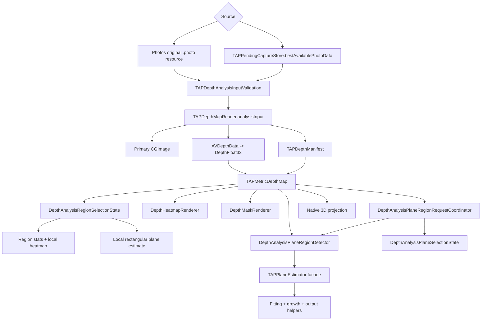
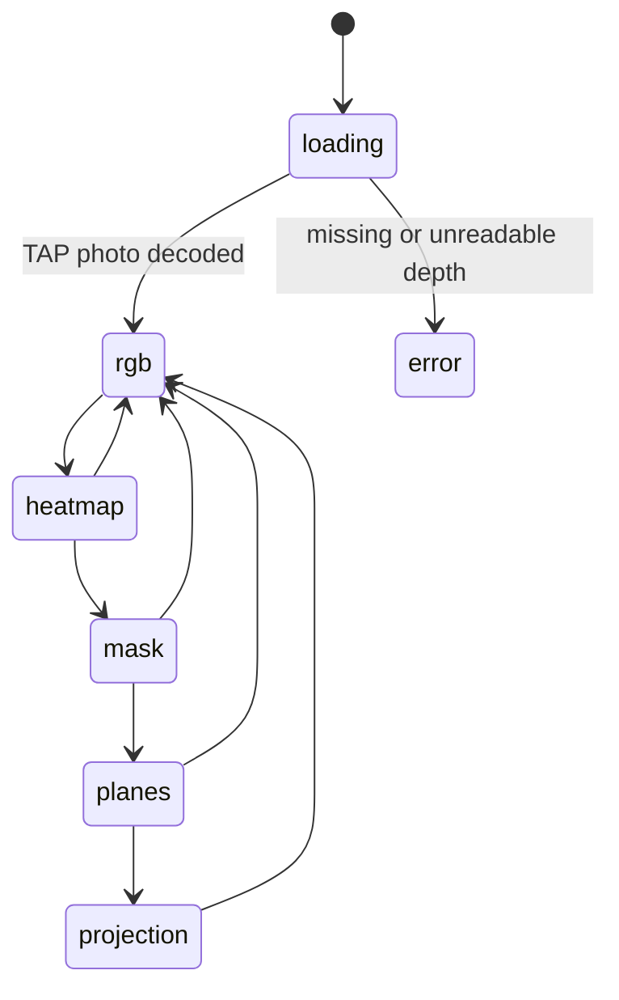
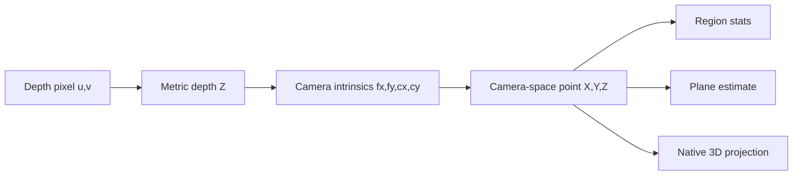

# DepthAnalysis Module

`TAPCamDemo/DepthAnalysis` is an independent reader and inspection surface for
saved or pending TAP depth photo files. It does not configure the live camera
and does not mutate capture output. It reads original HEIC or JPG bytes,
requires the TAP manifest plus Apple auxiliary depth, reconstructs metric depth,
and renders a Photos-style browser with a stable carousel plus centered
`RAW` / `2D` / `3D` primary surfaces.

The Photos-like feel is intentionally delegated to UIKit where it matters:
`DepthAnalysisView` wraps a `UIScrollView.isPagingEnabled` shell for horizontal
photo switching, keeps only previous/current/next page hosts alive, separates
RAW display-image loading from 2D/3D depth-analysis loading, uses a nested
`UIScrollView + UIImageView` for RAW pinch/double-tap zoom, and renders 2D/3D
inside the same centered aspect-fit rectangle as the RAW photo. Page content
leaves an 18pt black gap between neighboring photos.

This README is the current implementation-ownership document for the
user-facing **TAP Library** and Viewer. Product behavior is constrained by
[ProductContract.md](../../Docs/ProductContract.md), while visible UI revisions
follow [UIPrototypeContract.md](../../Docs/UIPrototypeContract.md).

Terminology is strict:

- **TAP Library** means the user-facing mixed-media grid and Viewer. Its route
  is `DepthAlbumPickerView` -> `DepthAnalysisView` inside this module.
- **Pending Capture Queue** means the app-private signing, Photos export, retry,
  and cleanup queue. Its implementation module retains the legacy filesystem
  name `TAPCamDemo/TAPLibrary`, but product and architecture prose must not call
  that private queue the TAP Library.

## Current Viewer Contract

The current Viewer is the Photos-style mixed-media browser. It keeps one
canonical order across still photos, Live Photos, and TAP Video and provides:

- native horizontal previous/current/next paging with an 18pt black inter-page
  gap and UIKit endpoint rubber-band bounce;
- stable Back, Share, and Delete chrome;
- a centered icon-only `RAW / 2D / 3D` bottom capsule;
- RAW pinch, pan while zoomed, and double-tap zoom;
- centered aspect-fit 2D and static-photo 3D surfaces aligned to the visible
  RAW photo;
- native Live Photo press-and-hold playback; and
- foreground TAP Video RAW playback and registered 2D playback with app-owned
  transport controls above the shared toolbar.

Paging and fixed chrome must remain mounted while thumbnails, originals, depth,
video resources, and first frames load. One drag freezes its mixed-media window
until landing so a concurrent TAP Library refresh cannot reinterpret the
gesture. Only the committed video owns an `AVPlayer`; adjacent video pages are
poster-only. A committed video keeps its poster above the warming
`AVPlayerLayer` until `isReadyForDisplay` reports a real frame. It does not
embed interactive SwiftUI controls in an `AVPlayerViewController` overlay.
Pending-to-owned migration and late Live Photo classification update the
current renderer by item revision instead of rebuilding the pager or chrome.
External removal selects the nearest remaining item or closes an empty Viewer.

TAP Video 3D remains a future feature tracked by `TAP-0016`. Its visible entry
may show one localized `Coming soon` edge toast, but it must not change the
selected mode or playback state.

The following are deprecated designs, not Todo items and not current UI:

- the tool drawer, up-swipe drawer/Verify action, down-swipe dismissal, and
  half/full detents;
- top-level Heatmap, Overlay, or Mask mode buttons; and
- a fourth credential or Verify mode inside the bottom capsule.

Internal heatmap, mask, plane-selection, and inspector code may remain as
analysis implementation detail. It does not recreate those deprecated
top-level controls. Any future Viewer proposal requires a new Task and an
approved Web prototype; it does not revive a deprecated interaction by default.

## Current Static-Photo 3D Contract

Static-photo `3D` is a native point projection for an eligible photo with
usable depth and calibration. Release calls it a **3D projection**, not a point
cloud, scan, reconstruction, mesh, digital twin, or world-space model.

- SceneKit is the current renderer. A possible Metal replacement is only the
  evidence-triggered technical option tracked by `TAP-0034`.
- Display orientation is applied once to geometry and camera intrinsics. RGB
  sampling and selected-plane membership remain in native pixel space.
- Depth pixels are back-projected with `fx / fy / cx / cy` into capture-camera
  space and mapped to SceneKit's camera-facing `-Z`; geometry is not normalized
  into an arbitrary display cube.
- The configured camera keeps the capture-camera projection. Custom gestures
  transform the interaction root rather than replacing the camera or projection
  matrix; SceneKit's default camera controller remains disabled.
- One-finger drag orbits, two-finger drag pans, pinch scales, two-finger rotation
  rolls, and double-tap resets the capture-camera view. Gesture ownership stays
  inside the 3D container; paging begins only outside it.
- Selected 2D plane pixels may render as a separate highlight overlay. Reduce
  Motion disables motion-dependent decoration and gyroscope movement.

## Share And Delete

Share uses the app-owned, on-demand flow:

1. Open one lightweight TAP Share popover anchored to the Viewer's bottom-left
   Share control. Photo, Live Photo, and TAP Video use this same stable control,
   coordinator, presentation, and preparation state machine.
2. Keep credential state, format selection, hidden fast preparation, visible
   progress, cancellation, public-safe failure, and Retry in that one anchored
   app-owned surface. The Viewer, mixed-media pager, playback session, and
   toolbar remain mounted behind it.
3. While the Viewer is open, resolve the complete original from local storage
   or iCloud. Share remains disabled until the photo original, complete Live
   Photo pair, or video original is held by a short-lived Viewer lease.
4. On Share open, freeze that exact lease and recompute its embedded local
   proof/content binding. This checks byte integrity against the embedded digest
   and binding; it does not cryptographically verify the App Attest assertion
   object because the registered public key remains backend-owned. It never
   contacts the TAP backend or App Attest Verify service. The same popover shows
   a text-free skeleton until the three-state result is known.
5. Generate the selected payload only after the user chooses it. Work
   completed within 50 ms does not insert progress UI. If work is still running
   after 50 ms, the popover changes in place to determinate, monotonic progress;
   once shown, progress remains visible for at least 400 ms and reaches 100%
   before handoff.
6. Dismiss the app-owned popover only after the payload is ready, then present
   exactly one sibling system activity controller. TAPCam does not nest,
   imitate, or embed the system destination chooser inside its popover.
7. Remove per-attempt temporary resources after completion, cancellation, or
   dismissal.

TAPCam-owned captures display their persisted credential/protection and
verifiability state. Viewing or sharing one does not run a new backend Verify
operation and does not expose a standalone Verify action. External-media import
and true in-app Verify remain future work tracked by `TAP-0022`; any remaining
verification service or panel files are unmounted legacy implementation, not a
current Viewer route.

Delete follows source ownership:

- exported Photos assets use the system Photos delete request and its single
  system confirmation; TAPCam must not add a second confirmation;
- pending or local-only captures require an app-owned confirmation before the
  Pending Capture Queue removes local data; and
- after deletion, the Viewer selects the item that occupied the next index when
  possible, otherwise the previous item, and closes only when TAP Library is
  empty.

### TAPNAP share artifact lifecycle

`.tapnap` package generation is strictly user-initiated and on demand. Viewer
original loading and Share-open local content binding do not generate a
package; ZIP writing begins only after the user selects the TAPNAP Package row.
The app must never pre-generate a package after signing/export, run
package generation as background prewarming, or retain a persistent `.tapnap`
cache.

The generated package belongs to one active share attempt and stays in a
per-attempt temporary directory only while the system activity controller may
read it. Completion, cancellation, system-share dismissal, or TAP Share popover
dismissal must remove that directory. A later share tap starts a new on-demand
generation. The share path never asks the backend to attest or verify a capture
again; it only checks that the embedded digest/content binding still matches
the exact local or iCloud-downloaded bytes about to be shared. This local gate
must not be described as independent App Attest assertion-authenticity proof.

Still photos and Live Photos can prepare the current `.tapnap` still/live
package contract. TAP Video opens the same TAP Share popover and can prepare an
independent byte-for-byte copy of its original MP4/MOV only after Share Video
is selected. A video `.tapnap` transport is explicitly Coming Soon; the app
does not disguise an MP4 as a still/live package or pre-generate either form.

The three public credential labels remain exactly **Verified**, **Needs
Retry**, and **Failed** (localized in the app). **Needs Retry** comes only from
an unsigned app-private queue resource. Photos/iCloud media does not become
Failed merely because its pending record was cleaned up: it derives identity
from the embedded manifest and runs the local binding check. A mismatch makes
TAPNAP Package unavailable while ordinary image/video sharing remains enabled
with an explicit unverifiability warning. None of these paths calls backend
Verify.

## Code Map

| Responsibility | Code |
| --- | --- |
| Photos album browser shell, loading model, navigation support, item cell, and route adaptation | [DepthAlbumPickerView.swift](DepthAlbumPickerView.swift), [DepthAlbumPickerViewModel.swift](DepthAlbumPickerViewModel.swift), [DepthAlbumPickerNavigationSupport.swift](DepthAlbumPickerNavigationSupport.swift), [TAPLibraryItemCell.swift](TAPLibraryItemCell.swift), [DepthAlbumRouteAdapter.swift](DepthAlbumRouteAdapter.swift) |
| Canonical mixed-media route context plus shared native photo/video paging and bounded adjacent previews | [DepthAlbumRouteAdapter.swift](DepthAlbumRouteAdapter.swift), [TAPLibraryNativePagingView.swift](TAPLibraryNativePagingView.swift), [DepthAnalysisAlbumContext.swift](DepthAnalysisAlbumContext.swift), [Playback/TAPVideoPlaybackRoute.swift](Playback/TAPVideoPlaybackRoute.swift) |
| Analysis photo source loading and decode handoff | [DepthAnalysisInputLoader.swift](DepthAnalysisInputLoader.swift) |
| Stable Analysis carousel window and focused display-fetch, analysis, and selection slot state | [DepthAnalysisCarouselState.swift](DepthAnalysisCarouselState.swift), [AnalysisPhotoSlot.swift](AnalysisPhotoSlot.swift), [AnalysisPhotoSlot+DisplayFetch.swift](AnalysisPhotoSlot+DisplayFetch.swift), [AnalysisPhotoSlot+Analysis.swift](AnalysisPhotoSlot+Analysis.swift), [AnalysisPhotoSlot+Selection.swift](AnalysisPhotoSlot+Selection.swift) |
| Public-safe analysis, album, and Planes error copy | [DepthAnalysisErrorPresentation.swift](DepthAnalysisErrorPresentation.swift) |
| TAP Library item loading, pending/exported/Photos merge, route anchors, and item cache keys | [DepthAlbumItemProvider.swift](DepthAlbumItemProvider.swift) |
| Main analysis screen shell, UIKit paged-scroll carousel, centered `RAW` / `2D` / `3D` surfaces, RAW zoom scroll view, 18pt page gap, left-edge return, and route callbacks | [DepthAnalysisView.swift](DepthAnalysisView.swift) |
| Pure viewer policy for left-edge return thresholds, native page spacing, centered aspect-fit tool containers, and aspect-fit rects | [DepthAnalysisViewerInteractionPolicy.swift](DepthAnalysisViewerInteractionPolicy.swift) |
| Stable full-screen viewer chrome shared by Photo and TAP Video, including Back, Share, Delete, a generic bottom accessory slot, and the shared mode capsule | [DepthAnalysisViewerChromeView.swift](DepthAnalysisViewerChromeView.swift), [DepthAnalysisControlsView.swift](DepthAnalysisControlsView.swift) |
| TAP Video route shell and playback module map | [TAPVideoDepthPlaybackView.swift](TAPVideoDepthPlaybackView.swift), [Playback/PLAYBACK.md](Playback/PLAYBACK.md) |
| Playback session/resource lifecycle, stable chrome, transport, player surface, and depth metadata/decode/render pipeline | [Playback/](Playback/), [Playback/Depth/](Playback/Depth/) |
| Debug-only runtime fixture specification, generator, and harness view | [DiagnosticsSupport/](DiagnosticsSupport/) |
| Central visual stage for RGB, heatmap, mask, planes, internal point projection, region gestures, and plane seed taps | [DepthAnalysisStageView.swift](DepthAnalysisStageView.swift) |
| Viewer toolbar: bottom-left Share, centered icon-only `RAW` / `2D` / `3D` capsule, and bottom-right Delete shared by Photo and TAP Video | [DepthAnalysisViewerChromeView.swift](DepthAnalysisViewerChromeView.swift), [DepthAnalysisControlsView.swift](DepthAnalysisControlsView.swift) |
| Stable Photo/Live Photo/TAP Video Share toolbar leaf, Viewer original owners/leases, local-only content-binding gate, anchored app-owned popover, frozen-subject preparation coordinator, haptic feedback, on-demand package/image/video builders, per-attempt temporary-artifact lease, and subsequent single system activity presentation | [DepthViewerShareControl.swift](DepthViewerShareControl.swift), [TAPPhotoOriginalResource.swift](TAPPhotoOriginalResource.swift), [Playback/TAPVideoPlaybackResourceLoader.swift](Playback/TAPVideoPlaybackResourceLoader.swift), [DepthAnalysisShareOriginalResource.swift](DepthAnalysisShareOriginalResource.swift), [DepthAnalysisSharePopover.swift](DepthAnalysisSharePopover.swift), [DepthAnalysisShareCoordinator.swift](DepthAnalysisShareCoordinator.swift), [DepthAnalysisShareFeedback.swift](DepthAnalysisShareFeedback.swift), [TAPNAPShareArtifactBuilder.swift](TAPNAPShareArtifactBuilder.swift), [TAPVideoShareArtifactBuilder.swift](TAPVideoShareArtifactBuilder.swift), [VerificationExportActivityView.swift](VerificationExportActivityView.swift) |
| Legacy backend verification service and unmounted panel; not a current TAPCam-owned-capture Viewer route | [AppAttestSignatureVerification.swift](AppAttestSignatureVerification.swift), [AppAttestSignatureVerificationPanel.swift](AppAttestSignatureVerificationPanel.swift) |
| Field-level panel content adapter for concrete inspector bodies | [DepthAnalysisInspectorPanelContent.swift](DepthAnalysisInspectorPanelContent.swift) |
| Analysis view-mode model, labels, icons, debug-only mode flag, and explanations | [DepthAnalysisViewMode.swift](DepthAnalysisViewMode.swift) |
| Public-safe capture metadata summary model and debug-only HUD from manifest payload summary fields | [DepthAnalysisMetadataHUD.swift](DepthAnalysisMetadataHUD.swift) |
| Legacy single-input analysis loading and selection-state bridge used by older focused tests | [DepthAnalysisViewModel.swift](DepthAnalysisViewModel.swift) |
| Rectangular region selection state and derived products | [DepthAnalysisRegionSelectionState.swift](DepthAnalysisRegionSelectionState.swift) |
| Planes seed selection, strictness, loading, error, and selected-region state | [DepthAnalysisPlaneSelectionState.swift](DepthAnalysisPlaneSelectionState.swift) |
| Plane geometry prewarm and seed-region calculation boundary | [DepthAnalysisPlaneRegionDetector.swift](DepthAnalysisPlaneRegionDetector.swift) |
| Async Planes request freshness, debounce, cancellation, and geometry-cache reuse | [DepthAnalysisPlaneRegionRequestCoordinator.swift](DepthAnalysisPlaneRegionRequestCoordinator.swift) |
| Planes algorithm facade, fitting, seed growth, and output products | [AnalysisTools/README.md](AnalysisTools/README.md) |
| TAP Library thumbnail derivation, memory cache, and protected disk cache | [DepthAlbumThumbnailPipeline.swift](DepthAlbumThumbnailPipeline.swift) |
| Interactive image, selection gestures, and plane overlays | [DepthAnalysisInteractiveImage.swift](DepthAnalysisInteractiveImage.swift) |
| Panel-controls index for the split panel files | [DepthAnalysisPanelControls.swift](DepthAnalysisPanelControls.swift) |
| Shared panel support values and button hint model | [DepthAnalysisPanelSupport.swift](DepthAnalysisPanelSupport.swift) |
| Legacy bottom view-mode and inspector strip with scroll-position sync | [DepthAnalysisInspectorStrip.swift](DepthAnalysisInspectorStrip.swift) |
| Adaptive analysis panel shell, pure height metrics, measurement, and debug layout log | [DepthAnalysisPanelLayer.swift](DepthAnalysisPanelLayer.swift) |
| Shared inspector help text, legends, metric rows, and region-stats presentation | [DepthAnalysisInspectors.swift](DepthAnalysisInspectors.swift) |
| Measurements inspector for rectangular depth stats and local plane summary | [DepthAnalysisMeasurementsInspectorContent.swift](DepthAnalysisMeasurementsInspectorContent.swift) |
| Legend inspector for RGB, heatmap, mask, planes, and internal projection modes | [DepthAnalysisLegendInspectorContent.swift](DepthAnalysisLegendInspectorContent.swift) |
| Region inspector and selected-area local heatmap loupe | [DepthAnalysisRegionInspectorContent.swift](DepthAnalysisRegionInspectorContent.swift) |
| Plane filter inspector, strictness binding, and plane metrics | [DepthAnalysisPlaneFilterInspectorContent.swift](DepthAnalysisPlaneFilterInspectorContent.swift) |
| Overlay opacity and internal projection info inspectors | [DepthAnalysisOverlayCloudInspectors.swift](DepthAnalysisOverlayCloudInspectors.swift) |
| TAP depth photo, auxiliary depth, manifest, and calibration reader | [DepthAnalysisReader.swift](DepthAnalysisReader.swift) |
| Photo byte budget, depth-map shape budget, sample-count, and calibration validation | [DepthAnalysisInputValidation.swift](DepthAnalysisInputValidation.swift) |
| Analysis input and metric depth models | [DepthAnalysisModels.swift](DepthAnalysisModels.swift) |
| Orientation mapping | [DepthOrientationMapper.swift](DepthOrientationMapper.swift) |
| Settings shell and authorization status surface | [DepthAnalyzerSettingsView.swift](DepthAnalyzerSettingsView.swift) |
| Settings App Attest section using public-safe status and redacted key ID presentation | [DepthAnalyzerAppAttestSection.swift](DepthAnalyzerAppAttestSection.swift) |
| Heatmap, mask, plane, and native projection helpers | [AnalysisTools/README.md](AnalysisTools/README.md) |

## Reading Order

If this module is new to you, read it in this order:

1. [DepthAnalysisModels.swift](DepthAnalysisModels.swift) defines the shared
   input, depth map, region, and plane model types.
2. [DepthAnalysisInputValidation.swift](DepthAnalysisInputValidation.swift)
   defines the fail-closed input contract for photo byte count, primary-image
   dimensions, depth-map pixel budget, sample count, and usable calibration
   intrinsics.
3. [DepthAnalysisReader.swift](DepthAnalysisReader.swift) turns original HEIC or
   JPG bytes into those model types.
4. [DepthAnalysisInputLoader.swift](DepthAnalysisInputLoader.swift) owns the
   `DepthAnalysisSource` routing from Photos or pending capture to photo bytes,
   then hands those bytes to the reader.
5. [DepthAlbumItemProvider.swift](DepthAlbumItemProvider.swift) owns TAP Library
   item loading, pending/exported/Photos merge rules, duplicate suppression,
   route anchors, and item-level thumbnail cache keys.
6. [DepthAlbumThumbnailPipeline.swift](DepthAlbumThumbnailPipeline.swift) owns
   Photos thumbnail requests, JPEG normalization, in-memory cache lookup, and
   protected disk-cache writes for the TAP Library grid.
7. [DepthAlbumPickerView.swift](DepthAlbumPickerView.swift) owns the TAP Library
   grid shell and model. [TAPLibraryItemCell.swift](TAPLibraryItemCell.swift)
   owns one grid cell, while
   [DepthAlbumRouteAdapter.swift](DepthAlbumRouteAdapter.swift) converts a
   selected item into a photo or TAP Video route. The picker retains fresh-entry
   top start, cached first album load, in-session clicked-item scroll return,
   item selection, and navigation into analysis.
   [DepthAlbumRouteAdapter.swift](DepthAlbumRouteAdapter.swift) provides the
   canonical mixed-media previous/current/next window, and
   [TAPLibraryNativePagingView.swift](TAPLibraryNativePagingView.swift) gives
   photo, Live Photo, and video the same interactive paging and endpoint bounce.
   Specialized photo/video contexts remain resource-management helpers rather
   than the visual Library order.
8. [DepthAnalysisCarouselState.swift](DepthAnalysisCarouselState.swift) owns
   the Analysis browser's `previous/current/next` window and stable item
   identity. The `AnalysisPhotoSlot` files split progressive display fetching,
   original analysis loading, and selection/Plane coordination without changing
   that identity. Read those files before changing photo switching, iCloud
   loading behavior, or 2D/3D shared analysis state.
9. [DepthAnalysisRegionSelectionState.swift](DepthAnalysisRegionSelectionState.swift)
   owns rectangular region selection, clamping, region stats, local heatmap
   generation, and local plane estimate generation. It receives only a loaded
   depth map and a rectangle.
10. [DepthAnalysisPlaneSelectionState.swift](DepthAnalysisPlaneSelectionState.swift)
   owns Planes-mode seed selection, strictness, loading, error, and selected
   region state. It receives only a loaded depth map, a depth-space point, or a
   detector result. Failed detector results pass through
   `DepthAnalysisErrorPresentation` before the Plane Filter inspector can show
   the error text.
11. [DepthAnalysisPlaneRegionDetector.swift](DepthAnalysisPlaneRegionDetector.swift)
   owns plane geometry cache building and seed-region calculation. It is local
   analysis only: it does not read Photos, write exports, or validate proofs.
12. [DepthAnalysisPlaneRegionRequestCoordinator.swift](DepthAnalysisPlaneRegionRequestCoordinator.swift)
   owns async Planes request cancellation, request freshness, strictness
   debounce, prewarm task scheduling, and geometry-cache reuse. It receives
   only loaded depth maps, seed points, strictness values, and detector results.
13. [AnalysisTools/README.md](AnalysisTools/README.md) gives the Planes
   algorithm reading path: projector, estimator facade, fitting helpers,
   seed/BFS growth, and output-product builders. Read this before changing
   thresholds or Planes result metrics.
   [../../TAPCamDemoTests/TAPDepthAnalysisPlaneRegionTests.swift](../../TAPCamDemoTests/TAPDepthAnalysisPlaneRegionTests.swift)
   is the focused test entry for camera-space geometry, Planes estimator/growth,
   detector cache build/reuse, and async request cache/freshness behavior.
14. [DepthAnalysisViewMode.swift](DepthAnalysisViewMode.swift) owns the mode
   labels, icons, explanations, legend text, and debug-only mode flag used by
   the screen, strip, and tests.
15. [DepthAnalysisView.swift](DepthAnalysisView.swift) is the source entry and
   screen shell. It owns stable chrome, UIKit paged scrolling,
   `previous/current/next` page hosting, RAW display-only browsing,
   RAW zoom/pan/double-tap, centered `RAW` / `2D` / `3D` primary surfaces,
   selected-tool routing, Share-subject propagation, Delete presentation,
   left-edge return, and top-level callbacks. The shared chrome mounts
   `DepthViewerShareControl`, which first opens the lightweight anchored TAP
   Share popover; original media is prepared only after the user chooses a
   format, and the system activity controller appears only when that payload is
   ready. Delete routes Photos assets through system Photos deletion via
   `PhotoLibraryWriter.deleteAsset` and pending local records through
   `TAPPendingCaptureStore.removeRecord`.
   [DepthAnalysisViewerInteractionPolicy.swift](DepthAnalysisViewerInteractionPolicy.swift)
   keeps left-edge return thresholds, native page spacing, aspect-fit rects,
   and centered-container layout testable. [DepthAnalysisViewerChromeView.swift](DepthAnalysisViewerChromeView.swift)
   owns stable viewer chrome above the carousel.
16. [DepthAnalysisStageView.swift](DepthAnalysisStageView.swift) owns the
   central visual stage for RGB, heatmap, mask, planes, and internal projection
   previews. It
   receives display-ready images, the loaded local depth map, local selection
   bindings, a capture metadata summary, and gesture callbacks; it does not
   receive sources, manifests, proofs, identifiers, Photos handles, pending
   store handles, geometry caches, or export state.
17. [DepthAnalysisViewerChromeView.swift](DepthAnalysisViewerChromeView.swift)
   owns the bottom-left Share and bottom-right Delete actions, while
   [DepthAnalysisControlsView.swift](DepthAnalysisControlsView.swift) owns only
   the centered icon-only `RAW` / `2D` / `3D` capsule. Tool content is rendered
   as the primary centered surface in `DepthAnalysisView`. Share and Delete are
   global actions around the three viewer modes, not additional modes.
   [AppAttestSignatureVerification.swift](AppAttestSignatureVerification.swift)
   and
   [AppAttestSignatureVerificationPanel.swift](AppAttestSignatureVerificationPanel.swift)
   are legacy, unmounted backend-verification implementation. They do not define
   an active route for TAPCam-owned captures; removal of redundant owned-capture
   Verify UX is tracked by `TAP-0014`, while any future external-media Verify
   flow belongs to `TAP-0022`.
18. [DepthAnalysisInspectorPanelContent.swift](DepthAnalysisInspectorPanelContent.swift)
   adapts field-level image/depth/stats/selection values into concrete
   inspector bodies. Read it before changing which data an inspector is allowed
   to see.
19. [DepthAnalysisMetadataHUD.swift](DepthAnalysisMetadataHUD.swift) owns the
   capture metadata summary and the debug-only HUD. The summary uses only the
   optional manifest payload's lens/source/zoom fields. Free-form manifest
   display strings are normalized through fixed fallbacks when they look like
   paths, URLs, proofs, App Attest key IDs, capture IDs, asset IDs, manifest
   IDs, or token values; the HUD does not display proof, App Attest key,
   Photos, pending, or export identifiers.
20. [DepthAnalysisInteractiveImage.swift](DepthAnalysisInteractiveImage.swift)
   owns image-space gestures, rectangle selection, plane seed taps, and overlay
   drawing.
21. [DepthAnalysisPanelControls.swift](DepthAnalysisPanelControls.swift) is an
   index for the split panel files.
22. [DepthAnalysisPanelSupport.swift](DepthAnalysisPanelSupport.swift),
   [DepthAnalysisInspectorStrip.swift](DepthAnalysisInspectorStrip.swift), and
   [DepthAnalysisPanelLayer.swift](DepthAnalysisPanelLayer.swift) own shared
   panel support, the legacy bottom view/inspector strip, and the adaptive panel
   shell still used by older inspector paths.
   `AnalysisPanelLayoutMetrics` is the pure policy for the panel content max
   height, pre-measurement viewport height, and scroll-indicator threshold.
23. [DepthAnalysisInspectors.swift](DepthAnalysisInspectors.swift) owns shared
   inspector primitives and `DepthRegionStatsPresentation`, the shared visible
   text boundary for rectangular depth stats. The concrete panel bodies live in
   [DepthAnalysisMeasurementsInspectorContent.swift](DepthAnalysisMeasurementsInspectorContent.swift),
   [DepthAnalysisLegendInspectorContent.swift](DepthAnalysisLegendInspectorContent.swift),
   [DepthAnalysisRegionInspectorContent.swift](DepthAnalysisRegionInspectorContent.swift),
   [DepthAnalysisPlaneFilterInspectorContent.swift](DepthAnalysisPlaneFilterInspectorContent.swift),
   and [DepthAnalysisOverlayCloudInspectors.swift](DepthAnalysisOverlayCloudInspectors.swift).
24. [AnalysisTools/README.md](AnalysisTools/README.md) is the entry point for
   heatmap, mask, plane, and native projection implementations.

## Legacy Unmounted UI Code

The following source remains for focused tests or later cleanup, but none of it
defines a current TAP Library Viewer route:

- `AppAttestSignatureVerification.swift` and
  `AppAttestSignatureVerificationPanel.swift` implement the former proactive
  backend Verify path. Owned-capture Verify removal is tracked by `TAP-0014`;
  future external-media Verify, if approved, belongs to `TAP-0022`.
- `DepthAnalysisPanelControls.swift`, `DepthAnalysisPanelSupport.swift`,
  `DepthAnalysisInspectorStrip.swift`, `DepthAnalysisPanelLayer.swift`, and the
  concrete inspector-content files implement the former drawer/inspector
  presentation. They must not be used as evidence that vertical gestures,
  detents, or top-level analysis modes remain current UI.

Privacy and model tests for these files protect the code while it exists; they
do not create a product obligation or an acceptance gap for deprecated UI.

## Human Acceptance Path

Use the first list for read-only code and documentation review. Use the second
list for attended device or UI checks that code reading alone cannot prove.

### Read-Only Review

1. Read [DepthAnalysisModels.swift](DepthAnalysisModels.swift) and
   [DepthAnalysisReader.swift](DepthAnalysisReader.swift) first. They define
   the analysis input and show how original photo bytes become image, depth,
   manifest, heatmap, and mask values.
2. Read [DepthAnalysisInputValidation.swift](DepthAnalysisInputValidation.swift)
   for the input contract. It is the single place that names the photo byte
   budget, primary-image dimension budget, depth-map pixel budget, sample-count
   invariant, finite positive sample requirement, and usable calibration
   intrinsics. Invalid or missing calibration still permits RGB, Heatmap, and
   Valid Mask analysis; Planes and native 3D projection require usable
   intrinsics.
3. Read [DepthAnalysisInputLoader.swift](DepthAnalysisInputLoader.swift) for the
   source-to-photo boundary. Photos items load original Photos data; pending
   items load the best available local signed or unsigned photo artifact and map
   missing pending artifacts to a generic temporary-unavailable analysis error.
   [../../TAPCamDemoTests/TAPDepthAnalysisInputTests.swift](../../TAPCamDemoTests/TAPDepthAnalysisInputTests.swift)
   is the focused test entry for input validation, reader input rejection,
   Photos/pending source routing, and the `DepthAnalysisViewModel.load(source:)`
   load-error bridge.
4. Read [DepthAnalysisErrorPresentation.swift](DepthAnalysisErrorPresentation.swift)
   for fixed user-visible album, analysis load, and Planes selection errors.
   Raw Photos errors, reader errors, paths, asset IDs, pending capture IDs, and
   local analysis errors should not be passed directly into visible SwiftUI text.
5. Read [DepthAlbumItemProvider.swift](DepthAlbumItemProvider.swift) for the
   pending/exported/Photos merge. Confirm exported owned assets suppress their
   duplicate Photos-only item, items sort by captured time, and Photos album
   read failures still allow pending items to appear.
6. Read [DepthAlbumThumbnailPipeline.swift](DepthAlbumThumbnailPipeline.swift)
   for the thumbnail cache key, Photos thumbnail request, JPEG normalization,
   and protected disk-cache write. Cache filenames are hashes, not raw Photos or
   pending identifiers.
7. Read [DepthAnalysisRegionSelectionState.swift](DepthAnalysisRegionSelectionState.swift)
   for rectangular region state. It receives a depth map and rectangle, then
   produces selection, stats, local heatmap, and local plane estimate values. It
   does not hold asset IDs, capture IDs, manifests, proofs, App Attest key IDs,
   Photos handles, pending store handles, or export state.
8. Read [DepthAnalysisPlaneSelectionState.swift](DepthAnalysisPlaneSelectionState.swift)
   for Planes seed-selection state. It owns strictness, seed point, selected
   region, loading, and the already-presented error text for an already-loaded
   depth map. It does not hold asset IDs, capture IDs, manifests, proofs, App
   Attest key IDs, Photos handles, pending store handles, geometry caches, async
   tasks, or export state.
   [../../TAPCamDemoTests/TAPDepthAnalysisSelectionTests.swift](../../TAPCamDemoTests/TAPDepthAnalysisSelectionTests.swift)
   is the focused test entry for rectangular region selection, Planes
   seed-selection state, and `DepthAnalysisViewModel.finishSelection` /
   `clearSelection` bridging. It does not prove real gestures, SwiftUI layout,
   Photos limited-access behavior, App Attest/backend acceptance, or positive
   real HEIC/JPG acceptance.
9. Read [DepthAnalysisPlaneRegionDetector.swift](DepthAnalysisPlaneRegionDetector.swift)
   for the plane-region calculation boundary. It accepts an already-loaded
   depth map, reuses or builds image-local geometry, and calls the plane
   estimator. It does not touch Photos, pending export state, App Attest, or
   provenance validation.
10. Read [DepthAnalysisPlaneRegionRequestCoordinator.swift](DepthAnalysisPlaneRegionRequestCoordinator.swift)
   for async Planes request ownership. It owns task cancellation, request IDs,
   strictness debounce, geometry prewarm scheduling, and image-local
   geometry-cache reuse. It does not hold sources, manifests, photo bytes,
   proofs, App Attest key IDs, Photos handles, pending store handles, or export
   state.
   [../../TAPCamDemoTests/TAPDepthAnalysisPlaneRegionTests.swift](../../TAPCamDemoTests/TAPDepthAnalysisPlaneRegionTests.swift)
   is the focused test entry for projector/intrinsics guardrails, seed-grown
   plane regions, detector geometry cache reuse, and async request freshness.
11. Read [DepthAnalysisViewModel.swift](DepthAnalysisViewModel.swift) for UI
   state bridging. It still owns load coordination and maps coordinator events
   into `DepthAnalysisPlaneSelectionState`, but source loading, rectangular
   selection products, synchronous Planes state, async Planes request lifecycle,
   and plane-region calculation are delegated.
12. Read [DepthAnalysisViewMode.swift](DepthAnalysisViewMode.swift) after the
   model boundaries. It owns labels, icons, explanations, debug-only mode flags,
   and the inspector routes each mode can show.
13. Read [DepthAnalysisView.swift](DepthAnalysisView.swift),
   [DepthAnalysisStageView.swift](DepthAnalysisStageView.swift),
   [DepthAnalysisControlsView.swift](DepthAnalysisControlsView.swift), and
   [DepthAnalysisInspectorPanelContent.swift](DepthAnalysisInspectorPanelContent.swift)
   together. The view is the source entry and screen shell; the stage owns the
   central visual mode switch; the controls own the current `RAW` / `2D` / `3D`
   bottom capsule; the panel content adapter is where field-level values are
   passed to concrete legacy inspectors.
14. Read [DepthAnalysisMetadataHUD.swift](DepthAnalysisMetadataHUD.swift) for
   capture metadata presentation. `CaptureMetadataSummary` is a small summary
   model used by the stage, while the visible HUD remains debug-only. It
   consumes only manifest payload summary fields and falls back to fixed public
   labels when free-form manifest display strings look like paths, URLs,
   proofs, App Attest key IDs, capture IDs, asset IDs, manifest IDs, or token
   values.
15. Read [DepthAnalysisPanelControls.swift](DepthAnalysisPanelControls.swift),
   [DepthAnalysisPanelSupport.swift](DepthAnalysisPanelSupport.swift),
   [DepthAnalysisInspectorStrip.swift](DepthAnalysisInspectorStrip.swift), and
   [DepthAnalysisPanelLayer.swift](DepthAnalysisPanelLayer.swift) for the legacy
   inspector controls and panel shell. `AnalysisPanelLayoutMetrics` is the pure
   adaptive height policy; the SwiftUI view still owns measurement preferences
   and rendering. These files receive route/model values, bindings, and content
   closures; they should not receive `TAPDepthAnalysisInput`,
   `DepthAnalysisSource`, Photos identifiers, pending identifiers, manifests,
   proofs, App Attest key IDs, or export state.
16. Read [DepthAnalysisInspectors.swift](DepthAnalysisInspectors.swift),
   [DepthAnalysisMeasurementsInspectorContent.swift](DepthAnalysisMeasurementsInspectorContent.swift),
   [DepthAnalysisLegendInspectorContent.swift](DepthAnalysisLegendInspectorContent.swift),
   [DepthAnalysisRegionInspectorContent.swift](DepthAnalysisRegionInspectorContent.swift),
   [DepthAnalysisPlaneFilterInspectorContent.swift](DepthAnalysisPlaneFilterInspectorContent.swift),
   and [DepthAnalysisOverlayCloudInspectors.swift](DepthAnalysisOverlayCloudInspectors.swift)
   for inspector UI. `DepthRegionStatsPresentation` is the shared text boundary
   for Measurements and Region depth-stat rows. These files receive field-level
   image, depth, stats, selection, mode, and binding values; they do not receive
   `DepthAnalysisSource`, `TAPDepthAnalysisInput`, Photos identifiers, pending
   capture identifiers, manifests, proofs, App Attest key IDs, or export state.

### Attended Device Or UI Review

1. Open TAP Library from the camera screen and confirm the grid can show pending
   records, exported pending records, and app-owned Photos assets.
2. Read [DepthAlbumPickerView.swift](DepthAlbumPickerView.swift) for fresh-entry
   top start, in-session clicked-item scroll return, cached album snapshot reuse,
   item selection, and navigation to analysis. Pending items open with
   `pendingCaptureID`; owned and Photos-only items open with `assetID`.
3. Open an item and verify the raw photo is centered on the screen, supports
   double-tap zoom, pinch zoom, pan while zoomed, and left/right photo switching
   at fit size.
4. Tap `2D` and verify the analysis surface replaces the primary surface in a
   centered aspect-fit container with the same visible ratio as the raw photo.
   Swiping outside that container should switch photos; tapping inside the
   analysis surface should still select a Plane seed.
5. Tap `3D` and verify the native projected 3D model replaces the primary
   surface in a centered aspect-fit container with the same visible ratio as the
   raw photo. Drag and pinch inside the container should interact with SceneKit;
   swiping outside the container should switch photos; the UI should not expose
   point-cloud terminology.
6. Switch among `RAW`, `2D`, and `3D` while paging left/right and verify the
   selected tool, toolbar, and route/bookmark state remain stable with no black
   rebuild flash.
   For video, also verify that the poster and loading indicator remain visible
   until the first frame replaces them directly, with no intermediate blank
   frame or full-screen refresh.
7. Tap Share and confirm the anchored popover shows only the persisted credential and
   verifiability state in Release UI, without starting a backend Verify action.
   Tap Delete and confirm Photos deletion uses the system Photos prompt, while
   pending/local-only removal first uses TAPCam's own confirmation and then the
   Pending Capture Queue storage boundary.
8. Treat this module as a local reader. It may read pending or saved TAP HEIC or
   JPG photo files, but App Attest proof validation and final export trust
   remain in the capture/output pipeline.

Photos limited-access behavior, deletion while the app is backgrounded, and
TAP Library rendered scroll restoration still need attended real-device or
UI-regression evidence. The model tests cover source routing, rectangular region
products, Planes selection state, async plane-region request coordination,
plane-region detector behavior, merge rules, partial failure behavior, and pure
route-policy boundaries, not those platform flows.

## Data Flow



## Internal Analysis Modes

The state diagram below describes internal analysis/rendering modes. It does
not define top-level Viewer controls: Release exposes only the `RAW / 2D / 3D`
capsule, and does not expose separate Heatmap, Overlay, Mask, Planes, or
projection buttons.



The UI keeps analysis separate from capture. `DepthAnalysisView` can open a
Photos asset or a pending capture ID. Pending capture reads use the best
available local photo artifact, preferring the signed container-specific file
and falling back to the unsigned container-specific file.

`DepthAnalysisView` owns the Photos-style browser shell now. It receives
display-ready local analysis values from `DepthAnalysisCarouselStore` and its
`AnalysisPhotoSlot`s, keeps the active photo centered, and switches the primary
surface among `RAW`, `2D`, and `3D`.
`DepthAnalysisViewerChromeView` owns the viewer toolbar, with Share as a
bottom-left action and Delete as a bottom-right action.
`DepthAnalysisControlsView` is only the centered
icon-only `RAW` / `2D` / `3D` capsule. Credential detail stays out of the
viewer toolbar; Release Share UI shows only whether a locally valid credential
is present. Field-level inspector data still stays out of the viewer toolbar.
The shared Photo / Live Photo / TAP Video toolbar follows the approved
prototype geometry: the Share and Delete circular backgrounds match the
42-point Back control, a 20-point template-vector icon box is concentric with
each circle, and the mode capsule remains compact and fixed at the screen
center between equal flexible gaps. It uses the vendored Phosphor
`share-network` and `trash` vectors with no compensating SwiftUI offset; the
Share progress ring is centered on the same circle. Native safe-area padding
remains adaptive rather than copying the prototype's fixed viewport bottom
inset.

TAP Library item construction is split from the grid UI.
[DepthAlbumItemProvider.swift](DepthAlbumItemProvider.swift) reads visible
pending records, exported records, and app-owned Photos assets, then creates one
current in-memory item list. Raw Photos and pending identifiers remain private
inputs for opening the selected item and deriving route-restore tokens; the
durable route context stores HMAC tokens, not those raw identifiers.

Cold Library and Share paths follow
[../../Docs/ColdPathResponsiveness.md](../../Docs/ColdPathResponsiveness.md): an
equivalent catalog is not republished, scroll geometry does not invalidate the
whole grid, thumbnail images are decoded once outside `body`, video-copy
progress is latest-value coalesced to at most 20 UI updates per second, and
Share logs low-cardinality lifecycle milestones without media identifiers.

[DepthAlbumPickerView.swift](DepthAlbumPickerView.swift) keeps that loaded item
list in its `DepthAlbumPickerViewModel` while the picker is still alive. Back
navigation from `DepthAnalysisView` uses the cached snapshot instead of
re-fetching Photos and pending records; explicit TAP Library change
notifications still schedule a silent refresh.

Analysis input loading is split from the analysis state model.
[DepthAnalysisInputLoader.swift](DepthAnalysisInputLoader.swift) resolves
`DepthAnalysisSource` to photo bytes and calls `TAPDepthMapReader.analysisInput`.
Pending capture read failures trigger a TAP Library refresh and use a generic
temporary-unavailable message rather than exposing raw capture identifiers or
storage details to the UI.
[../../TAPCamDemoTests/TAPDepthAnalysisInputTests.swift](../../TAPCamDemoTests/TAPDepthAnalysisInputTests.swift)
proves this local reader safety boundary with Simulator tests. It does not
prove final Photos export trust, backend App Attest acceptance, positive real
HEIC/JPG fixture acceptance, or Photos limited-access behavior.

Plane-region calculation is split from the analysis state model.
[DepthAnalysisPlaneRegionDetector.swift](DepthAnalysisPlaneRegionDetector.swift)
builds image-local camera-space geometry and grows seed-selected plane regions
from an already-loaded depth map. [DepthAnalysisPlaneRegionRequestCoordinator.swift](DepthAnalysisPlaneRegionRequestCoordinator.swift)
owns async request cancellation, request freshness, debounce, prewarm task
scheduling, and geometry-cache reuse. `DepthAnalysisViewModel` maps coordinator
events into `DepthAnalysisPlaneSelectionState`; the detector owns only local
analysis work.
[../../TAPCamDemoTests/TAPDepthAnalysisPlaneRegionTests.swift](../../TAPCamDemoTests/TAPDepthAnalysisPlaneRegionTests.swift)
proves this local geometry, detector, and request-coordinator boundary. It does
not prove Photos or pending-source loading, App Attest proof creation, backend
verification, final Photos export, real gestures, rendered SwiftUI layout, or
positive real HEIC/JPG acceptance.

Rectangular region analysis is split from the view model.
[DepthAnalysisRegionSelectionState.swift](DepthAnalysisRegionSelectionState.swift)
owns region selection, clamping, stats, local heatmap, and local plane estimate
products. It consumes only the already-loaded metric depth map plus a rectangle,
so private route identifiers and provenance state stay outside this local UI
model.
[../../TAPCamDemoTests/TAPDepthAnalysisSelectionTests.swift](../../TAPCamDemoTests/TAPDepthAnalysisSelectionTests.swift)
proves the local region and Planes selection states plus the ViewModel
finish/clear bridge. It does not replace the focused plane-region suite,
renderer checks, or rendered UI evidence.

This loader is not a provenance or export gate. It may decode unsigned pending
photo bytes for local analysis, and the reader may expose a decoded TAP
manifest, but that does not mean the image has a verified App Attest proof.
Final export trust stays in the capture/output pipeline.

Album thumbnail rendering keeps an in-memory cache plus a disk cache under the
app Caches directory. [DepthAlbumThumbnailPipeline.swift](DepthAlbumThumbnailPipeline.swift)
owns the cache key, Photos thumbnail request, JPEG normalization, and cache
writes. Disk cache writes use `TAPLocalArtifactStoragePolicy.privatePhotoArtifact`
for the same file protection policy as pending TAP Library thumbnails. The
cache has no custom retention timer; it follows the normal app Caches lifecycle
and can be rebuilt from pending records or Photos assets.

## Geometry Flow



For a depth pixel `(u, v)` with metric depth `Z`, the analysis module uses the
pinhole model from `AVCameraCalibrationData.intrinsicMatrix`:

```text
X = (u - cx) / fx * Z
Y = (v - cy) / fy * Z
Z = depthMeters
```

## Limits

Single-photo RGB-D analysis can estimate visible-surface depth and approximate
coplanarity. It is not full 3D reconstruction: there is no stable world
coordinate system, no hidden geometry behind visible objects, and no
multi-frame mesh.

For plane details, read
[Documentation/PlanesTechnicalDesign.md](Documentation/PlanesTechnicalDesign.md).
