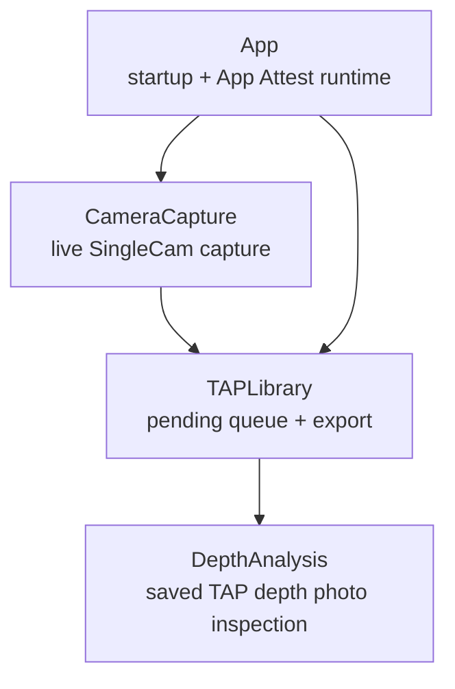

# TAPCamDemo Source Tree

This source root is split by product responsibility, not by framework target.
The iOS app target compiles all Swift files under this tree.

## Module Map

| Module | README | Owns |
| --- | --- | --- |
| App | [App/README.md](App/README.md) | App root, first-install permissions, App Attest runtime, diagnostics. |
| CameraCapture | [CameraCapture/README.md](CameraCapture/README.md) | UI, planning, AVFoundation runtime, logical package, unsigned HEIC/JPG handoff. |
| TAPLibrary | [TAPLibrary/README.md](TAPLibrary/README.md) | Pending records, serial signing/export queue, retry states, cleanup. |
| DepthAnalysis | [DepthAnalysis/README.md](DepthAnalysis/README.md) | HEIC/JPG depth readback, heatmap, mask, planes, point cloud, saved capture inspection. |

## Boundary Rules

- `App` can decide when the camera surface is available, but does not prebuild
  camera runtime objects.
- `CameraCapture` is the only module that mutates `AVCaptureSession`.
- `CameraCapture` writes unsigned artifacts to `TAPLibrary`; it does not export
  to Photos directly.
- `TAPLibrary` owns App Attest capture proof injection and Photos export.
- `DepthAnalysis` reads saved or pending artifacts; it does not mutate capture
  output or live camera state.
