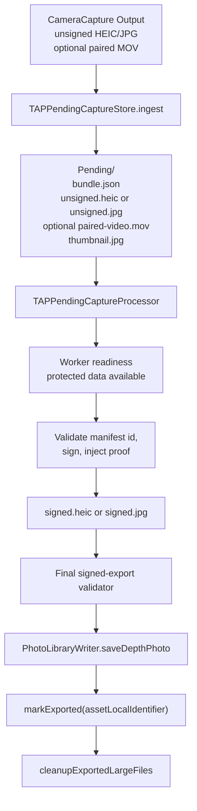
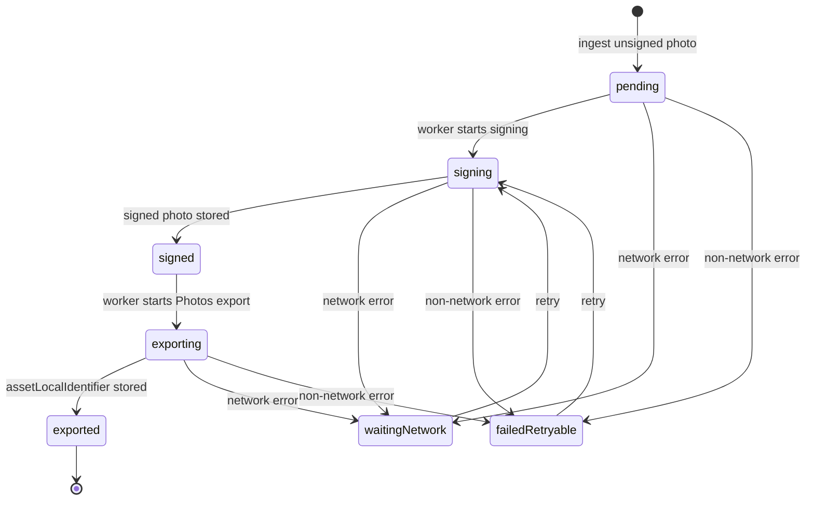
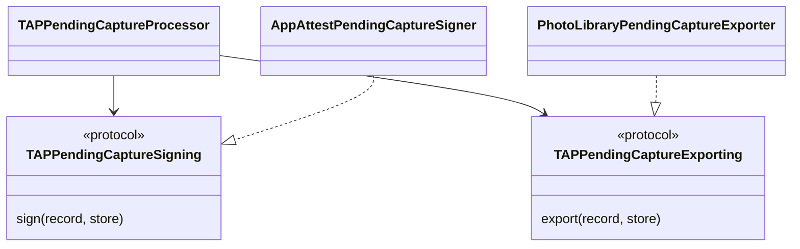

# TAPLibrary Module — Pending Capture Queue

`TAPCamDemo/TAPLibrary` is the legacy implementation-module name for the
app-private **Pending Capture Queue**. It owns pending artifacts, signing,
Photos export, retry, and cleanup. The user-facing **TAP Library** is the
mixed-media grid and Viewer implemented under `TAPCamDemo/DepthAnalysis`; this
private queue must not be called the TAP Library in product or architecture
prose.

Camera capture writes an unsigned HEIC/JPG photo or TAP Video artifact and
returns quickly. Live Photo captures may add one fixed paired MOV resource.
`TAPPendingCaptureProcessor` serializes signing, export, readback, retry state,
and cleanup so real-device App Attest and Photos work do not overlap. Product
scope and terminology come from
[ProductContract.md](../../Docs/ProductContract.md).

TAP Video proof filling never mutates the durable generation that Viewer or
Share may currently snapshot. The store creates one independent same-bundle
working generation on demand, signing mutates only that file, and the store
atomically publishes the completed inode. The temporary signing generation is
discarded on failure/cancellation and is neither a generated `.tapnap` nor a
persistent media cache.

## Current Coarse Retry Model

The implemented retry model is deliberately coarse:

- durable status is one of `pending`, `waitingNetwork`, `signing`, `signed`,
  `exporting`, `exported`, `failedRetryable`, or `failedTerminal`;
- `TAPPendingCaptureRetryClassifier` maps a non-terminal worker error to either
  `waitingNetwork` or `failedRetryable` using typed error domains and codes;
- `AppAttestPendingCaptureSigner` performs credential preparation and capture
  assertion/proof generation inside one signing operation;
- each record persists one cumulative `retryCount`, but no retry stage,
  `nextAttemptAt`, retry window, cooldown, or total-budget state;
- only one worker runs at a time, and each candidate capture ID is attempted at
  most once in that worker run; a later explicit worker invocation may retry an
  eligible coarse retry state;
- signed/exporting records are processed before new pending/signing records,
  which are processed before failed-retryable/waiting-network records; and
- protected-data unavailability stops the worker before private queue reads or
  mutations and does not convert a capture into a failure.

Release presentation uses fixed public-safe failure text and does not expose
queue position, raw retry errors, proof identifiers, or a manual signing Retry
control. The queue may be retriggered by its callers, but it has no fine-grained
time scheduler of its own.

Future credential/assertion/export stage separation, `nextAttemptAt`, bounded
retry windows, cooldown, pause state, and persistence migration are one
technical optimization tracked only by
[`TAP-0015`](../../Docs/ProjectBoard.md#tap-0015--implement-fine-grained-credential-retry-optimization).
Those unimplemented details are not part of this current module contract and
must not be copied into another active design document.

## Code Map

| Responsibility | Code |
| --- | --- |
| Queue record model, statuses, and persisted location | [TAPPendingCaptureRecord.swift](TAPPendingCaptureRecord.swift) |
| Pending Capture Queue change notification (legacy type name) | [TAPLibraryNotifications.swift](TAPLibraryNotifications.swift) |
| Pending bundle path and filename validation | [TAPPendingCaptureBundlePathPolicy.swift](TAPPendingCaptureBundlePathPolicy.swift) |
| Pending bundle filesystem, record IO, artifact IO, and cleanup | [TAPPendingCaptureBundleStorage.swift](TAPPendingCaptureBundleStorage.swift) |
| Serialized queue repository and public API | [TAPPendingCaptureStore.swift](TAPPendingCaptureStore.swift) |
| Video workspace ownership and ingest validation | [TAPPendingVideoWorkspaceCoordinator.swift](TAPPendingVideoWorkspaceCoordinator.swift), [TAPPendingVideoIngestValidator.swift](TAPPendingVideoIngestValidator.swift) |
| Pure video record transitions and focused maintenance | [TAPPendingVideoRecordTransitions.swift](TAPPendingVideoRecordTransitions.swift), [TAPPendingCaptureMaintenance.swift](TAPPendingCaptureMaintenance.swift) |
| Locked-capture staging/import validation | [TAPPendingLockedCaptureImporter.swift](TAPPendingLockedCaptureImporter.swift) |
| Shared artifact paths plus Pending Capture Queue notification/root policies | [TAPPendingCaptureArtifacts.swift](TAPPendingCaptureArtifacts.swift), [TAPLibraryNotifications.swift](TAPLibraryNotifications.swift) |
| Queue record JSON encoding/decoding policy | [TAPPendingCaptureRecordCoding.swift](TAPPendingCaptureRecordCoding.swift) |
| Processing route and candidate priority policy | [TAPPendingCaptureProcessingPolicy.swift](TAPPendingCaptureProcessingPolicy.swift) |
| Worker protected-data readiness policy | [TAPPendingCaptureWorkerReadiness.swift](TAPPendingCaptureWorkerReadiness.swift) |
| Retry status classification from worker errors | [TAPPendingCaptureRetryClassifier.swift](TAPPendingCaptureRetryClassifier.swift) |
| Public-safe persisted failure reason types, text, and legacy normalization | [TAPPendingCaptureFailureReasonPresentation.swift](TAPPendingCaptureFailureReasonPresentation.swift) |
| Local artifact write and file-protection policy | [TAPLocalArtifactStoragePolicy.swift](TAPLocalArtifactStoragePolicy.swift) |
| Camera writer adapter | [TAPPendingCaptureArtifactWriter.swift](TAPPendingCaptureArtifactWriter.swift) |
| Pending item thumbnail renderer | [TAPPendingCaptureThumbnailRenderer.swift](TAPPendingCaptureThumbnailRenderer.swift) |
| Serial orchestration worker and injected operation contracts | [TAPPendingCaptureProcessor.swift](TAPPendingCaptureProcessor.swift), [TAPPendingCaptureOperations.swift](TAPPendingCaptureOperations.swift) |
| App Attest proof injection | [AppAttestPendingCaptureSigner.swift](AppAttestPendingCaptureSigner.swift) |
| TAP manifest/provenance writer used by signing and export validation | [TAPCaptureProvenanceWriter.swift](../CameraCapture/Output/TAPCaptureProvenanceWriter.swift) |
| Photos export/readback adapter | [PhotoLibraryPendingCaptureExporter.swift](PhotoLibraryPendingCaptureExporter.swift) |

## Pending Capture Queue Flow

## Record State Machine

Candidate priority is defined by
[TAPPendingCaptureProcessingPolicy.swift](TAPPendingCaptureProcessingPolicy.swift):

1. `signed` and `exporting`
2. `pending` and `signing`
3. `failedRetryable` and `waitingNetwork`

The same policy also decides whether a candidate should sign then export, export
an existing signed TAP depth photo file, or be skipped.
Already signed/exporting work is first because those records have already paid
the App Attest signing cost and should reach Photos before newer pending records
start another signing pass.

The worker tracks already-visited capture IDs during one run so a failing item
does not spin forever inside the same pass.

## Worker Readiness

`TAPPendingCaptureWorkerReadiness` is the first preflight inside the pending
worker. It converts the injected protected-data state into one readable
decision: the worker may read private pending artifacts, or it must return
without doing queue work.

When protected data is unavailable, the worker returns before reconciliation,
candidate enumeration, unsigned or signed photo reads, manifest/proof parsing,
Photos asset lookup, signing, export, retry updates, cleanup, or failure-reason
updates. The record remains in its existing state because this branch means
temporary device or storage readiness, not a failed capture and not a network
failure.

The readiness model does not import UIKit, Photos, AVFoundation, or App Attest.
Production converts `UIApplication.shared.isProtectedDataAvailable` at the
processor edge. Tests inject a Boolean so the policy can be read and verified
without simulating a locked device.

## Processor Dependencies

Production uses the App Attest signer and Photos exporter. Tests inject fake
signer/exporter actors so queue ordering and error classification can run
without App Attest hardware, network, or Photos side effects.

## Storage Rules

- `TAPLocalArtifactStoragePolicy.privatePhotoArtifact` is the write boundary for
  app-private photo artifacts and derived thumbnails.
- `unsigned.heic` or `unsigned.jpg` is the output of `EmbeddedPhotoPackager`,
  depending on the resolved output profile.
- `signed.heic` or `signed.jpg` is created only after the record `captureID`
  matches the embedded TAP manifest `payload.id` and App Attest proof injection
  succeeds.
- `paired-video.mov` is present only for Live Photo captures whose Apple movie
  complement was delivered. It is copied into the pending bundle before commit,
  signed as `content-binding:v3`, and removed with the staged photo files after
  export.
- The signed photo file is exported only after `validateSignedExportPhoto`
  re-reads the final bytes and verifies the source container, manifest
  schema/id, proof envelope, proof digest binding, and Apple auxiliary
  depth/disparity. The validator returns `ValidatedTAPDepthPhoto`, which is the
  type accepted by the Photos writer.
- Live Photo export uses `validateSignedExportLivePhoto` and
  `PhotoLibraryWriter.saveDepthLivePhoto`; still-photo export continues to use
  `validateSignedExportPhoto` and `saveDepthPhoto`.
- Normal `.signed` first export goes straight to final validation and Photos
  save; it does not scan every existing TAPCamDepth Photos asset first.
  Existing-asset recovery via `depthAssetIdentifier` is reserved for `.exporting`
  records, where the app may be resuming after an interrupted Photos save.
- `thumbnail.jpg` is kept for TAP Library listing.
- `assetLocalIdentifier` is kept after export so saved TAP photos remain
  discoverable even when Photos access is limited.
- Exported large files are cleaned up; records and thumbnails remain.
- Saved Photos assets can later be exported from the signature-verification
  panel as verification originals. Still-photo captures export the original
  `.photo` resource as a single HEIC/JPG. Complete Live Photo captures export
  a ZIP containing `primary-photo.heic` or `primary-photo.jpg`,
  `paired-video.mov`, and an unsigned minimal `tapcam-export.json` sidecar.
  If a Live Photo manifest is present but Photos no longer exposes the original
  `.pairedVideo`, the export path may provide only the primary photo and must
  warn that Live Photo verification remains incomplete.
- Precise capture location is kept only while the record is pending, signing,
  or exporting so Photos can receive the location at save time. `markExported`
  clears the persisted queue copy after Photos has accepted the asset.
- Pending bundle directories, records, photo artifacts, and thumbnails are
  protected with complete-until-first-user-authentication file protection.
- `TAPPendingCaptureBundlePathPolicy` validates pending bundle path components:
  capture IDs must be single safe directory names, and persisted artifact
  filenames must be one of the fixed bundle resources.
- `TAPPendingCaptureBundleStorage` is the only Pending Capture Queue helper that owns the
  pending root directory, per-capture bundle directories, temporary bundle
  directories, file moves/removes, `bundle.json` reads/writes, artifact
  reads/writes, and exported-file cleanup. It routes bundle and artifact paths
  through `TAPPendingCaptureBundlePathPolicy` and routes writes/protection
  through `TAPLocalArtifactStoragePolicy`.
- `TAPPendingCaptureStore` does not directly enumerate directories, call
  `Data(contentsOf:)`, write `bundle.json`, or remove photo files. It owns queue
  semantics: ingest idempotence, record ordering, state transitions, failure
  reason normalization, actor serialization, notifications, and diagnostics.

## Diagnostic Privacy

Pending-capture logs keep operational state public, such as status, route,
retry count, byte count, and whether a failure reason exists. Values that can
link a log line back to a specific photo or proof are OSLog-private:
`captureID`, embedded manifest ids, App Attest key ids, and Photos
`assetLocalIdentifier`.

The queue still stores raw `captureID` and `assetLocalIdentifier` where product
behavior needs them. Persisted `failureReason` values come from
`TAPPendingCaptureFailureReasonPresentation` through the
`TAPPendingCaptureStore` write boundary, not from raw
`error.localizedDescription`. Legacy stored reasons are normalized before
records leave the store. Public error summaries come from
`TAPDiagnostics.describe`, which keeps domain/code and scalar network hints but
omits localized messages, failing URLs, raw network paths, proof bodies, photo
bytes, GPS values, and thumbnails.

## Persisted Failure Reason Presentation

`TAPPendingCaptureRecord.failureReason` is durable queue state in
`bundle.json`, so it must be treated like public-safe presentation text even
though the record is app-private. `TAPPendingCaptureRetryClassifier` maps raw
worker errors to `.waitingNetwork` versus `.failedRetryable` by checking typed
Foundation error domains and codes, including wrapped underlying errors. It
does not classify by `error.localizedDescription`.

`TAPPendingCaptureProcessor` logs `TAPDiagnostics.describe(error)` for
diagnosis, then passes a typed `TAPPendingCaptureFailureReasonPresentation.Reason` into
`TAPPendingCaptureStore.updateStatus`; callers cannot pass arbitrary strings
into the durable write API.

`TAPPendingCaptureStore` is the final boundary before `bundle.json`. It maps
typed retry reasons to fixed text for retry states and clears failure reasons
for non-failure states:

- `waitingNetwork`: `Network unavailable. Capture will retry.`
- `failedRetryable`: `Capture processing failed. It will retry.`

The persisted reason must not include capture IDs, manifest IDs, Photos asset
IDs, URLs, paths, App Attest key IDs, proofs, photo bytes, or raw associated
error reasons.

Older `bundle.json` files may contain raw strings from builds before this
boundary existed. Store reads normalize those legacy values before returning
records to UI or worker code: retry states return the fixed text above, and
non-failure states return `nil`. `normalizePersistedFailureReasons()` is the
explicit disk migration entry point; the processor calls it during reconcile
after protected-data readiness passes. Until that migration runs, an unopened
legacy bundle can still contain its old raw string on disk, but store read APIs
do not return it.

Worker reconcile also repairs one historical video-state mistake. A TAP Video
record persisted as `failedTerminal` by the former pre-sign manifest/track
validator is reopened only when it remains `.unsigned`, still has its local
artifact, has no Photos/export-recovery state, and carries
`invalidVideoArtifact` or `proofValidationFailed`. It becomes
`failedRetryable` and can be signed in the same worker run. Signed integrity
failures, external mutation, Photos readback failures, and missing source files
may remain terminal. Missing depth alone is not a valid terminal product result:
the Product Contract requires the RGB/audio artifact to continue through
signing and export with truthful zero-depth state and a non-blocking warning.
Any remaining terminal missing-depth code path is the implementation gap tracked
by `TAP-0011`, not the Pending Capture Queue contract.

## TAP Library Integration: Item Identity And Route Context

`DepthAlbumPickerView` presents three item identities:

- `pending:<captureID>` for an app-private capture that has not exported yet.
- `owned:<assetLocalIdentifier>` for an exported pending record with a matching
  Photos asset.
- `photos:<assetLocalIdentifier>` for TAPCamDepth Photos assets that do not have
  a visible pending-store record.

These raw identifiers can reveal recent photo or pending-capture activity, so
they are not written into durable route context. `CameraRouteContextStore`
persists protected HMAC tokens derived from the current item, capture, and asset
identity. When route context needs validation, the current visible item list can
provide anchors and `CameraRouteStore` resolves the persisted token only when a
current item matches. Current TAP Library fresh entries do not use that token to
reposition the grid; they start at the top.

Precise scroll offset is intentionally not part of this durable context. The TAP
Library picker keeps an in-session vertical offset in view-local state only so
returning from an analysis page can land near where the user left off. The
return bookmark stores the clicked item's identity and viewport position, then
computes the target offset from the current item list without writing that UI
coordinate to disk.

Pending-to-owned migration is handled by the capture token: a
`pending:<captureID>` anchor can resolve to `owned:<assetLocalIdentifier>` after
export because the owned item still carries the same pending record `captureID`.
Route context must remain item context only; it must not trigger photo artifact
reads, signing, export, retry, Photos fetches, or automatic analysis navigation.

## Tests

Queue behavior is covered in
[TAPLibraryRouteTests.swift](../../TAPCamDemoTests/TAPLibraryRouteTests.swift),
[TAPLibraryStorageTests.swift](../../TAPCamDemoTests/TAPLibraryStorageTests.swift)
and [TAPLibraryProcessingTests.swift](../../TAPCamDemoTests/TAPLibraryProcessingTests.swift).
Capture proof and export-gate behavior is covered by the provenance focused
tests listed below:

- `TAPLibraryRouteTests.swift` covers route anchors, top-start TAP Library
  picker boundaries, clicked-item return bookmarks, pending-to-owned anchor
  resolution, item merge/dedupe/sort behavior, thumbnail cache-key privacy, and
  fixed-length HMAC route-context tokens.
- `TAPLibraryStorageTests.swift` covers record identity, persisted location,
  visible-pending state, bundle path and exact fixed artifact filename
  allow-list validation,
  hidden-directory and Unicode capture ID rejection, bundle-directory versus
  `bundle.json` capture ID consistency, thumbnail-optional ingest, candidate
  priority, exported-thumbnail index behavior, store-level failure-reason write
  normalization, legacy read normalization, and explicit bundle migration that
  skips invalid bundles while continuing valid migrations.
- `TAPLibraryProcessingTests.swift` covers the pure worker readiness model,
  protected-data early exit without sign/export/retry/failure mutation,
  protected-data early exit before legacy failure-reason reconciliation,
  sign/export ordering, typed network failure classification as
  `waitingNetwork`, and public-safe persisted failure reasons for network and
  retryable processing failures.
- [TAPCaptureManifestEncodingTests.swift](../../TAPCamDemoTests/TAPCaptureManifestEncodingTests.swift),
  [TAPCaptureContentDigestTests.swift](../../TAPCamDemoTests/TAPCaptureContentDigestTests.swift),
  [TAPCaptureAssertionSignerTests.swift](../../TAPCamDemoTests/TAPCaptureAssertionSignerTests.swift),
  [TAPCaptureProvenanceWriterSigningTests.swift](../../TAPCamDemoTests/TAPCaptureProvenanceWriterSigningTests.swift),
  and [TAPSignedExportValidatorTests.swift](../../TAPCamDemoTests/TAPSignedExportValidatorTests.swift)
  cover payload/proof separation, digest stability, App Attest capture
  assertion proof shape, manifest id mismatch before App Attest calls, and
  final signed-export validation before Photos save.
- Shared deterministic payload, manifest, pending-record, artifact,
  thumbnail, temporary-directory, and `bundle.json` helpers live in
  [TAPCamDemoTestFixtures.swift](../../TAPCamDemoTests/TAPCamDemoTestFixtures.swift).

See [TAPCamDemoTests/README.md](../../TAPCamDemoTests/README.md) for the
automation command and the Simulator versus real Photos/UI evidence limits.
