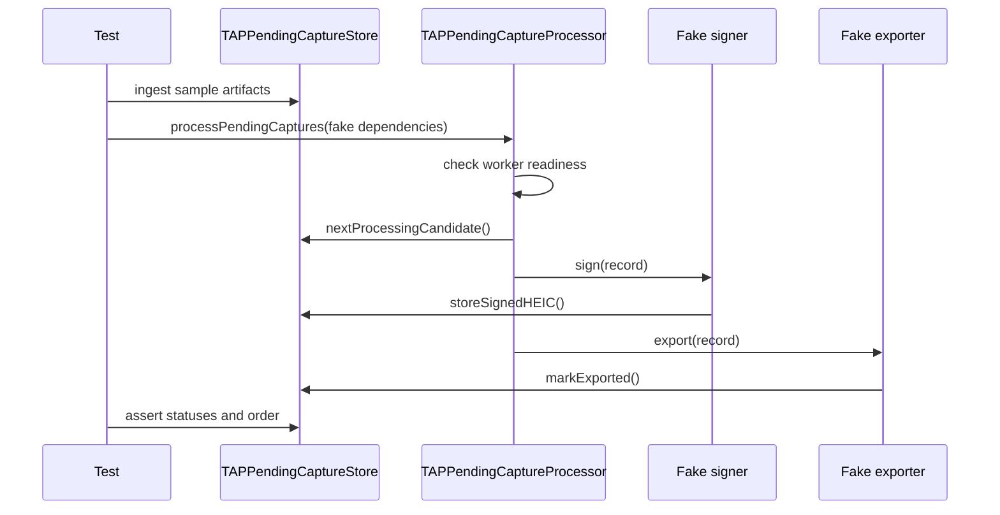

# TAPCamDemoTests

`TAPCamDemoTests` is the default automation target for the shared
`TAPCamDemo` scheme. It is intentionally focused on deterministic unit and
app-hosted checks that can compile on Simulator without a depth-capable camera,
App Attest hardware acceptance, Photos UI automation, or live backend calls.

## Test Entry

```mermaid
flowchart TD
    Scheme["TAPCamDemo.xcscheme"] --> Env["TAPCAM_XCTEST_HOST=1"]
    Scheme --> Tests["TAPCamDemoTests.xctest"]
    Env --> App["TAPCamDemoApp"]
    App --> Host["XCTestHostView"]
    Tests --> Main["TAPCamDemoTests.swift"]
    Tests --> DepthInput["TAPDepthAnalysisInputTests.swift"]
    Tests --> DepthSelection["TAPDepthAnalysisSelectionTests.swift"]
    Tests --> DepthPlaneRegion["TAPDepthAnalysisPlaneRegionTests.swift"]
    Tests --> DepthErrorPresentation["DepthAnalysisErrorPresentationTests.swift"]
    Tests --> DepthAnalysisPresentation["TAPDepthAnalysisPresentationTests.swift"]
    Tests --> LogPrivacy["TAPDiagnosticsOSLogPrivacyTests.swift"]
    Tests --> Output["TAPCaptureOutputProfileTests.swift"]
    Tests --> ManifestEncoding["TAPCaptureManifestEncodingTests.swift"]
    Tests --> ContentDigest["TAPCaptureContentDigestTests.swift"]
    Tests --> AssertionSigner["TAPCaptureAssertionSignerTests.swift"]
    Tests --> ProvenanceSigning["TAPCaptureProvenanceWriterSigningTests.swift"]
    Tests --> SignedExport["TAPSignedExportValidatorTests.swift"]
    Tests --> CameraPresentation["TAPCameraCapturePresentationTests.swift"]
    Tests --> Status["TAPCameraStatusPresentationTests.swift"]
    Tests --> ManualIntent["TAPCameraManualControlIntentTests.swift"]
    Tests --> ManualPresentation["TAPCameraManualControlPresentationTests.swift"]
    Tests --> ManualSummary["TAPCameraManualControlSummaryTests.swift"]
    Tests --> ManualCommandPlan["TAPCameraManualControlCommandPlanTests.swift"]
    Tests --> ManualBoundary["TAPCameraManualControlBoundaryGuardTests.swift"]
    Tests --> ControlService["TAPCameraControlServiceTests.swift"]
    Tests --> Route["TAPLibraryRouteTests.swift"]
    Tests --> Storage["TAPLibraryStorageTests.swift"]
    Tests --> Processing["TAPLibraryProcessingTests.swift"]
    Tests --> Fixtures["TAPCamDemoTestFixtures.swift"]
    Main --> Unit["Swift Testing functions"]
    DepthInput --> Unit
    DepthSelection --> Unit
    DepthPlaneRegion --> Unit
    DepthErrorPresentation --> Unit
    DepthAnalysisPresentation --> Unit
    LogPrivacy --> Unit
    Output --> Unit
    ManifestEncoding --> Unit
    ContentDigest --> Unit
    AssertionSigner --> Unit
    ProvenanceSigning --> Unit
    SignedExport --> Unit
    CameraPresentation --> Unit
    Status --> Unit
    ManualIntent --> Unit
    ManualPresentation --> Unit
    ManualSummary --> Unit
    ManualCommandPlan --> Unit
    ManualBoundary --> Unit
    ControlService --> Unit
    Route --> Unit
    Storage --> Unit
    Processing --> Unit
    Fixtures --> Main
    Fixtures --> DepthInput
    Fixtures --> DepthSelection
    Fixtures --> Output
    Fixtures --> ContentDigest
    Fixtures --> AssertionSigner
    Fixtures --> ProvenanceSigning
    Fixtures --> SignedExport
    Fixtures --> DepthAnalysisPresentation
    Fixtures --> Status
    Fixtures --> ManualIntent
    Fixtures --> ManualPresentation
    Fixtures --> ManualSummary
    Fixtures --> ManualCommandPlan
    Fixtures --> ManualBoundary
    Fixtures --> ControlService
    Fixtures --> Route
    Fixtures --> Storage
    Fixtures --> Processing

    click Scheme "../TAPCamDemo.xcodeproj/xcshareddata/xcschemes/TAPCamDemo.xcscheme"
    click App "../TAPCamDemo/App/TAPCamDemoApp.swift"
    click Main "TAPCamDemoTests.swift"
    click DepthInput "TAPDepthAnalysisInputTests.swift"
    click DepthSelection "TAPDepthAnalysisSelectionTests.swift"
    click DepthPlaneRegion "TAPDepthAnalysisPlaneRegionTests.swift"
    click DepthErrorPresentation "DepthAnalysisErrorPresentationTests.swift"
    click DepthAnalysisPresentation "TAPDepthAnalysisPresentationTests.swift"
    click LogPrivacy "TAPDiagnosticsOSLogPrivacyTests.swift"
    click Output "TAPCaptureOutputProfileTests.swift"
    click ManifestEncoding "TAPCaptureManifestEncodingTests.swift"
    click ContentDigest "TAPCaptureContentDigestTests.swift"
    click AssertionSigner "TAPCaptureAssertionSignerTests.swift"
    click ProvenanceSigning "TAPCaptureProvenanceWriterSigningTests.swift"
    click SignedExport "TAPSignedExportValidatorTests.swift"
    click CameraPresentation "TAPCameraCapturePresentationTests.swift"
    click Status "TAPCameraStatusPresentationTests.swift"
    click ManualIntent "TAPCameraManualControlIntentTests.swift"
    click ManualPresentation "TAPCameraManualControlPresentationTests.swift"
    click ManualSummary "TAPCameraManualControlSummaryTests.swift"
    click ManualCommandPlan "TAPCameraManualControlCommandPlanTests.swift"
    click ManualBoundary "TAPCameraManualControlBoundaryGuardTests.swift"
    click ControlService "TAPCameraControlServiceTests.swift"
    click Route "TAPLibraryRouteTests.swift"
    click Storage "TAPLibraryStorageTests.swift"
    click Processing "TAPLibraryProcessingTests.swift"
    click Fixtures "TAPCamDemoTestFixtures.swift"
```



The app-hosted test path renders a minimal black host view instead of entering
first-launch permissions, camera startup, pending-capture signing credential
warmup, or pending queue processing. This avoids the AI/CI hang pattern caused
by app startup side effects during tests.

## Shared Fixtures

[TAPCamDemoTestFixtures.swift](TAPCamDemoTestFixtures.swift) is the shared
test-only fixture entry for deterministic payloads, manifest captures, pending
records, pending artifacts, manual-control capability snapshots, temporary
directories, thumbnail bytes, and `bundle.json` helpers. Keep cross-suite
fixtures there instead of copying helpers into individual test suites.
Suite-specific fixtures that are only used by one file should stay beside that
suite.

## Test Coverage Map

| Area | Tests |
| --- | --- |
| App Attest runtime config, credential flow, backend public summary, and public-safe Settings presentation | [AppAttestRuntimeTests.swift](AppAttestRuntimeTests.swift) |
| App Attest logging/UI privacy review | `diagnosticsDescriptionOmitsLocalizedDescriptionAndFailingURL`, `diagnosticsDescriptionKeepsVPNHintWithoutRawNetworkPath`, `diagnosticsDescriptionKeepsScalarStreamDiagnostics`, key ID presentation redaction tests, and credential failure status redaction tests in [AppAttestRuntimeTests.swift](AppAttestRuntimeTests.swift) |
| OSLog source privacy harness | `allTAPDiagnosticsLoggingFilesAreCoveredByHarness`, `osLogInterpolationsDeclareReviewedPrivacy`, backend public-summary source guard, and `sensitiveOSLogLabelsAreNotAccidentallyBroadenedByPrefix` in [TAPDiagnosticsOSLogPrivacyTests.swift](TAPDiagnosticsOSLogPrivacyTests.swift) |
| Startup gate policy, backend preflight retry policy, backend preflight execution, and coordination | `startupGatePolicyNamesRequiredAndOptionalRequirements`, `startupGateRequiresSecurityPreflightCameraAndPhotos`, `startupGateRejectsNonGrantedSecurityPreflightStates`, `startupGateTreatsSecurityPreflightDenialAsBlocking`, `startupGateTreatsLocationAsOptional`, pure security-preflight retry/timeout policy tests, injected backend preflight execution tests, and injected preflight coordinator tests in [StartupGateCoordinatorTests.swift](StartupGateCoordinatorTests.swift) |
| Output profile selection, public-safe selection presentation, catalog, quality policy, resolved output execution token, resource plan, photo-output capability snapshot, and photo settings factory | `releaseOutputProfileNamesCurrentHEICDepthPolicy`, `capturePhotoQualityPolicyNamesAppLevelQualityBeforeAVFoundation`, `tapDepthManifestUsesPhotoQualityPolicyManifestDescription`, `releaseOutputProfileCatalogNamesSingleExecutableDefault`, `outputProfileCatalogSurfacesInvalidProfileSets`, `releaseOutputProfileRequiresHEVCAndDoesNotFallbackToJPEG`, `outputProfileRejectsDepthAndQualityContractDrift`, `outputProfileResolutionProducesSingleRuntimeRequest`, `resolvedOutputValidatesPhotoOutputCapabilities`, `runtimeResolvesAndReusesOutputThroughCapabilitySnapshot`, `outputResourcePlanNamesCurrentSignedHEICResources`, `outputResourcePlanReusesResolvedPackagingValidation`, `outputResourcePlanStaysPurePolicyModel`, `resolvedOutputValidatesCapturePlanDepthContract`, `runtimePackageAndManifestUseResolvedOutputAsExecutionToken`, `outputProfileSelectionIntentResolvesReleaseDefaultProfile`, `outputProfileSelectionIntentResolvesExplicitProfileID`, output-profile selection presentation redaction tests, `outputProfileSelectionIntentRejectsEmptyProfileIDWithoutFallback`, `outputProfileSelectionIntentRejectsMissingProfile`, `outputProfileSelectionIntentFailsClosedForInvalidCatalog`, and `photoSettingsFactoryUsesReleaseOutputProfileDefaults` in [TAPCaptureOutputProfileTests.swift](TAPCaptureOutputProfileTests.swift) |
| Pre-capture configuration snapshot, preview crop handoff, and Runtime fact preservation | crop update, selection-context crop update, Runtime execution-fact preservation, fixed zoom ID, custom raw release zoom, and source-guard tests in [TAPPreCaptureConfigurationBuilderTests.swift](TAPPreCaptureConfigurationBuilderTests.swift) |
| Manifest payload/proof separation | `proofChangesDoNotAffectPayloadBytes` in [TAPCaptureManifestEncodingTests.swift](TAPCaptureManifestEncodingTests.swift) |
| Capture content digest stability | `captureContentDigestCanonicalJSONIsStable` in [TAPCaptureContentDigestTests.swift](TAPCaptureContentDigestTests.swift) |
| App Attest capture assertion shape | `appAttestCaptureAssertionSignerBuildsProofValue` and `appAttestCaptureAssertionSignerStopsWhenPrepareIfNeededFails` in [TAPCaptureAssertionSignerTests.swift](TAPCaptureAssertionSignerTests.swift) |
| Pending-signing provenance writer guardrails | `unsignedCaptureManifestKeepsProofsEmptyWhenSignerIsMissing`, `unsignedCaptureManifestUsesFixedReasonWhenProofCannotBeCreated`, and `pendingSigningRejectsManifestIDMismatchBeforeSignerCall` in [TAPCaptureProvenanceWriterSigningTests.swift](TAPCaptureProvenanceWriterSigningTests.swift) |
| Final Photos preflight gate | `signedExportValidatorRejectsNonHEICContainerBeforePhotosSave`, `validatedTAPDepthHEICRejectsRawJPEGBeforePhotosWriterCanBeCalled`, `signedExportValidatorCoversReleaseResourcePlanBeforePhotosSave`, `signedExportValidatorRejectsMissingProofAfterContainerCheck`, `signedExportValidatorRejectsInvalidProofEnvelopeAfterContainerCheck`, `signedExportValidatorRejectsMultipleManifestProofsBeforePhotosSave`, `signedExportValidatorRejectsManifestMismatchAfterContainerCheck`, `signedExportValidatorRejectsReleaseOutputPolicyDriftBeforePhotosSave`, and `signedExportValidatorRejectsMissingAuxiliaryDepthAfterContainerCheck` in [TAPSignedExportValidatorTests.swift](TAPSignedExportValidatorTests.swift) |
| CameraCapture chrome, lifecycle, preview-stage, and Debug presentation state | `captureLifecycleCoordinatorKeepsPendingSigningWarmupAndRetryPoliciesExplicit`, shutter feedback preference checks, `cameraCaptureControlsStateLocksLibraryWhileCaptureWrites`, `cameraCaptureControlsStateDoesNotNameSensitiveInputs`, `cameraPreviewStageStateDoesNotNameCaptureSecurityOrOutputInputs`, `cameraFocalLengthDisplayOptionDoesNotNameHardwarePlanningInputs`, and Debug overlay display-state reflection tests in [TAPCameraCapturePresentationTests.swift](TAPCameraCapturePresentationTests.swift). |
| Camera status presentation and capture metrics failure text | `cameraCaptureStatusPresentationOmitsRawIdentifiersAndPaths`, `cameraCaptureStatusPresentationRedactsAssociatedReasons`, `cameraCaptureStatusPresentationRedactsNSErrorDescriptionURLAndPath`, `cameraCaptureStatusPresentationKeepsGenericRecoverableMessages`, and `capturePipelineMetricsUsePublicSafeFailureReason` in [TAPCameraStatusPresentationTests.swift](TAPCameraStatusPresentationTests.swift). |
| Durable TAP Library route context persistence/restoration, item merge rules, album error presentation, and thumbnail cache-key privacy | `cameraRouteStoreDefaultsToCamera`, `cameraRouteStoreReturnsToCameraWithoutDroppingAlbumAnchor`, `cameraRouteStorePersistsAlbumAnchorsAcrossInstances`, `cameraRouteStoreClearsUnavailablePersistedAlbumAnchors`, `cameraRouteStoreMigratesPersistedPendingAnchorToOwnedPhotoAnchor`, `cameraRouteContextPersistsTokensWithoutRawAlbumIdentifiers`, `cameraRouteContextPersistsOnlyHexTokenValues`, item merge/provider tests, `depthAlbumPickerShowsPhotosErrorOnlyWhenNoItemsSurvive`, `depthAlbumPickerUsesFixedErrorWhenStoreLoadFails`, and Photos, owned-export, plus pending thumbnail cache-key privacy tests in [TAPLibraryRouteTests.swift](TAPLibraryRouteTests.swift) |
| Manual camera control pure capability and intent model | Capability naming, no-op versus explicit auto, supported request acceptance, unsupported/out-of-range rejection, non-finite rejection, and depth-safe zoom rejection in [TAPCameraManualControlIntentTests.swift](TAPCameraManualControlIntentTests.swift) |
| Manual camera control public-safe status presentation | No-op/ready/blocked copy, fixed control-group labels, blocked value redaction, hostile device-string redaction, reader-description separation, depth-unsafe zoom status, and Runtime error status copy in [TAPCameraManualControlPresentationTests.swift](TAPCameraManualControlPresentationTests.swift) |
| Manual camera control field-row summary | No-change versus explicit-auto rows, executable requested rows, blocked row mapping, raw identifier redaction, zoom-only summary, and stored-field privacy checks in [TAPCameraManualControlSummaryTests.swift](TAPCameraManualControlSummaryTests.swift) |
| Manual camera control Runtime command plan | No-op plans, ordered executable commands, blocked-plan no-command behavior, string/debug redaction, and no session/writer/input-model storage in [TAPCameraManualControlCommandPlanTests.swift](TAPCameraManualControlCommandPlanTests.swift) |
| Manual camera control architecture guards | Command-plan source dependency checks, CameraCapture UI source guard, and Runtime guard-before-lock source order in [TAPCameraManualControlBoundaryGuardTests.swift](TAPCameraManualControlBoundaryGuardTests.swift) |
| Manual camera control Runtime write service | Matching-plan validation, blocked-plan rejection, stale-camera rejection, stale-control-surface rejection, public error copy, zoom clamping, and registered session-queue marking in [TAPCameraControlServiceTests.swift](TAPCameraControlServiceTests.swift) |
| TAP Library record model, path policy, bundle storage, candidate selection, exported-location minimization, and store-level failure-reason migration | `pendingCaptureRecordNamesIdentityLocationAndVisibilityWithoutStore`, `pendingCaptureStorePersistsLedgerAcrossInstances`, `pendingCaptureStoreWritesArtifactsThroughLocalStoragePolicy`, `pendingCaptureStoreRejectsUnsafeCaptureIDsBeforeBundlePathUse`, `pendingCaptureStoreRejectsHiddenAndUnicodeCaptureIDs`, `pendingCaptureStoreRejectsTamperedBundleFilenames`, `pendingCaptureBundlePathPolicyKeepsArtifactFilenameAllowListExact`, `pendingCaptureBundlePathPolicyAllowsOnlyCurrentArtifactFilenames`, `pendingCaptureStoreRejectsMismatchedBundleRecordCaptureID`, `pendingCaptureStoreSkipsThumbnailWhenSourceCannotDecode`, `pendingCaptureStoreTracksSigningExportAndCleanup`, `pendingCaptureStoreNormalizesFailureReasonAtWriteSink`, `pendingCaptureStoreClearsFailureReasonForNonFailureStatuses`, `pendingCaptureStoreNormalizesLegacyFailureReasonOnRead`, `pendingCaptureStoreMigratesLegacyBundleJSONFailureReason`, `pendingCaptureStoreMigrationSkipsInvalidBundlesAndNormalizesOthers`, `pendingCaptureStoreAllRecordsNormalizesLegacyFailureReasons`, and candidate/thumbnail/exported-index checks in [TAPLibraryStorageTests.swift](TAPLibraryStorageTests.swift) |
| TAP Library worker readiness, processor routing, retry classification, and persisted failure-reason presentation | `pendingCaptureWorkerReadinessRequiresProtectedData`, `pendingCaptureProcessorStopsWhenProtectedDataIsUnavailable`, `pendingCaptureProcessorLeavesSignedRecordUntouchedWhenProtectedDataIsUnavailable`, `pendingCaptureProcessorDoesNotReconcileLegacyFailureReasonsWhenProtectedDataUnavailable`, `pendingCaptureProcessorSignsAndExportsInCandidatePriorityOrder`, `pendingCaptureProcessorClassifiesNetworkExportFailureAsWaitingNetwork`, `pendingCaptureRetryClassifierMapsTypedNetworkErrorsToWaitingNetwork`, `pendingCaptureRetryClassifierReadsUnderlyingNSErrorCodes`, `pendingCaptureRetryClassifierReadsMultipleUnderlyingNSErrorCodes`, `pendingCaptureRetryClassifierDoesNotClassifyByLocalizedDescription`, `pendingCaptureFailureReasonPresentationOmitsRawIdentifiersAndPaths`, `pendingCaptureProcessorPersistsPublicSafeNetworkFailureReason`, and `pendingCaptureProcessorPersistsPublicSafeRetryFailureReason` in [TAPLibraryProcessingTests.swift](TAPLibraryProcessingTests.swift) |
| DepthAnalysis input validation, reader metadata/input rejection, source loading, load-error presentation, and load-state ViewModel bridge | `depthAnalysisInputValidationRejectsUnsafeDepthMapShapes`, `depthAnalysisInputValidationRejectsOversizedBudgetsBeforeAllocation`, `depthAnalysisReaderRejectsNonHEICInputBeforeAnalysisDecode`, `imageOrientationReaderAcceptsImageIONumericMetadataTypes`, Photos/pending loader routing tests, pending temporary-unavailable mapping, reader refresh separation, fixed reader/Photos loader presentation tests, and `depthAnalysisViewModelLoadsInputAndClearsPreviousAnalysisState` in [TAPDepthAnalysisInputTests.swift](TAPDepthAnalysisInputTests.swift) |
| DepthAnalysis rectangular region selection, Planes seed-selection state, and ViewModel selection bridge | `depthAnalysisRegionSelectionStateBeginsAndPreviewsWithoutDerivedProducts`, `depthAnalysisRegionSelectionStateFinishesWithStatsHeatmapAndPlaneEstimate`, `depthAnalysisRegionSelectionStateClearRemovesSelectionAndDerivedProducts`, `depthAnalysisRegionSelectionStateClampsOutOfBoundsSelection`, `depthAnalysisRegionSelectionStateMapsInvalidRegionHeatmapToGenericMessage`, `depthAnalysisPlaneSelectionStateClampsSeedAndStrictness`, `depthAnalysisPlaneSelectionStateStartSuccessFailureAndClearTransitions`, `depthAnalysisViewModelBuildsRegionProductsOnlyAfterExplicitSelection`, and `depthAnalysisViewModelClearSelectionRemovesDerivedRegionProducts` in [TAPDepthAnalysisSelectionTests.swift](TAPDepthAnalysisSelectionTests.swift) |
| DepthAnalysis camera-space geometry, Planes estimator/growth, detector cache behavior, and async request freshness | `projectorUsesCalibrationToProduceCameraCoordinates`, `cameraIntrinsicsRejectNonFiniteAndZeroCalibration`, seed validation and growth tests, `planeEstimatorFindsSyntheticFlatDepthRegion`, `planeDetectorFindsAndFiltersHighConfidenceFlatRegions`, `depthAnalysisPlaneRegionDetectorBuildsGeometryAndDetectsRegion`, `depthAnalysisPlaneRegionDetectorReusesMatchingGeometryCache`, `depthAnalysisPlaneRegionRequestCoordinatorKeepsGeometryCacheAcrossRegionCancel`, and `depthAnalysisPlaneRegionRequestCoordinatorPublishesOnlyNewestRegionRequest` in [TAPDepthAnalysisPlaneRegionTests.swift](TAPDepthAnalysisPlaneRegionTests.swift) |
| DepthAnalysis, album, Planes, inspector public-safe error presentation, and stats-presentation privacy guard | `depthAnalysisErrorPresentationKeepsAnalysisLoadCopyFixedAndPublicSafe`, `depthAnalysisErrorPresentationKeepsAlbumCopyFixedAndPublicSafe`, `depthAnalysisErrorPresentationKeepsPlaneSelectionCopyFixedAndPublicSafe`, `depthAnalysisInspectorErrorMessageKeepsRegionHeatmapCopyPublicSafe`, `depthAnalysisInspectorErrorMessageKeepsPlaneSelectionCopyPublicSafe`, `depthAnalysisInspectorViewsDoNotAcceptRawErrorStringSinks`, and `depthRegionStatsPresentationDoesNotAcceptSensitiveInputs` in [DepthAnalysisErrorPresentationTests.swift](DepthAnalysisErrorPresentationTests.swift) |
| DepthAnalysis metadata HUD, view-mode, panel route, region-stats, help, interaction, and authorization presentation/privacy | `captureMetadataSummaryRequiresPayload`, `captureMetadataSummaryPublishesExpectedPublicText`, `captureMetadataSummaryOmitsIdentifiersAndLocation`, `captureMetadataSummaryFallsBackForSensitiveManifestDisplayFields`, `captureMetadataSummaryFallsBackForDepthSourceDeviceName`, `analysisViewModesAllPublishUserFacingExplanations`, `analysisViewModesPublishInspectorRoutes`, `analysisDepthAndMaskViewModeButtonsAreDebugOnly`, `analysisInteractionStateSeparatesDrawingFromRegionInspection`, `analysisPanelDestinationSelectsInspectorsOnly`, `depthRegionStatsPresentationFormatsValidRegionStats`, `depthRegionStatsPresentationUsesFixedNoDepthCopy`, `depthRegionStatsPresentationRoundsValidSamplePercentage`, `analysisViewModesAndInspectorsExposeLabelsAndIcons`, and `analyzerAuthorizationStatusTextIsPassiveAndDeterministic` in [TAPDepthAnalysisPresentationTests.swift](TAPDepthAnalysisPresentationTests.swift) |
| DepthAnalysis orientation, renderer products, pure adaptive panel layout metrics, and remaining broad depth-analysis model coverage | Orientation mapping, heatmap/mask rendering, adaptive panel metrics, and broad mixed capture/depth checks in [TAPCamDemoTests.swift](TAPCamDemoTests.swift). These are model and Simulator checks, not debug metadata HUD layout, rendered adaptive panel height layout, inspector body layout automation, real-device Photos UI regression, limited-access/deletion, App Attest/backend acceptance, or positive real HEIC/Photos acceptance evidence. |
| Capture planning, manifest, and HEIC packaging | The remaining broad capture tests in [TAPCamDemoTests.swift](TAPCamDemoTests.swift). |

## Capture Output Profile Focused Tests

When reading the future format and quality boundary tests, start with
[TAPCaptureOutputProfileTests.swift](TAPCaptureOutputProfileTests.swift). This
file is the deterministic Simulator suite for the current Release HEIC-depth
profile, app-level quality policy, fail-closed profile selection, and the
AVFoundation photo-settings handoff.

- `releaseOutputProfileNamesCurrentHEICDepthPolicy` proves the current Release
  profile is one HEVC HEIC with required embedded depth.
- `capturePhotoQualityPolicyNamesAppLevelQualityBeforeAVFoundation` proves
  quality is named as app policy before it becomes AVFoundation settings, and
  that the current policy makes no file-size or compression-ratio guarantee.
- `releaseOutputProfileCatalogNamesSingleExecutableDefault` proves there is
  only one executable Release default today.
- `releaseOutputProfileRequiresHEVCAndDoesNotFallbackToJPEG` proves JPEG-only
  codec availability is rejected instead of used as fallback.
- `outputProfileRejectsDepthAndQualityContractDrift` proves future profile
  combinations cannot silently weaken depth or quality requirements.
- `outputProfileSelectionIntent*` tests prove future UI requests must resolve
  through a fail-closed selection boundary.
- `outputProfileSelectionPresentation*` tests prove future visible format or
  quality status text does not reuse developer-facing profile ids, paths, URLs,
  proofs, or key labels from invalid profile requests or catalogs.
- `resolvedOutputValidatesCapturePlanDepthContract` proves the resolved Runtime
  request rejects capture plans that drift away from required depth delivery.
- `runtimePackageAndManifestUseResolvedOutputAsExecutionToken` proves provider,
  package, packager, and manifest paths consume `ResolvedCaptureOutputProfile`
  instead of reinterpreting raw profile fields after configuration.
- `outputResourcePlanNamesCurrentSignedHEICResources` and
  `outputResourcePlanStaysPurePolicyModel` prove the current Release resource
  set is named without carrying bytes, paths, URLs, Photos identifiers, key IDs,
  capture IDs, manifests, or AVFoundation objects.
- `currentPhotosExportSurfaceStaysSingleValidatedHEICResource` proves the
  current Photos writer still exports exactly one validated `.photo` HEIC
  resource and has not grown an unreviewed paired-video or alternate-photo path.
- `photoSettingsFactoryUsesReleaseOutputProfileDefaults` proves the resolved
  profile feeds depth, HEVC, and quality into `AVCapturePhotoSettings`.

These are policy and Runtime-request checks. They do not prove real-device
codec availability, visual quality, output file size, Photos acceptance, or a
positive real-depth HEIC fixture.

## Capture Provenance Focused Tests

When reading the capture proof and export gate tests, read these files in
order. They form the deterministic Simulator suite for content digest
stability, App Attest capture assertion shape, pending-signing guardrails, and
the final signed HEIC validation that runs before Photos export.

- [TAPCaptureManifestEncodingTests.swift](TAPCaptureManifestEncodingTests.swift)
  proves manifest proofs do not alter the canonical payload bytes that are
  signed.
- [TAPCaptureContentDigestTests.swift](TAPCaptureContentDigestTests.swift)
  proves the digest JSON is stable and decodable.
- [TAPCaptureAssertionSignerTests.swift](TAPCaptureAssertionSignerTests.swift)
  proves the App Attest signer builds the expected proof value and client-data
  hash, and that signer setup failure stops before device assertion generation.
- [TAPCaptureProvenanceWriterSigningTests.swift](TAPCaptureProvenanceWriterSigningTests.swift)
  proves unsigned fallback stays public-safe and pending signing checks queue
  identity before invoking the signer.
- [TAPSignedExportValidatorTests.swift](TAPSignedExportValidatorTests.swift)
  binds the current required resource plan and `CaptureOutputManifestPolicy` to
  the final export gate, then proves that raw JPEG data, missing, invalid, or
  multiple proof records, manifest ID mismatch, Release output policy drift, and
  missing auxiliary depth are rejected before Photos save.

These are model and container checks. They do not prove real-device App Attest
hardware acceptance, backend verification, Photos UI behavior, or a positive
real-depth HEIC fixture.

## TAP Library Focused Tests

When reading the TAP Library queue tests, start with
[TAPLibraryStorageTests.swift](TAPLibraryStorageTests.swift) for durable
record, path, storage, migration, and candidate-selection behavior. Then read
the worker, processor, retry-classifier, and processor failure-reason tests in
[TAPLibraryProcessingTests.swift](TAPLibraryProcessingTests.swift).

- `pendingCaptureRecordNamesIdentityLocationAndVisibilityWithoutStore` proves
  the queue record model can be read without opening the store actor.
- `pendingCaptureStoreRejectsUnsafeCaptureIDsBeforeBundlePathUse` and
  `pendingCaptureStoreRejectsTamperedBundleFilenames` prove pending bundle paths
  are generated from validated capture IDs and fixed artifact filenames.
- `pendingCaptureBundlePathPolicyKeepsArtifactFilenameAllowListExact` is a
  source guard for the current `unsigned.heic`, `signed.heic`, and
  `thumbnail.jpg` allow-list; future multi-resource output must update this
  policy and its tests deliberately.
- `pendingCaptureBundlePathPolicyAllowsOnlyCurrentArtifactFilenames` proves the
  path policy allows only the current three artifact names and rejects
  path-safe but unauthorized future resource names.
- `pendingCaptureStoreRejectsHiddenAndUnicodeCaptureIDs` proves capture IDs
  cannot create hidden bundle directories or platform-dependent Unicode path
  names.
- `pendingCaptureStoreRejectsMismatchedBundleRecordCaptureID` proves
  `bundle.json` identity must match the bundle directory being read.
- `pendingCaptureStoreSkipsThumbnailWhenSourceCannotDecode` proves thumbnail
  generation is optional and does not make ingest fail.
- `pendingCaptureStoreTracksSigningExportAndCleanup` proves precise location is
  available before Photos export and removed from the persisted exported record
  afterward.
- `pendingCaptureWorkerReadinessRequiresProtectedData` proves protected-data
  readiness is a pure policy value.
- `pendingCaptureProcessorStopsWhenProtectedDataIsUnavailable` and
  `pendingCaptureProcessorLeavesSignedRecordUntouchedWhenProtectedDataIsUnavailable`
  prove the worker returns before private artifact reads, signing, export,
  retry updates, or failure-reason mutation.
- `pendingCaptureProcessorDoesNotReconcileLegacyFailureReasonsWhenProtectedDataUnavailable`
  proves the worker also returns before legacy failure-reason reconciliation
  while protected data is unavailable.
- `pendingCaptureProcessorSignsAndExportsInCandidatePriorityOrder` proves
  pending, signed, and retry backlog ordering stays explicit.
- `pendingCaptureProcessorClassifiesNetworkExportFailureAsWaitingNetwork`
  proves network export errors still map to `waitingNetwork`.
- `pendingCaptureRetryClassifierMapsTypedNetworkErrorsToWaitingNetwork`,
  `pendingCaptureRetryClassifierReadsUnderlyingNSErrorCodes`,
  `pendingCaptureRetryClassifierReadsMultipleUnderlyingNSErrorCodes`, and
  `pendingCaptureRetryClassifierDoesNotClassifyByLocalizedDescription` prove
  retry classification is a named typed-error policy, not raw localized text
  matching.
- `pendingCaptureFailureReasonPresentationOmitsRawIdentifiersAndPaths` proves
  persisted failure-reason text is fixed low-cardinality copy.
- `pendingCaptureStoreNormalizesFailureReasonAtWriteSink` proves the durable
  store writes fixed text rather than caller-supplied strings.
- `pendingCaptureStoreClearsFailureReasonForNonFailureStatuses` proves
  non-failure states cannot keep stale failure copy.
- `pendingCaptureStoreNormalizesLegacyFailureReasonOnRead` proves raw legacy
  strings do not escape through `readRecord`.
- `pendingCaptureStoreMigratesLegacyBundleJSONFailureReason` proves the
  explicit migration rewrites old `bundle.json` failure copy.
- `pendingCaptureStoreMigrationSkipsInvalidBundlesAndNormalizesOthers` proves a
  corrupt or tampered bundle does not stop migration of other readable legacy
  records.
- `pendingCaptureStoreAllRecordsNormalizesLegacyFailureReasons` proves
  collection reads also return normalized legacy records.
- `pendingCaptureProcessorPersistsPublicSafeNetworkFailureReason` and
  `pendingCaptureProcessorPersistsPublicSafeRetryFailureReason` prove new
  pending records do not persist raw URLs, paths, capture/manifest IDs, App
  Attest key IDs, proofs, or associated error reasons into `bundle.json`.

The legacy migration tests cover the explicit store migration method and prove
that an invalid bundle does not stop migration of other readable records. They
do not prove every old on-disk bundle has already been opened or reconciled on a
user device, and they do not prove real-device file-protection attributes, App
Attest, or Photos export.

## CameraCapture UI Focused Tests

When reading the CameraCapture UI tests, use these entry points before scanning
the whole file:

Start with
[TAPCameraCapturePresentationTests.swift](TAPCameraCapturePresentationTests.swift)
for CameraCapture chrome, lifecycle, preview-stage, and Debug display-state
boundaries.

- `captureLifecycleCoordinatorKeepsPendingSigningWarmupAndRetryPoliciesExplicit`
  proves scene, route, App Attest pending-signing credential warmup, and
  pending-queue retry policy from pure inputs.
  `CameraViewLifecycleModifier` is a thin SwiftUI hook adapter around that
  policy; these tests do not prove real SwiftUI lifecycle delivery.
- `cameraRouteStorePersistsAlbumAnchorsAcrossInstances`,
  `cameraRouteStoreClearsUnavailablePersistedAlbumAnchors`,
  `cameraRouteStoreMigratesPersistedPendingAnchorToOwnedPhotoAnchor`, and
  `cameraRouteContextPersistsTokensWithoutRawAlbumIdentifiers` in
  [TAPLibraryRouteTests.swift](TAPLibraryRouteTests.swift) prove the camera to
  TAP Library route context stores protected HMAC tokens instead of raw Photos
  or pending identifiers.
- `cameraRouteContextPersistsOnlyHexTokenValues` proves the durable route
  context stores fixed-length token values, not raw item/capture/asset IDs.
- `shutterHapticsPreferenceDefaultsToEnabled` and
  `shutterSoundPreferenceDefaultsToEnabled` prove the default shutter feedback
  preferences remain explicit.
- `cameraCaptureControlsStateLocksLibraryWhileCaptureWrites` proves the bottom
  camera chrome disables the TAP Library entry while a foreground write is still
  finishing.
- `cameraCaptureControlsStateDoesNotNameSensitiveInputs` proves the controls
  presentation state does not expose raw-id, HEIC, proof, manifest, key, store,
  or data-shaped inputs.
- `cameraPreviewStageStateDoesNotNameCaptureSecurityOrOutputInputs` proves the
  preview stage state does not name App Attest, pending/export, Photos, HEIC,
  manifest, proof, key, pipeline, route, or output-profile inputs.
- `cameraFocalLengthDisplayOptionDoesNotNameHardwarePlanningInputs` proves the
  Release FOV chips use display-only state rather than camera/depth profiles,
  raw device/source objects, zoom plans, or format objects.
- `cameraPreviewDebugStateDoesNotNameCaptureSecurityOrOutputInputs` proves the
  DEBUG overlay state does not name App Attest, capture/export, Photos, HEIC,
  manifest, proof, key, store, pipeline, route, session, controller, capability,
  plan, profile, format, or device-shaped fields.
- `cameraDebugDepthDisplayOptionDoesNotNameHardwarePlanningInputs` and
  `cameraDebugZoomDisplayOptionDoesNotNameHardwarePlanningInputs` prove the
  Debug overlay uses display-only rows rather than raw devices, camera profiles,
  format selections, capture plans, or output/security objects.

For camera status text, start with
[TAPCameraStatusPresentationTests.swift](TAPCameraStatusPresentationTests.swift).
It is the focused suite for public-safe camera status copy and capture metrics
failure reasons.

- `cameraCaptureStatusPresentationOmitsRawIdentifiersAndPaths`,
  `cameraCaptureStatusPresentationRedactsAssociatedReasons`, and
  `cameraCaptureStatusPresentationRedactsNSErrorDescriptionURLAndPath` prove
  camera status and Debug failure text do not expose capture IDs, manifest IDs,
  Photos IDs, URLs, paths, App Attest key IDs, proofs, or raw associated error
  reasons.
- `cameraCaptureStatusPresentationKeepsGenericRecoverableMessages` proves fixed
  recoverable messages such as camera access, backpressure, and unsupported
  zoom remain readable.
- `capturePipelineMetricsUsePublicSafeFailureReason` proves
  `CapturePipeline` records `CaptureJobMetrics.failureReason` through the same
  public-safe presentation boundary consumed by `PerformancePanelView`.
- Debug zoom display tests prove the visible FOV/debug labels still use the
  expected wide-baseline and raw zoom values.

These tests prove state, routing, preferences, and presentation contracts. They
do not prove SwiftUI layout, real touch gestures, haptic or shutter sound
behavior, physical camera capture, preview crop framing, Photos UI behavior, App
Attest backend acceptance, or real-device depth capture. The preview-stage tests
prove only state boundaries and compilation; they do not prove preview crop
framing, physical camera framing, or Debug overlay layout. The Debug overlay
tests prove field boundaries only; they do not prove overlay placement,
animation, slider behavior, or hardware Debug source correctness. The camera
status presentation tests prove visible text redaction; OSLog privacy tests are
source-level harnesses for critical log call sites, not real unified-log capture
tests. They do not prove real-device error coverage or migration of older TAP
Library records that may already contain raw failure reasons.

## DepthAnalysis Focused Tests

When reading the DepthAnalysis tests, use these entry points before scanning the
broad mixed suite:

- [TAPDepthAnalysisInputTests.swift](TAPDepthAnalysisInputTests.swift) proves
  the local analysis reader and loader safety boundary: HEIC byte and depth
  pixel budgets, sample-count shape rejection, non-HEIC rejection before
  analysis decode, numeric ImageIO orientation metadata, Photos versus pending
  source routing, pending unavailable refresh behavior, fixed user-visible
  reader/Photos loader errors, and `DepthAnalysisViewModel.load(source:)`
  cleanup of previous analysis state. This is local reader safety, not the
  final Photos export or App Attest trust gate.
- [TAPDepthAnalysisSelectionTests.swift](TAPDepthAnalysisSelectionTests.swift)
  proves rectangular region-selection state, Planes seed-selection state, and
  the ViewModel bridge that finishes or clears those local selections. It uses
  local depth-analysis fixtures only; it does not prove real gestures, rendered
  SwiftUI layout, Photos limited access, App Attest/backend acceptance, or real
  HEIC acceptance.
- [TAPDepthAnalysisPlaneRegionTests.swift](TAPDepthAnalysisPlaneRegionTests.swift)
  proves already-loaded `TAPMetricDepthMap` geometry, camera intrinsics
  guardrails, seed-plane growth, `DepthAnalysisPlaneRegionDetector` cache
  build/reuse, and `DepthAnalysisPlaneRegionRequestCoordinator`
  cache/freshness behavior. It does not prove Photos or pending-source loading,
  App Attest proof creation, backend verification, final Photos export, real
  gestures, rendered SwiftUI layout, or positive real HEIC acceptance.
- [DepthAnalysisErrorPresentationTests.swift](DepthAnalysisErrorPresentationTests.swift)
  proves public-safe album and analysis load-error copy is fixed and does not
  include raw localized errors, URLs, paths, asset IDs, or capture IDs.
- [TAPDepthAnalysisPresentationTests.swift](TAPDepthAnalysisPresentationTests.swift)
  proves the metadata HUD summary, view-mode labels/routes, panel destinations,
  region-stats text, help defaults, interaction flags, and authorization status
  text stay deterministic and public-safe. It is the presentation/privacy
  companion to the error-copy suite, not a rendered SwiftUI layout test.
- `depthAnalysisInputLoaderReadsPhotosSourceThenDecodesInput` proves the
  Photos source uses the injected original-data path before decoding.
- `depthAnalysisInputLoaderReadsPendingSourceThenDecodesInput` proves the
  pending source uses the injected pending HEIC path before decoding.
- `depthAnalysisInputLoaderMapsPendingFailureToGenericUnavailableError` proves
  pending storage failures refresh TAP Library and do not expose raw capture
  identifiers in the user-facing error.
- `depthAnalysisInputLoaderLeavesReaderFailureGenericAndDoesNotRefreshLibrary`
  proves malformed reader errors are not misclassified as pending refresh
  failures and do not expose raw reader error text in visible copy.
- `depthAnalysisViewModelUsesFixedGenericPresentationForPhotosLoaderErrors`
  proves raw Photos loader errors do not reach visible analysis copy.
- `depthAnalysisInputValidationRejectsUnsafeDepthMapShapes` proves mismatched
  `width` / `height` / `samples.count` values fail closed before direct sample
  access, region stats, geometry sampling, plane detection, or geometry-cache
  allocation can use them.
- `depthAnalysisInputValidationRejectsOversizedBudgetsBeforeAllocation` proves
  HEIC byte count, depth pixel count, and overflow-prone dimensions are rejected
  by the shared input validation policy without constructing oversized data.
- `depthAnalysisReaderRejectsNonHEICInputBeforeAnalysisDecode` proves the
  analysis reader rejects non-HEIC bytes before local RGB/depth analysis.
- `cameraIntrinsicsRejectNonFiniteAndZeroCalibration` proves zero, NaN, and
  infinite calibration inputs do not create camera intrinsics, projected points,
  or Plane regions.
- `seedPlaneGrowthRejectsNonFiniteSeedBeforePixelConversion` proves Plane
  growth rejects non-finite taps before converting them to integer pixels.
- `depthAnalysisRegionSelectionStateBeginsAndPreviewsWithoutDerivedProducts`
  proves active drag state does not publish stale stats, heatmaps, or local
  plane estimates.
- `depthAnalysisRegionSelectionStateFinishesWithStatsHeatmapAndPlaneEstimate`
  proves a completed rectangular selection creates stats, a local heatmap, and
  a local rectangular plane estimate from an already-loaded depth map.
- `depthAnalysisRegionSelectionStateClearRemovesSelectionAndDerivedProducts`
  proves clearing removes the rectangular selection and all synchronous derived
  products.
- `depthAnalysisRegionSelectionStateClampsOutOfBoundsSelection` proves selection
  bounds are clamped to the loaded depth map.
- `depthAnalysisRegionSelectionStateMapsInvalidRegionHeatmapToGenericMessage`
  proves invalid-only regions use the generic local heatmap failure message.
- `depthAnalysisPlaneSelectionStateClampsSeedAndStrictness` proves Planes seed
  taps and strictness values are clamped inside the loaded depth-map and
  detector policy bounds before async work starts.
- `depthAnalysisPlaneSelectionStateStartSuccessFailureAndClearTransitions`
  proves Planes loading, selected-region, fixed public-safe failure text, and
  clear transitions are local state, separate from the ViewModel's async task
  owner, without surfacing raw detector error text.
- `depthAnalysisInspectorErrorMessageKeepsRegionHeatmapCopyPublicSafe`,
  `depthAnalysisInspectorErrorMessageKeepsPlaneSelectionCopyPublicSafe`, and
  `depthAnalysisInspectorViewsDoNotAcceptRawErrorStringSinks` prove the
  concrete Region and Plane Filter inspectors receive typed public-safe error
  messages instead of raw `String?` sinks.
- `depthAnalysisPlaneRegionRequestCoordinatorKeepsGeometryCacheAcrossRegionCancel`
  proves the async request coordinator keeps image-local geometry reusable after
  region request cancellation, without making ViewModel own the cache.
- `depthAnalysisPlaneRegionRequestCoordinatorPublishesOnlyNewestRegionRequest`
  proves rapid Planes requests publish only the newest region result, even when
  an older detached task finishes later.
- `depthAnalysisPlaneRegionDetectorBuildsGeometryAndDetectsRegion` proves the
  detector can build camera-space geometry and return a grown plane region from
  a synthetic depth map.
- `depthAnalysisPlaneRegionDetectorReusesMatchingGeometryCache` proves the
  detector reuses a matching prewarmed geometry cache instead of rebuilding it.
- `depthAnalysisViewModelLoadsInputAndClearsPreviousAnalysisState` stays in the
  input suite because its subject is `load(source:)` cleanup. The selection
  suite owns `depthAnalysisViewModelBuildsRegionProductsOnlyAfterExplicitSelection`
  and `depthAnalysisViewModelClearSelectionRemovesDerivedRegionProducts`, which
  prove the ViewModel still routes and clears region-selection and
  plane-selection state correctly.
- `depthAnalysisViewModelUsesInputLoaderUnavailablePresentation` and
  `depthAnalysisViewModelUsesFixedGenericPresentationForReaderErrors` prove the
  ViewModel keeps pending-unavailable and reader-failure presentations distinct.
- `analysisViewModesAndInspectorsExposeLabelsAndIcons` proves each analysis mode
  and inspector still exposes the expected route labels/icons after inspector
  body files are split.
- `analysisViewModesPublishInspectorRoutes` proves each view mode publishes the
  inspector route list consumed by `DepthAnalysisControlsView`, instead of
  keeping the mode-to-inspector map inline in the screen body.
- `captureMetadataSummaryRequiresPayload` proves the stage/HUD metadata summary
  is absent when no manifest payload is loaded.
- `captureMetadataSummaryPublishesExpectedPublicText` proves the normal sample
  payload produces the intended public title, detail, and accessibility text.
- `captureMetadataSummaryOmitsIdentifiersAndLocation` proves the stage/HUD
  metadata summary does not expose capture IDs, timestamps, or GPS values in
  visible strings.
- `captureMetadataSummaryFallsBackForSensitiveManifestDisplayFields` and
  `captureMetadataSummaryFallsBackForDepthSourceDeviceName` prove free-form
  manifest display strings that look like paths, URLs, proofs, App Attest key
  IDs, capture IDs, asset IDs, manifest IDs, or token values are replaced with
  fixed public labels. These are privacy contract tests, not HUD layout tests.
- `analysisViewModesAllPublishUserFacingExplanations` and
  `analysisDepthAndMaskViewModeButtonsAreDebugOnly` prove the extracted
  view-mode model still publishes explanations and keeps Depth/Mask buttons
  debug-only.
- `analysisPanelDestinationSelectsInspectorsOnly` proves panel destination
  state still routes only inspector panels.
- `depthRegionStatsPresentationFormatsValidRegionStats`,
  `depthRegionStatsPresentationUsesFixedNoDepthCopy`, and
  `depthRegionStatsPresentationRoundsValidSamplePercentage` prove Measurements
  and Region inspectors share the same visible median/range/sample formatting,
  fixed no-valid-depth fallback, and valid-sample rounding rule.
- `analysisPanelLayoutMetricsUsesOnePointViewportBeforeMeasurement`,
  `analysisPanelLayoutMetricsFitsShortMeasuredContentWithoutScrolling`,
  `analysisPanelLayoutMetricsCapsOverflowingContentAndEnablesScrolling`, and
  `analysisPanelLayoutMetricsKeepsMinimumContentHeightForSmallPanels` prove the
  adaptive panel's pure height policy for unmeasured, fitting, overflowing, and
  small-panel cases. They do not render SwiftUI or prove screenshot layout.

These tests prove code boundaries and state transitions. They do not prove real
Photos limited-access behavior, deletion while backgrounded, App Attest backend
acceptance, UI restoration, debug metadata HUD layout, rendered adaptive panel
height layout, inspector body layout, or real HEIC/Photos acceptance on a
physical device.

Startup and lifecycle tests use pure policy inputs. They prove the first-launch
gate still requires backend security preflight, camera, and photo library while
leaving location optional. Backend preflight policy tests prove retry, delay,
deadline, and timeout decisions without sleeping on wall-clock time or calling a
live backend. `CameraViewLifecycleModifier` compiles as the SwiftUI adapter for
those policies, but the default tests do not boot a real camera, simulate iOS
protected-data locking, run a lock-screen extension, validate real-device
background/foreground timing, prove SwiftUI lifecycle hook delivery, or prove
backend/App Attest acceptance.

[TAPCaptureOutputProfileTests.swift](TAPCaptureOutputProfileTests.swift)
contains the output profile unit contract checks. They prove the Release
profile catalog has one executable default, selection intent fails closed
instead of falling back on empty/missing/invalid profile requests, the Release
profile requests HEVC-only HEIC with required embedded depth, the app-level
quality policy maps to AVFoundation `.quality` and the manifest string
`quality`, resolves into one Runtime request, and rejects invalid future
combinations. They do not prove real-device codec availability, actual visual
quality, file size, positive Apple auxiliary-depth fixture behavior, Photos
export acceptance, or App Attest backend acceptance.

Final export validation tests prove that non-HEIC containers, missing proofs,
invalid proof envelopes, manifest mismatches, Release output policy drift, and
missing auxiliary depth cannot reach the Photos writer through the current
signed TAP depth HEIC gate. The Release drift check is split between a small
manifest policy unit test and writer integration tests that still re-read the
final signed bytes. Unsigned shutter-time manifest tests prove fallback
signature status uses fixed public text instead of raw proof-creation errors.
They do not prove external App Attest assertion verification by a backend.

For manual-control coverage, start with
[TAPCameraManualControlIntentTests.swift](TAPCameraManualControlIntentTests.swift),
then read the presentation, summary, command-plan, boundary-guard, and Runtime
service suites. These focused suites cover future EV, ISO, shutter, focus,
white-balance, aperture, and zoom boundaries before any SwiftUI controls exist.

Manual-control intent tests prove pure value parsing and capability gating only.
Presentation tests prove future UI/status copy can use fixed control groups
without leaking raw device identifiers, reader descriptions, or requested raw
values. Summary tests prove future field rows can distinguish no change,
requested, blocked, and blocked requested control states without storing raw
device identifiers, requested values, ranges, or writer handles. Command-plan
tests prove only executable resolutions become ordered Runtime-executable commands,
blocked resolutions produce no commands, target device ids plus control-surface
signatures stay available for stale Runtime guards, and string/debug output
stays redacted. Boundary-guard tests prove Planning, UI, and Runtime source
boundaries do not drift. Runtime service tests prove blocked plans, stale camera
ids, stale control surfaces, and queue misuse are rejected before device locking.
They do not prove real-device EV, ISO, shutter, focus, white-balance, aperture,
or zoom writes, SwiftUI controls, persistence, Photos export behavior, or App
Attest proof semantics.

Worker readiness tests inject protected-data availability. They prove the unit
policy and processor early exit do not mutate queue state or call signer/exporter,
and that locked-state early exit happens before legacy failure-reason
reconciliation. Processor tests use injected signer/exporter fakes; they do not
simulate a real locked device, iOS protected-data notifications, Photos export
acceptance, or App Attest hardware/backend acceptance.

Diagnostic logging tests prove the shared public error formatter omits raw
localized descriptions, failing URLs, and network paths while keeping scalar
diagnostics. The OSLog privacy harness source-scans critical log files so
`captureID`, `assetID`, `manifestID`, `credentialName`, `keyID`, and invalid
bundle names stay `.private`, every interpolation declares privacy, reviewed
scalar labels stay `.public`, and `error=` logs go through
`TAPDiagnostics.describe(error)`. It does not read unified-log output from a
device.

## Queue Test Flow



## Automation Commands

Use `build-for-testing` as the default compile gate:

```bash
xcodebuild build-for-testing -project TAPCamDemo.xcodeproj -scheme TAPCamDemo -destination 'platform=iOS Simulator,OS=26.5,name=iPhone 17'
```

To execute the tests, choose a simulator that is already booted and pass its
UDID explicitly:

```bash
xcrun simctl list devices booted
xcodebuild test -project TAPCamDemo.xcodeproj -scheme TAPCamDemo -destination 'id=<BOOTED_SIMULATOR_UDID>'
```

After `build-for-testing`, `test-without-building` can use the same
`-destination 'id=<BOOTED_SIMULATOR_UDID>'` form. Using a shutdown destination
by name can make Xcode create a temporary clone and wait on CoreSimulator
launch/migration before test functions run.

## Removed Test Surface

The old UI test target was removed because it only exercised an attended
physical-device FOV flow and skipped on Simulator. Live App Attest backend
acceptance is also not part of the default unit-test target; real-device
camera/App Attest validation remains an attended path.
